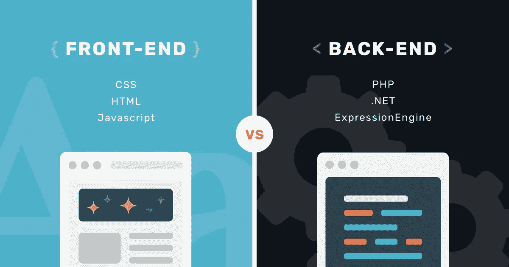
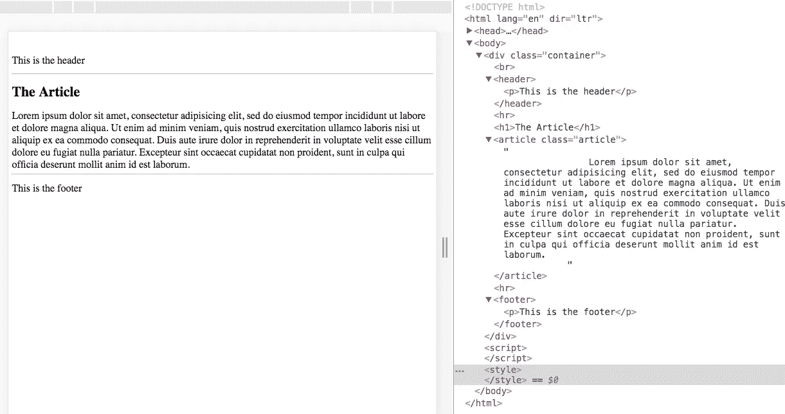
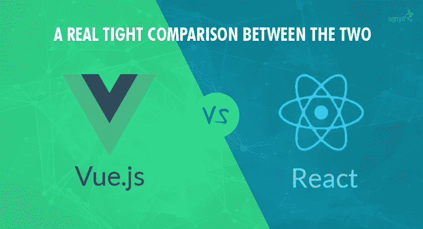

# 前端重构—带 Vue 的组件

> 原文：<https://medium.com/hackernoon/front-end-refactored-components-with-vue-907a08a3630>

我对编码了解得越多，我就越觉得这些想法是多么的有创造性和革命性。从 Ruby 的可读性，到 Javascript 的散列世界，这些想法不断更新着我们的思维方式，并一直推动着科技世界的发展。

# “前端无逻辑/编码”

这是一个常见的刻板印象，我注意到在 Makers Academy 的未来开发人员中很常见，当咨询他们的工作前景和兴趣时。



Front End gets a bad reputation for being ‘uninteresting’ because of how people think there is very little coding

在我们公司，我们发现很难找到一个中高级前端开发人员加入我们的团队。这确实让我思考这种态度是否会导致开发人员不想致力于前端。

但是最近前端已经被多种想法彻底改变了，比如 CSS 网格，来自 Bootstrap 的标准化和使用[组件](https://hackernoon.com/tagged/components) …

# 以前

这里我们展示了页面通常是如何组成的。



Using the dev tools mode in Chrome (Apple + Alt + I and then going to the Elements Tab) shows the HTML code of the page

我们将页面的所有元素放在输出到页面的 HTML 代码的 body 标记之间。

这看起来是一个非常好的方法，但是问题是，如果有很多页面，我们希望所有的页面上都有页眉和页脚呢？

我们会在我们的每个页面上复制和粘贴大量的代码，这是一种非常低效的方式。

# 重构思维(在 Vue.js 中)

每当 DRY(不要重复自己)出现在代码中，它意味着一件事…我们可以将其重构为可重用的东西，这是指！

对此有一些建议，比如使用片段，但在过去几年中最流行的是使用组件，正如脸书开发人员使用 React.js 所推广的那样

让我们看一个使用 Vue.js 的例子，它类似于 React.js。我喜欢 Vue.js，因为它比 React imo 更易读、更清晰。

我们的组件存储在 vue 文件中，它的父 vue 文件引用它，通常叫做 App.vue，每个 vue 文件在分成三个部分的地方总是有相同的结构；

```
<template>
// HTML of the component goes here
</template><script>
// Code goes here
</script><style>
// CSS Styling goes here
</style>
```

因此，让我们把代码分开，放入一个单独的 vue 文件中，该文件位于一个名为 components 的文件夹中。我们将取出页脚代码并将其放入 Header.vue 中。HTML 放入模板标记中，我们在包含文本的数据散列中创建一个变量。

```
// Header.vue<template>
    <header>
        <p>{{ headerText }}</p>
    </header>
</template><script>
export default {
    data: {
        headerText: "This is the header",
    }
}</script><style >
</style>
```

在我们最初的 App.vue 文件中，我们引用了刚刚创建的新创建的 header 组件。

```
// App.vue<template>
    <div class="container">
        <br>
        <app-header></app-header>
        <hr>
        <h1>The Article</h1>
        <article class="article">
            Lorem ipsum dolor sit amet, consectetur adipisicing elit, sed do eiusmod tempor incididunt ut labore et dolore magna aliqua. Ut enim ad minim veniam, quis nostrud exercitation ullamco laboris nisi ut aliquip ex ea commodo consequat. Duis aute irure dolor in reprehenderit in voluptate velit esse cillum dolore eu fugiat nulla pariatur. Excepteur sint occaecat cupidatat non proident, sunt in culpa qui officia deserunt mollit anim id est laborum.
        </article>
        <hr>
        <footer>
            <p>This is the footer</p>
        </footer>
    </div>
</template><script>
import appHeader from './components/Header.vue'export default {
  components: {
    'app-header': appHeader,
  },
};</script><style>
</style>
```

在脚本中，我们使用组件散列导入该组件，然后我们将该名称用于它自己的定制命名的 html 标签，在本例中我们称之为<app-header>。我们可以使用名称“header ”,但因为这已经是一个存在的标签名称，我们希望避免这些名称，以避免任何冲突的代码。Vue 就是这么称呼它的组件的，和 React.js 不一样。</app-header>

所以让我们对文章和页脚部分做同样的事情。

```
// Article.vue<template>
    <div>
        <h1>The Article</h1>
        <article>{{ articleText }}</article>
    </div>
</template><script>
export default {
    data() {
        return {
            articleText: "Lorem ipsum dolor sit amet, consectetur adipisicing elit, sed do eiusmod tempor incididunt ut labore et dolore magna aliqua. Ut enim ad minim veniam, quis nostrud exercitation ullamco laboris nisi ut aliquip ex ea commodo consequat. Duis aute irure dolor in reprehenderit in voluptate velit esse cillum dolore eu fugiat nulla pariatur. Excepteur sint occaecat cupidatat non proident, sunt in culpa qui officia deserunt mollit anim id est laborum."
        }
    }
}
</script><style >
</style>
```

现在页脚…

```
<template>
    <footer>{{ footerText }}</footer>
</template><script>
export default {
    data() {
        return {
            footerText: "This is the footer",
        }
    }
}
</script><style lang="css">
</style>
```

最终的 App.vue

```
<template>
    <div class="container">
        <br>
        <app-header></app-header>
        <hr>
        <app-article></app-article>
        <hr>
        <app-footer></app-footer>
    </div>
</template><script>
import appHeader from './components/Header.vue'
import appArticle from './components/Article.vue'
import appFooter from './components/Footer.vue'export default {
  components: {
    'app-header': appHeader,
    'app-article': appArticle,
    'app-footer': appFooter,
  },
};</script><style>
</style>
```

在所有这些工作之后，它看起来一模一样。但是现在我们有了可重复使用的组件！这意味着我们想要创建的任何其他页面，我们都可以导入这些组件并使用它。

更棒的是，只需查看模板部分，就可以很容易地判断哪个组件被导入了，以及它在页面中的什么位置。

# 前端革命

组件是超级灵活和可重用的，这对于大型网站来说是非常好的。甚至像按钮和表单这样的元素也可以是组件，因此可以重复使用。

每个组件的样式也可以包含在其中，这对网站品牌的一致性非常重要。

组件之所以伟大的另一个原因是来自函数的逻辑也可以添加到每个组件中。这真的改变了网站的创建方式，因为逻辑通常被放在一个完全独立于 HTML 的地方。现在，它被添加到组件中，这意味着逻辑就链接到那里，可以更容易地找到。

这意味着许多逻辑现在与前端混合在一起，允许前端开发人员获得更完整的堆栈体验，同时减少后端的压力，后端只包含与其试图做的事情相关的代码。



It seems like this will be the battle of the component based Javascript framework! Who will win?

我希望每个人都有一个美好的五一银行假期周末，下次再见！