# 前端框架攻击:Riotjs 产品定制者

> 原文：<https://medium.com/hackernoon/frontend-framework-attack-riotjs-product-customiser-a2922112137b>

## 这是挑战的第一周，我享受了使用 riotjs 构建产品定制器的乐趣。当我谈论我如何发现它的时候跟着读。

*感觉不耐烦——这里是* [*演示*](http://paulbird.co/riotjs-rioter-customiser/) *和* [*文件*](https://github.com/birdyboy18/riotjs-rioter-customiser) *(如果你想跟着代码走也有用)*

这是我的第一个选择:


picking riotjs and product customiser

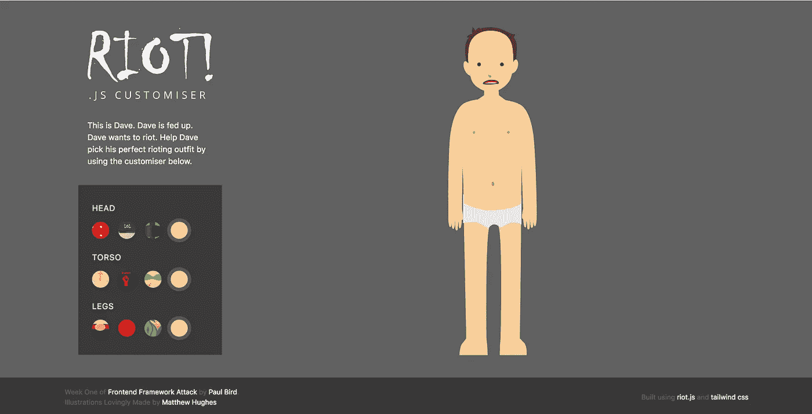

And what I built

# 学习骚乱

这实际上是一个非常好的开始，因为它引入的概念对我来说并不陌生。Riot.js 自诩为“简单优雅的基于组件的 UI 库”

这是真的，一个包含所有 html、js 逻辑和 css 的文件在同一个地方使得编辑和编写变得非常容易；然后你就可以像普通的 html 标签一样，在你的 html 中使用新制作的标签。这与大多数现代 js [框架](https://hackernoon.com/tagged/frameworks)目前的工作方式并没有太大的不同。

它有一个超级简单的 api，模板语法很容易，传递数据很简单，可观察的 API 是一个很大的帮助，知道它是如何更新的，这一切都导致了一个非常简单的项目构建。

我确实遇到了一些小问题，但是我以后会处理的。我确信这是由于我自己知识的缺乏，而不是图书馆的任何问题。我也不是这方面的专家，所以首先也是最重要的是，寻找答案的最好地方是医生们自己。

# 安装

我肯定要做的第一件事是设置，这样我就可以使用最新的 javascript 语法。我开始安装 webpack 和 riot.js 可能使用的任何所需的加载程序，幸运的是，文档站点简要介绍了如何安装 webpack 和 es6。

*值得注意的是，我不必这样设置。事实上，让每个标签成为一个单独的脚本非常容易，添加 riot.js 编译器脚本并让它在浏览器中处理其余的部分。这个团队做得很好。这已经使它成为模板/wordpress 站点风格下降的一个很好的选择。这是我在第一篇* *中最初的调查标准之一。*

首先，一个典型的 npm 安装。`npm i -D webpack babel-core babel-loader babel-preset-env riot riot-compiler riot-tag-loader`

然后是一个相当标准的 webpack 配置。你可以随意更改。标签加载器在那里很重要，这样 webpack 就知道如何处理 riot 标签。

**webpack.config.js**

```
module.exports = {
  entry: './src/js/app.js',
  output: {
    filename: './assets/js/main.js',
  },
  module: {
    rules: [
      {
        test: /\.tag$/,
        loader: 'riot-tag-loader',
        enforce: 'pre',
        query: {
          type: 'es6'
        }
    }, {
        test: /\.(js|tag)$/,
        exclude: /node_modules/,
        use: {
          loader: 'babel-loader',
          options: {
            presets: ['babel-preset-env']
          }
        }
      }
    ]
  }
}
```

为了让它工作，我所做的就是在终端中运行`webpack --watch`,这就是 js 编译。

HTML/CSS
HTML 也很简单。我包含了一个名为 [tailwind](https://tailwindcss.com/) 的 css 库，它使用了实用程序类，因为我想拥有一些可以开始使用的样式。我最后也写了自己的 css，但是很少。这真的不需要太多。只是一个小实验/webapp。

我使用 npm 的 node [http-server](https://www.npmjs.com/package/http-server) 模块在本地提供这个服务，我使用这个模块来满足任何静态文件服务器的需求。这就是我想要的，我不需要热模块重装。这就足够了，也达到了它的目的。

总的来说，很简单。

# 开始暴乱

要开始渲染 riot 标签，非常简单，只需导入全局 riot 实例，以及您想要渲染到应用程序中的任何 riot 标签。在 app.js 中，您应该这样写。

**app.js**

```
import riot from 'riot'
import HelloWorld from './components/HelloWorld.tag'riot.mount('*')
```

这里我们使用了通配符，这意味着呈现它在页面上找到的所有标签。您也可以选择只呈现一个标记，方法是将它改为标记名`riot.mount('hello-world')`

**组件/HelloWorld.tag**

```
<hello-world>
  <p>Hello World</p> <script>
    console.log('Hello from hello world tag')
  </script></hello-world>
```

上面你会看到创建一个标签，真的很简单；当你创建一个标签时，首先声明 html，然后声明脚本标签。您也可以通过使用样式标签将 css 添加到这个文件中，但是我仍然喜欢将它们全部包含在一个 css 文件中。

如果你感兴趣的话，防暴文档会更详细地介绍这一点。

最后，您将编辑 html 以在 html 中包含 riot/custom 标记，以及一个脚本链接以包含您编译的 js 包。

**HTML**

```
<html>
  <head>
    <title>Riot | Riot Test</title>
    <link href="https://cdn.jsdelivr.net/npm/tailwindcss/dist/preflight.min.css" rel="stylesheet">
    <!-- Any of your own CSS would go here -->
    <link rel="stylesheet" href="assets/css/style.css">
    <link href="https://cdn.jsdelivr.net/npm/tailwindcss/dist/utilities.min.css" rel="stylesheet">
  </head>
  <body class="font-sans">
    <div class="container mx-auto">
      <hello-world></hello-world>
    </div>
    <script src="assets/js/main.js"></script>
  </body>
</html>
```

在屏幕上，你应该有一个写着“Hello World”的页面和一个控制台日志声明。那很容易，是啊。让我们使信息动态化。

你放在自定义标签上的任何不属于[保留属性](http://riotjs.com/api/#reserved-words)的属性都将被传递到你附加到词汇‘this’的范围内，在一个名为`opts`的键下。修改标签我们现在可以这样做。

**组件/HelloWorld.tag**

```
<hello-world>
  <p>{this.opts.message}</p><script>
    console.log(`${this.opts.message}`)
  </script></hello-world>
```

**HTML**

```
<hello-world message="Hello from above"></hello-world>
```

你可以看到，突然之间传递数据变得很容易。你会发现这种单向数据流的范例也存在于 React 和 Vue 中。

Riot 还允许您在挂载标签时传入一个 javascript 对象，这将对根标签可用(因为您可以嵌套标签)。这将对标签实例上的`opts`键可用。对象不仅仅是一个 key:value，它也可以是一个函数，这意味着你可以将整个类和函数传递到你的标签中，这使得它非常强大。我们可以用它将数据传递给我们的标签。

**app.js**

```
import riot from 'riot'
import HelloWorld from './components/HelloWorld.tag'riot.mount('*', { message: "Hello from initial data"})
```

然后我们需要修改我们的标签实例和 html 来使用它。

**HTML**

```
<hello-world></hello-world>
```

在这里，我们已经删除了消息属性，初始数据现在将被处理和传递。如果 hello world 嵌套在父标记中，情况会有所不同。这一次我们不需要修改标签中的任何内容。这是因为所有这些数据将被传递给`opts`到父标签的任何直接后代。

现在我们将制作一个名为`<hello-container></hello-container>`的新标签来演示如何将数据向下传递给顶级标签的后代标签。

**app.js**

```
import riot from 'riot'
import HelloWorld from './components/HelloWorld.tag'
import HelloContainer from './components/HelloContainer.tag'riot.mount('*', { message: 'Hello from above'})
```

**components/hello container . tag**

```
<hello-container>
  <hello-world message={this.opts.message}></hello-world>
</hello-container>
```

这里的`hello-container`嵌套了我们的`hello-world`标签。这就是标签所需要的，但是这一次，我们已经将消息从父标签/容器传递到嵌套的 hello world 标签。然后可以像以前一样通过`this.opts.message`访问。

# **制作定制器**

既然已经介绍了如何制作和使用标签的基础知识。是时候开始定制了。这是我制作的，向我的好朋友兼室友[马修·休斯](https://twitter.com/HughesMoose)大声说，感谢他为我制作了这些资产。


Finished result of the riot js customiser

这个想法是，点击侧边栏中的任何一个选项都会改变暴徒的穿着。虽然很琐碎，但它演示了如何在各种标签之间传递数据，以及 riot 如何让我们轻松地做到这一点。

首先是制作侧边栏标签和父标签。它们如下。我们一会儿会做这些。

*   `product-customiser`
*   `<sidebar></sidebar>`
*   `<colour-list></colour-list>`
*   `<colour></colour>`

**app.js**

```
import riot from 'riot'
import ProductCustomier from './components/ProductCustomiser.tag'
import sidebar from './components/sidebar.tag'
import ColourList from './components/ColourList.tag'
import Colour from './components/Colour.tag'const initialState = {
  options: {
    head: [
      {
        name: 'Spotty Bandana',
        thumbnail: 'bandana',
        layerSrc: 'bandana',
        hex: '#D92222'
      }
    ],
  }
}riot.mount('product-customiser', initialState);
```

使用上面的数据结构，我们可以为每个头部，躯干和腿部层选择这些选项，并将这些选项作为一个数组放在里面。如果你想看完成的源文件，你可以看看它最后是如何构造的，以及我添加了多少选项，它和上面的一样。这里的文件是。

*为了让你更容易理解，我也不用和 Medium 的换行做斗争，我将主要发布代码片段的图片，而不是输入它们。此外，语法突出显示。*

**components/product customizer . tag**

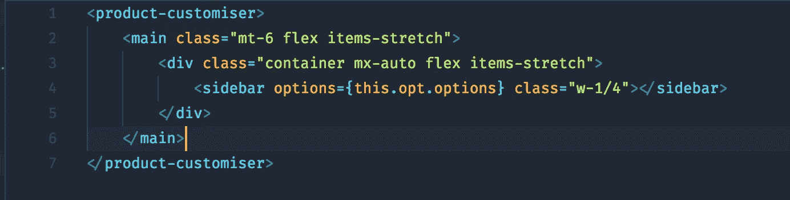

Pass the options from our initial data from riot.mount

**组件/侧栏.标签**

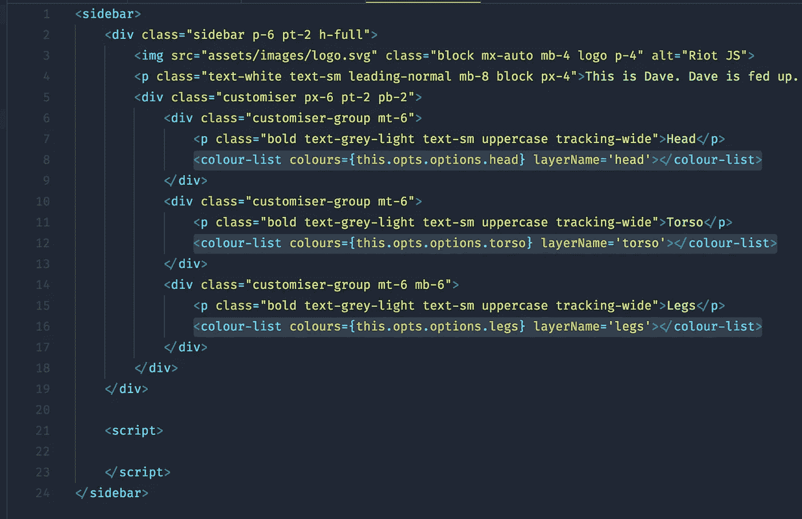

sidebar tag with nested colour-list tag being passed our options again to colours

对于每个组，我们将头部、躯干和腿部的选项数组传递给颜色列表标签。然后，我们使用 riot.js 循环语法为每个条目渲染一个颜色标签。我们还传入一个名为 layerName 的属性，我们稍后会用到它。

**components/colour list . tag**

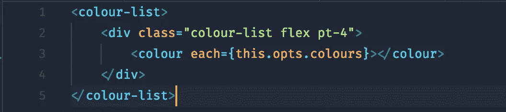

Here the colour list tag takes the passed array for each option grouping and then renders a tag for each one.

当使用循环渲染标签时，它会自动将对象中的任何数据传递给标签实例，范围为`this`。举个简单的例子，layerSrc 将是`this.layerSrc`，而不是像你想的那样放在`this.opts.layerSrc`下。有关循环的参考，请查看[文档](http://riotjs.com/guide/#loops)。

然后，使用传递下来的数据为每一个渲染颜色。

**组件/颜色.标签**

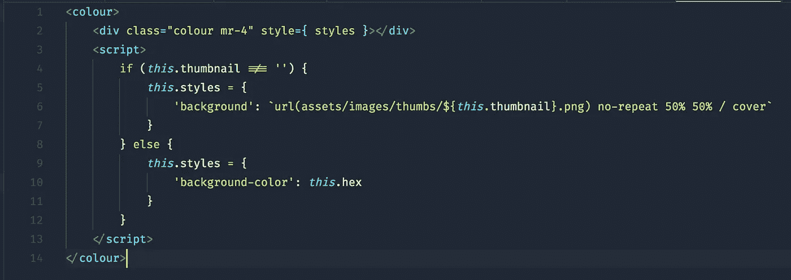

Here we use the data to set a background using css

在 riot 中，你可以使用一个转换成字符串的对象来设置样式。在这里，如果由于任何原因背景缩略图不存在，我们使用十六进制值来设置背景颜色，而不是图像。

既然我们已经成功地传递了我们的数据，我们需要它做一些事情。最好是当你点击它，让我们快速附加一个事件，建立应用程序的另一部分，然后回到这里。

**成分/颜色.标签**

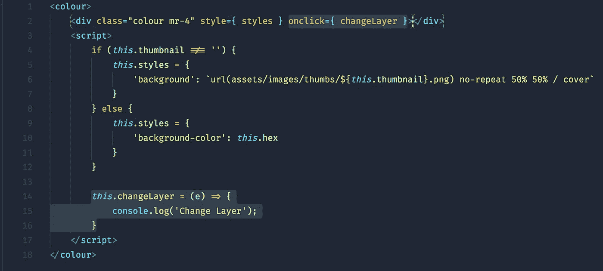

Added a changeLayer function to the onlick binding

接下来，我们需要建立我所说的更衣室标签。为了能够改变我们的暴徒的样子，这些图像都被放入一个包含 div。

它的工作原理是有一个基础图像，然后每个图像层被导出为大小完全相同的透明 png。这些位置绝对在基础的上面。然后当我们想改变头部、躯干或腿部时；我们可以使用该标签中绑定的标签属性来交换图像。让我展示给你看。

**组件/更衣室标签**

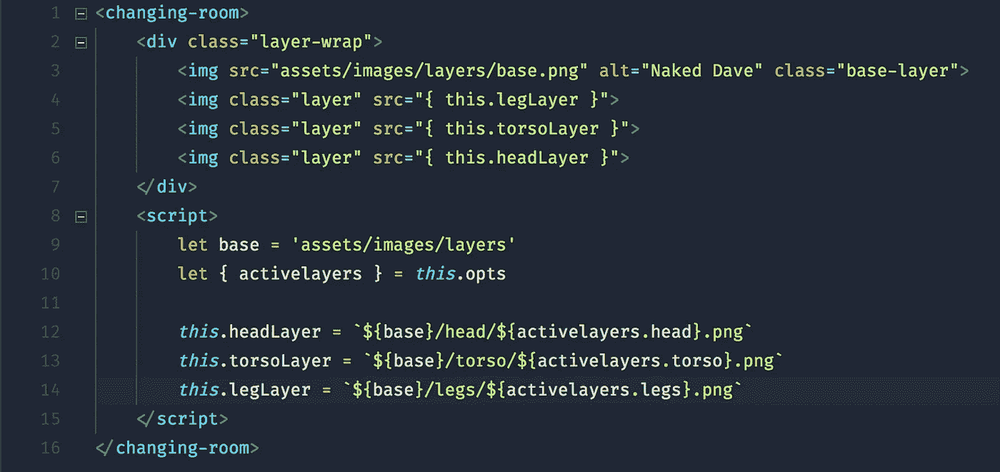

Here we pass active layers down from the opts

这里，层图像源是从传递给标签的 opts 设置的。这些数据从 app.js 添加到根 initialState，并按前面提到的方式传递给每个标记。

**组件/产品定制者.标签**

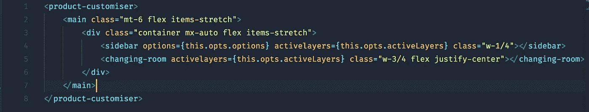

We include the new changing room tag and pass in activeLayers

另外，不要忘记你需要导入新的`changing-room`标签来让 riot 选择它。我们还将 activeLayers 传递到我们的侧边栏，因为我们以后会需要它们。

最后，这是我们初始状态的新部分。

**app.js**

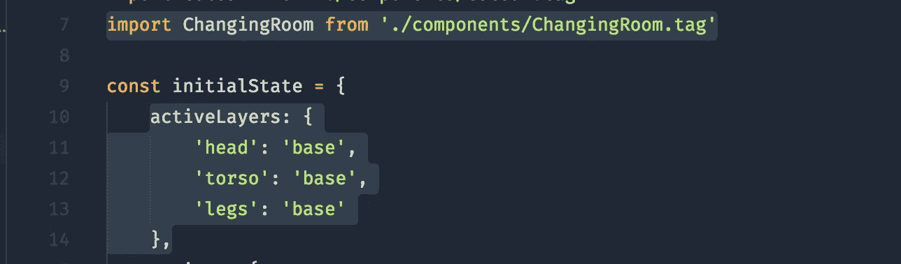

adding the new tag, and new activeLayers object

这里的键指的是它所属的层，而值实际上就是我们想要获取的文件名。你会看到这些在`ChangingRoom.tag`的代码中是匹配的。这些组成了图像目录中的文件名。如果成功的话，你的屏幕上会出现一个冷冷的戴夫。如果您正在跟进，但不确定资产/图像目录的结构。快速浏览一下 [github](https://github.com/birdyboy18/riotjs-rioter-customiser) 上的源文件。


Someone get this guy some clothes

要为 Dave 更改一件衣服，只需更改任一层的值。我们有问题吗？我们的组件/标签不知道彼此的存在。

这其实很好。如果他们这样做了，他们会耦合得太紧，而实际上我们希望他们不要关心彼此。这有很多好处，比如可读性、可维护性等等。

# 用可观察的方式集中我们的状态

我将向您展示我是如何实现我提出的用于标签间对话的最终解决方案的，我将谈论我在经历时打嗝的地方。

***Hiccup 1*** *我第一次使用可观察的作为一个非常容易的事件总线，但是状态很快就不同步了。这是因为更新在状态改变之前就被调用了，但是在下一次点击时它会更新。它对图层的改变很有效，但是当我想给颜色标签添加活动状态时，它总是在后面。*

可观察是一种模式，其中代码可以监听并运行自定义事件的函数。这是一个非常强大的模式，我们将在 React Redux 范式的思想的帮助下使用它。

我想让国家始终保持同步。这意味着我要开自己的商店。我大致了解了 [Redux](https://redux.js.org/docs/introduction/) 的工作原理，并实现了一个简单的例子。然而，我的版本没有使用 dispatch 或 subscribe。它使用了 riot 和直接变异状态提供的本地 on 和 trigger 方法。代码并不多。

**Store.js**

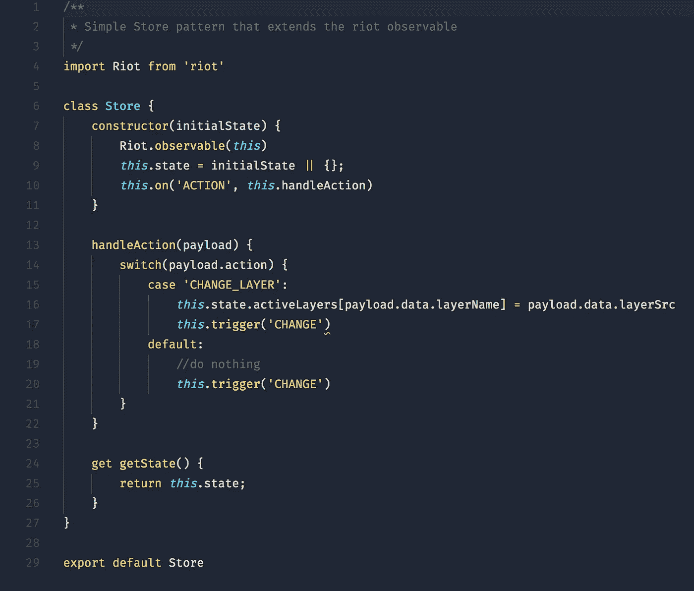

All the code needed to create our a store class

通过将任何函数或类作为参数传递给`Riot.observable`，你可以很容易地将它扩展为 riot observable。这扩展了它，使它拥有所有与`Riot.observable`相同的方法。这意味着现在我们的商店可以使用可观察的 on 和 trigger 方法等等。查看 [API](http://riotjs.com/api/observable/) 了解它能做的一切。

***Hiccup 2*** *首先我采用了一种更面向对象的方法，尝试扩展 Riot Observable 并在构造函数中调用 super on‘this’。出于某种原因，它附加了方法，但没有跟踪订户。因此我这样做了，在这里我调用 Riot.observable，将类的词法 this 传递给它。*

商店可以采取一个初始状态，并在自己身上注册一个将调用`handleAction`的事件。这意味着我们可以调用`store.trigger(‘ACTION’, payload)`，`handleAction`将运行。在这一点上，它的行为类似于 redux 中的 reducer，但都是硬编码的。它将匹配动作，然后在触发更新事件之前改变状态。

最后，我们为 getState 设置了一个自定义的 getter，我不需要这样做，可以直接调用 State，但我喜欢这种感觉，它更加隐含了我正在做的事情。

那是一家商店。现在，我们只需要实例化它，并将其提供给我们的初始状态，并将其传递给我们的标签。

**app.js**

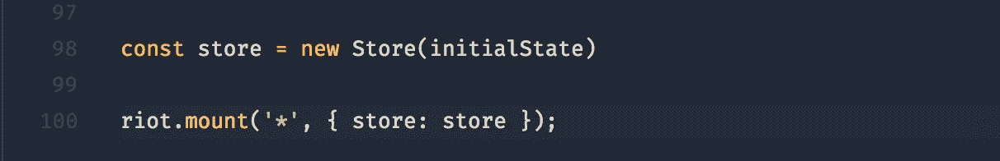

make a store, feed it our data and pass it to the mount method

现在您可以访问它并将其用作`this.opts.store`。随着商店在标签上可用，你可以用它来触发改变，回到`Color.tag`中的`changeLayer`函数。你可以让它触发一个动作。然后改变它的状态。

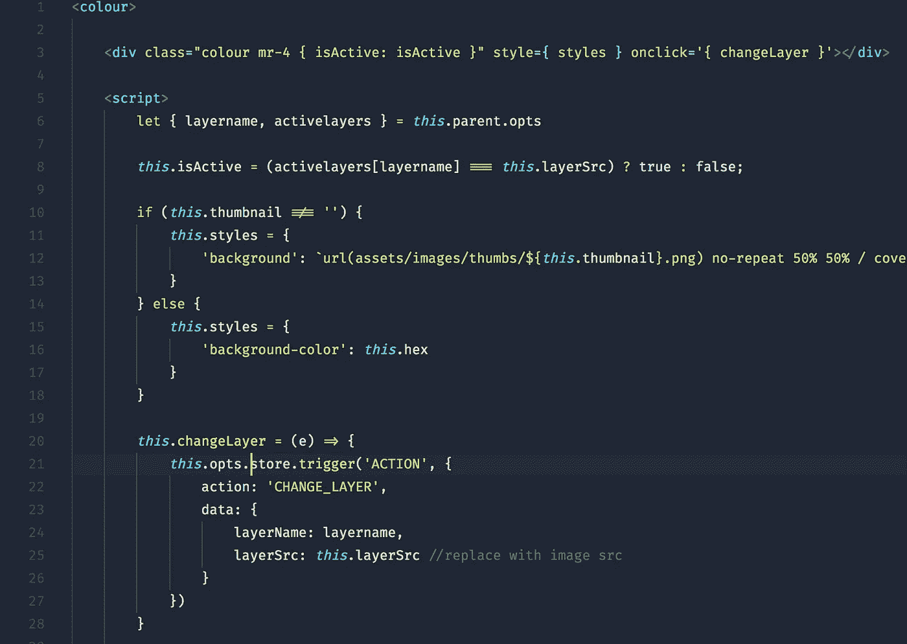

Here changeLayer now triggers an action in our store

我们的商店将知道如何对此做出反应，并改变状态。

在上面我声明 layername 和 activelayers 的代码片段中，你可以看到我们可以从父节点获取 opts，记住这是我们之前添加的。从父标签获取 opts 是我们已经使用过的方法，每个标签都可以访问它的父标签，直到根标签。

理论上，我可以通过向上遍历来访问商店，但是向下遍历更容易跟踪任意调用的`this.parent.parent`等等。

现在我们知道了图层名，我们用它来知道我们想要改变哪个图层的源图像并把它发送过来。


In the store you can see that the change layer action takes a payload that we use to change state

“更改层”动作从有效负载中提取层名称，将其用作匹配关键字，并将其 src 设置为有效负载中提供的新 src。在我们渲染的每个 colourlist 标签上，我们添加了一个名为 layername — `layername=’head’.` 的属性，用于从活动层中选择正确的层并对其进行更改。一旦完成，它就会发出 change 事件，通知任何侦听器状态刚刚发生了变化。

现在可以监听标记中的 change 事件，并调用标记更新方法。

**了解 this.update()如何工作**

关于更新，有两件重要的事情需要记住。首先，当用户交互调用事件处理程序时，它会自动更新。这意味着当我们调用颜色标签中的`changeLayer`时，它将自动调用更新来重新评估该标签中的所有表达式。

其次，当它在一个标签上调用更新时，它也会在所有子标签上调用更新。知道这些很好，因为我们可以利用它们。为了更深入地了解你可以用 update 做什么，[文档](http://riotjs.com/api/#updating)提供了适量的细节。

现在我们知道了它是如何工作的，让我们在`changing-room`标签中设置商店来监听变化。

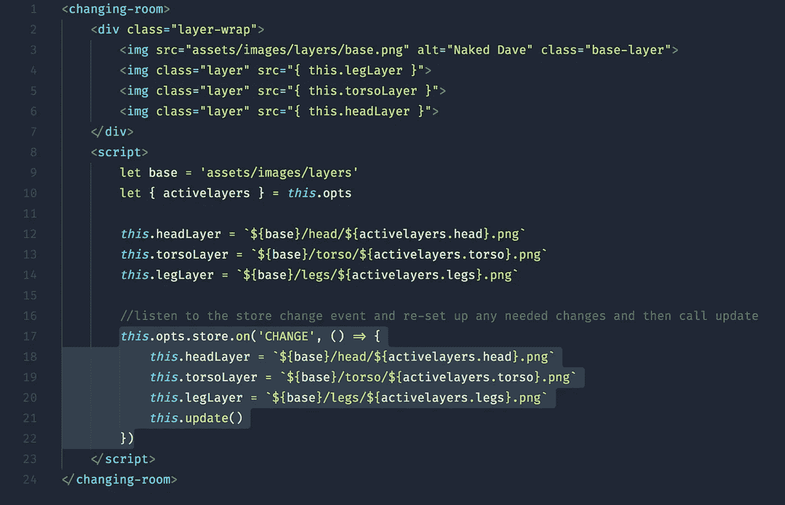

Here we listen for a change on our store re-update our expressions and call update

这个标签现在知道每当我们的状态更新时该做什么。很好，现在状态保持同步，代码知道它何时被更新。我觉得这可以改进，所以这导致了下一个问题。

***打嗝 3*** *我想变得懒惰，不必记得传下我的店铺，也不必记得订阅。请记住，对父标签的更新会调用对所有子标签的更新。我想做的是在 react land 中被称为状态容器的东西。父包装标签是* `*product-customiser*` *我开始从存储中传递所有状态，然后监听变化，简单地重新分配状态并调用 update。不幸的是，我不能让这个工作。我仍然不知道为什么它不如实。*

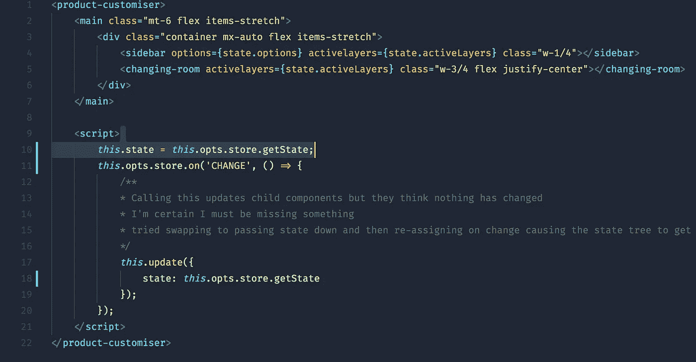

Using product-customiser as a state container

新代码现在使用了一个状态对象，我会重新分配、调用和更新这个对象，希望所有东西都能更新。我实际上发现这不起作用。更新是在子标签上调用的，但它似乎从不认为表达式已经改变。

尽管上面说的很好，但对于一个更大的应用程序来说，每次都重新呈现状态是不必要的，除了不能让它工作之外，我不想回到传递商店。需要满足一个快乐的中间立场。

# 混合起来

最终的解决方案非常简单，也是我认为最好的结果。我基本上希望能够在所有标签上引用我们的商店，而不需要传递下去。

解决办法，暴动[混血儿](http://riotjs.com/api/#mixins)。mixin 是一种模式，它允许你扩展一个对象，并向它添加定制的函数和属性，我们在前面使用 riot observable 间接实现了这一点。mixin 允许你添加我们自己的方法。

我们将创建一个接受我们的存储的函数，将它传递给对象和 init 方法，当标记被创建时，这个方法将被调用。然后我们告诉它将传递的存储附加到所有标签上，作为`this.store`。

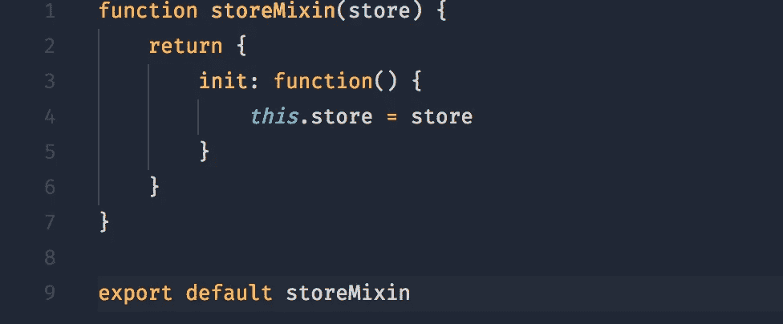

The storeMixin code

要开始使用 mixin，我们需要使用 riot.mixin 方法，并向它传递我们刚刚创建的 storeMixin 函数。请记住，如果您想使用它，您需要导入它。

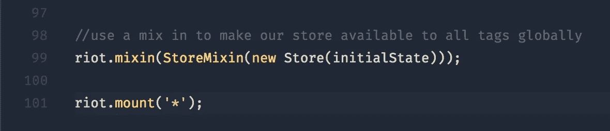

Globally setting a mixin

你可以像这里一样设置一个全局的 mixin，也可以通过命名空间注册一个共享的 mixin。然后你可以在任何你想使用的标签中调用`this.mixin('myMixin')`。

使用共享 mixin 的一个特别好的用例是，如果你想拥有多个商店。然后，你可以访问你只关心的标签中的商店，而不是拥有一个巨大的商店。

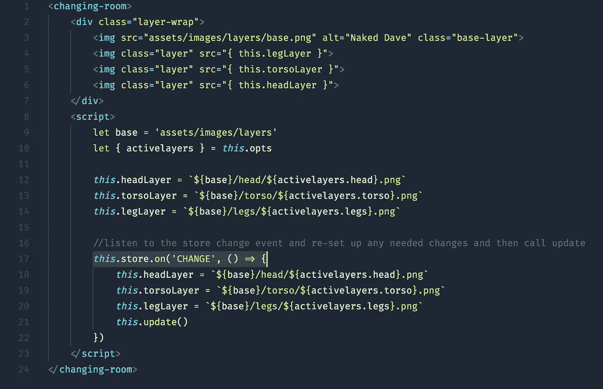

Now we can simply call this.store and not have to worry about passing the store down to our tags

现在每个标签都可以访问存储，所有的东西都可以通过它运行，状态也可以保持同步。

在完成的源文件中，我仍然监听产品定制者的变化并更新状态，这确实更新了传递给标签的状态。似乎必须手动重新分配会使 riot 意识不到发生了变化。因为更新调用仍然在那里进行，所以您可以省略子标签的变更回调中的 `*this.update()*` *。*

最后，现在需要做的就是更新颜色标签以使用新的存储引用，并使用它来计算活动状态。

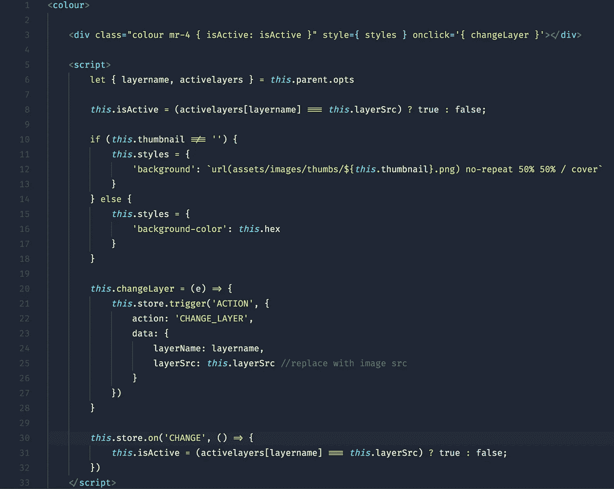

Here isActive is re-calculated on change, update not needed because it’s called in product-customiser

现在，您还可以根据 isActive 类的值来添加它。

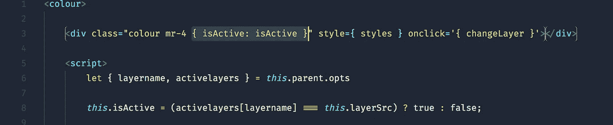

add an isActive class if isActive is true or false

如果你一直积极跟进，你应该希望有一个完整的衣服戴夫准备采取任何暴乱。这里是完成的[演示](http://paulbird.co/riotjs-rioter-customiser/)和[源代码](https://github.com/birdyboy18/riotjs-rioter-customiser)

# 结论

我真的很喜欢学习 Riot.js，这是一个非常整洁的小库。它的最小和小的 API 表面使得学习如何使用它非常快。事实上，它在如何做事上不是非常固执己见，这是我使用它的一个最喜欢的部分。尽管我以前从未使用过 Redux，但我能够利用 riot 的 observable API 很快理解并实现它。这是我想做的，而不是因为暴乱告诉我要这么做。

事实上，所有的逻辑都包含在一个标签文件中，我认为这很棒，把它直接放到 html 中，它就可以工作了，这太棒了。这种模式和 Store 模式相结合，使得为模板制作高级小部件和更高级的 js 功能变得非常有利可图。结合数据传递，您可以相对容易地从 CMS 中引导所需的数据。

我觉得 mixins 对我来说真的是锦上添花。我认为使用它来使商店对任何标签都可用是非常强大的，虽然不是一个不常见的概念，但真的很酷。老实说，我以前从来没有把 mixins 作为一种模式使用过，所以陷进去感觉很好。

我唯一的批评是，我想更深入地了解更新是如何工作的，因为我觉得状态容器方法确实应该工作。我认为如果文档告诉你它如何知道触发更新，以及除了已经提到的更新之外可能存在的任何警告，那会更好。

Riot 不会强迫你进入一个范式，很容易学会。它不需要使用 ES6 语法，如果需要，可以在浏览器中快速运行。这使得它成为遗留 javascript 项目的一个完美竞争者，这也是我在对各种 js 库的整个调查中想要考虑的事情之一。

标签可以很容易地解耦，这意味着我们仍然可以让页面的不同部分相互交流，即使使用服务器呈现的模板。

总的来说，我已经认为这是一个很好的嵌入式方法的竞争者。仅此而已。

如果你已经读到这里，感谢你一直关注我。我希望这对你有所帮助，哪怕是一点点。我很想知道你的想法，所以请留言；我写的不多(可能显而易见？).下周我将在一个新的图书馆里建立一个新的项目，所以请留意。再次感谢。