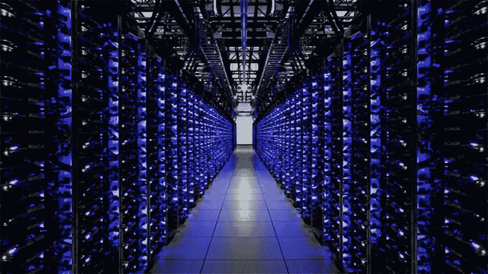
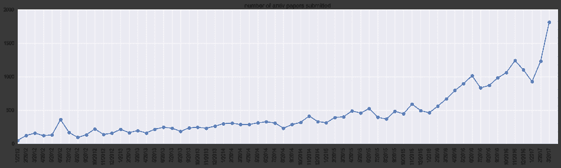

# 前沿 AI:我们离人工“通用”智能真的有多远？

> 原文：<https://medium.com/hackernoon/frontier-ai-how-far-are-we-from-artificial-general-intelligence-really-5b13b1ebcd4e>

有人称之为“强”人工智能，有人称之为“真正的”人工智能，“真正的”人工智能或人工“通用”智能(AGI)……无论是什么术语(以及重要的细微差别)，没有什么问题比我们是否正在集体开发能够真正像人类一样思考的通用人工智能更重要了——甚至可能处于超人的智能水平，具有不可预测和不可控制的后果。

几十年来，这一直是科幻小说中反复出现的主题，但鉴于人工智能在过去几年中取得的巨大进展，这场辩论已经以特别的强度重新爆发，越来越多的媒体和对话警告我们,(邪恶的)AGI 即将到来，而且比我们想象的要快得多。最新例子:新纪录片[你信任这台电脑吗？由埃隆·马斯克(Elon Musk)免费提供的上周末播放的](http://doyoutrustthiscomputer.org/)，由来自学术界和工业界的多位受人尊敬的人工智能专家主讲。这部纪录片描绘了一幅令人担忧的人工智能画面，这是地球上的一种“新生命形式”，即将“缠绕”我们。也有越来越多的故事指向人工智能越来越可怕的方面，有关于替代现实创造的报道(假名人[人脸生成器](https://www.theverge.com/2017/10/30/16569402/ai-generate-fake-faces-celebs-nvidia-gan)和 [deepfakes](https://en.wikipedia.org/wiki/Deepfake) ，完整的视频生成和语音合成可能在不久的将来实现)，越来越恐怖的 Boston Dynamics 视频(最新的一个:[机器人合作](https://www.youtube.com/watch?v=fUyU3lKzoio)开门)，以及关于谷歌的人工智能变得“[极具攻击性](https://qz.com/911843/googles-ai-got-highly-aggressive-when-competition-got-stressful-in-a-fruit-picking-game/)的报道

然而，作为一个在人工智能“战壕”里呆了很长时间的投资者，我一直在这个话题上经历着相当多的认知失调。我每天都与许多人工智能企业家互动(包括我的投资组合内外)，我看到的现实非常不同:为现实世界打造一个人工智能产品仍然非常困难，即使你解决了一个特定的问题，聘请了优秀的机器学习工程师，并筹集了数百万美元的风险投资。显然，即使是“狭义”的人工智能在野外也远远不能在需要 100%准确执行的场景中工作，正如最近与自动驾驶相关的死亡事件所证明的那样。

那到底是哪一个？指数级技术加速的主要特征是它们看起来像是在遥远的未来，直到突然之间它们不再是了。我们即将迎来拐点吗？

我的许多关于人工智能的博客帖子都是关于如何构建人工智能应用程序和创业公司的。在这篇文章中，我看了一下人工智能研究的上游，试图了解谁在做什么工作，以及人工智能研究实验室可能会有什么成果。特别是，我有幸在几周前在 NYU 举行的[大脑和机器中的规范计算](http://ccbm2018.org/)之前参加了一个令人难以置信的小组研讨会，这特别有启发性，并为本文的一些内容提供了信息。

这些只是我的笔记，注定要发给对人工智能普遍感兴趣的技术和创业公司的任何人，而不是技术观众。当然，这是一项正在进行的工作，欢迎评论。

这是我到目前为止学到的东西。

**比以往更多的人工智能研究、资源和计算来计算 AGI**

已经有很多关于人工智能创业活动爆炸的报道，据报道，2017 年有 152 亿美元的风险资本流向人工智能创业公司(CB Insights)，但同样的事情也发生在人工智能研究的上游。

自 2012 年以来，发表在人工智能上的研究论文总数急剧增加——以至于产生了像安德烈·卡帕西(Andrej Karpathy)推出的 [Arxiv Sanity Preserver](http://www.arxiv-sanity.com/) 这样的项目，这是一个可以访问大约 45，000+篇论文的浏览器，“因为事情严重失控”

[NIPS](https://nips.cc/) ，一个始于 1987 年的高度技术性会议，曾经是一个微小而默默无闻的事件，在 2017 年有 8000 人参加。

人工智能研究越来越全球化。除了“通常的嫌疑人”美国大学(例如麻省理工学院 CSAIL 实验室)，一些最先进的人工智能研究中心位于加拿大(特别是多伦多，既有多伦多大学和新向量研究所，也有蒙特利尔，包括 MILA)、欧洲(伦敦、巴黎、柏林)、以色列，以及越来越多的中国。

(有趣的是，人工智能学术界的许多人报告说，他们越来越多地遇到令人印象深刻的年轻研究人员，包括一些青少年，他们在技术上非常精通，在研究中具有前瞻性思维，这可能是人工智能工具和教育民主化的结果)。

最近的另一个主要趋势是，基础人工智能研究越来越多地在大型互联网公司中进行。当然，公司赞助实验室的模式并不新鲜——想想贝尔实验室。但是最近它在人工智能研究中有了一个新的维度。alphabet/谷歌都有[deep mind](https://deepmind.com/)(2014 年收购的一家初创公司，现在是一个 700 人的团队，主要专注于基础人工智能研究，由戴密斯·哈萨比斯运营)和[谷歌大脑](https://research.google.com/teams/brain/)(2011 年由杰夫·迪恩、格雷格·科拉多和吴恩达创立，更专注于应用人工智能)。脸书有由深度学习之父 Yann LeCun 领导的 T4 博览会。微软有 [MSR AI。优步拥有优步人工智能实验室，这是他们收购纽约初创公司 Geometric Intelligence 的结果。阿里巴巴有阿里巴巴人工智能实验室，百度有百度研究院，腾讯有腾讯人工智能实验室。这样的例子不胜枚举。](https://www.microsoft.com/en-us/research/lab/microsoft-research-ai/)

这些行业实验室拥有深厚的资源，通常会支付数百万美元来获得顶尖的研究人员。在与人工智能研究人员的交谈中，一个反复出现的主题是，如果创业公司很难吸引拥有机器学习博士学位的学生，那么学术界就更难留住他们。

这些实验室中的许多都在或明或暗地追求 AGI。

此外，人工智能研究，特别是在那些行业实验室中，可以以前所未有的水平获得两种关键资源:数据和计算能力。

迄今为止，可用于训练人工智能的不断增加的**数据**已经得到了很好的记录，事实上，谷歌和脸书等互联网巨头在开发广泛的横向人工智能解决方案方面具有很大的优势。在中国，事情也变得越来越“有趣”，大量的数据正在被聚合起来，以训练人工智能进行人脸识别，旷视科技(也称为 Face++)和商汤科技(SenseTime)等独角兽初创公司就是受益者。2017 年，一项名为“梁雪”(sharp eyes)的计划被宣布，该计划涉及**集中处理来自中国 50 多个城市的监控摄像头(公共和私人)的镜头**。还有传言称，为了人工智能训练的目的，中国各互联网巨头之间的数据聚合。

除了数据，另一个可能催生 AGI 的重大转变是计算能力的巨大加速，尤其是在过去几年里。这是利用现有硬件和专门为人工智能构建新的高性能硬件两方面进展的结果，导致进展速度**快于摩尔定律**。

回顾一下，在 2012 年赢得 ImageNet 竞赛的团队(该赛事引发了当前围绕人工智能的大部分热潮)使用了 2 个 GPU 来训练他们的网络模型。这需要 5 到 6 天，被认为是最先进的。2017 年，脸书宣布，它已经能够在一个小时内训练 ImageNet，使用 256 个 GPU。仅仅几个月后，来自 Preferred Networks 的一个日本团队打破了这一记录，用 1024 个英伟达特斯拉 P100 GPU 在 15 分钟内训练了 ImageNet。

但这可能只是一场热身，因为世界现在正在进行一场生产更强大的人工智能芯片和围绕它们的硬件的竞赛。2017 年，谷歌发布了其张量处理单元(TPUs)的第二代产品，该产品专门用于加速机器学习任务。每个 TPU 可以提供 180 万亿次的性能(并用于机器学习模型的推理和训练)。这些 TPU 可以聚集在一起，产生超级计算机——1000 个云 TPU 系统可供愿意公开分享他们工作的人工智能研究人员使用。

初创公司层面也有大量活动，有大量资金支持的新兴硬件公司，如 Cerebras、Graphcore、Wave Computing、Mythic 和 Lambda，以及中国初创公司 Horizon Robotics、Cambricon 和 DeePhi。

最后，围绕量子计算和光学计算出现了硬件创新。虽然从研究的角度来看还很早，但谷歌和 IBM 都宣布了他们在量子计算方面的一些有意义的进展，这将把人工智能带到另一个指数加速的水平。

计算能力的大幅增长为用不断增加的数据量训练人工智能打开了大门。它还使人工智能研究人员能够更快地进行实验，加快进度，并创造新的算法。

OpenAI (Elon Musk 的非营利研究实验室)的人提出的一个关键点是，仅在五年前，当算法在相对普通的硬件上运行时，人工智能已经用它的力量让我们感到惊讶——谁知道所有这些计算能力会发生什么？(见 OpenAI 首席技术官 Greg Brockman 的精彩 TWiML & AI [播客](https://twimlai.com/twiml-talk-74-towards-artificial-general-intelligence-greg-brockman/)

**人工智能算法，新旧**

人工智能的惊人复活实际上始于 2012 年 ImageNet 竞赛，在很大程度上是由深度学习推动的。这种统计技术由包括 Geoff Hinton、Yann LeCun 和 Yoshua Bengio 在内的几位人工智能研究人员开创并完善，涉及多个层次的处理，逐渐完善结果(参见 2015 年《自然》[的这篇文章](http://pages.cs.wisc.edu/~dyer/cs540/handouts/deep-learning-nature2015.pdf)获得深入解释)。这是一项古老的技术，可以追溯到 20 世纪 60 年代、70 年代和 80 年代，但当有足够的数据和计算能力时，它突然显示出了它的威力。

深度学习几乎可以为任何令人兴奋的人工智能产品提供动力，从 Alexa 到人工智能在放射学中的应用，再到 HBO 硅谷的“热狗与否”恶搞产品。事实证明，它在各种问题的模式识别方面非常有效，包括语音识别、图像分类、对象识别和一些语言问题。

从 AGI 的角度来看，深度学习激发了想象力，因为它做的比它被编程做的更多，例如围绕想法对图像或单词进行分组(如“纽约”和“美国”)，而没有被明确告知这些图像或单词之间存在联系(如“纽约位于美国”)。**人工智能研究人员自己并不总是知道**到底[深度学习为什么会这样做。](https://www.technologyreview.com/s/604087/the-dark-secret-at-the-heart-of-ai/)

然而，有趣的是，随着世界其他地区开始在许多消费者和企业应用程序中广泛采用深度学习，**人工智能研究界正在询问是否是** **达到了收益递减**。Geoff Hinton 本人在 2017 年 9 月的一次会议上质疑了他帮助发明的神经网络的主干——反向传播，并建议重新开始，这在人工智能研究界引发了冲击波。Gary Marcus 在 2018 年 1 月发表的一篇论文[中提出了深度学习的十个问题，并建议“如果我们要达到人工通用智能，深度学习必须得到其他技术的补充”。](https://arxiv.org/pdf/1801.00631.pdf)

很多讨论似乎都集中在“监督”学习上——这种学习形式需要向机器展示大量带标签的例子，以训练机器如何识别类似的模式。

人工智能研究社区现在似乎同意，如果我们要到达 AGI，需要更多地关注**无监督学习**——机器在没有标记数据的情况下接受训练的学习形式。无监督学习有许多变体，包括自动编码器、深度信念网络和 GANs。

GANs，或“**生成对抗网络**”是一种更新的方法，与无监督深度学习直接相关，由伊恩·古德菲勒在 2014 年首创，当时他是蒙特利尔大学的博士生。GANs 通过在两个神经网络之间制造竞争来工作，这两个神经网络是根据相同的数据训练的。一个网络(生成器)创建尽可能真实的输出(如照片);另一个网络(鉴别器)将照片与它接受训练的数据集进行比较，并试图确定每张照片是真是假；然后，第一网络调整其参数以创建新图像，等等。GAN 有自己的进化，2017 年刚刚出现了多个版本的 GAN(WGAN，BEGAN，CycleGan，Progressive GAN)。

这最后一种[逐步训练 GANs](http://research.nvidia.com/publication/2017-10_Progressive-Growing-of) 的方法使得 Nvidia 能够生成假名人的高分辨率面部照片。

另一个加速发展的相关领域是**强化学习**——这是一种技术，其中 **AI 通过一次又一次的尝试来自学**如何做某事，将好的动作(导致奖励)与坏的动作分开，并每次都改变其方法，直到它掌握该技能。强化学习是另一种可以追溯到 20 世纪 50 年代的技术，在很长一段时间内被认为是一个有趣的想法，但效果并不好。然而，这一切在 2013 年末发生了变化，当时独立创业公司 DeepMind 教会了一个人工智能以超人的水平玩 22 个雅达利 2600 游戏，包括《太空入侵者》。2016 年，它的 **AlphaGo** ，一个经过强化学习训练的人工智能，击败了韩国围棋大师 Lee Sedol。然后就在几个月前的 2017 年 12 月， **AlphaZero** ，一个更通用、更强大的 AlphaGo 版本使用了同样的方法，不仅掌握了**围棋，还掌握了国际象棋和 shogi** 。除了游戏规则，没有任何人类的指导，AlphaZero 仅用了四个小时就自学了大师级的象棋。在 24 小时内，AlphaZero 能够在这 3 场比赛中击败所有最先进的人工智能程序(Stockfish、elmo 和 AlphaGo 的 3 天版本)。

AlphaZero 离 AGI 有多远？DeepMind 的首席执行官戴密斯·哈萨比斯称 AlphaZero 的游戏风格为“异类”，因为它有时会以牺牲等完全违反直觉的举动获胜。看到一个计算机程序在短短几个小时内将最复杂的人类游戏自学到世界级水平，是一种令人不安的体验，这似乎接近于一种智能形式。人工智能社区的一个关键反驳观点是，AlphaZero 是一个令人印象深刻的蛮力练习:AlphaZero 通过使用 5000 个第一代 TPU 和 64 个第二代 TPU 的自我游戏进行训练；一旦经过训练，它就可以在一台带有 4 个 TPU 的机器上运行。在强化学习中，人工智能研究人员指出，人工智能不知道它实际上在做什么(就像玩游戏一样)，并且局限于它被赋予的特定约束(游戏规则)。这里有一篇有趣的博文，讨论 AlphaZero 是否是一个真正的科学突破。

当谈到 AGI，甚至机器学习的成功时，几位研究人员对**转移学习**寄予厚望。例如，DeepMind 的戴密斯·哈萨比斯称迁移学习为“普通智力的关键”。迁移学习是一种机器学习技术，其中在一个任务上训练的模型被重新用于第二个相关的任务。这个想法是，有了从第一个任务中学到的先例知识，与在第二个相关任务中从头训练的新神经网络相比，人工智能将表现更好，训练更快，需要的标记数据更少。从根本上说，希望它能帮助人工智能变得更“通用”，从一个任务跳到另一个任务，从一个领域跳到另一个领域，尤其是那些标记数据不太容易获得的领域(见这里的一个很好的概述)

为了将迁移学习引向 AGI，人工智能需要能够跨越来越远的任务和领域进行迁移学习，这将需要越来越多的抽象。根据哈萨比斯的说法，“进行迁移学习的关键是获得概念性知识，这些知识是从你从哪里学到的感性细节中抽象出来的”。我们还没到那一步。迁移学习在工作中最具挑战性——当任务密切相关时，它工作得很好，但超出这个范围就变得复杂得多。但这是人工智能研究的重点领域。DeepMind 的 PathNet 项目取得了重大进展(见这里的一个很好的概述)，这是一个神经网络的网络。作为该领域另一个有趣的例子，就在几天前，OpenAI 发起了一场转移学习[竞赛](https://contest.openai.com/)，该竞赛测量强化学习算法从以前的经验中进行归纳的能力。这些算法将在 30 款 SEGA“老派”电子游戏中进行测试。

**递归皮层网络** (RCN)是另一种有前途的方法。由硅谷初创公司 Vicarious 开发的 RCN 最近被用于以高准确率解决基于文本的验证码，使用的数据比其对手少得多——在场景文本识别基准的情况下少 300 倍，(参见 2017 年 12 月 8 日的科学[文章](http://science.sciencemag.org/content/358/6368/eaag2612)

鉴于最近的技术进步，还有许多方法正在考虑、开发或重新探索，包括(不分先后):杰夫·辛顿的胶囊网络或 CapNets(涉及金·卡戴珊[的平易近人的解释，这里](https://hackernoon.com/capsule-networks-are-shaking-up-ai-heres-how-to-use-them-c233a0971952))、神经注意力模型(没有金·卡戴珊[的平易近人的解释，这里](https://towardsdatascience.com/the-fall-of-rnn-lstm-2d1594c74ce0?gi=44e1ed87d20b))、一次性学习、可微分神经计算机(DNC)、神经进化、进化策略……这份清单还在继续，进一步证明了人工智能研究的爆炸性活力。

**人工智能与神经科学的融合**

到目前为止描述的所有技术本质上都是数学和统计性质的，并且依赖于大量的计算能力和/或数据来获得成功。虽然在创建和改进这种算法方面已经显示出相当的实力，但对这些方法的一个常见批评是，机器仍然不能从原则出发或学习原则。AlphaZero 不知道它在玩游戏，也不知道游戏是什么。

研究中越来越多的思路是根据人类大脑(包括儿童大脑)的工作方式来重新思考人工智能的核心原则。虽然最初是受人脑(因此有“神经”这个术语)的启发，但神经网络很快从生物学中分离出来——一个常见的例子是反向传播在自然界中没有对等物。

教机器如何像孩子一样学习是人工智能最古老的想法之一，可以追溯到 20 世纪 50 年代的图灵和明斯基，但随着人工智能领域和神经科学领域的成熟，正在取得进展。

人工智能和神经科学的交叉正是我前面提到的“大脑和机器中的规范计算”研讨会的主题。虽然这两个领域仍在相互了解，但很明显，一些最深入的人工智能思想家正越来越多地专注于神经科学启发的研究，包括深度学习教父 Yann LeCun(视频:[新生儿的学习原则是什么](https://www.youtube.com/watch?v=DfDGnKxntAE)？)和 Yoshua Bengio(视频:[弥合深度学习和神经科学之间的差距](https://www.youtube.com/watch?v=z7xefhmNJ2I&list=PLBHioGD0U1Cjd-meZbEcz-9ZxK-mb50tZ&index=3))。

麻省理工学院认知科学和计算教授乔希·特南鲍姆提出了一条特别有前途的研究路线。特南鲍姆工作的一个关键部分是致力于建立婴儿或儿童如何学习的定量模型(包括在睡梦中！)，而不是她从进化论中继承的东西，特别是他所谓的“直觉物理学”和“直觉心理学”。概率语言(贝叶斯世界的一部分)的进步推动了他的工作，概率语言融合了各种方法，如用于知识表示的符号语言、用于不确定性推理的概率推理和用于模式识别的神经网络。(视频:“[建造像人一样学习和思考的机器](https://www.youtube.com/watch?v=VLOXHeGKHE0)”和“[建造像人一样观看、学习和思考的机器](https://www.youtube.com/watch?v=7ROelYvo8f0)”)

虽然麻省理工学院在 2 月份刚刚启动了一项名为“麻省理工学院智能探索”的计划，以结合神经科学、认知科学和计算机科学来帮助“破解智能密码”，但所有这些仍然是非常实验室的研究，很可能需要极大的耐心才能产生适用于现实世界和行业的结果。

**结论**

那么，我们离 AGI 有多远？这种高水平的旅行显示了矛盾的趋势。一方面，创新的步伐令人眼花缭乱——这篇文章中提到的许多发展和故事(AlphaZero、GANs 的新版本、胶囊网络、破解 CAPTCHA 的 RCNs、谷歌的第二代 TPUs 等。)仅发生在过去 12 个月内，事实上主要发生在过去 6 个月内。另一方面，许多人工智能研究社区本身在积极追求 AGI 的同时，不遗余力地强调我们仍然有多远——也许是出于对媒体围绕人工智能的炒作可能导致希望破灭和又一个人工智能核冬天的担忧。

不管我们是否能在短期内到达 AGI，很明显，人工智能正变得越来越强大，而且随着它在越来越强大的计算机上运行，它将变得更加强大，这引发了人们对如果它的权力被错误的人(无论是人类还是人工)掌握会发生什么的合理担忧。令人不寒而栗的是，埃隆·马斯克提出了“你信任这台电脑吗？”纪录片是，人工智能甚至不需要想要敌视人类，甚至不知道人类是什么，就此而言。在它不遗余力地寻求通过一切手段完成任务的过程中，它可能会对人类有害，仅仅因为他们碰巧挡在路上，就像被公路撞死一样。

抛开身体伤害不谈，人工智能的进步导致了一系列更直接的危险，需要彻底思考——从大型行业(后台办公室、卡车运输)的大量失业到我们对现实的完全扭曲(虚假视频和音频很容易被创建)。

*图片/图表鸣谢:谷歌/康妮·周佐治亚州道格拉斯县谷歌数据中心的一排服务器(带有由谷歌大脑驱动的冷却系统)。arxiv-理智图发现于* [*这篇*](/@Synced/andrew-ng-says-enough-papers-lets-build-ai-now-6b52d24bcd58) *的博文。*