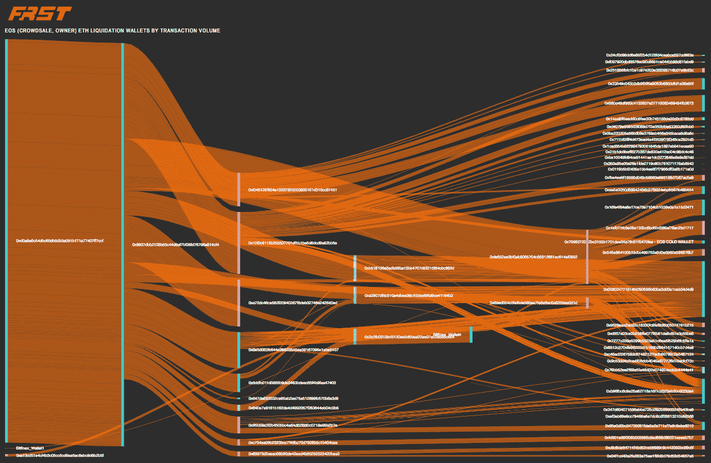
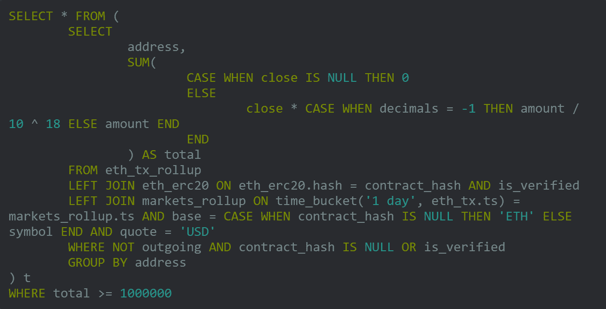

# FRST.io —加密交易平台

> 原文：<https://medium.com/hackernoon/frst-io-crypto-trading-platform-55189a2417ab>

FRST.io displaying ETH flowing between wallet addresses

我有机会采访了 FRST.io 的首席执行官 Karl Muth。他们开发企业级的、交易台可用的加密软件。使用他们的软件，交易者可以跟踪各种钱包和交易所的大规模和微妙的加密活动，以了解市场的走向。您还可以使用庞大的数据集来调整您的算法，这些数据集包括块 1 的注释信息。

Karl 拥有法学博士和工商管理硕士学位，后者主修芝加哥大学经济学，以及伦敦经济学院的哲学博士学位。今年早些时候，FRST 的创始人聘请他担任首席执行官；在此之前，他是芝加哥搜索引擎初创公司 Haystack 的首席执行官，该公司的技术可以帮助用户在音乐、播客和视频平台上找到内容。

FRST 的联合创始人乔纳斯·弗罗斯特(Jonas Frost)和帕特里克·戈雷尔(Patrick Gorrell)决定建立 FRST.io，因为他们看到在识别和注释交易者、节点、采矿地点和区块链上的其他位置之间的关系时，有令人难以置信的大量有价值的数据，但没有人将这些数据整合在一起，并以可操作的格式提供给交易者。乔纳斯和帕特里克想回答一些简单的问题:

-鲸鱼在移动吗？

-交易所之间的反应如何？

ICO 的 ETH 在做什么？

因此，他们建立了一个平台来产生见解，然后根据这些见解采取行动。

交易平台的目标是在 2019 年第一季度上线。他们还发行了一个公用令牌，将授予一定级别的速度和访问交易信息。令牌股票代码是 NDXX。不会有 ICO 取而代之的是，代币将由 FRST 直接分发，并通过折扣递减的预售模式经由交易所进行分发。

**集中交易的问题**

如今，绝大多数交易都发生在中央交易所。卡尔认为今天的集中交易有三个问题，都与效率有关。

1.  密码交换的成本太高。你可以看到，传统股票和大宗商品交易所的交易成本要低得多。因此，这需要改变，也将会改变。
2.  加密交易所的价格效率低下，这创造了巨大的套利机会。在任何繁忙的交易日，你经常会在交易所之间获得巨大的价差，随着时间的推移，这种价差应该而且将会被套利交易消除。
3.  一些交易所无法很好地处理当前的交易量，随着 Karl 预期交易量的增加，这个问题在今年下半年只会变得更糟。试图支持自己做市功能的较小交易所将越来越不堪重负。需要对 IT 基础设施进行更多投资，我认为我们将会看到更多像 Bittrex 这样没有盘根错节的做市功能的交易所活动。

**那么，有什么事情是很难做到的，但你可以利用 FRST 平台来完成？**

那么，如何从最近的 EOS 事件中跟踪 ETH 清算，以查看所有的交易量、流量和交易对手以及它们之间的关系？用现有的许多工具来说明和询问这些关系是很困难的。

然后，我们允许您查询事件本身作为一个时间窗口，并了解哪些市场参与者在事件期间最活跃，以及在事件期间发生了哪些异常或不寻常的市场活动。你可以在这里看到我们的 EOS-ETH 清算事件互动示例图:【https://frst.io/map

**研究**

历史研究的功能在平台上通过跟踪 ERC20 网络上的每一笔交易来处理，允许人们查询这些交易，然后还允许人们在图形数据库中查看一个钱包和另一个钱包、一个节点和另一个节点、基金及其挖掘操作之间的关系。这些关系非常重要，因为它们让人们能够识别区块链上的哪些人是有关系的，并区分关联交易和正常交易。

FRST 计划在未来引入不符合 ERC20 的数据，但该平台目前不支持[比特币](https://hackernoon.com/tagged/bitcoin)。Karl 指出，团队从 ERC20 开始，因为这是 ICO 活动最多的网络。

下面是一个查询示例“显示 ERC20 网络上所有面值至少为 100 万美元的钱包。”

如果您想知道这个查询返回什么，答案是略少于 50 万个钱包地址的列表。

**粒度数据**

正如 Karl 所说，“我们跟踪 ERC20 网络上发送的每一条消息、提交的每一笔交易以及移除的每一个令牌。我的意思是，每当有人转让了一只密码猫的所有权时，我们就有。每当有人在网络上进行不一定有美元价值的交易时，我们都会有交易活动。在某种程度上，现货价格对于任何给定的代币都是可用的，我们提供它们，并且我们提供它们与时间线上的正确时刻同步。在某种程度上，令牌是不可替代的或者没有美元价值，我们提醒用户注意这一事实。用户可以从查询中排除不可替换的令牌，或者，例如，排除价值低于一百万美元的交易。”

**示例功能:洗涤检测**

你想知道一个特定的 ERC20 代币的交易量是否合法吗？嗯，你可以观察钱包，看看它们是否只是在彼此之间交易。这会给你一个很好的线索，让你知道哪些代币和交易是合法的，哪些是非法的。

因为 FRST 平台根据聚类和谱系来描述钱包，所以当交易是在一个钱包家族内进行而不是合法的正常交易时，这一点就很明显了。例如，该工具还可以抑制某些类型的活动和某些类型的钱包，在交易量计算中避免关联方交易，只包括上个季度交易至少 100 万美元的钱包群。

**车队**

卡尔说，FRST 的团队是一个真正的区分者，“帕特里克和乔纳斯都来自一个社会影响者的背景，使用尖端工具研究人和内容的网络。我来自一家搜索引擎初创公司，在这里，性能和准确性至关重要。我们有其他人和我们一起工作，他们都很棒，从架构到开发，但是不仅仅是技术团队强大；我们刚刚请来了 Meg，她将制作面向客户和面向投资者的重要材料。甚至我们的新标志 Thundr Pup 也是顶级作品，由西蒙设计，他还设计了 Twitter 的鸟标志和 Github 的吉祥物 Octocat。最让我兴奋的不仅仅是团队的资质，而是团队中的每个人都知道交易大厅是什么样子，交易者需要什么，我们需要什么样的方法和工具来支持；我们了解我们的客户，因为我们每个人都经历了他们的挑战，听到了他们的需求，看到了他们对当前可用工具的不满。”

FRST 的标志和吉祥物图恩德普是由西蒙·奥克斯利设计的。

很明显，我们还处于游戏的早期。加密和区块链横跨全球，因此税收、监管、传统科技和金融巨头、经济冲击和许多其他因素将有助于塑造前进的道路。我们看到许多有才华的团队正在建设急需的基础(和高级)基础设施，这很好。

你可以在 Twitter 上通过 [@karlmuth](https://twitter.com/KarlMuth) 关注卡尔。

作者:帕特·拉森是美国空军学院和芝加哥大学布斯商学院的校友。他是针对个人和注册会计师的加密货币税收工具 [ZenLedger.io](http://www.zenledger.io) 的联合创始人。推特上的 [@patlarsen](https://twitter.com/PatrickLarsen) 。