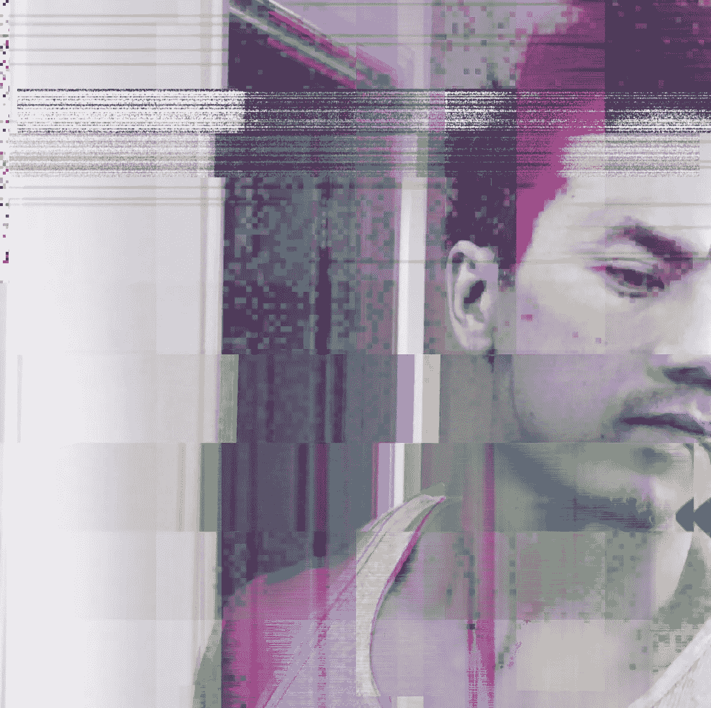

# 去他妈的三年后你会看到什么

> 原文：<https://medium.com/hackernoon/fuck-where-you-see-yourself-in-three-years-5fdd6e582d42>

## 追踪蓝图的后果。

是的，你应该有远见。一个计划。方向。你应该知道你想去哪里，你希望你的生活是什么样子。你在伴有励志音乐的视频中看到过。每个人都说同样的话。你需要**看到它**才能实现它。不，不只是看。感受它，在你的骨子里。好像已经发生了一样。

我在客厅地板上放了一个计时器，多年来一直在想象这件事。总是这样。当我啜饮着早晨的咖啡，享受着躺在我身下的洛杉矶的微风时，我翻阅着我写的《纽约时报》畅销书的海报，这些海报像电影一样挂在我的墙上。在幕后，团队、公司和合作伙伴都致力于改变我们的改变方式。我有一个放着摩托车的车库，一个后院，当你想要的东西和现实的轮廓完美地排列在一起时产生的那种罕见的感觉。你“成功了”的感觉。你终于到达了那个岛。你已经到了。你现在可以停止做梦了。

做梦是我从小看里奇·里奇卡通时就一直在做的事情。这是美国，你应该有梦想。在这里一切皆有可能。你不需要成为任何人。你一定要看看那狗屎。沉迷其中。你不可能拥有任何东西，除非你先去梦想。

但是随着你的成长，你会发现“成功”是一个神话，一个移动的目标。没有这回事。当你到了那里，你只是想要更多或不同。对你的未来有一个健康的愿景和对它如此顺从以至于其他任何事情都不重要，包括现在，这两者之间有一条细微的界限。

我经常越界。

侧面思考。

> 现在是周六的早上 5 点 15 分，我意识到我未来的旅行会对我的人际关系产生多大的影响。我可以极度地活在当下，从一个人的眼神中注意到一个人声音中微妙的裂缝，看到像一本动画书一样播放的思想。因为我全神贯注，全神贯注。我可以大笑，枕头大战，抱着某人直到我忘记我在那里。因为我在那里，关注着。或者我可以完全不在，就像昨天的风。失落。在我的脑海里。思考未来和所有的如果。我就像一个外国电视频道一样，时好时坏。当我写这篇文章时，我回想起我以前的许多关系，并意识到我是白噪音的时代。他们是对的。这让我很难过。生自己的气。

我上面提到的书籍海报和微风的视觉效果是我痴迷了一段时间的东西。它是我努力工作，竭尽所能传播一段对话，挑战人们思维的副产品。随之而来的是一个真正的家。值得买真正的家具，因为我一生都在洛杉矶四处奔波。从来没有一个我可以称之为家的地方。我的生活一直是过渡性的。一个有着你称之为“碎片”的家具的家。我在跳蚤市场买到这件作品。我得到了梅尔罗斯的这篇文章。喜欢艺术，但这种愿景现在开始消退。故意的。我要放手了。不是因为我不认为这是可获得的或者我不想要它。而是因为你必须放手，给魔法留出空间。如果说我从生活和宇宙以及事情的发展中学到了什么，那就是你不能太长时间地抓住任何东西不放。是的，你必须知道你想要什么，你想往什么方向走，但是你必须放手。也许这就是没人谈论的部分。放手吧。我明白了，当你长时间紧紧抓住蓝图不放时，你会从充满活力和力量的感觉变成绝望和无能为力。你创造了期望悬崖，最终你会掉下去。这可能是毁灭性的。

> 看到你的未来，但是随它去吧，相信它会如你所愿的那样展开。

这是我这些天努力摆脱的地方。

我相信我们可以显化事物。当然，有了努力，有了远见，有了肚子里的火。当你竭尽全力磨练你的天赋，并朝着你的目标定位自己时，明星们会站出来。事情开始天衣无缝地发生。但是它们很少在我们想要的时间或者我们想象的方式出现。

所以我们必须放手，否则我们会被困住，发育不良。这种放手是人生中最难做到的事情之一。这意味着你必须有信仰。这意味着你必须相信你的故事。这也意味着你必须接受，而不是想要更多或不同，而是欣赏你面前的一切。这是唯一的活路，否则你就活不下去。你只是想了很多，这就产生了一个滴答作响的时钟。引发恐慌的点燃的导火线。剥夺了你的力量和感恩的能力。它让你的心变得冷酷。让你隐形。你开始迷失自己。感觉不到，因为你不在你想去的地方。那么你可能会妥协你是谁和你的立场。开始觉得恶心。开始喜欢别人的故事。否认你的。瞬间就会失去。你可能会变得绝望，你的天赋可能会被冲淡。你可能开始错过生活，因为你忙着在脑海中描绘一幅画面。

突然你 45 岁了。你的裤子不像以前那样合身了。你对食物过敏。你在脸上看到奇怪的线条。你又需要眼镜了。

以下是我所知道的。因为它总是发生在我身上。三年后，当你回首往事时，你会意识到你应该更关注当下。因为天从未塌下来。你还在这里，你还是你。希望发生了一些好事。也可能不是。因为宇宙不会给你时间。也许除了时间什么都没发生。如果是这样的话，你会后悔你不在这里。你没有看到沿途洒下的黄金。你不懂得欣赏事物。人们。时刻。经历。你忙着思考。纠结于你没有的一切。因为这样做，你失去了你所做的。

我希望你能再读一遍，因为我意识到生活就像水一样。它流动。你憋不住了。你要么游泳，要么淹死，这取决于你脑子里在想什么。我没必要什么都知道。我不必纠结于事情以及事情将如何发展。我可以接受现在的一切，现在摆在我面前的一切，并完全投入其中。即使这不是我想要的或我想去的地方，因为让我们面对它。永远不会。因为就像我上面提到的，我们的成功目标总是在移动。它随着我们的改变和我们的定义的改变而改变。这就是游泳的样子。或者我可以沉迷其中，沉溺其中。简单来说，吃亏。

那么游泳是什么样子的呢？好吧，让我们从这个开始:**去他妈的三年后你会看到什么。**你知道你想去哪里。你已经纠结了十年了。放下它，专注于生活。他妈的给我出来。停止希望和暂停生活，直到你的梦想实现，直到你得到你想要的。在这里。禁足自己。注意。感受一下。深呼吸。专注于对你最重要的事情。把你的生命挂在那上面。你怎么能给予？你能留下什么？你能影响谁？我不是说妥协你自己和你的目标。但是如果你相信你的生活和故事比你更伟大，那就那样生活，而不是不停地奔跑和追逐。相信它，回到此时此地，生活的地方。

有幻觉，但不要用沙皮画出来。拥有梦想，并全力以赴去追求它。但总要给魔法留有余地。否则就不会有了。

*   愤怒的

[获取我的每日短信](https://www.theangrytherapist.com/)

行动呼吁

[在这里保护你的关系。](https://coursecraft.net/c/theangrytherapist/splash)

点击这里查看我的每周播客[。](http://bit.ly/theangrytherapistpodcast)

如果你想用你的故事改变他人的生活，请加入我们的[催化剂辅导强化](https://www.jrni.co/life-coach-training-program?src=medium)。

下面是我的免费关系工具包。