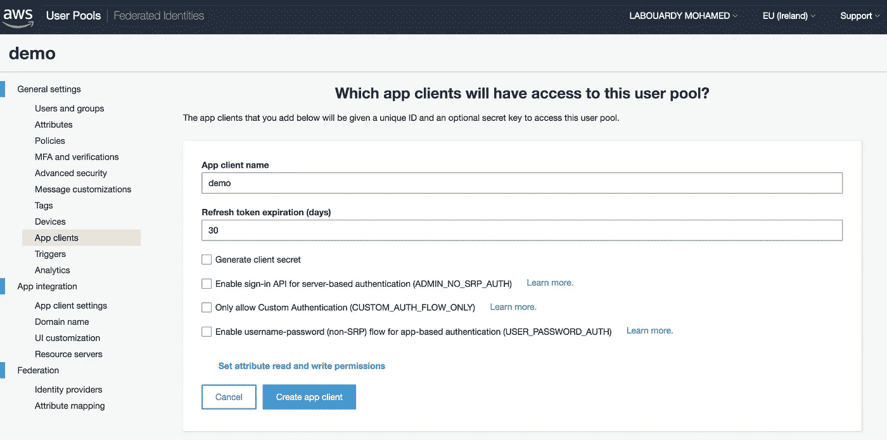
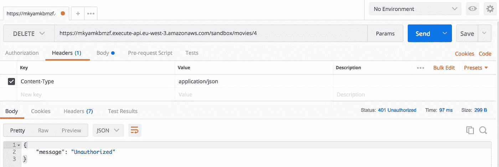

# 零代码构建无服务器 API 的完整指南

> 原文：<https://medium.com/hackernoon/full-guide-to-building-a-serverless-api-with-zero-code-c4f7871998f5>

API Gateway 的一个常见用例是在 Lambda 函数之上构建 API 端点。它还可以用作 API 代理来连接 AWS 服务。在本指南中，我将带您了解如何仅使用 API Gateway 和 DynamoDB 创建自己的 API，并介绍增强 API 端点的高级功能，例如:

*   映射模板、集成请求和集成响应。
*   错误处理和请求验证。
*   使用 AWS Cognito 和 Lambda Authorizer 进行身份验证。
*   使用计划使用和 API 键的 API 节流。
*   API 文档生成。
*   API 网关自定义域。

# 设置 DynamoDB

首先，创建一个名为 *movies* 的 DynamoDB 表，用一个 *id* 作为分区键(将读/写容量保留为默认值):

接下来，在表中插入几个项目，应该是这样的:

接下来，我们需要授权 API 网关访问 DynamoDB 表。因此，我们需要创建一个可由 API 网关承担的 IAM 角色:

该角色将给予 API Gateway 权限来调用对*电影*表的以下 DynamoDB 操作:

# API 端点

在深入了解该架构的细节之前，下图显示了 API Gateway 和 DynamoDB 如何适应 API 架构:

Serverless API Architecture

当调用 API 端点时，请求将通过 API 网关，API 网关将调用适当的 DynamoDB 操作。这将返回一个响应，该响应由 API 网关以 JSON 格式代理给客户机。

## 获取/电影

从 [API 网关控制台](https://console.aws.amazon.com/apigateway/home?region=eu-west-1#/apis/create)创建名为 *MoviesAPI* 的新 API，并创建一个新资源，姑且称之为 *movies* :

在 */movies* 资源上通过点击“ **Create Method** ”暴露一个 *GET* 方法。在“**集成类型**下选择 *AWS 服务*，选择 **DynamoDB** 服务，设置 HTTP 方法为 *POST* ，动作类型为 **Scan** 操作。

接下来，我们需要将进入 API Gateway 的 HTTP 请求转换为对 DynamoDB 的正确的 **Scan** 请求。在 API 网关控制台中，选择“**集成请求**”。在底部，我们可以选择身体贴图模板。这里，创建一个新的*应用程序/json* 映射模板，配置如下:

从“**动作**部署 API 并创建新的部署阶段，将显示调用 URL:

将您的浏览器指向给定的 URL，或者使用像 Postman 这样的现代 REST 客户端。端点将返回 JSON 格式的电影列表:

输出以 DynamoDB 响应格式返回，为了将原始响应映射到传统的 JSON 对象结构，我们将使用**集成响应**特性。

点击“**获取**方法，导航到“**集成响应**，展开 200 响应代码。展开“**映射模板** s”部分。在 **Content-Type** 中，选择 *application/json* 并创建一个映射模板，该模板循环遍历 *Items* 数组中的每个项目，提取电影项目的相关属性并将它们放入一个响应结构中:

> *映射模板*是用[速度模板语言(VTL)](http://velocity.apache.org/engine/devel/vtl-reference-guide.html) 表达的脚本，并使用 [JSONPath 表达式](http://goessner.net/articles/JsonPath/)应用于有效载荷。

因此，您现在应该会看到一个格式化的响应。

## 获取/电影/:id

第二个端点将负责根据客户端提供的 ID 获取电影。因此，应该创建一个带有 path 参数的新资源。ID 的值将通过 *$input.params('id')* 方法获得:

公开一个 GET 方法，然后将资源链接到 DynamoDB 服务。该动作将被 *GetItem* 操作:

同样，为集成请求指定一个主体映射模板，现在使用以下模板:

当用一个 ID 调用 API URL 时，如果存在对应于该 ID 的电影，则返回该电影。

同样，我们将使用 integration response 将原始 DynamoDB 响应映射到我们之前定义的类似 JSON 对象结构:

如果您再次测试它，将会返回以下 JSON:

## 海报/电影

现在我们知道了 **GET** 方法在有和没有路径参数的情况下是如何工作的。下一步是向表中插入一个新项目。用 **PutItem** 作为动作创建一个 **POST** 方法:

我们将创建一个映射模板，将客户机请求转换成 DynamoDB API **PutItem** 需要的结构。下面的映射模板创建了 DynamoDB PutItem API 所需的 JSON 结构。使用 *$input* 变量从请求 JSON 中引用三个输入变量:

回到**方法执行**窗格点击**测试**。创建一个与上面记录的 API 定义相匹配的示例请求体，然后选择“ **Test** ”。例如，您的请求正文可以是:

导航到 DynamoDB 控制台，查看 *movies* 表，显示请求确实被成功处理:

尝试在不给出电影名称属性的情况下插入新电影。将返回以下错误:

这是一个 DynamoDB PutItem 错误。幸运的是，API Gateway 允许您在调用下游资源(在我们的例子中是 DynamoDB 表)之前验证请求体。为了实现这一点，我们将使用 API 网关模型。模型定义了有效载荷数据结构。模型定义是使用 JSON 模式草案 4 编写的。

在 API Gateway 中，导航到 Models 选项卡并创建一个新模型。按如下方式填写表格:

上面的模型定义了一个具有 3 个属性的*电影*实体，并要求定义 *id* 和 *name* 属性(在验证期间使用)。

返回到“**资源**”页面，从 **POST** 方法中点击“**方法请求**，启用请求验证器选项，如下所示:

如果您试图在不提供所需参数的情况下插入新电影，将会返回错误的请求消息错误:

您可以覆盖来自“**网关响应**的默认 400 消息，如下所示:

因此，将返回用户定义的错误消息:

太好了！尝试实现 **PUT** 和 **DELETE** 方法:

# 证明

到目前为止，我们构建的无服务器 API 就像一个魔咒。然而，它是对公众开放的，任何人都可以将数据插入 DynamoDB 表，只要他/她有 API 网关调用 URL。幸运的是，API Gateway 提供了两种处理身份验证的方法:

API Gateway Authentication with Cognito and Lambda Authorizer

## 亚马逊认知

创建一个新的用户池，点击“**查看默认设置**创建一个具有默认设置的池。创建过程结束时应显示一条成功消息:

创建您的第一个用户池后，从“**常规设置”**下的“**应用客户端”**注册您的无服务器 API，并选择“**添加应用客户端”**。为应用程序命名，并检查基于服务器的认证 **ADMIN_NO_SRP_AUTH** 选项:

使用 AWS 命令行创建新用户:

现在已经创建了用户池，我们可以配置 API 网关，在授予对 DynamoDB 的访问权限之前，验证来自成功的用户池身份验证的访问令牌。

要开始保护 API 访问，请转到 API 网关控制台，选择我们之前在中构建的 RESTful API，然后单击导航栏中的“**Authorizers”**。点击**创建新授权人**按钮，选择**cogn ITO**。然后，选择我们之前创建的用户池，并将令牌源字段设置为*授权*。这定义了包含 API 调用者身份令牌的传入请求头的名称，用于授权:

现在，您可以保护所有端点，例如，为了保护负责创建新电影的端点。点击 */movies* 资源下对应的 *POST* 方法。点击“**方法请求”**框，然后点击“**授权”**，选择我们之前创建的用户池:

完成后，重新部署 API，并尝试使用 API 调用 URL 插入一部新电影。这一次，端点受到保护，并需要身份验证:

为了进行身份验证，我们需要从用户池中获取登录用户的身份令牌，并将身份令牌包含在 API 网关请求的*授权*头中。发出以下 AWS CLI 命令以获取新令牌:

上面的命令获取一个 JSON 文件，该文件具有以下属性:

一旦执行，前面的命令将返回以下 JSON 响应:

复制 ID 令牌并将其添加到您的请求的*授权*标题中:

API 网关将验证令牌，并将调用*电影*表上的 *PutItem* 操作，这将向表中插入一部新电影:

## λ授权器

当客户端向您的 API 发送请求时，它将通过 API 网关，API 网关将从请求中提取令牌，并用它调用您的 Lambda 函数授权器。该函数评估令牌，生成策略并将其发送回 API 网关。API Gateway 评估策略并调用为 API 端点注册的 DynamoDB 操作。

为了简单起见，我们的函数将验证客户机提供的令牌是否等于我们的 secret(环境变量),并根据结果返回一个策略文档。下面是 Node 写的函数处理程序源代码。JS:

返回 API 网关，创建一个新的“ **Lambda 授权器**”，并将*授权*设置为 API 网关将从中提取令牌的标头:

选择您想要保护的方法，比方说，它将是负责从表中删除电影的端点。点击**方法请求**，在**授权**下选择您的新授权人:

让我们试着呼叫端点，不出所料，我们没有接通真正的端点:

如果您在请求的*授权*头中包含了秘密令牌，您应该能够删除一个项目:

看起来不错！

# API 节流

您可以使用结合 API 键的使用计划来设置 API 的方法级限制，并定义客户端可以访问 API 的数量和速度(请求速率和配额)。

以下过程描述了如何创建使用计划:

## API 用法

创建一个名为**基本**的使用计划，其*限制*为每秒 1 个请求，而*配额限制*为每天 10000 个请求:

创建名为 **premium** 的第二个使用计划，其*阈值限制*为每秒 10 个请求，而*配额限制*为每天 100 万个请求:

## API 键

接下来，创建两个 API 键:

将第一个 API 密钥分配给基本使用计划，将第二个密钥分配给高级使用计划:

将我们创建的使用计划与 API 部署阶段相关联:

将 API 方法配置为需要 API 密钥:

部署或重新部署 API 以使需求生效:

现在，如果您添加了 **x-api-key** 头。如果一切顺利，您将收到如下输出:

如果超出了与 API 键相关的速率限制或配额限制，将返回“**太多请求**”HTTP 错误:

# **自定义域名**

您可以将自己的域名用于 API 和部署阶段，创建一个由**ACM**(Amazon Certificate Manager)证书支持的**自定义域名**:

从 API 网关控制台创建新的自定义域名:

添加路径映射，将域名映射到 API 部署阶段:

配置完成后，您可以使用自定义域名查询 API，如下所示:[https://api.serverlessmovies.com/movies](https://api.serverlessmovies.com/movies)

# 证明文件

在完成本指南之前，我们将介绍如何为我们到目前为止构建的无服务器 API 创建文档。

在 API Gateway 控制台上，选择您有兴趣为其生成文档的部署阶段。在下面的例子中，我选择了*沙箱*环境。然后，点击**导出**选项卡，并点击**导出为摆动**部分:

**Swagger** 是 **OpenAPI** 的实现，OpenAPI 是由 Linux 基金会定义的关于如何描述和定义 API 的标准。这个定义被称为 **OpenAPI 规范文档**。

您可以将文档保存在 JSON 或 YAML 文件中。然后，导航到 [https://editor。昂首阔步。io/](https://editor.swagger.io) 并将内容粘贴到网站编辑器上，它将被编译并生成一个 HTML 页面，如下所示:

喜欢你正在读的东西吗？查看我的书，了解如何使用 AWS Lambda 在 Golang 中构建、保护、部署和管理生产就绪的无服务器应用程序。

 [## 使用 Go | PACKT Books 动手操作无服务器应用程序

### 学习使用 AWS Lambda 在 Golang 中构建、保护、部署和管理您的无服务器应用程序

www.packtpub.com](https://www.packtpub.com/application-development/hands-serverless-applications-go)