# 数组旋转的乐趣

> 原文：<https://medium.com/hackernoon/fun-with-array-rotations-add4a335d79a>

Source: [https://giphy.com/](https://giphy.com/)

数组是最通用的数据结构之一。数组是许多应用程序的基础，许多算法和数据结构都基于数组。

例如，[二分搜索法](https://www.geeksforgeeks.org/binary-search/)算法的工作方式是因为数组数据结构为我们提供了内容的 ***随机存取*** 。如果我们去掉随机存取，我们就不能像以前一样执行具有相同时间复杂度的著名的二分搜索法算法。

类似地，我们有[优先级队列](https://www.geeksforgeeks.org/priority-queue-set-1-introduction/)数据结构，它也是基于完整二叉树的数组表示，堆本身是许多应用程序的根。

这篇特别的文章将处理与数组和字符串中的**旋转相关的[编程](https://hackernoon.com/tagged/programming)问题。**这是一个相当有趣的问题领域，我们将基于数组中的旋转概念来研究一系列不同的问题。

在开始实际问题之前，让我们先看一些旋转的例子，并尝试回答以下关于旋转的问题:

1.  什么是轮换？
2.  包含 N 个元素的数组可以旋转多少次？
3.  将数组旋转一个元素的时间复杂度是多少？
4.  一些 [Python](https://hackernoon.com/tagged/python) 魔法来实现旋转。

## 什么是轮换？

下面的图表将会清楚地说明什么是真正的旋转。

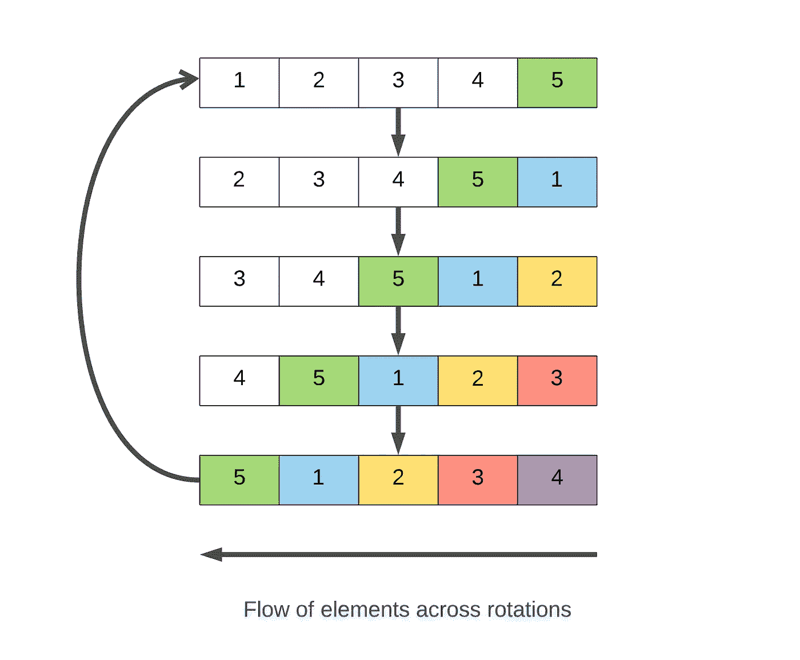

本质上，我们删除数组的第一个元素，把它放在最后，把所有剩余的元素左移一步。这是一个**向左旋转的例子。**

类似地，我们可以让**向右旋转。**


## **转数？**

上面的图表很清楚地说明了这一点。无论我们有左旋还是右旋，对于一个 N 元素的数组，我们都会有 N 个可能的旋转数组(包括 self)。

## **旋转的时间复杂度？**

本质上，当我们旋转数组时，我们所做的是移除第一个元素(考虑到我们正在谈论左旋转),我们将所有剩余的元素向左移动一个位置，最后我们将从第一个位置移除的元素插入到数组的最末端。

由于每次我们必须做一个旋转步骤，无论是向左旋转还是向右旋转，剩余的 N-1 个元素也必须被移位**以适应旋转，所以这个操作的时间复杂度是 **O(N)。****

## 巨蟒魔法！🧙‍

我们有很多方法可以解决这个问题。我们将只展示向左旋转的方法，向右旋转也可以用类似的方法实现。所以这是留给读者的练习。

这是在给定数组上实现一步向左旋转的最基本方法。我们简单地将第一个元素放在最后，在此之前，我们将剩余的每个元素都向左移动一步，即从索引 1 开始(对于基于 0 的数组索引)。

这种方法实际上会修改底层数组。很多时候，我们只对数组的旋转版本感兴趣，或者我们对给定数组的所有旋转感兴趣，然而，*我们并不真的想要修改底层数组*。你可以说给定的数组是一个只读数据结构。

如果你仔细注意，为了第 n 次做左旋转，你需要前一次旋转的结果。因此，举例来说，如果给我们的原始数组是`[1,2,3,4,5]`,你按照上面列出的方法，在一次旋转后，它将变成`[2,3,4,5,1]`,然后我们可以对它再进行一次左旋转，得到`[3,4,5,1,2]`。

按照上面的方法，很难得到 N 次左旋转后剩下的数组。

让我们看一个有趣的方法来实现这一点。

这里的诀窍是**模**运算。如果你注意到旋转后的数组，旋转后的数组的起点实际上是原始数组中的某个索引`i`。这个索引`i`可以由数字`N`决定，它代表我们想要对给定数组执行的旋转次数，然后返回结果。

同样，你可以想象，N 也可以很大。它可以大于原始数组的长度。然而，在某个时间点之后，旋转后的数组开始**重复自身**。因此，对于一个大小为 N 的数组，在 N-1 次旋转后，我们得到的下一个旋转后的数组就是原来的数组。

要理解为什么这里的模运算有效，请看下图，它显示了一些旋转。


我希望这张图能给你足够的清晰，为什么我们可以简单地做模运算，我们可以直接得到 N 次旋转后的数组。

我们也可以用 Python 编写一个 liner，而不是像前面的代码片段那样编写代码。

现在我们有了旋转的概念，也知道了如何处理数组，我们终于可以看看围绕旋转数组这个概念的一些有趣的问题了。

# 旋转琴弦

[](https://leetcode.com/problems/rotate-string/description/) [## 旋转字符串- LeetCode

### 我们得到两个字符串，A 和 b。A 上的移位包括获取字符串 A 并将最左边的字符移动到…

leetcode.com](https://leetcode.com/problems/rotate-string/description/) 

让我们看看这个问题要求我们做什么。

它说我们有两个字符串 A 和 B，长度可能相等也可能不等😛(你错过这个了吗？)，如果字符串 A 的任意特定旋转可以给出字符串 b，我们将返回 true。

在下图中，我们考虑两个字符串`A = abcde`和`B = cdeab`，经过两次旋转后，字符串 A 等于字符串 b。因此在这种情况下，我们返回`True`


一个肯定会返回`False`的简单检查是两个字符串的长度是否不同。在这种情况下，无论我们做什么旋转，弦都不会相等。

解决这个问题的一个非常天真的方法是找出所有的旋转，然后用字符串 B 进行字符串匹配，看两个字符串是否相等。我们将首先查看该解决方案，然后查看其复杂性分析，最后我们将查看它在 [leetcode](https://leetcode.com/) 平台上与其他解决方案相比表现如何。

**时间复杂度:** O(N)因为对于每一次旋转，我们对两个长度为 N 的字符串进行字符串匹配，这需要 O(N)，我们总共有 O(N)次旋转。

**空间复杂度:** O(N)因为我们每次循环都创建一个新的链表。

在 leetcode 平台上，这个解决方案的表现不如预期。

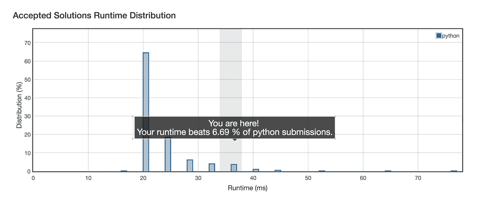

事实证明我们可以做得比这更好。

> 这里的想法是将字符串 A 附加到自身，然后检查字符串 B 是否是这个扩展字符串 A + A 的子字符串

你可能会问，我们为什么要这样做？

事实证明，如果我们将一个给定的数组/字符串附加到它自身，那么得到的数组或字符串覆盖了原始数组的所有旋转。让我们看看下面的图表，以了解这种连接操作如何有效地产生所有可能的旋转。下图中我们要考虑的字符串是`abcde`，所以在将这个字符串和它自身连接起来之后，我们得到了`abcdeabcde`

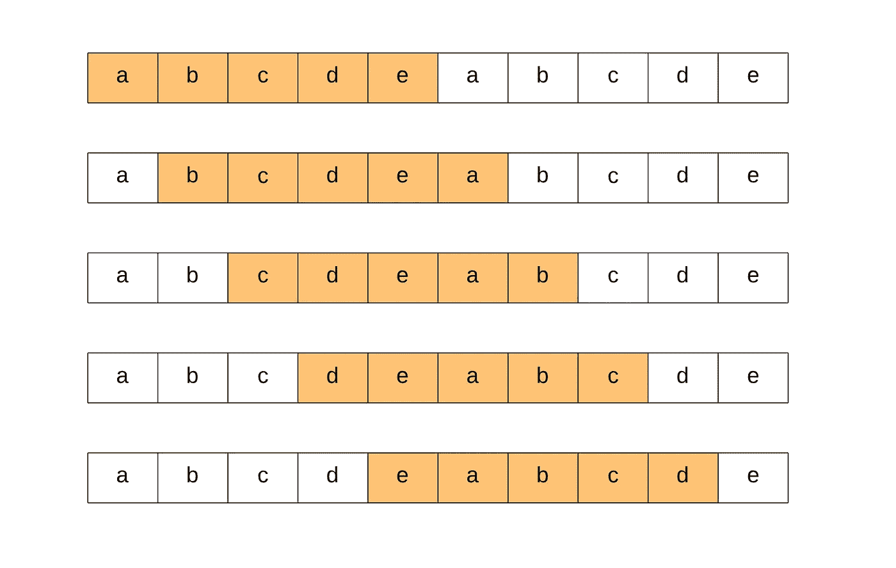

Figure showing all possible rotations for string “abcde” covered by “abcdeabcde”

现在，如果字符串 A 或 A 的任何旋转确实等于字符串 B，那么字符串 B 将是这个扩大的字符串 2A 的子字符串。

**时间复杂度:** O(N)因为我们所做的只是一个大小为 N 的字符串和另一个大小为 2N 的字符串之间的字符串匹配。

**空间复杂度:** O(N)因为我们要创建一个大小为 2N 的新字符串来容纳这个字符串 a 的放大版本。

该算法比前一个算法快得多，并且实现时间也短得多。这是 Python 中的一行代码🙈。

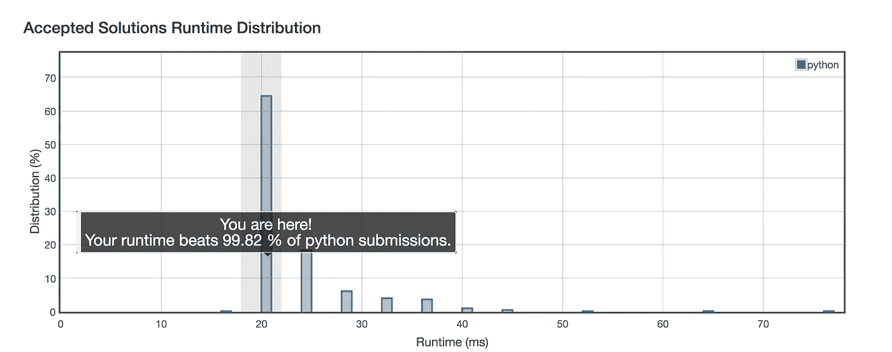

我得说这已经够快了！

让我们转到另一个有趣的问题，这个问题看起来很简单，但是在我们得到完美的解决方案之前，有一系列的注意事项需要考虑。

# 旋转排序数组中的最小值

[](https://leetcode.com/problems/find-minimum-in-rotated-sorted-array/description/) [## 在旋转排序数组中查找最小值- LeetCode

### 假设一个按升序排序的数组在某个你事先不知道的支点上旋转。(即[0，1，2，4，5，6，7]…

leetcode.com](https://leetcode.com/problems/find-minimum-in-rotated-sorted-array/description/) 

在继续之前，我要感谢 [Divya Godayal](https://medium.com/u/842b783318b8?source=post_page-----add4a335d79a--------------------------------) 为本文的这一部分做出了贡献。干杯！

所以这个问题只是要求我们在数组中找到一个元素

*   已排序，
*   旋转，显然
*   不包含任何重复的元素。

解决这个问题的一个非常野蛮的方法是搜索整个数组并找到最小元素。这种方法会简单地忽略给定数组已经排序的事实，这是解决这个问题的幼稚方法。首先，让我们来看看这个问题的一个简单的基于线性搜索的解决方案。

**时间复杂度:** O(N)如果给定数组中有 N 个元素。

**空间复杂度:** O(1)

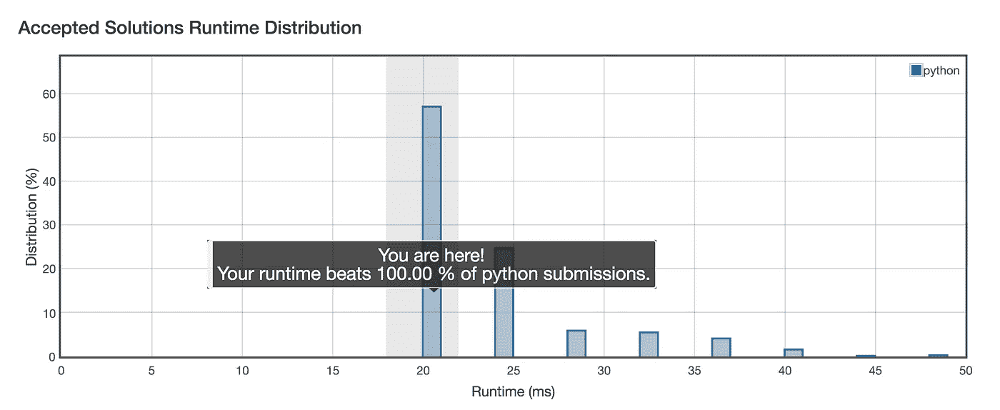

这个其实挺有意思的。一个 O(N)的解决方案为我们提供了 leetcode 的最佳执行时间。然而，就渐近复杂性而言，我们可以做得比这更好。

给定数组被排序的事实本身就是一个巨大的暗示。因为数组是排序的，我们要在数组中找到一个元素，我们可以使用二分搜索法范式。

但是，阵列是旋转的。所以简单地应用二分搜索法在这里是行不通的。

在这个问题中，我们将基本上应用二分搜索法的修改版本，其中决定搜索方向的`condition`将不同于标准的二分搜索法。

在标准的二分搜索法算法中，我们做以下事情

```
1\. while left <= right
2\.     mid = (left + right) / 2
3\.     if element == middle element:
4\.         return mid 
5\.     elif element < middle element:
6\.         move to the left i.e. [left, mid - 1]
7\.     else:
8\.         move to the right i.e. [mid + 1, right].
```

由于给定的数组已经排序，我们可以明确地应用二分搜索法算法来搜索元素。唯一的事情是，元素被旋转了，这是我们必须考虑的事情。

首先，我们如何检查数组是否旋转了？

如果数组没有旋转，并且数组按升序排序，则

```
last_element > first_element
```


在上面的例子`7 > 2`中。这意味着阵列没有任何旋转。在这种情况下，我们可以简单地返回数组的第一个元素，因为这是最小的元素。

然而，如果阵列实际上是旋转的，那么阵列中的某个地方将会形成心跳。让我们来看看我们所说的心跳形成是什么意思。

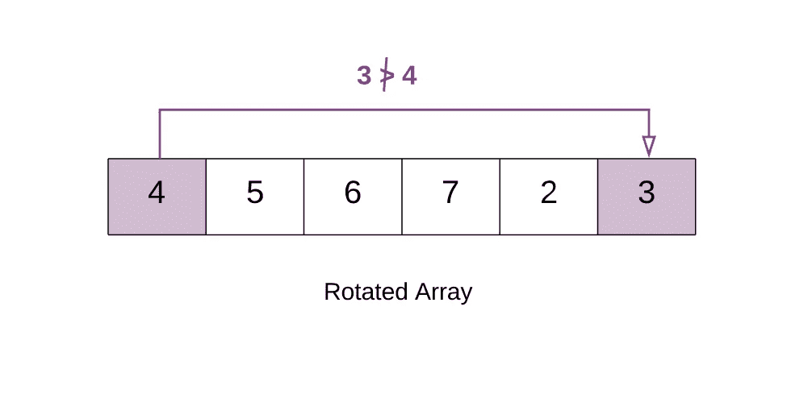

如果您查看上面的数组元素，它们按照预期的升序排列(因为数组是按升序排序的)。然而，在元素 7 之后，有一个突然的下降，然后值又开始增加。这就是我们所说的心跳结构。

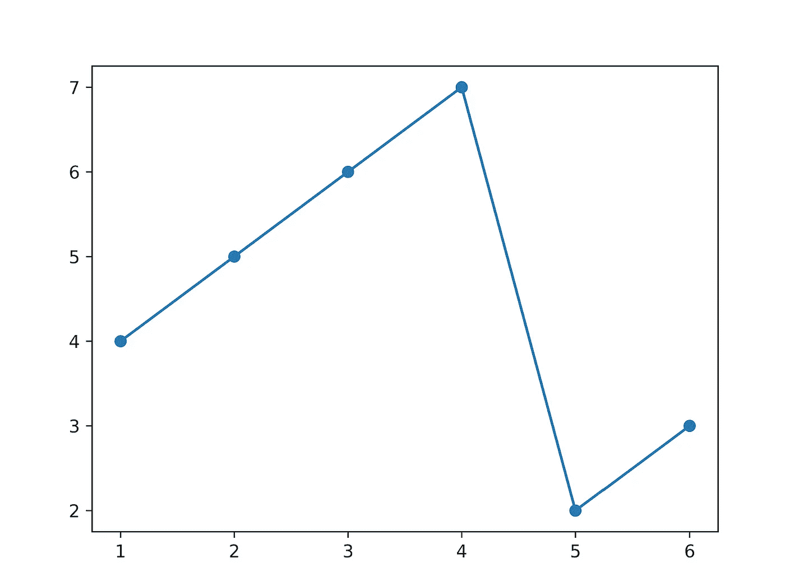

在上面给出的数组中`3 < 4`。因此阵列被旋转。发生这种情况是因为数组最初是`[2, 3 ,4 ,5 ,6 ,7]`。但是旋转之后，较小的元素`[2,3]`在后面。即【4，5，6，7，`2, 3]`。因此，旋转数组中的第一个元素`[4]`变得比最后一个元素大。

从问题中可以明显看出，心跳结构意味着数组中有一个点会发生变化。这一点将有助于我们解决这个问题。我们称之为`Inflection Point`。


拐点的一个重要属性对解决这个问题至关重要，那就是:

> *拐点左边的所有元素>数组的第一个元素。
> *拐点右侧的所有元素<数组的第一个元素。

在看实现之前，让我们先看看解决这个问题的算法。

1.  找到数组的`mid`元素。
2.  如果`mid element > first element of array`这意味着我们需要寻找`mid`右边的拐点。
3.  如果`mid element < first element of array`这样，我们需要寻找`mid`左边的拐点。

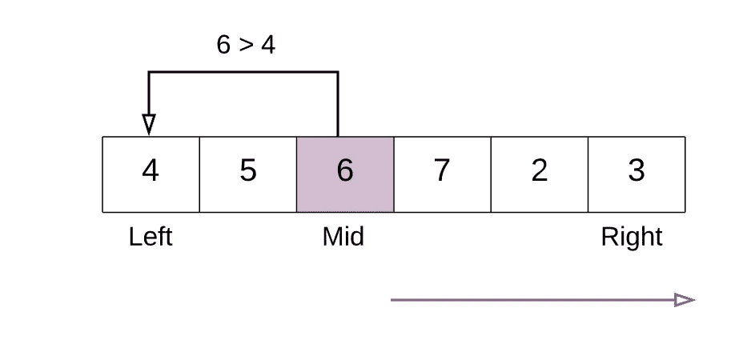

当我们找到拐点时，当两个条件中的任何一个满足时，我们停止搜索:

→ `nums[mid] > nums[mid + 1]`因此，`mid+1`最小。

→ `nums[mid - 1] > nums[mid]`因此，`mid`最小。

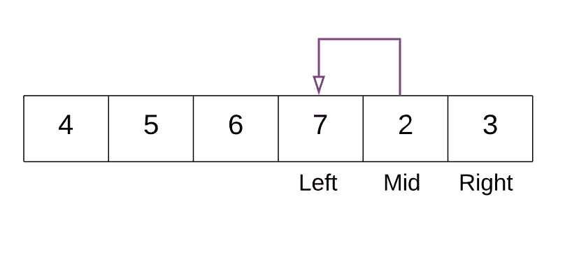

时间复杂度: O(logN)因为我们在这里所做的一切都依赖于我们的好朋友二分搜索法，因此利用了原始数组的排序性质。

**空间复杂度:** O(1)


没有比这更好的了，对吧？😉

这个问题最大的问题是数组中没有重复的元素。如果数组中有重复的元素怎么办？我们还能遵循类似的方法来解决问题吗？

这个问题的答案是肯定的，也是否定的。我们上面讨论的相同概念也适用于这个问题的修改版本。但是，时间复杂度不再保证为 O(logN)。看看下面的例子。

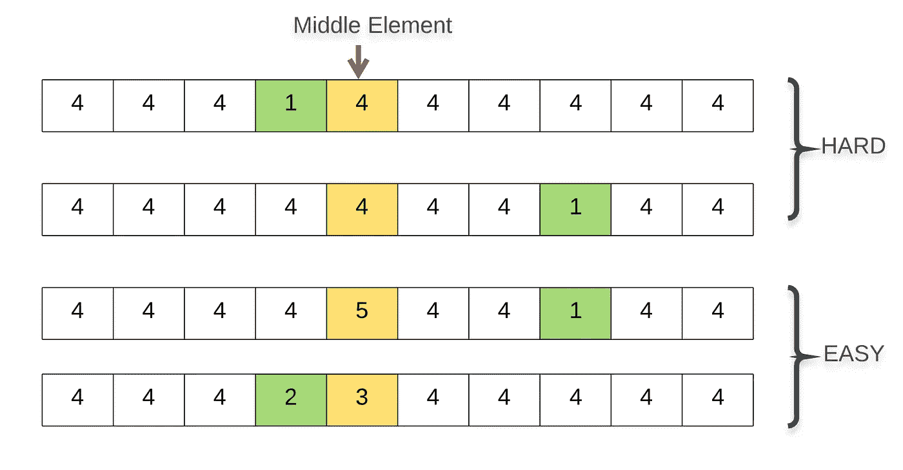

下面提到的两种情况更容易解决，因为中间的元素不同于第一个和最后一个元素，可以帮助指引二分搜索法(尽管您会被 4 作为二分搜索法的中点卡住)。

重点是，由于这里允许重复元素，因此可能会出现这样的场景:

```
leftmost element == middle element == rightmost element
```

当这种情况发生时，我们如何决定我们需要朝什么方向前进。我们没有可能知道二分搜索法算法可以忽略的方向。因此，我们必须尝试将两者都视为可能的候选，并对它们进行处理，如果数组中的所有元素都相同，即`[4,4,4,4,4,4,4,4]`，那么我们最终将逐个处理每个元素。

因此，怀着沉重的心情😢我们不得不得出结论，在这个问题上没有办法得到一个保证 O(logN)复杂度的算法。我们上面看到的二分搜索法算法的修改版本的最坏情况时间复杂度是 O(N)。

让我们进入这篇文章的最后一个问题，这将是一个重磅炸弹。相信我！

# 有序队列

[](https://leetcode.com/problems/orderly-queue/description/) [## 有序队列- LeetCode

### 给定一串小写字母 S。然后，我们可以走任意多步。在每一步中，我们选择一个…

leetcode.com](https://leetcode.com/problems/orderly-queue/description/) 

在得到解决方案之前，让我们先看看一些可能的字符串旋转。我们将考虑的字符串是`baaca`，K = 3，这意味着我们可以选择前三个字符中的任意一个作为**，然后将其从原来的位置移除，将其添加到最末尾，最后将所有字符向左移动一个位置，以在最后容纳这个新元素。**


假设字符串有以下字符:`a[0], a[1], a[2] … a[n-1]`，我们想把某个位置 i (i > = 0 & & i < n — 1)和位置 i+1 互换，或者把 a[i]和 a[i+1]互换。声明是，我们可以通过对字符串使用旋转，对字符串中的任意两个相邻元素实现这一点。例如:假设字符串由 5 个字符组成，我们想要交换`a[2] and a[3]`，下面是我们如何通过数组旋转来实现这一点。

```
a[0], a[1], **a[2], a[3]**, a[4], a[5]     ROTATE around first elementa[1], **a[2], a[3]**, a[4], a[5], a[0]     ROTATE around first element**a[2], a[3]**, a[4], a[5], a[0], a[1]     ROTATE around **second** element**a[2],** a[4], a[5], a[0], a[1], **a[3]**     ROTATE around **first** elementa[5], a[0], a[1], **a[3], a[2],** a[4]     ROTATE around firstelementa[0], a[1], **a[3], a[2],** a[4], a[5]     ROTATE around firstelement
```

您可以尝试使用这个想法，但本质上我们可以通过以上面显示的方式执行多次旋转来交换给定字符串中的任意两个相邻元素。

> 因为我们可以交换任意两个元素，所以我们可以执行**冒泡排序！**

冒泡排序算法本质上涉及相邻元素之间的比较，目的是 ***将元素向上/向下冒泡到它们在数组中各自的位置。***

因此，我们已经实现了字符 a[2]和 a[3]的交换，而没有扰乱其他字符的顺序(类似地，这可以对任何一对相邻的索引进行)。

因此，如果问题中的 K > 1，我们基本上可以通过使用旋转来执行冒泡排序算法，并且最终我们将得到的最小字典序字符串将是按升序排序的原始字符串。

## K = 1 时呢？

在这种情况下，我们在“选择”将哪个元素移动到数组后面时没有那么大的自由。在这种情况下，我们必须查看原始字符串的所有可能的旋转，并返回字典中最小的一个。

如果你没记错的话，大小为 N 的字符串的旋转数是 N。因此，当 K = 1 时，我们必须查看数组的所有旋转数(还记得我们在文章中讨论的获取所有旋转数的 **mod** 方法或 **concat** 方法吗？)并按字典顺序获得最小的一个。

让我们看一下实现，尽管它非常小。

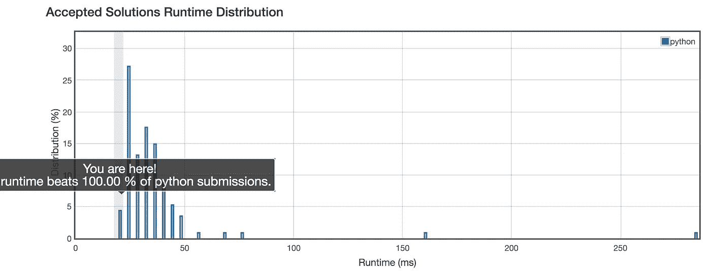

**时间复杂度:** O(NlogN)因为我们正在为 K > 1 排序字符串

**空间复杂度:** O(N)因为如果 K = 1，那么我们创建 S+S 也就是 O(N)空间分配。

本文到此为止。希望你在学习数组循环时过得愉快，并且我希望你能够掌握我们在这里讨论的所有概念。

> 所有冰雹编码…