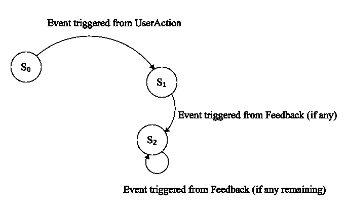
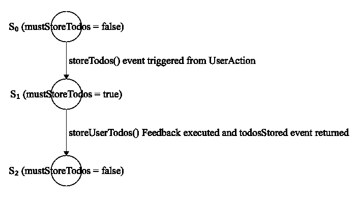
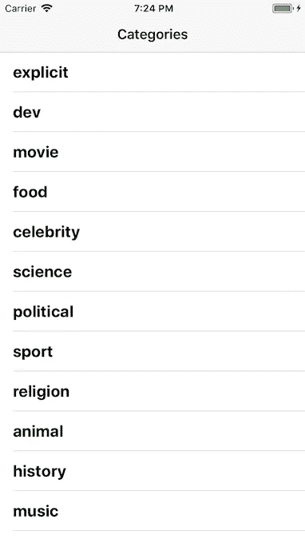
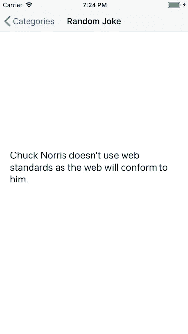
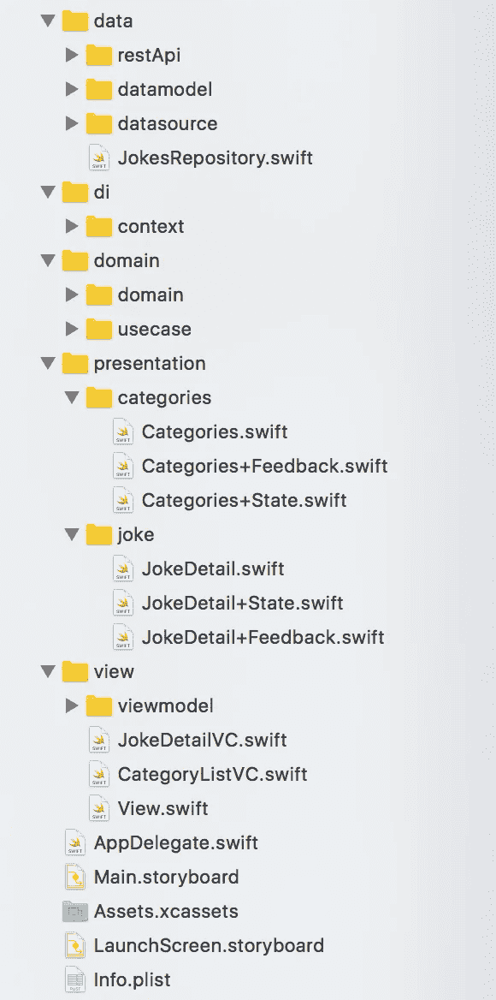

# Swift 的功能架构

> 原文：<https://medium.com/hackernoon/functional-architecture-for-swift-dfa8854239cb>

在这篇文章中，我将介绍一个用于设计 iOS 应用程序的库，名为 ArchitectureKit:

> “功能套件的最简单架构”

# 目录

1.  介绍
2.  动机
3.  建筑信息技术
4.  依赖注入
5.  完整示例
6.  结论

# 1.介绍

ArchitectureKit 是一个库，它试图加强正确性并简化应用程序和系统的状态管理。它帮助您编写行为一致且易于测试的应用程序。它受到了 [Redux](https://redux.js.org) 和 [RxFeedback](https://github.com/NoTests/RxFeedback.swift) 的强烈启发。

# 2.动机

我一直在努力寻找一种合适的方法和架构来简化管理和处理移动应用程序状态的复杂性，并且易于测试。

我从[模型-视图-控制器](https://developer.apple.com/library/content/documentation/General/Conceptual/DevPedia-CocoaCore/MVC.html) (MVC)开始，然后是[模型-视图-视图模型](https://msdn.microsoft.com/en-us/library/hh848246.aspx) (MVVM)，还有[模型-视图-展示者](https://en.wikipedia.org/wiki/Model–view–presenter) (MVP)以及[干净的架构](https://fernandocejas.com/2014/09/03/architecting-android-the-clean-way/)。MVC 不像 MVVM 和 MVP 那样容易测试。 **MVVM 和 MVP 很容易测试**，但是问题是 **UI 状态可能会很混乱**，因为没有一个集中的方法来更新它，并且你可以在改变状态的代码中有很多方法。

然后出现了 [Elm](https://guide.elm-lang.org/architecture/) 和 [Redux](https://redux.js.org) 等类似 Redux 的架构如 [Redux-Observable](https://github.com/redux-observable/redux-observable) 、 [RxFeedback](https://github.com/NoTests/RxFeedback.swift) 、 [Cycle.js](https://cycle.js.org) 、[resswift](https://github.com/ReSwift/ReSwift)等。这些架构(包括 ArchitectureKit)和 MVP 之间的主要区别在于，它们**引入了 UI 状态如何更新的约束，以加强正确性并使应用程序更容易推理。**

ArchitectureKit 与这些类似 Redux 的架构的不同之处在于，它使用反馈循环来运行效果，并将它们编码到状态的一部分中(我们将在第 3 点中看到这一点)，并使用 FunctionalKit 中的单子来包装效果。

**ArchitectureKit 为你运行** [**副作用**](https://en.wikipedia.org/wiki/Side_effect_(computer_science)) **。你的代码保持 100%的纯净。**

# 3.建筑信息技术

ArchitectureKit 本身非常简单。

## 核心概念

应用程序的每个屏幕(以及整个应用程序)都有一个状态。在 ArchitectureKit 中，这种状态表示为 and 对象(即 Struct)。例如，待办事项应用程序的状态可能如下所示:

这个状态对象代表了待办应用程序中“待办屏幕列表”的状态。“todos”变量包含所有可能在屏幕上绘制的待办事项，而“visibilityFilter”则告诉列表中应该显示哪些待办事项。

使用这种具有实际表示屏幕状态的对象的方法，**视图是状态**的直接映射:

> `view = f(state)`

这个“f”函数将是我们稍后会看到的 UI 绑定函数。

要改变状态，您需要调度一个**事件**。事件是描述发生了什么的枚举。以下是几个事件示例:

强制将每一个变化都描述为一个事件，让我们对应用程序中发生的事情有一个清晰的理解。如果有些东西改变了，我们知道它为什么会改变。事件就像已经发生的面包屑。最后，为了将状态和动作联系在一起，我们编写了一个称为 reducer 的函数。它只是一个以状态和动作作为参数的函数，并返回应用程序的下一个状态:

> **(状态，事件)——>状态**

我们为每个屏幕的每个状态编写一个缩减器。有关 todos 屏幕的列表:

注意，reducer 是一个纯函数，就[参考透明](https://en.wikipedia.org/wiki/Referential_transparency)而言，对于状态 S 和事件 E，它总是返回相同的状态，没有副作用。

这基本上是 ArchitectureKit 的全部思想。注意，我们没有使用任何 ArchitectureKit APIs。它附带了一些实用程序来促进这种模式，但主要思想是描述您的状态如何随着时间的推移而更新以响应事件，并且您编写的 90%的代码都非常简单快捷，因此可以轻松地测试 UI 逻辑。

但是异步代码和副作用如 API 调用、DB 调用、日志记录、读写文件呢？

## 异步结果和功能套件

`[**AsyncResult**](https://github.com/RPallas92/ArchitectureKit/blob/master/ArchitectureKit/AsyncResult.swift)` 数据结构用于处理异步操作。AsyncResult 只是一个`typealias`到一个`Reader<Future<Result>>`单子堆栈。这些单子(及其单子转换器)在 [FunctionalKit](https://github.com/facile-it/FunctionalKit) 中可用，这是 ArchitectureKit 中唯一的依赖项。

FunctionalKit 为 [Swift](https://hackernoon.com/tagged/swift) 中的功能性[编程](https://hackernoon.com/tagged/programming)提供了基本函数和组合子，可以认为是对`Foundation`的扩展。我们主要使用 Reader monad 以及 Future 和 Result。

*   [**Reader monad:**](https://github.com/facile-it/FunctionalKit/blob/master/Sources/FunctionalKit/ReaderType.swift)**它用在 monad 栈的顶层，提供一种注入依赖的方式。稍后我们将深入了解。**
*   **[**未来单子:**](https://github.com/facile-it/FunctionalKit/blob/master/Sources/FunctionalKit/FutureType.swift) 用来表示异步值。**
*   **[**结果单子:**](https://github.com/facile-it/FunctionalKit/blob/master/Sources/FunctionalKit/ResultType.swift) 表示计算是否成功或有错误。**

**我们使用 monad 转换器创建 AsyncResult，作为这三个 monad 的堆栈。**async result 是一个 monad，表示返回成功值或错误的异步操作，并提供依赖注入机制。****

**我们可以在下面的代码片段中看到一个使用 AsyncResult 的脸书登录示例:**

**为了创建一个 AsyncResult，我们使用它的静态方法`unfoldTT`(TT 代表 transformer，因为它是一个 monad transformer)。它期望一个函数作为有两个输入的参数:一个环境或上下文和一个延续或回调。环境参数来自读取器 monad，它是一个包含注入依赖项的对象。continuation 参数是一个回调函数，必须用 de 异步操作返回的`Result`值调用。在这个例子中，当成功时，结果返回一个`string`。当登录成功时，我们使用来自脸书的令牌调用 continuation 方法。如果登录失败，我们调用包含错误的失败`Result`的 continuation 方法。**

**AsyncResult 必须用 3 个值参数化。第一个是环境类型(包含依赖项)，第二个是异步操作的实际期望值(在本例中我们使用`string`，因为我们希望脸书登录返回登录令牌)，最后一个是出错时`Result`将返回的错误类型。**

**每个异步操作和副作用必须使用 AsyncResult monad 来执行，我们将使用来自 ArchitectureKit 的反馈来执行它们的副作用。此外，我们将在完整的示例中看到如何使用 AsyncResults。**

## **设计反馈回路**

**让我们在之前的待办事项应用程序中添加一个新功能！我们希望让用户把他们的待办事项保存到云端。这将需要一个网络调用，这是一个副作用，并且是异步的，所以为了实现它，我们将使用反馈循环。在体系结构中处理效果的方法是将它们编码成状态的一部分，然后设计反馈回路。**

**反馈回路只是在某些情况下触发的计算，取决于系统的当前状态，它启动新的事件，并产生新的状态。**

**一个完整的 ArchitectureKit 循环从一个触发事件的 [UserAction](https://github.com/RPallas92/ArchitectureKit/blob/master/ArchitectureKit/UserAction.swift) 开始。然后 reducer 函数根据事件和先前的状态计算新的状态。ArchitectureKit 检查是否必须从新状态触发任何反馈循环。如果是这样，反馈会异步产生一个新事件(通过执行副作用)和一个新状态(如果是从反馈的事件计算出来的)。**

**因此，我们可以看到一个完整的 ArchitectureKit 循环，如下所示:**

1.  **UserAction 产生一个事件。**
2.  **减速器(当前状态，事件)->新状态。**
3.  **查询新状态以检查是否必须触发反馈回路。**
4.  **如果是，则触发新事件(执行副作用)。**
5.  **reducer(新状态，新事件)->更新状态。**
6.  **从步骤 3 开始重复，直到不再有反馈(或最多 5 次反馈循环)**

****

**ArchitectureKit whole loop**

**在下面的代码片段中，我们可以看到一个如何在云中存储用户待办事项的反馈示例:**

**为了实现这个特性，添加了两个新事件`storeTodos()`和`todosStored(Bool)`，并且在状态中有一个新的布尔变量:`mustStoreTodos`。`storeUserTodos(todos:[Todo])`函数是在反馈循环中执行的函数，它返回一个 AsyncResult monad，后者在执行副作用时返回`todosStored(Bool)`事件。这个函数负责存储用户的待办事项。**

**反馈对象由两个接收当前状态作为参数的函数组成。第一个函数是要执行的实际 AsyncResult，第二个函数根据状态检查何时必须执行反馈循环。在示例中，当`mustStoreTodos`变量为真时，将执行用户的待办事项反馈。**

**在新的减速器中，`storeTodos()`事件将`mustStoreTodos`设置为真，而`todosStored(Bool)`将它设置回假。`storeTodos()`事件将由用户动作触发，比如点击按钮。**

**下图说明了存储用户待办事项的步骤:**

****

**How Feedback loop is executed after an UserAction**

## **谁调度事件？用户操作**

**[UserAction](https://github.com/RPallas92/ArchitectureKit/blob/master/ArchitectureKit/UserAction.swift) 是来自 ArchitectureKit 的对象，表示来自用户或 iOS 框架的任何动作，该动作触发一个改变状态的事件(并且从该状态改变它可以触发一个反馈循环)。**

**它有两种方法:**

*   **`init`:创建 UserAction，并指定当执行用户操作时将触发什么事件**
*   **`execute`:执行用户动作。**

## **简单的例子**

**我们可以在这里看到一个简单的例子，展示 ArchitectureKit 的代码是怎样的:**

**这是一个简单的计数器，带有递增和递减按钮。状态只是一个包含当前计数的整数。**

****

# **依赖注入**

**对于依赖注入，我们将使用位于 AsyncResult 单子堆栈顶层的 [**读取器单子**](https://github.com/facile-it/FunctionalKit/blob/master/Sources/FunctionalKit/ReaderType.swift) 。**

****阅读器用类型** `**(D) -> A**` **包装一个计算，并启用该类型**的复合计算。**

**`D`代表*“阅读器上下文”*，它代表计算运行所需的依赖关系。它还自动向下传递依赖关系，因为它是自己完成的，这要归功于`Readers`组合在一起的方式。**

**因此，它推迟了所有级别的计算，因为它包装了计算，并且通过在不同的函数调用之间自动传递来注入依赖关系。**

**方法是创建一个包含所有需要的依赖项的 Swift 结构(我称之为 Context ),并在运行`Reader (AsyncResult)`计算时传递该对象。在下面的例子中，我们可以看到如何在 ArchitectureKit 中注入依赖关系:**

**正如您在前面的代码片段中看到的,`BaseContext`协议是用`AppContext`类将拥有的必需依赖项定义的。在该类中，我们添加了应用程序的全局依赖项。然后我们为每个屏幕创建一个上下文类，像`TodoListContext`。它从 AppContext 扩展而来，包含了待办事项列表屏幕的特定依赖项，比如视图。**

**如果我们想要测试`deleteAllTodosFromDatasource`反馈，我们可以创建一个带有模拟数据源和模拟视图的测试上下文。通过这种方法，我们还可以为每个服务器环境配置不同的上下文:生产、试运行、测试和开发。**

**在下一节中，我们将看到一个完整的例子，其中我们使用不同的上下文来测试应用程序和实际代码。**

**你可以在 Jorge Castillo 的文章中看到更多关于依赖注入的内容:**

** [## 使用阅读器 Monad 的 Kotlin 依赖注入

### 作为一名 Android 开发人员，我习惯于浪费大量时间来创建必要的基础设施以提供依赖性…

medium.com](/@JorgeCastilloPr/kotlin-dependency-injection-with-the-reader-monad-7d52f94a482e) 

# 完整示例

我使用 ArchitectureKit 和 FunctionalKit 创建了一个简单但功能齐全的应用程序，来说明如何使用这个库以及如何设计应用程序本身。你可以在这里 **找到 app 的 [**源代码。**](https://github.com/RPallas92/FunctionalSwiftArchitecture)**

该应用程序是关于查克·诺里斯的笑话，从这个 API 中检索。第一个屏幕显示了笑话类别列表。当用户点击一个类别时，一个新的屏幕会出现该类别的随机笑话。我们可以看到一些截图(免责声明:我没有在 UI 上下功夫):

List of joke categories screen

Custom joke detail screen

在下图中，我们可以看到应用程序被划分成的层:

它分为:

*   **数据**:我们在哪里使用存储库模式
*   **领域**:这里有领域对象、服务和用例。
*   **表现:**我们可以建立表现逻辑(ArchitectureKit)
*   **视图**:app 的视图(ViewControllers)
*   **DI:** 我们定义依赖注入所需的*上下文*对象

如果你看一下[测试文件夹](https://github.com/RPallas92/FunctionalSwiftArchitecture/tree/master/FunctionalSwiftArchitectureTests)，你会看到我们是如何注入依赖关系的，以及使用一个非常简单的模拟视图测试整个应用程序是多么容易。

# 结论

我将使用 ArchitectureKit 作为一种干净的体系结构方法中的视图层的体系结构，取代 Model View Presenter。此外，我会用*功能*干净的架构来设计应用，而不是 OOP 干净的架构。尽可能使用函数而不是类，使用 AsyncResult monad 来保持代码的纯净，编码副作用，注入依赖性，利用函数转换… **我认为**[**functional swift architecture**](https://github.com/RPallas92/FunctionalSwiftArchitecture)**是一个很好的例子，说明了我如何从头开始制作一个应用程序。**

我在 ArchitectureKit 中看到的**优势**是:

*   你的代码保持 100%的纯净。所有的副作用都是由 ArchitectureKit 自己执行的。
*   状态的所有变化都很容易推理并有助于正确性。
*   视图是状态的直接映射。
*   易于测试，由于干净的架构，所有业务逻辑都被隔离，UI 逻辑是纯 Swift 代码。和依赖注入机制，使应用程序更容易测试。
*   带有一些概念的简单库。

## 后续步骤

我计划改进用户行为机制。并为每个 UIKIt 控件创建一个特定的 UserAction。

如果出现新的用例，我将重构这个库并进行更改。

## 感谢

我想感谢[杰西·曼努埃尔·洛佩斯·马丁内斯](https://medium.com/u/fc39ebe507ff?source=post_page-----dfa8854239cb--------------------------------)和[何塞·路易斯·阿尔卡拉](https://medium.com/u/d278e9977263?source=post_page-----dfa8854239cb--------------------------------)帮助我开发了 ArchitectureKit 的代码库，并帮助我撰写了这篇文章。**