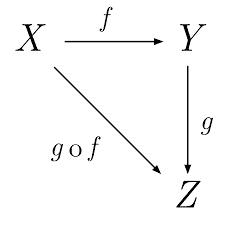
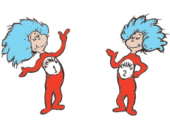

# 函数式 JavaScript —函子、单子和承诺

> 原文：<https://medium.com/hackernoon/functional-javascript-functors-monads-and-promises-679ce2ab8abe>


有人说过一个`Promise`就是一个`Monad`。别人都说一个`Promise`不是一个`Monad`。他们都错了...他们都是对的。

当你读完这篇文章时，你会明白什么是`Functor`和`Monad`，以及它们与`Promise`的相似和不同之处。

https://dev.to/joelnet/functional-javascript-函子-单子-承诺-1pol 。如果你想看到彩色的代码，请在 DEV.to 上阅读。

# 为什么没人能解释一个单子？

如果没有理解单子所需的必备词汇，很难解释单子是什么。

我喜欢理查德·费曼的这个视频，当他被要求描述两个磁铁之间“发生了什么”时。

整个视频是惊人的和令人兴奋的，但是如果你对学习有些厌恶，你可以直接跳到 6:09。

> *我无法用你所熟悉的其他事物来解释这种吸引力——理查德·费曼@* [*6:09*](https://www.youtube.com/watch?v=MO0r930Sn_8#t=6m9s)

所以让我们后退几步，学习理解什么是`Monad`所需的词汇。

# 我们准备好理解函子了吗？

定义:“函子”是“可映射”的东西，或者是可以在一个类别中的对象之间映射的东西。

好吧…还没有。但是不要害怕，如果你用过`Array`的`map`功能，你就已经熟悉`Functors`了。

```
[1, 2, 3].map(x => x * 2) //=> [2, 4, 6]
```

在我们能够完全理解一个`Functor`之前，我们也必须理解成为`Mappable`意味着什么，并且理解我们也必须理解一个`Category`是什么。所以让我们从这里开始。

# **类别、对象和贴图(态射)**



一个`category`由节点(对象)和态射(函数)的集合组成。一个对象可以是数字、字符串、URL、客户，或者任何其他你想组织的东西。(图中的 X、Y 和 Z 是对象。)

`map`是一个将某物从一个对象转换到另一个对象的函数。(f，g，雾是贴图)。🔍谷歌提示:对象之间的一个`map`被称为一个`Morphism`。

示例:使用`toString()`方法可以将对象`Number Type`中的对象转换为对象`String Type`。

```
// A map of Number -> String
const numberToString = num => num.toString()
```

你也可以创建`maps`回自己的对象或更复杂的对象类型。

```
// A map of Number -> Number
const double = num => num * 2// A map of Array -> Number
const arrayToLength = array => array.length// A map of URL -> Promise (JSON)
const urlToJson = url =>
  fetch(url)
    .then(response => response.json())
```

所以一个对象可以很简单，比如一个数字或者一个字符串。对象也可以更抽象，如用户名、用户 API URL、用户 API HTTP 请求、用户 API 响应、用户 API 响应 JSON。然后我们可以在每个对象之间创建映射或变形来获得我们想要的数据。

态射的例子:

*   用户名->用户 API Url
*   用户 API Url ->用户 API HTTP 请求
*   用户 API HTTP 请求->用户 API 响应
*   用户 API 响应->用户 API 响应 JSON

🔍Google 提示:`Function Composition`是一种组合多个`map`或`morphisms`来创建新的`maps`的方法。使用`Function Composition`我们可以创建一个从`Username`直接到`User API Response JSON`的地图

# 回到函子

现在我们明白了成为`Mappable`意味着什么，我们终于可以明白什么是`Functor`了。

一个`Functor`是一个`Mappable`的东西，或者可以在一个类别中的对象之间映射的东西。

一个`Array`是`Mappable`，所以是一个`Functor`。在这个例子中，我将一个`Array of Numbers`变形为一个`Array of Strings`。

```
const numberToString = num => num.toString()const array = [1, 2, 3]array.map(numberToString)
//=> ["1", "2", "3"]
```

注意:一个`Functor`的特性之一是它们总是保持同一类型的`Functor`。您可以将包含`Strings`的`Array`变形为`Numbers`或任何其他对象，但是`map`将确保它始终是一个`Array`。你不能把`Number`的一个`map`变成仅仅一个`Number`。

我们也可以将这种`Mappable`用途扩展到其他物体上！让我们举一个简单的`Thing`的例子。

```
const Thing = value => ({
  value
})
```

如果我们想让`Thing`像`Array`一样可映射，我们只需要给它一个`map`函数。

```
const Thing = value => ({
  value,
  map: morphism => Thing(morphism(value))
//                 ----- -------- -----
//                /        |            \
// always a Thing          |             value to be morphed
//                         |
//             Morphism passed into map
})const thing1 = Thing(1)               // { value: 1 }
const thing2 = thing1.map(x => x + 1) // { value: 2 }
```

那是一个`Functor`！真的就这么简单。



🔍谷歌提示:我们创建的`"Thing"` `Functor`被称为`Identity`。

# 回到单子上

有时函数会返回一个已经包装好的值。这可能不方便与`Functor`一起使用，因为它会将`Functor`重新包裹在另一个`Functor`中。

```
const getThing = () => Thing(2)const thing1 = Thing(1)thing1.map(getThing) //=> Thing (Thing ("Thing 2"))
```

该行为与`Array`的行为相同。

```
const doSomething = x => [x, x + 100]
const list = [1, 2, 3]list.map(doSomething) //=> [[1, 101], [2, 102], [3, 103]]
```

这就是`flatMap`派上用场的地方。它类似于`map`，除了态射也被期望执行包装值的工作。

```
const Thing = value => ({
  value,
  map: morphism => Thing(morphism(value)),
  flatMap: morphism => morphism(value)
})const thing1 = Thing(1)                          //=> Thing (1)
const thing2 = thing1.flatMap(x => Thing(x + 1)) //=> Thing (2)
```

这样看起来更好！

当你可能需要从`Just`切换到`Nothing`时，这在`Maybe`中会派上用场，例如当道具丢失时。

```
import Just from 'mojiscript/type/Just'
import Nothing from 'mojiscript/type/Nothing'const prop = (prop, obj) =>
  prop in obj
    ? Just(obj[prop])
    : NothingJust({ name: 'Moji' }).flatMap(x => prop('name', x))
//=> Just ("Moji")Just({}).flatMap(x => prop('name', x))
//=> Nothing
```

该代码可以缩短为:

```
const Just = require('mojiscript/type/Just')
const Nothing = require('mojiscript/type/Nothing')
const { fromNullable } = require('mojiscript/type/Maybe')const prop = prop => obj => fromNullable(obj[prop])Just({ name: 'Moji' }).flatMap(prop('name'))
//=> Just ("Moji")Just({}).flatMap(prop('name'))
//=> Nothing
```

🔍Google 提示:这个代码缩短是通过`currying`、`partial application`和`point-free style`实现的。

我希望在这一点上，你认为这是一个比你最初认为的更容易的旅程。我们已经讲述了`Functors`和`Monads`以及接下来的`Promise`！

# 承诺

如果这些代码看起来很熟悉，那是因为`Promise`的行为类似于`map`和`flatMap`。

```
const double = num => num * 2const thing1 = Thing(1)             //=> Thing (1)
const promise1 = Promise.resolve(1) //=> Promise (1)thing1.map(double)    //=> Thing (2)
promise1.then(double) //=> Promise (2)thing1.flatMap(x => Thing(double(x)))
//=> Thing (2)promise1.then(x => Promise.resolve(double(x)))
//=> Promise (2)
```

正如你所看到的，当返回一个展开的值时，`Promise`方法`then`像`map`一样工作，当它被包装在`Promise`中时，像`flatMap`一样工作。这样，`Promise`类似于`Functor`和`Monad`。

这也是它与众不同的地方。

```
thing1.map(x => Thing(x + 1))              // Thing (Thing (2))
promise1.then(x => Promise.resolve(x + 1)) // Promise (2)thing1.flatMap(x => x + 1) //=> 2
promise1.then(x => x + 1)  //=> Promise (2)
```

如果我想包装一个值两次(想想嵌套的`Arrays`)或者控制返回类型，我不能用`Promise`。这样，它违反了`Functor`定律，也违反了`Monad`定律。

# 摘要

*   一个`Functor`是一个`Mappable`或者可以在一个类别中的对象之间映射的东西。
*   一个`Monad`类似于一个`Functor`，但是在类别之间是`Flat Mappable`。
*   `flatMap`与`map`相似，但是产生了对映射函数返回类型包装的控制。
*   承诺违反了`Functor`和`Monad`定律，但仍有很多相似之处。相同但不同。

继续阅读:[空，“十亿美元的错误”，也许什么都没有](https://dev.to/joelnet/null-the-billion-dollar-mistake-maybe-just-nothing-1cak)

我的文章展示了对函数式 JavaScript 的热爱。如果你需要更多的 FP，在这里或者在 Twitter 上关注我 [@joelnet](https://twitter.com/joelnet) ！

感谢我的好友 Joon 证明了这一点:)

