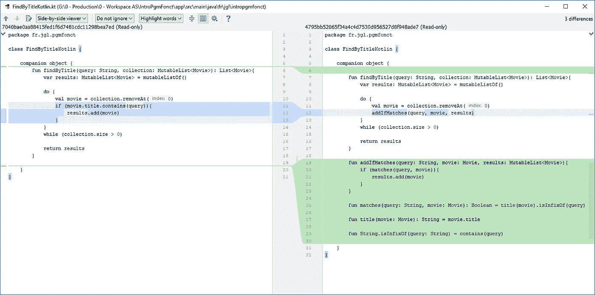
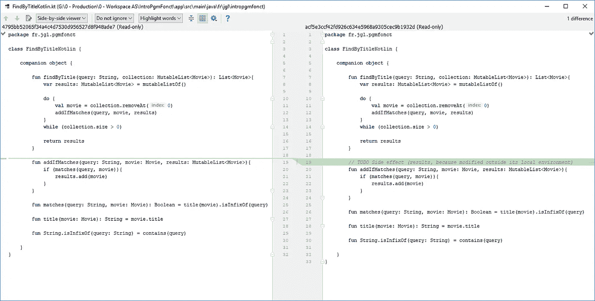
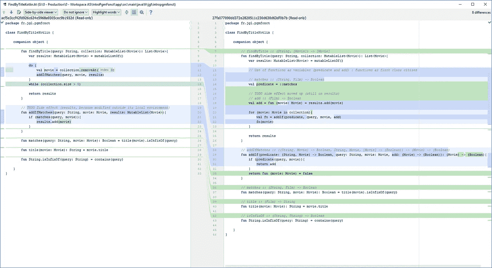
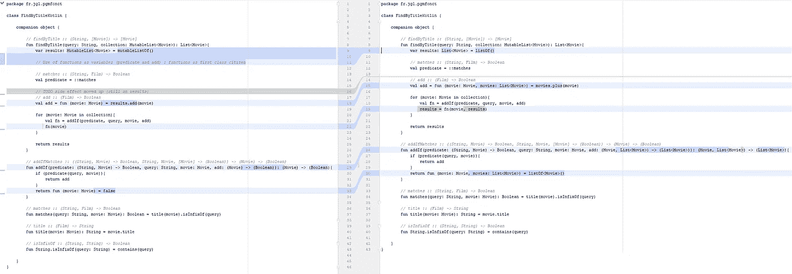
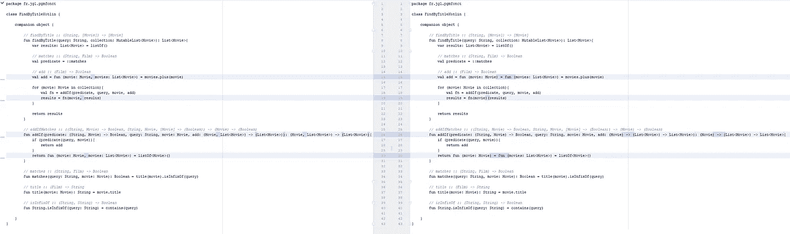
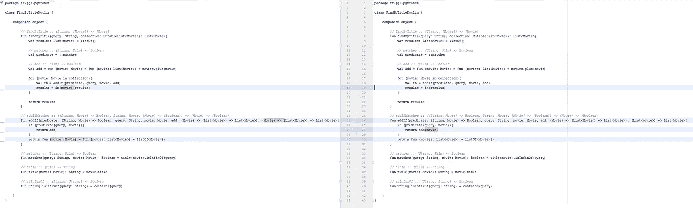
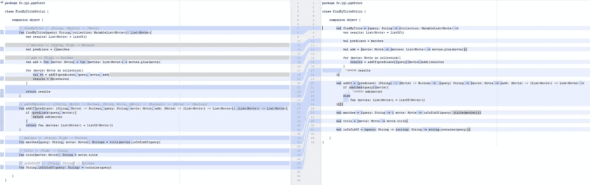
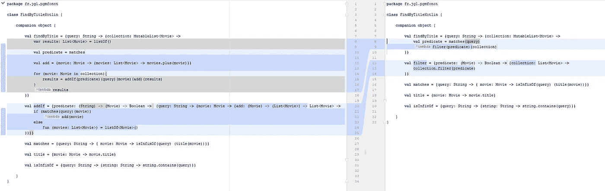

# Kotlin 函数式编程示例

> 原文：<https://medium.com/hackernoon/functional-programming-by-example-with-kotlin-27fd7e49b55f>

在这篇文章中，我通过展示从命令式编程到函数式编程的方法重构的不同步骤来浏览 T2 函数式编程的基本概念。这篇文章也允许看到**我们可以用 **Kotlin 作为 FP 语言**的地方。**

概念:

*   副作用
*   纯函数
*   充当一等公民
*   高阶函数
*   封闭参数和闭包
*   货币化/部分应用
*   λ表达式

## 基础方法

## 从命令到程序

## 从程序到功能:**出现一个**副作用

> **副作用**:如果一个[函数](https://en.wikipedia.org/wiki/Subroutine)或[表达式](https://en.wikipedia.org/wiki/Expression_(programming))修改了其本地环境之外的某个[状态](https://en.wikipedia.org/wiki/State_(computer_science))，则称其具有副作用。— [维基百科](https://en.wikipedia.org/wiki/Side_effect_(computer_science))

使用 FP，我们不希望有**副作用**，因为我们希望有独立的进程来实现并行化。没有副作用的函数(对于相同的参数返回相同的值)被称为纯函数。

> **纯函数**:具有以下性质:
> 
> *对于相同的[参数](https://en.wikipedia.org/wiki/Argument_of_a_function)，其[返回值](https://en.wikipedia.org/wiki/Return_statement)相同(不随本地[静态变量](https://en.wikipedia.org/wiki/Static_variable)、[非本地变量](https://en.wikipedia.org/wiki/Non-local_variable)、可变[引用参数](https://en.wikipedia.org/wiki/Value_type_and_reference_type)或来自 [I/O 设备](https://en.wikipedia.org/wiki/Input/output)的输入流而变化)。
> 
> *它的求值没有副作用(没有局部静态变量、非局部变量、可变引用参数或 I/O 流的突变)。— [维基百科](https://en.wikipedia.org/wiki/Pure_function)

## 副作用越来越大

通过这一步，我们开始像使用变量一样使用函数(作为参数传递给其他函数，由另一个函数返回或作为值赋给变量)。

这种用法叫做**充当一等公民**

以另一个函数为自变量的函数称为**高阶函数**。

*add()* 使用一个参数， *results* ，该参数不作为实参传递。这个参数叫做**封闭参数**，方法**叫做封闭。**该参数是封闭的，因为不可由参数修改，这与作为标准方法参数传递的开放参数相反。

## 消除副作用

最后，通过使用*加*操作符完全消除了副作用，该操作符返回另一个包含附加电影的列表。

## 第一次

> **Currying** :将带有多个参数的函数的求值转化为一系列函数的求值的技术，每个函数只有一个参数— [wikipedia](https://en.wikipedia.org/wiki/Currying)

**Currying** 启用 **lambda calculus** ，你可能永远不会在标准应用程序中使用它，但它也允许将函数简化为可能已经存在于你的 SDK 中的不太复杂的函数，然后减少你的代码。

**部分应用**是一个类似的概念，没有 1 个参数的要求。

> **部分应用**:指将多个实参固定在一个函数上，产生另一个实参更小的函数的过程。— [维基百科](https://en.wikipedia.org/wiki/Partial_application)

## (删除电影副本)

## 从匿名到 Lambda 表达式和最后一个 currying

> **Lambda 表达式**:带简化符号的匿名函数

使用 lambda 应该可以帮助我们编写更简洁的代码，我们在这里看到，使用 Kotlin，这并不明显...例如，JavaScript 允许去掉花括号和类型，以得到一个非常干净的管道。

int Kotlin 中存在一种替代方法，使用类型化变量符号(参见文章末尾)。

## 通过替换为基本函数:集合来减少代码。过滤器

## 最后形状

代码现在是一个非常基本的功能的表达式，业务与其余部分明显分离( *findByTitle()* 和 *matches())。我们得到一个真正的函数程序。*

## 附录:使用类型化变量符号

可以将类型从管道中移除到变量中。对于长管道，它仍然不友好，还会导致类型错误。

代码在 github 上，通过单元测试来确保代码在步骤之间工作。

 [## Jacques giraudel/intropgmfoct

### Kotlin 版本的 devo xx 2018 conf“Tout ce que you with toujours voulus savoir on the programming functionnelle…

github.com](https://github.com/jacquesgiraudel/IntroPgmFonct) 

*本文灵感来源于这个* [*现场编码谈*](https://www.youtube.com/watch?v=IQ1kDpGeoCk) *(法语)，我把代码改编成了科特林。一个英文版(略有差异)可以在这里* *找到* [*。*](https://www.youtube.com/watch?v=x7j6KeQgZ6k)