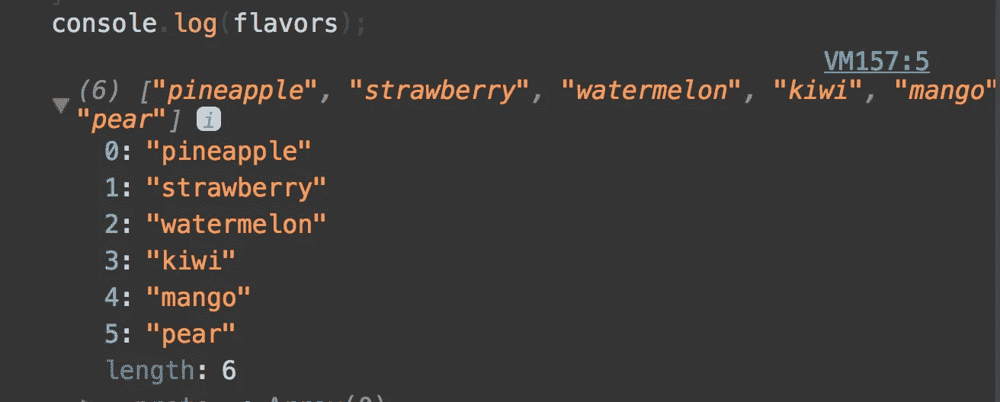
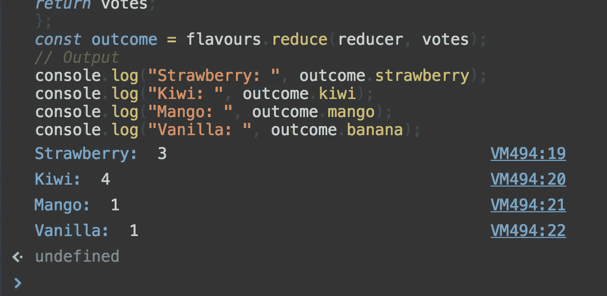

# JS 中的函数式编程:map，filter，reduce (Pt。5)

> 原文：<https://medium.com/hackernoon/functional-programming-in-js-map-filter-reduce-pt-5-308a205fdd5f>

> 注意:这是学习 JavaScript ES6+中函数式编程技术的“Javascript 和函数式编程”系列的一部分。查看上一篇关于 curry[<Part 4>](https://hackernoon.com/javascript-and-functional-programming-currying-pt-4-96e3230782ab)的功能文章。从[开始，从这里](https://hackernoon.com/javascript-and-functional-programming-an-introduction-286aa625e26d)开始。

来点实际的吧！之前，我们研究了*高阶函数。*作为一个快速提醒*，*高阶函数*是一个* **函数，它接受另一个函数作为参数。**

[Javascript](https://hackernoon.com/tagged/javascript) 数组有几个**内置方法**是高阶函数。


这篇文章将讨论 3 个最流行的:*过滤，映射和减少。*🙂🙂

## 过滤器

> filter array 方法创建一个新数组，其中所有元素都通过了由提供的函数实现的测试。

这是直接从文件出来的[。以一种更友好的方式来说，filter 是一种在给定集合/数组上运行的方法，它基于返回布尔值(true 或 false)的函数来过滤项目。](https://developer.mozilla.org/en-US/docs/Web/JavaScript/Reference/Global_Objects/Array/filter)

让我们先来看一个例子，然后逐步了解实际发生了什么。在我们的例子中，我们假设下面的集合。

```
const iceCreams = [
  { flavor: 'pineapple', color: 'white' },
  { flavor: 'strawberry', color: 'red' },
  { flavor: 'watermelon', color: 'red' },
  { flavor: 'kiwi', color: 'green' },
  { flavor: 'mango', color: 'yellow' },
  { flavor: 'pear', color: 'green' }
];
```

让我们使用 filter 方法创建一个新的数组，其中只有红色的冰淇淋。记住，filter 创建了一个新的数组，因此我们必须将函数的输出保存到一个变量中，以便以后使用。

```
const favoriteFlavors = iceCreams
    .filter(iceCream => iceCream.color === 'red');console.log(favoriteFlavors);
```

在控制台中运行此代码片段将产生以下输出:


如果你感到有点困惑，那很好。让我们走一遍:)


的。 ***filter*** 方法接受带有 4 个参数的函数，顺序如下

*   **元素**-数组的当前元素
*   **索引** -数组的当前索引(可选)
*   **数组** -对数组本身的引用(可选)
*   **this arg**-执行回调时用作 this 的值(可选)

总之，我们需要提供一个具有以下签名的函数


请注意，在我们的示例中，我们传递了一个匿名函数(它没有命名！)我们也可以选择传递一个命名函数，如下所示:

```
const getRed = icecream => icecream.color === 'red';const favoriteFlavors = iceCreams
    .filter(getRed);console.log(favoriteFlavors);
```

输出将如下所示:


请注意，我们传递了用元素参数隐式调用的 getRed 函数。

过滤是一种快速解析数据的好方法，只留下与我们相关的内容。如果你是第一次阅读，传递一个遵循特定结构的函数的想法可能看起来有点笨拙，但最终会变得非常强大。首先，这种结构使开发人员更容易阅读彼此的代码。其次，在检查*时，我们现在将使用相同的模式。地图*阵列法😎😎😎😎😎

## 地图

`**map()**`方法创建一个新数组，其结果是在调用数组中的每个元素上调用一个提供的函数。本质上，map 方法*基于初始数组创建了一个新数组*。快速看了一下 ***地图()*** 签名:


就像 ***filter()*** ， ***map()*** 是另一个高阶函数。类似于 ***filter()*** 的方法结构我们在这里也必须传递一个函数。但是我们不是过滤原始数组中的项目，而是转换数据。

🤔🤔🤔🤔🤔🤔🤔🤔🤔🤔🤔🤔

我们来看一个例子来阐明！我们将使用上一个示例中的数组。

```
const iceCreams = [
  { flavor: 'pineapple', color: 'white' },
  { flavor: 'strawberry', color: 'red' },
  { flavor: 'watermelon', color: 'red' },
  { flavor: 'kiwi', color: 'green' },
  { flavor: 'mango', color: 'yellow' },
  { flavor: 'pear', color: 'green' }
];
```

假设我们想要创建一个新的字符串数组，包含所有口味的冰淇淋。在我们使用 ***map()*** 之前，让我们试着用经典的这种老派的方式来进行循环。

```
let flavors = [];
for (let i = 0; i < iceCreams.length; i++) {
    flavors.push(iceCreams[i].flavor)
}console.log(flavors);
```



Our output from the for loop code snippet

从技术上讲，对于这个简单的例子来说，这样做很好。但是，当像这样对循环使用*时，您是否看到了一些悄悄出现的问题？我的悲观主义认为这里有三个机会搞砸😳😳😳*

*   定义迭代器值

```
let i = 0; 
```

*   为循环定义*的结束值*

```
i < iceCreams.length
```

*   递增迭代器值

```
i++
```

在不同的情况下，根据我们的数据，这里很容易出现错误。这可能是一个简单的输入错误，比如忘记了一个分号，或者错误地将迭代器实例化为错误的值。

再用 ***map()*** 的方法试试同样的方法。

```
const iceCreams = [
  { flavor: 'pineapple', color: 'white' },
  { flavor: 'strawberry', color: 'red' },
  { flavor: 'watermelon', color: 'red' },
  { flavor: 'kiwi', color: 'green' },
  { flavor: 'mango', color: 'yellow' },
  { flavor: 'pear', color: 'green' }
];const flavors = iceCreams.map(icecream => icecream.flavor)
console.log(flavors)
```


OMG?!!

我们的输出是相同的，但是请注意代码是多么的简洁明了。没有索引，没有分号，没有声明数据长度！自从用 ***map()*** 和 ***filter()，*** 编程以来，我注意到，基于我们的集合/数组的复杂性，与循环相比，使用这些函数方法的容易程度显著提高了。这些绝对值得整合到您的日常编程工作流程中。

## 减少

终于！正如克里斯蒂安·酒井在之前的评论中提到的，reduce 是所有这些方法的鼻祖👵🏻👵🏻👵🏻👵🏻👵🏻👵🏻👵🏻

根据[文档](https://developer.mozilla.org/en-US/docs/Web/JavaScript/Reference/Global_Objects/Array/reduce):

> `**reduce()**`方法对一个累加器和数组中的每个元素(从左到右)应用一个函数，将其减少到一个值。

这太神秘了！让我们把这个的意思“简化”成简单的东西。让我们再回到 ***filter()*** ，和 ***map()*** 方法。他们有什么共同点？本质上，它们将一个集合/数组转换成一个不同的集合/数组。但是这些方法在如何转换数据方面是特定的。相比较而言， ***reduce()*** 就像是瑞士军刀对列表的变换。它可以用来表达**任何**变换！事实上，我们甚至可以用 ***reduce()*** 来实现 ***map()*** 和 ***filter()。*** 说够了！让我们来看看对数组求和的经典 reduce 示例🙃 🙃 🙃 🙃

**先用*作*循环**

```
const arr = [10,20,30]let total = 0;
for(let i = 0; i < arr.length; i++) {
    total += arr[i]}console.log(total);
```


**现在随着减少**

```
const arr = [10, 20, 30];const reducerFunction = (acc, currentItem) => acc + currentItem;const sum = arr.reduce(reducerFunction, 0);
console.log(sum);
```


很明显，我们得到了同样的结果。我们来分解一下。内置数组方法***reduce()******需要一个回调函数作为第一个参数。**这个回调函数在其输入中是预先确定的，最多接受 4 个参数，类似于 ***filter()和 map()*** 期望的回调。我们来看看预期的 ***reducer()*** 函数签名。*

**

****reduce()*** 第二个参数是可选的，是 initialValue。当我们迭代一个数组并试图将它减少到一个单一值时，建议实例化初始值。在我们的*数组求和*示例中，我们将 *initialValue* 实例化为零。如果我们没有实例化初始值，会发生什么？*

```
*const arr = [10, 20, 30];const reducerFunction = (acc, currentItem) => acc + currentItem;// Not instantiating the initial value!
const sum = arr.reduce(reducerFunction);
console.log(sum);*
```

**

*我们得到相同的值！这是为什么呢？根据文档，当没有提供 *initialValue* 时，将使用数组中的第一个元素。虽然这个例子没有提供初始值，但是**我建议习惯于总是提供一个**。这将防止[未来的](https://hackernoon.com/tagged/future)错误，并且还需要您思考您试图在您的阵列上进行的*缩减*是否有意义。*

## *实现***map()******filter()***与 ***reduce()****

*前面我声称 ***reduce()*** 是列表转换方法的始祖，因为我们可以用它来实现所有的方法。让我们证明这一点！*

****地图与减少()****

```
*// ************* Map with Reduce *************const data = [10, 20, 30];const tripledWithMap = data.map(item => {
  return item * 3;
}); const tripledWithReduce = data.reduce((acc, value) => {
  acc.push(value * 3);
  return acc;
}, []);console.log(tripledWithMap, tripledWithReduce);*
```

**

****用 reduce()过滤****

```
*// ************* Filter with Reduce *************const data2 = [1, 2, 3, 4, 5, 6, 7, 8, 9, 10];const evenWithFilter = data2.filter(item => {
  return item % 2 === 0;
})const evenWithReduce = data2.reduce((acc, value) => {
  if (value % 2 === 0) {
    acc.push(value);
  }return acc;
}, []);console.log(evenWithFilter, evenWithReduce);*
```

**

## *一个更实际的 reduce()例子*

*让我们用我们的 ***reduce()*** 方法做一些更有用的事情。让我们计算一下最佳冰淇淋口味的投票结果🍦🍦🍦🍦🍓🍋 🍌 🍉 🍇*

```
*const flavours = [
  "strawberry",
  "strawberry",
  "kiwi",
  "kiwi",
  "kiwi",
  "strawberry",
  "mango",
  "kiwi",
  "banana"
];const votes = {};
const reducer = (votes, vote) => {
  votes[vote] = !votes[vote] ? (votes[vote] = 1) : votes[vote] + 1;return votes;
};
const outcome = flavours.reduce(reducer, votes);// Output
console.log("Strawberry: ", outcome.strawberry);
console.log("Kiwi: ", outcome.kiwi);
console.log("Mango: ", outcome.mango);
console.log("Banana: ", outcome.banana);*
```

**

*类似于我们使用 reduce 的任何时候，我们在一个数组上调用 ***reduce()*** 方法，并提供回调和 initialValue。注意，在这个例子中，我们将初始值设置为一个空对象。如果没有初始化，这将会失败！*

## *用 reduce 扁平化数据*

*首先，让我们为我们的例子定义扁平化数据。展平看起来像这样:*

```
*[[a, b, c], [d, e, f], [g, h i]] -> [a, b, c, d, e, f, g, h, i]*
```

*本质上，我们希望按照数组出现的顺序合并所有的数组。 ***reduce()*** 很好地解决了这个问题🤗🤗*

```
*const letterArr = [['a', 'b', 'c'], ['d', 'e', 'f'], ['g', 'h', 'i']];
const flattened = letterArr.reduce((acc, val) => {
  return acc.concat(val);
}, []);console.log(flattened);*
```

**

## *列表转换器的性能*

*一种常见的模式是链表变压器。虽然它使复杂的转换更容易阅读，但在处理非常大的数组时速度不够快。让我们看一个例子。*

```
*let bigData = [];
for (let i = 0; i < 1000000; i++) {
  bigData[i] = i;
}// Slow
let filterBegin = Date.now();
const filterMappedBigData = bigData
  .filter(value => value % 2 === 0)
  .map(value => value * 2);

let filterEnd = Date.now();
let filtertimeSpent = (filterEnd - filterBegin) / 1000 + "secs";// Fast
let reducedBegin = Date.now();
const reducedBigData = bigData.reduce((acc, value) => {
  if (value % 2 === 0) {
    acc.push(value * 2);
  }
  return acc;
}, []);
let reducedEnd = Date.now();
let reducedtimeSpent = (reducedEnd - reducedBegin) / 1000 + " secs";console.log("filtered Big Data:", filtertimeSpent);
console.log("reduced Big Data:", reducedtimeSpent);*
```

**

*为什么滤镜和贴图的链接这么慢？第一个 ***filter()*** 需要遍历整个数组(1，000，000)，过滤一半。然后 ***map()*** 遍历数组余数(500，000)并创建新数组。相比之下，在 ***reduce()*** 中我们只迭代一次数组！不经常迭代相同的数据集更有效，但性能较差。*

## *如果这篇文章有帮助，请点击拍手👏按钮以示支持！⬇⬇*

*如果你对更多科技和创业相关的内容感兴趣，可以在 [Medium](/@omergoldberg) 、 [Instagram](https://www.instagram.com/omeragoldberg/) 、 [Github](https://github.com/Arieg419) 和 [Linkedin](https://www.linkedin.com/in/omer-goldberg-680b40100/) 上关注我。*