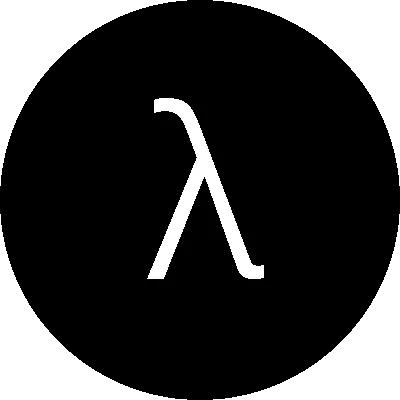

# 函数式编程(不一定用 Java！)

> 原文：<https://medium.com/hackernoon/functional-programming-not-necessarily-with-java-f93764d64a8c>



在一个范例和技术堆栈不断变化的世界里，保持竞争力并提高生产率和质量有时会被证明是一个相当大的挑战。

在本文中，我想首先展示一般情况下使用函数式编程(FP)的优势，特别是增加您的 Java 编码体验。在尝试向函数式编程转变时，我将尝试重复我认为最重要的几个原因。请记住，这绝不是一个巨大的创新，我相信 FP 在 70 年代就已经存在了，但只是在最近几年才获得了关注和兴趣。我们来看看为什么！

> **并发**

随着多核/多线程处理器的出现，函数式编程开始获得更多关注。这绝不是简单的巧合，因为函数式编程鼓励使用不可变的对象、属性和变量(即值不能改变的数据容器)。这有什么关系？想象一下下面的程序块:

```
private int aNumber;public void setNumber(int numberParameter) {
  this.aNumber = numberParameter;
}
```

很简单，对吧？你可能已经看过无数次了。但是如果两个线程同时访问 *setNumber* 方法会发生什么呢？你可以想象，可能会发生某种阻塞，最终，只有最后一个访问该方法的线程对某个数值有最终决定权。但这不是确定性的。这取决于各种因素，因此，我们可以说方法 setNumber 不是引用透明的(后面会详细介绍)。在这种情况下，不变性有助于对代码进行推理，因为我们可以肯定地知道，不管有多少线程访问它的一部分，它的值总是相同的。

> **引用透明功能和可测试性**

函数式编程鼓励使用引用透明的函数。那是什么意思？这意味着一个函数总是可以被它的值所替代，一切都保持不变。想象下面的代码块:

```
import java.util.Random;public class RandomValueProvider {
  public int getSomeRandomValue() {
    Random rand = new Random();
    return rand.nextInt(50);
  }
}
```

*getSomeRandomValue()* 方法是引用透明的吗？我们试着用它的价值来代替它。它总是保持不变吗？我猜不会。这只是一个例子，但是随机数在 FP 中不容易[处理](https://softwareengineering.stackexchange.com/questions/202908/how-do-functional-languages-handle-random-numbers)。不过，尽可能频繁地使用引用透明的函数可能是一个好习惯。想象一下，测试上面的 *getSomeRandomValue* 方法比测试下面的方法要困难得多:

```
public int getSum(int a, int b) {
  return a + b;
}
```

具有提示性名称的小函数通常比在使用函数的地方应用表示其返回值的表达式要好。一个好主意可能是确保(至少大部分)我们编写的函数是确定性的。这将增加代码推理的便利性，以及可测试性。

> **功能组成**

当应用 FP 原则时，操作现在更简单和更确定的事实允许我们通过将不同的函数组合在一起来创建更复杂的行为。接收其他函数作为参数或返回函数的函数称为高阶函数。这里的一些例子来自 Java 8 Stream API。自从溪流在 2014 年成为 JDK 的一部分以来(甚至在此之前)，已经有很多关于溪流的文章。我只想在这里展示一个使用消费者功能接口的简单例子。以下面的代码片段为例，为了简洁起见进行了简化:

```
public void processListOfNumbers(List<Integer> listOfNumbers, Consumer<Integer> processor) {
  return listOfNumbers.stream()
    .forEach(number -> processor.accept(number));
}
```

和一些客户端代码:

```
List<Integer> numbers = Arrays.asList(5, 6, 7, 8);
Consumer<Integer> numberPrinter = n -> System.out.println(n);processListOfNumbers(numbers, numberPrinter);
```

方法 *processListOfNumbers* 是函数组合的一个例子，你可能会听到它有时被命名为高阶函数。在 Java 中，函数(也包括供应商和消费者)是对象。这意味着我们可以应用它们，组合它们，并把它们作为参数传递。

> **用 FP 风格编写的应用更健壮**

可以说，当以函数式风格编写代码时，应用程序本身更不容易出错。这是因为当你有更少的活动部件时，应用程序往往变得更可预测，更容易推理，更能适应逆境。我的意思是，函数组合和不变性的一般用法将确保所有那些因为应用程序不同部分的状态变化而发生的错误现在都将默认消失。该应用程序将变得更加健壮，并将提供更短的开发->测试->调试迭代循环。

> **关注“什么”而不是“如何”**

假设我们有一个 *getUserById* 方法(在同一个类中),它负责从数据库中获取相应的用户对象，以下面这个 Java 流的经典应用为例:

```
public List<User> getAdultUsers(List<Integer> listOfUserIds) { 
  return listOfUserIds.stream().map(this::getUserById)
    .filter(user -> user.getAge() >= 18)
    .collect(Collectors.toList());
}
```

现在让我们看看非函数风格的相同代码:

```
public List<User> getAdultUsers(List<Integer> listOfUserIds) {
  List<User> adultUsers = new ArrayList<>();
  for(int id: listOfUserIds) {
    User user = getUserById(id);
    if (user.getAge() >= 18) {
      adultUsers.add(user);
    }
  }
  return adultUsers;
}
```

除了第二个代码片段稍微长一点之外，我们还可以注意到，它花了一些时间来“解释”这个操作的每一步是如何完成的:创建一个空白列表，遍历 id，获取每个用户，基于条件表达式将一些用户添加到空白列表，完成并返回收集到的用户。

另一方面，在第一个片段中，功能方法更关注“是什么”。代码在做什么？它将一些 id 映射到一些用户，过滤掉他们，并将其余的收集到一个列表中。有人可能会说，在第二种情况下，通过提取小方法可以实现同样的事情，但是我认为第一个代码片段的流和函数作为数据的方法更好。它将我们的功能放在业务逻辑的最前面，与应用程序中的任何其他数据具有相同的地位。

> **更好看的方法签名**

当我们的功能从命令式风格转变为功能式风格时，命名部门也开始变得清晰起来。乍一看，下面的方法很难仅仅通过它的签名来阅读:

```
public void executeProcess() {
  // executing some mysterious stuff!
}
```

代码是做什么的？为什么它不想从我们这里得到什么，为什么它不想回报什么？你能测试一下吗？你看得懂吗？至少，这并不容易。如果它看起来像这样呢？

```
public ExecutionStatus executeProcess(Process processToBeExecuted) {
  // execute "processToBeExecuted" and return some status
}
```

仅仅通过将一些 FP 概念应用到这个简单的例子中，代码就变得可读性更好了。现在，只需查看签名就能说明问题(尽管方法名可能还需要改进)。它需要一个过程，并以某种状态进行响应。除了直接在代码中提供更好的“文档”之外，签名变得更有意义。执行什么流程？我们可以在运行时查看流程对象。它完成使命后会发生什么？我们现在可以看到自己，并可能在我们的流程中使用以后的结果。

> **结论**

如今，无论我们是在处理遗留代码还是新的绿地项目，我们都可以使用一些东西来提高日常工作的质量和生产率。函数式编程从不同的角度处理编码。它通常意味着更简洁，但是如果适当的话，也会提高可读性。它还帮助我们解决一些常见的问题，比如并发编程中的竞争条件、讨厌的对象状态错误或难以跟踪的代码。