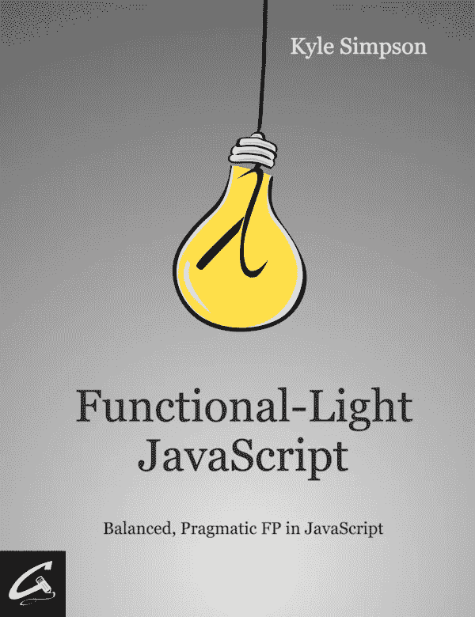
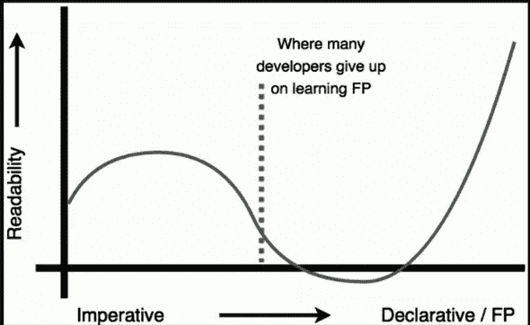

# 去神秘化的函数式编程范式(核心概念)

> 原文：<https://medium.com/hackernoon/functional-programming-paradigm-demystified-core-concepts-d9828762717e>

Photo by [Roman Mager](https://unsplash.com/photos/5mZ_M06Fc9g?utm_source=unsplash&utm_medium=referral&utm_content=creditCopyText) on [Unsplash](https://unsplash.com/search/photos/math?utm_source=unsplash&utm_medium=referral&utm_content=creditCopyText)

准备好离开面向对象编程的领域，进入未知的领域。

老实说，我真的很高兴和你一起揭开我最近一直困扰的一个话题的神秘面纱。

这是对**函数式编程范例**的概述。

在这篇文章中，我想探讨它背后的一些核心概念和基本思想。这些概念你现在就可以开始应用到大多数编程语言中。

为了尽可能顺利地进行，我将试着一路说明这一点。

我真的希望这能让你和我一样，对函数式范例能给 web 开发的未来带来什么感到兴奋。

***免责声明*** *:我绝不是专业的函数式程序员。我仍然处于这种范式的早期，因为大约一年半前我才开始与它混合。一开始你可能会觉得这很神秘，但是请耐心听我说，我真的认为函数性是我逻辑思维中最大的突破之一。*

所以不开玩笑了，让我们开始吧。

# 什么是函数式编程？

*姑且称之为 FP 吧，为了酷孩子。*

让我们偷懒吧，因为 FP 爱偷懒，引用一句名言来定义主题:

> *功能* [*编程*](https://hackernoon.com/tagged/programming) *有许多不同的定义。从 Haskell 的角度来看，Lisp 程序员的定义是非常不同的。OCaml 的 FP 与 Erlang 中的范式没有多少相似之处。你甚至会在*[*JavaScript*](https://hackernoon.com/tagged/javascript)*中找到几个相互竞争的定义。然而，有一个束缚——一些模糊的当我看到它时就知道的定义，很像淫秽(事实上，有些人确实觉得 FP 淫秽！)[…]*

布莱恩·朗斯多夫

虽然这个定义越来越元，但随着你采用 FP 风格，它实际上会变得越来越有意义。

除了来自 Brian Lonsdorf，一个功能性的大布道者，这个引用来自 JS 大师 Kyle Simpson 的书《Functional Light JS》的前言。如果你是一名网络开发人员，并且你对学习 FP 非常感兴趣，这应该是你的第一本[必读书籍](https://github.com/getify/Functional-Light-JS)。

如果你真的很认真，很难找到学习 FP 的时间，那么停止阅读这篇文章(你这个傻瓜),开始读这本书，就像真的一样。

# 功能范式核心概念

我们不会真的触及 FP 的任何深刻的学术数学根源，这是你可能会自然潜入的东西，如果你最终拿起范式，但我不认为这是必要的。

我们更倾向于关注适用于大多数编程语言的概念。有了这些，你就可以开始在日常生活中逐步使用它了。

# 功能不是你想象的那样

在开始任何具体的事情之前，我想让你对 FP 中的术语“函数”有一些基本的了解。FP 中的函数比你用命令式范式得到的经典定义要严格得多。

如果你以前从未做过 FP，这可能对你来说是真实的:

> *函数==方法==过程==子程序。*

不再是了，伙计。从现在起，你应该对函数采取更数学化的方法。

## 数学方法？

在数学函数中，既没有范围也没有全局状态。除了*输入变量*之外，不能访问任何信息。

这意味着，如果你把 f(x) = x 写在一张纸上，写在火星的沙土上，或者在电脑上定义函数，那么对于 x = 5，它的值总是 25。

如果你做到了这一点，你将最终获得数学世界的所有神奇好处(提示；比你想象的要多得多)。

## 一个函数应该是纯的

纯意味着给定相同的输入，函数应该*总是*返回相同的输出，这是确定性的。

让我们再次强调*总是*。这意味着那些不被认为是纯粹的:

*   IO 操作
*   Web 请求，
*   任何可以抛出异常的东西

现在，一些像 Haskell 这样的纯函数式编程语言会强制执行这一规则，而一些则更加灵活。你可能会问，如果你不能做到所有这些，你的程序的目的到底是什么。嗯，答案是你确实可以，但是以一种非常特殊的方式。

这个概念对于这篇文章的目的来说太先进了，所以我们不会涉及它，但是如果你继续你的 FP 之旅，你肯定会自己在这上面绊倒。；)

## 这意味着什么？

一个函数调用唯一的外部交互是它的返回值。

如果你将函数调用替换为它的返回值，这在你的程序中不会引起任何变化，这叫做 [**引用透明**](https://en.wikipedia.org/wiki/Referential_transparency) 。

以这种方式使用函数大大减少了你的大脑为了理解逻辑而必须加载的信息量，从而使你在长期内更有效率。

这样你就不必在心里计算程序在 x 时刻的整个当前状态。你只需看看函数的输入，就能*确定当前状态。*

现在，老实说，在 FP 中有更多关于严格函数定义的“规则”,但这是我认为你现在应该知道的唯一一条。

# 范畴理论在程序设计中的应用

正如我所说的，函数式编程植根于数学，但更具体地说是源于 [**范畴理论**](https://en.wikipedia.org/wiki/Category_theory) 。

这一数学分支主要旨在“理解保持数学结构的过程”

为什么和编码有关系？原来任何数据结构也是数学结构。对我们大多数开发人员来说，我们的工作主要是一遍又一遍地修改数据结构。

## 了解流程

基本上，我们讨论的是对数据结构中的数据进行的任何转换。

我们来看一个例子。

假设我们用面向对象的方法来做这件事:

下面是这段代码详细说明的内容:

*   创建新数组(与先前的数组结构相同)
*   如果数字是偶数，我们乘以 2，并将其添加到新的数组中

现在，如果我们用我们刚刚谈到的“流程”和“结构”来分析这段代码，我们会得出以下结论:

*   我们有两个流程:

1.  我们过滤掉奇数
2.  我们将每个数字乘以 2

就是这样，两个流程，一个结构。它非常符合我们刚刚谈到的数学分支。

那么在 FP 中会是什么样子呢？

## 从这个函数式编程例子中得到的启示

老实说，在这个例子中没有什么太大的改变，但是让我们试着从这个例子中得到一些启示。

你可以看到一个直接在数组上使用的新函数，**图**之一。这个函数通常被简单地解释为“它允许你为列表中的每个元素应用一个函数”。

虽然数组的 map 实现是正确的，但还有更多方法。

让我们换一种方式来说:map 函数提供了一种将函数应用于某个特定上下文中的方法，它留给特定的上下文来实现该方法。

> *这里的* *很好地介绍了这些概念。它更理论化一点，但仍然非常容易理解。*

我们再聚精会神地读一遍这个:“[map]是一种将功能应用于某个特定上下文中所包装的东西的方式”。

现在让我们根据我们的例子来重新措辞:“[map]是一种将函数应用于包装在数组内的每个值的方法”。

你可以看到我们回到了最初的琐碎定义，但我们现在理解了它背后的抽象概念。

这里的要点不仅在于知道如何使用 Array.map 函数，而且在于掌握一个通用数据结构(如数组)如何能够给出一个抽象的实用函数，以便它能够处理其中的任何数据。

到那时，也只有到那时，你才会开始感受到函数式编程的抚慰之光——在认识到这一点之前，FP 通常会感觉像地狱，尽管有点有趣(一点也不像 PHP)。

这里有一张很好的图片，展示了你的学习过程可能会是什么样子:

Perseverance will pay, big time.

# 可组合性和可重用性

你应该记住的启动 FP 之旅的最后一个概念是我们从一开始就一直默默指向的:可组合性。

通过尽可能细粒度地表达您的数据操作，您将自然地创建小的逻辑构建块，这将提供比您可能习惯的更多的可组合性——换句话说:**粒度孕育可组合性**。

可组合性是伟大编程的基础，因为它是实现适当的*可重用性*的条件。一旦你开始越来越多地摆弄 FP 原则，你会开始一遍又一遍地做事情，你会想要添加一些“元”实用功能，如作曲、咖喱、记忆等。

目前这些可能不值得你使用，但是你绝对应该看一看。

# 结束语和要点

事实证明，将修改数据的函数和应用它们的顺序分开是一个非常好的主意。它隔离了你的顾虑，减少了噪音。FP 很自然的这样引导你。

你可以想一想，甚至看看你已经写的一些代码，看看这些原则是否合适。我敢打赌，你写的大部分代码都是这样。只有一些架构概念很难在 FP 中建模，我不认为你现在就投入进去是好的。

关键是，你通常编写的“业务逻辑”的整个领域可以很容易地从这些原则中受益，而无需进行重大的修改。

# 跳入功能范式

一个非常好的库是 [Ramda.js](http://ramdajs.com/docs/) ，阅读他们的文档会给你很好的见解。

以下是我鼓励您探索的其他参考资料，以便开始学习&进一步发展您的函数式编程知识:

*   [功能灯 JS](https://github.com/getify/Functional-Light-JS) ，凯尔·辛普森(这个怎么推荐都不过分)。
*   弗里斯比教授的函数式编程指南
*   [图片中的函子、应用程序和单子](http://adit.io/posts/2013-04-17-functors,_applicatives,_and_monads_in_pictures.html)
*   [弗里斯比教授关于函数式编程的(令人敬畏的)书呆子视频系列](https://egghead.io/courses/professor-frisby-introduces-composable-functional-javascript)
*   [幻想世界规范，又名代数 JavaScript 规范](https://github.com/fantasyland/fantasy-land)(这个带有一个警告——这里是更重、更抽象的东西)

**但是，嘿，我能给你的最大建议是循序渐进，如果遇到困难就问问题。**

现在，这里有两个挑战你应该试着按顺序去做:

*   下个月不要写任何 for 循环
*   一旦你做到了这一点，代码功能，如过滤器，地图和减少自己。这会给你一个很好的挑战，并迫使你了解在引擎盖下发生了什么。

一旦你完成了这个，我希望你马上回来告诉我实验进行得怎么样了。我真的很感激让对话进行下去，所以点击下面的评论区的任何意见或问题！

最重要的是，快乐的功能编码。；)

我最初在[的 Snipcart 博客](https://snipcart.com/blog/functional-programming-paradigm-concepts)上发表了这篇文章，并在我们的[时事通讯](http://eepurl.com/cDZnQ9)上分享了它。