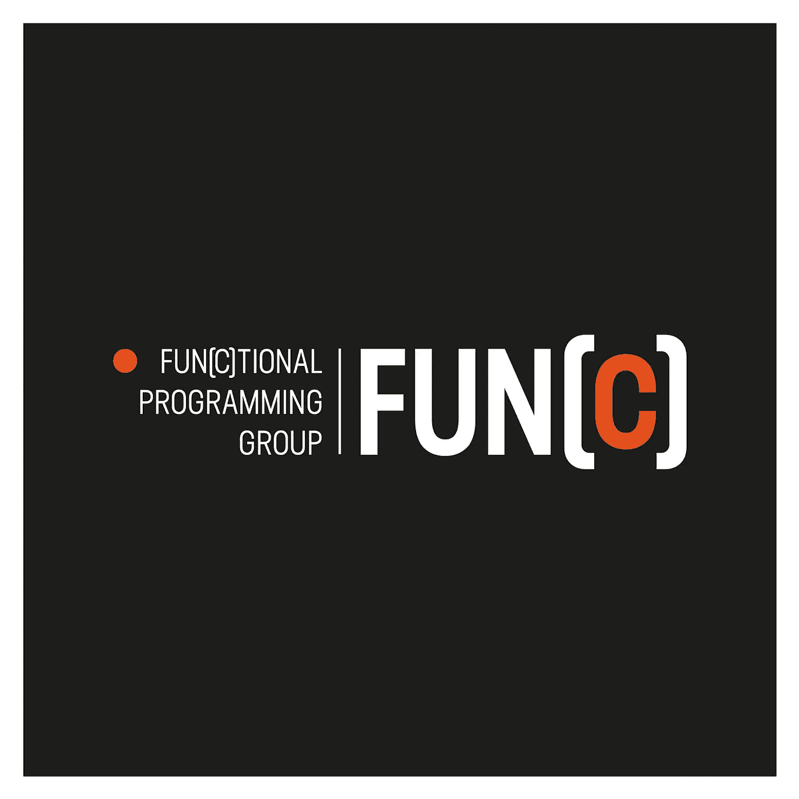

# 函数式编程讲座

> 原文：<https://medium.com/hackernoon/functional-programming-talks-19f12cc20b8d>

我是美国华盛顿州贝尔维尤市一个有趣的团体的主持人。这是各种水平的程序员学习[函数式编程](http://en.wikipedia.org/wiki/Functional_Programming) (FP)的聚会。
我们欢迎所有函数式语言，包括(但不限于)Scala、Erlang、Haskell、Clojure、F#。我们也对与 FP 相关的技术感兴趣，比如反应式[编程](https://hackernoon.com/tagged/programming)，消息传递架构，参与者模型等等。

如果你对 FP 很好奇加入我们:[meetup.com](https://www.meetup.com/fun-c-group/)， [Youtube](https://www.youtube.com/c/FunctionalProgrammingGroup) ， [**@** fun_c_](https://twitter.com/fun_c_)

小组会议在每个月的第二个星期四举行，我们会广播我们的会议，所以你将有一个[机会](https://hackernoon.com/tagged/opportunity)现场观看并向演讲者提问！

我们在今年 4 月开始了我们的旅程，我想总结一下我们迄今为止的会谈。

# April——为什么函数式程序员总是谈论代数？—亚当·罗森

在这个演讲中，我们将学习什么是代数，为什么函数式程序员经常谈论它们，以及如何在你的项目中使用它们。代数*是*结构，我们会谈到它们的各种形式:代数数据类型，F-代数，对象代数等等！

[**@** 阿罗森](https://twitter.com/arosien)

# may——与 Clojure 合作的功能性创业公司——德里克·斯拉格

*两年多前，Amperity 成立了，它的目标是成长为一家以函数式编程为核心的大型成功公司。Derek 将具体解释使用 Clojure 的基本原理，以及当一家初创公司快速增长时，函数式编程在哪些方面可以(和不可以)有所帮助。*

[@derekslager](https://twitter.com/derekslager)

# May —带效果的函数式编程— Rob Norris

*函数式编程的基础是值、纯函数、函数组合；但是这种计算的精益模型似乎抛弃了现实世界中的顾虑，比如偏好、异常、日志、可变状态等等。这个演讲从基本原理介绍了 FP，并演示了我们如何通过效果恢复命令式编程的表达能力，而不牺牲等式推理的好处。*

[**@** tpolecat](https://twitter.com/tpolecat)

# June 自由幺半群函子 Bartosz Milewski

*在函数式编程中，我们巧妙地将数据组织成代数数据类型，并使用函子来创建参数化类型。特别感兴趣的是与类型代数兼容的函子。应用函子，也称为 lax 幺半群函子，与该代数的幺半群部分相容。列表是自由幺半群，可以被认为是解释器的骨架，我们称之为折叠。自由幺正函子是有效解释器的骨架。*

[**@** 巴托斯基](https://twitter.com/BartoszMilewski)

# 七月——FP 最大化——约翰·德去了

*当你把一个被部分功能和效果弄得千疮百孔的过程化程序，逐步重构为一个纯粹的功能性程序——然后把它增加到 11 个，会发生什么？在这个现场编码会议中，John 希望您会觉得有趣，可能还会有点害怕，因为他向您展示了纯 FP 在一个可能的最简单程序中的领先地位，指出了纯函数式编程的好处和成本，并让您了解函数式编程技术如何在非常大的团队和非常大的应用程序中扩展并提供最大的好处。*

[**@** jdegoes](https://twitter.com/jdegoes)