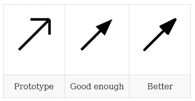
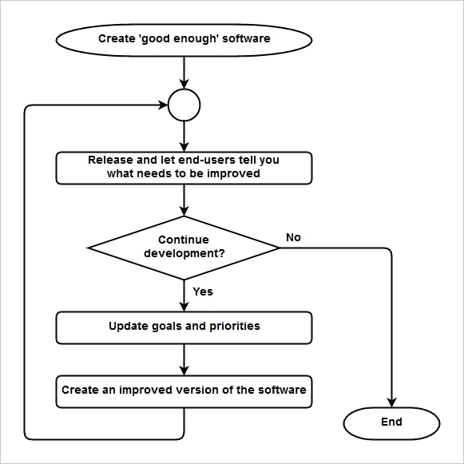
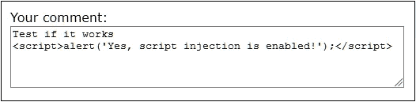
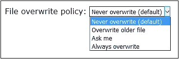

# 成功软件开发人员的基础语用学

> 原文：<https://medium.com/hackernoon/fundamental-pragmatics-for-successful-software-developers-79a9d327f430>

为每个软件开发人员提供的经过战斗验证的有用技巧列表


“A person throwing their hands up in the air on the edge of a tall jagged rock” by [Samuel Clara](https://unsplash.com/@samuelclara?utm_source=medium&utm_medium=referral) on [Unsplash](https://unsplash.com?utm_source=medium&utm_medium=referral)

# 介绍

创造好的、成功的软件是困难的。*非常辛苦！*

因此，对于每一个程序员来说，了解、理解并应用基本的[软件开发](https://hackernoon.com/tagged/software-development)语用学是很重要的——实践建议和规则已经证明了它们的有用性，并帮助我们在最短的时间内创建出最好的软件。

在这篇文章中，我试图整理出一套我认为最相关的基本语用学。如果你是一个有经验的程序员，那么你可能对他们中的大部分/全部都很熟悉。如果你错过了一些建议，请留下评论与我们分享。

请注意:

*   本文中的语用学是关于*设计和编写代码*。软件开发项目的成功还有其他重要的方面(比如良好的用户界面，与人打交道，等等。)，但它们超出了本文档的范围。
*   以下语用学仅涵盖基本的原则，意为*普遍适用的*。没有针对特定的[编程](https://hackernoon.com/tagged/programming)环境(编程语言、库、工具和架构)的建议。
*   如果你很急，可以在文末找到所有语用学的总结。

提示分为三类:

*   一般准则
*   数据设计
*   编写代码

让我们开始吧。

# 一般准则

## 一切都要尽量简单，但不能更简单！——阿尔伯特·爱因斯坦

简单的工具和概念可以很快理解，易于使用，不容易出错，并使我们更有效率。

我们都喜欢简单。简单让工作和生活更愉快。

然而，我们必须意识到过于简单化，正如爱因斯坦那句美丽的引言结尾所指出的那样。

所以:保持简单，但不要简单化！

许多名人提倡简朴。这里有几个例子:

> “简单是可靠的前提。简单明了……决定成败。” *—埃德格·w·迪杰斯特拉；荷兰计算机科学家；《转到被认为有害的语句》一书的作者*
> 
> "简单是最高级的复杂。" *—未知*
> 
> “简单将平凡转化为神奇。” *—斯科特·亚当斯；呆伯特的创造者*
> 
> “如果你不能简单地解释它，你就不够了解它。” *—阿尔伯特·爱因斯坦；物理学家；天才*
> 
> "真理永远可以在简单中找到，而不是在纷繁复杂的事物中." *—艾萨克·牛顿；数学家；天文学家；神学家；作家兼物理学家*

## 如果注定要失败，那就“快点失败！”

大多数软件项目都会失败。这是一个可悲且不可否认的事实。

如果一个项目被认为是失败的，那么它应该尽可能快地失败，以便限制损失并为其他(希望)不会失败的项目腾出时间和资源。

*快速失败*在这种情况下意味着问题应该被*检测到并尽快处理*。我们等待解决问题的时间越长，浪费的时间、精力和资源就越多。累积损耗随时间呈指数增长。

例如，在设计阶段纠正设计缺陷既容易又便宜。但是一旦软件投入生产并被许多人使用，修复错误通常是非常昂贵和令人沮丧的。

> “我们‘失败’得越早，学习得越快，成功的机会就越大。尽早失败可以节省您的时间和金钱。” *—德米安·博尔巴；Adobe 产品经理*
> 
> "快速测试，快速失败，快速调整." *—汤姆·彼得斯；畅销书《追求卓越》的作者*

## 争取‘足够好’，而不是‘完美’。然后释放！

创建*完美的*软件(没有错误，所有功能都完全实现，最佳的用户界面，优秀的文档等)。)是极其耗时和昂贵的，除非我们正在做一个非常小的项目。在大多数情况下，由于实际的限制，不可能达到完美。

即使拥有最好的开发人员和理想预算的软件行业的主要参与者也写不出完美的软件。这就是他们不断提供补丁和新版本的原因。

因此，像这样进行:

*   设定目标和优先事项
*   创建一个原型
*   交付“足够好”的软件
*   持续改进(见下一项)



> “你不可能写出 100%完美的代码。即使你做到了，6 个月后也不会完美。” *—克里斯·蒙德；CodeProject 的联合创始人*
> 
> "在计算机的短暂历史中，没有人写过一个完美的软件." *—安迪·亨特作家；《实用程序员》的合著者*
> 
> “现在交付的 90%的功能比从来没有交付的 100%的功能要好。” *—布莱恩·w·克尼根；计算机科学家和作家；Unix 的共同开发者*
> 
> “寻找完美的解决方案往往会导致停滞和沮丧。坚持不懈，容忍不完美，追求进步，尽最大努力，这些都是健康的，最有可能产生最好的结果。” *—阿尔伯特·艾利斯；心理治疗师*

## 听听用户的意见！

实践表明:

*   软件开发人员不能预见用户真正想要的所有东西。
*   用户通常不知道他们到底想要什么，除非他们已经使用这个软件一段时间了。
*   用户的满意度是软件成功的决定性因素。

我们想要快乐的用户。因此，最好的方法是这样的迭代方法:



> “在花了大量时间尝试一些营销技巧后，他(Stack Exchange 的联合创始人乔尔·斯波尔斯基)得出结论(5 年后):没有什么比改进你的产品更有效了。做出人们想要的伟大软件，并不断改进它。与你的客户(用户)交谈并倾听。了解他们需要什么。” *—《工作中的程序员》一书*
> 
> “……我们为每个主要的产品功能构建原型。我们很早就对预发布用户和关键客户进行了测试，而且肯定是在我们开始实施之前。是的，我们确实“失败”了很多，这很好！这很好，因为我们在这个过程中学到了很多东西，并从长远来看将失败的风险降到了最低。最终，我们以创新的方式，感同身受地解决真正的客户需求。” *—德米安·博尔巴；Adobe 的产品经理*
> 
> “早发布，常发布。”——[*维基百科*](https://en.wikipedia.org/wiki/Release_early,_release_often)
> 
> "程序最重要的属性是它是否完成了用户的意图." *—东尼·霍尔；计算机科学家；1980 年美国计算机学会图灵奖*

# 数据设计

## 在编写代码之前，仔细设计您的数据！

无论何时创建应用程序，都要从仔细设计数据结构及其关系开始。在编写代码之前这样做。

设计良好的数据结构会导致代码更简单、更易维护、更少的错误、更好的性能和更少的内存消耗。

这种差异可能是惊人的。


> “一项又一项的研究表明，最优秀的设计者能够更快、更小、更简单、更清晰地设计出数据结构，而且不费吹灰之力。伟人和普通人之间的差异接近一个数量级。” *—弗雷德·布鲁克斯；《没有银弹》一书*
> 
> “给我看你的流程图(代码)，隐藏你的表格(数据结构)，我将继续感到迷惑。给我看你的表(数据结构)，我一般不会需要你的流程图(代码)；他们会很明显。” *—弗雷德·布鲁克斯；《人月神话》一书*
> 
> “表示规则:将知识折叠成数据，这样程序逻辑就可以变得愚蠢和健壮。数据主导。如果你选择了正确的数据结构并且组织得很好，算法几乎总是不言自明的。数据结构，而不是算法，是编程的核心”*——Unix 编程的艺术*
> 
> “我非常支持围绕数据设计代码，而不是反过来。糟糕的程序员担心代码。优秀的程序员会担心数据结构和它们之间的关系。” *—莱纳斯·托瓦尔兹；Linux 的创造者*
> 
> "如果你得到了正确的数据结构和它们的不变量，大部分代码会自己写出来." *—彼得·多伊奇；《工作中的程序员》一书*

## 让所有的数据结构不可变，除非有充分的理由让它们可变！

不可变数据结构更容易理解、使用和不易出错，因为:

*   一旦创建，状态就不再改变。没有状态转换，没有临时无效状态，也不需要同步、锁定或防御性复制。
*   不可变数据可以在并发/并行计算环境中自由共享——不存在数据损坏、死锁或其他难以解决的棘手问题的风险。
*   基于不可变数据的计算结果可以很容易地被缓存以获得更好的性能。

然而，不可变的数据结构并不总是最佳选择。例如，为每一个变化克隆一个完整的结构可能是非常昂贵的(在时间和空间上)。在某些情况下(例如游戏或 GUI 应用程序)，可变数据结构更适合。

此外，如果两个对象需要直接相互引用，那么这些对象(至少其中一个)必须是可变的。例如，树中直接相互引用的父节点和子节点、共同的朋友(A 指向 B，B 指向 A)等。如果在这种情况下必须保持不变性，那么一个可能的解决方案是拥有一个描述关系的附加数据结构，比如一组表示一对彼此相关的对象的元组。

## 将允许的值限制在尽可能小的范围内！

限制数据类型的允许值集:

*   记录并帮助理解数据类型
*   消除因错误值而导致的不当行为或严重故障的风险
*   简化了处理数据的代码

例如，考虑数据类型`employee`的`name`字段的情况。通过允许任何字符串存储在`name`中，会发生以下情况:

*   长字符串可能导致缓冲区溢出(取决于编程语言)、内存耗尽或其他软件故障。
*   名称中无效但在 Javascript 和 SQL 中用作有效符号的字符(如`<`、`>`和`"`)会为 SQL 和/或脚本注入等攻击打开大门。
*   如果代码没有显式地正确处理这些值，空字符串或`null`字符串会导致错误。

为了避免这些风险，应该约束`name`字段。例如，以下简单的正则表达式消除了所有上述问题:

```
[a-zA-Z ]{1,70}
```

该正则表达式将名称限制为最多 70 个字符，要求至少一个字符，并且只允许字母和空格。但是，请注意，上面的正则表达式过于简化，不适合于必须允许名称包含连字符、撇号甚至其他符号的实际应用程序。

保护数据免受无效值的影响(尤其是在从外部源读取数据的情况下)通常被认为是编写安全软件的最重要的规则。(例如，参见 [OWASP 十大关键 Web 应用漏洞](https://www.owasp.org/index.php/Category:OWASP_Top_Ten_Project)和[十大安全编码实践](https://wiki.sei.cmu.edu/confluence/display/seccode/Top+10+Secure+Coding+Practices))

尝试在数据输入表单中输入 [SQL 注入](https://www.w3schools.com/sql/sql_injection.asp)的示例:


JavaScript 注入尝试的示例:



## 大多数情况下，默认值应该是一组允许值中最严格的。

通过选择尽可能严格的值作为缺省值，我们总是安全的。

更多的许可值需要被明确地声明(在代码中，在配置文件中，等等)。).

例如:

*   默认情况下，写入文件的函数不应覆盖现有文件。
*   默认情况下，应启用所有编译器警告。
*   如果在多用户应用程序中添加了新用户，则默认情况下应授予最低权限。

最后一个例子说明严格的默认值并不总是最佳选择。他们可能很烦人。如果多用户应用程序仅由一个人在他/她的 PC 上使用，那么用户显然希望默认拥有全部权限。因此，最佳默认值有时取决于几个因素。

GUI 中严格默认值的示例:



## 避免数据冗余！

在不同的位置存储可变数据的副本容易出错、费力且昂贵，因为:

*   在数据变更的情况下，由于遗忘、技术问题、安全问题等，存在不能更新所有位置的风险。这可能导致数据不一致和损坏，并最终导致严重的软件故障。
*   有时需要为每次数据修改(创建、更新和删除操作)实现和激活锁定/同步机制，以避免在数据修改过程中访问无效数据。实现这些机制可能非常棘手并且容易出错。
*   需要额外的内存来存储副本。

平庸的例子:一个推销员错过了一个重要的约会。原因:他在个人电脑上将约会输入了自己的日程，但忘记了将数据与手机上的另一个日程同步。如果两个议程的数据都存储在一个地方(例如，在云中)，他就不会错过他的约会。

## 考虑使用通用的标准化格式将数据存储在简单的文本文件中！

使用文本文件作为存储介质有许多优点:

*   所有操作系统都完全支持文本文件。不需要安装和配置额外的软件，如数据库服务器。
*   文本文件很容易被人阅读和操作。这对于调试非常方便。
*   许多第三方应用程序(用任何编程语言编写)和工具也可以轻松地读取和操作它们。例如，Unix 提供了许多有用的文本操作工具，如 grep、awk、sed 等。
*   使用标准格式，如 JSON、XML 和 CSV，使数据能够被许多现有的应用程序查询、排序、过滤、搜索、打印和转换。例如，CSV 文件很容易在电子表格应用程序中使用。

然而，文本文件也有严重的局限性，尤其是在大数据的情况下。复杂的查询(使用过滤器和连接)、更新和删除操作、事务处理、数据加密和其他功能可能需要手动实施，效率非常低。对于大数据，将它们存储在数据库中通常是唯一可行的选择。

此外，将数据存储为字符(而不是位)会消耗更多的空间和时间。因此，二进制数据有时是不可避免。

使用文本表示图形的一个很好的例子是`SVG`(标量矢量图形)。

下面是一个简单的 SVG 文件示例( *SVG_example.svg* ):

```
<?xml version="1.0" encoding="UTF-8"?>
<svg 
    width="140"
    height="140" > <circle cx="70" cy="70" r="40" stroke="red" stroke-width="4" fill="yellow" />
</svg>
```

打开文件(例如使用 web 浏览器)会显示以下图像:


> "编写处理文本流的程序，因为这是一个通用接口." *—道格·麦克洛伊；Unix 管道的发明者*
> 
> Unix 传统强烈鼓励编写能读写简单的、文本的、面向流的、与设备无关的格式的程序 *—埃里克·史蒂文·雷蒙德；Unix 编程的艺术*

# 编写代码

## 写出漂亮的代码！

漂亮的代码简短、易懂、模块化、可扩展、可靠和可维护。

漂亮的代码很少需要注释，读起来像散文。

开发人员喜欢看漂亮的代码并与之一起工作。这让他们感觉很好。

编写漂亮的代码是一门艺术，需要热情、投入和多年的实践。

> “伟大的软件需要对美的狂热热爱。如果你仔细观察好的软件，你会发现那些没人会看到的部分也很漂亮。” *—保罗·格拉厄姆、* [*黑客和画家*](http://www.paulgraham.com/hp.html)
> 
> "当前的开发速度是过去开发质量的函数." *—布莱恩·麦卡利斯特*
> 
> "程序应该写给人们阅读，顺便说一下，应该写给机器执行." *—艾贝尔森和苏斯曼；《计算机程序的结构和解释》一书*
> 
> 因为维护如此重要且如此昂贵，所以在编写程序时，要把它们所做的最重要的交流当成是将来阅读和维护源代码的人(包括你自己)而不是执行它们的计算机。*—Unix 编程的艺术*
> 
> “编写代码的时候，要把最终维护你代码的人想象成一个知道你住哪儿的暴力精神病患者。” *—约翰·伍兹*
> 
> "你总能从真理的美丽和简单中认出它." *—理查德·p·费曼；物理学家*

## 尽可能使用现有软件！

不要多此一举！

在编写新代码之前，请确保您需要的功能尚不存在。

看看现有的库和框架(可能是用不同语言写的)，工具，其他应用和云服务，找到你需要的，或者得到灵感，变得开明。

例如，Unix 为文本操作提供了许多强大、可靠和灵活的现成工具(Windows 上也有)。如果合适的话，在你的应用程序中使用它们。

> “……库代码可能比您自己编写的代码更好，并且可能会随着时间的推移而改进。…库代码受到的关注远远超过了大多数开发人员对相同功能的投入。” *—约书亚·布洛赫；《有效的 Java》一书*
> 
> “你应该研究你的图书馆，并努力不要无缘无故地重新发明它们，这样你的代码就可以简短易读，你的日子就会愉快而富有成效。” *—亨利·斯潘塞；*[*C 程序员十诫*](https://www.lysator.liu.se/c/ten-commandments.html)
> 
> “最好的代码是根本没有代码。” *—杰夫·阿特伍德*
> 
> 如果说我比别人看得更远，那是因为我站在巨人的肩膀上。 *—艾萨克·牛顿；数学家；天文学家；神学家；作家兼物理学家*

## 失败得又快又吵！

尽早发现并修复问题！

这有助于最大限度地减少开发时间和成本，并降低生产模式中的故障和损坏风险。

最多应该自动检测到错误。这可以通过智能 ide、编译器、静态代码分析器、模糊测试器等来实现。自动检测到的 bug 被发现的成本非常低，而且不能投入生产造成故障。

编写好的单元测试。

在运行应用程序之前未被检测到的错误，以及各种运行时问题(例如，找不到文件、输入数据无效等。)应在运行时尽早检测到*。*

因此，检查所有输入的有效值(函数参数、用户输入、资源输入等)。).检查所有返回值的错误情况。

如果运行时问题不能被很好地处理，那么应用程序应该一致地应用*快速失败*原则，以适当的方式报告问题(即，提供最大限度的有助于解决问题的信息)，然后立即中止。这很重要，因为:

*   在开发模式下，它有助于调试，因为一旦出现问题，应用程序就会崩溃
*   在生产模式中，它会导致应用程序崩溃，这通常比静默继续导致更糟糕的结果(如错误的数据、错误的决策等)要好得多。

这里有一个错误的 HTML 代码会发生什么的例子，因为*快速失效*原则是*而不是*应用的:

不是显示下面的*救生*警告…


…显示一条*危及生命的*消息:


有关上述结果的解释(以及如何快速失败的更多建议)，请阅读[快速失败简介软件开发中的原理](/@christian.ppl/introduction-to-the-fail-fast-principle-in-software-development-865ccab28979)(提示:只是 HTML 代码中缺少的`>`字符)。

> 最终，*快速失效原则有助于在更短的时间内编写更可靠、更安全的代码*。

因此，最好选择支持*快速失效*原则的编程语言、库、框架和工具。

> "修复你能修复的——但是当你必须失败时，尽快喧闹地失败." *— Unix 哲学；* [*修复法则*](http://www.faqs.org/docs/artu/ch01s06.html#id2878538)
> 
> "如果一个函数被宣传为在遇到困难时返回一个错误代码，你应该检查那个代码，是的，即使检查的大小是你的代码的三倍，并使你打字的手指疼痛，因为如果你认为"这不会发生在我身上"，上帝肯定会因为你的傲慢而惩罚你。" *—亨利·斯潘塞；*[*C 程序员十诫*](https://www.lysator.liu.se/c/ten-commandments.html)
> 
> "你在写新代码之前会修正错误吗？" *—乔尔·斯波尔斯基；* [*【乔尔测试:12 步变得更好的代码*](https://www.joelonsoftware.com/2000/08/09/the-joel-test-12-steps-to-better-code)

## 每个软件组件都应该很小，并且只有一个职责。

小型的单一责任组件对组件的作者和用户都有好处。

*   对作者的好处:它们更容易编写、测试和维护。它们不容易出错，并且降低了可靠性(耦合)。
*   对用户的好处:它们更容易理解和使用。它们可以以更灵活的方式与其他组件相结合。如果需要，用另一个实现替换或扩展它们会更容易。

整体的力量是许多简单组件无缝协作的结果。

> “编写由干净接口连接的简单部分。让每个节目做好一件事。”*—Unix 编程的艺术*
> 
> "我养成了编写非常小的函数的习惯." *—马丁·福勒；* [*函数长度*](https://martinfowler.com/bliki/FunctionLength.html)

## 不要过度设计！

抵制添加*将来可能*会用到的功能的诱惑。

每个功能都增加了复杂性和故障风险。每个功能都需要时间来创建、测试和维护。

此外，通常很难预见以后实际需要的特性，尤其是在需求经常变化的项目中。添加永远不会用到的功能是没有意义的。

记住:保持小而简单！

在思考“我们还能添加什么？”，问自己“有什么我们可以移除的吗？”

> “当有疑问时，把它排除在外。如果说 API 设计有一个基本定理，那就是这个。它同样适用于功能、类、方法和参数。API 的每个方面都应该尽可能的小，但是不能再小了。你随时可以在后面添加东西，但你不能把它们拿走。” *—约书亚·布洛赫；* [*如何设计一个好的 API 以及为什么它很重要*](https://www.youtube.com/watch?v=aAb7hSCtvGw)
> 
> “完美的实现，不是当没有更多可以添加的时候，而是当没有什么可以拿走的时候。” *—安托万·德·圣·埃克苏佩里*
> 
> “要获得知识，每天添加东西。要获得智慧，每天都要去除东西。” *—老子*
> 
> " YAGNI:你不会需要它的." *—极限编程原理* [*维基百科*](https://en.wikipedia.org/wiki/You_aren%27t_gonna_need_it)

## 仅在必要时进行优化！

与其写“运行*更快*的聪明代码”，不如写简单、正确和可维护的代码，运行*足够快*。

方法应该是:

*   编写完成这项工作的简单代码
*   *如果*(并且只有*如果*)有性能问题，那么:
*   *测量*性能以可靠地找到瓶颈(不要猜测！)
*   优化需要更快运行的代码

不要忘记:糟糕的性能通常只是糟糕的数据结构、糟糕的代码和/或糟糕的架构的结果。

> “过早优化是万恶之源。” *—唐纳德·克努特；《计算机编程的艺术》的作者*
> 
> “让它跑起来，然后让它正确，然后让它快速。” *—肯特·贝克；极限编程的创造者*
> 
> “在发现瓶颈之前匆忙进行优化可能是唯一一个比功能蔓延毁掉更多设计的错误。从折磨人的代码到难以理解的数据布局，以牺牲透明性和简单性为代价而痴迷于速度、内存或磁盘使用的结果无处不在。它们会产生数不清的错误，耗费数百万工时——通常，只是为了在使用一些比调试时间便宜得多的资源方面获得边际收益。”*—Eric Steven Raymond Unix 编程的艺术*

## 自动化周期性任务！

一次又一次地做同样的事情是容易出错的、适得其反的、无聊的，并且增加了不做重要事情的风险，比如单元/集成测试、备份等等。

对于经常性的任务，比如写/编辑代码、处理文件等，使用你能得到的最好的工具。

争取单击执行，或者更好的是，自动运行的预定任务。

自动化任务通常很容易。创建小脚本(用您喜欢的语言编写或使用操作系统脚本)，使用自动化工具，如 [Autoit](https://www.autoitscript.com) 、 [Selenium](http://www.seleniumhq.org/) ，或使用任何其他最适合的工具来快速自动化您或您的用户的重复任务。

> “优先使用工具，而不是不熟练的帮助来减轻编程任务，即使你不得不绕道来构建工具，并期望在使用完它们后扔掉它们。” *—道格·麦克洛伊；Unix 管道的发明者*
> 
> “经济法则:程序员时间贵；优先于机器时间保存它。”*—Unix 编程的艺术*
> 
> "你能一步到位吗？" *—乔尔·斯波尔斯基；* [*【乔尔测试:12 步变得更好的代码*](https://www.joelonsoftware.com/2000/08/09/the-joel-test-12-steps-to-better-code)

## 享受在流动中！

在[维基百科](https://en.wikipedia.org/wiki/Flow_(psychology))中对心流(心理学)有如下描述:

> “心流……是一种精神状态，在这种状态下，从事某项活动的人完全沉浸在一种精力充沛的专注感中，完全投入并享受活动的过程。本质上，心流的特征是完全专注于自己所做的事情，并因此丧失了对空间和时间的感觉。”

处于心流中(也称为处于区域中的*或处于黑客模式*中的*)会导致一种需要体验才能理解的极乐感觉状态。“心流”可能是一个程序员曾经在一个论坛上写道:“我想编码、编码、编码——直到我死。”*

对于程序员来说，在以下条件下可以最好地实现心流:

*   这里没有*干扰*，比如来电、电子邮件、任何其他类型的通知、噪音等等。
*   手头的编程任务*是有价值和有挑战性的，但不太难*。
*   在开始编码之前，你必须*看清楚*。

“看清楚”是什么意思？闭上眼睛。你能看到全局、数据结构及其关系，以及功能和它们的交互吗？必须首先消除疑虑——通过使用纸和笔、搜索网络、寻求帮助、编写测试代码的小片段，或者做任何其他合适的事情来消除疑虑。

你现在能看清楚了吗？然后开始编码，充分享受吧！

# 摘要

以下是所有语用学的总结:

## 一般准则

*   *一切都要尽量简单，但不能更简单！* —阿尔伯特·爱因斯坦
*   如果注定要失败，那就“快失败！”
*   *争取‘足够好’，而不是‘完美’。然后释放！*
*   *听听用户的意见！*

## 数据设计

*   在编写代码之前，请仔细设计您的数据！
*   让所有的数据结构不可变，除非有充分的理由让它们可变！
*   *将允许值限制在尽可能小的范围内！*
*   大多数情况下，默认值应该是一组允许值中最严格的。
*   *避免数据冗余！*
*   考虑使用通用的标准化格式将数据存储在简单的文本文件中！

## 编写代码

*   *写出漂亮的代码！*
*   尽可能使用现有的软件！
*   又快又吵地失败！
*   每个软件组件都应该很小，并且有一个单一的职责。
*   *不要过度设计！*
*   *仅在必要时进行优化！*
*   *自动化周期性任务！*
*   享受生活的乐趣吧！