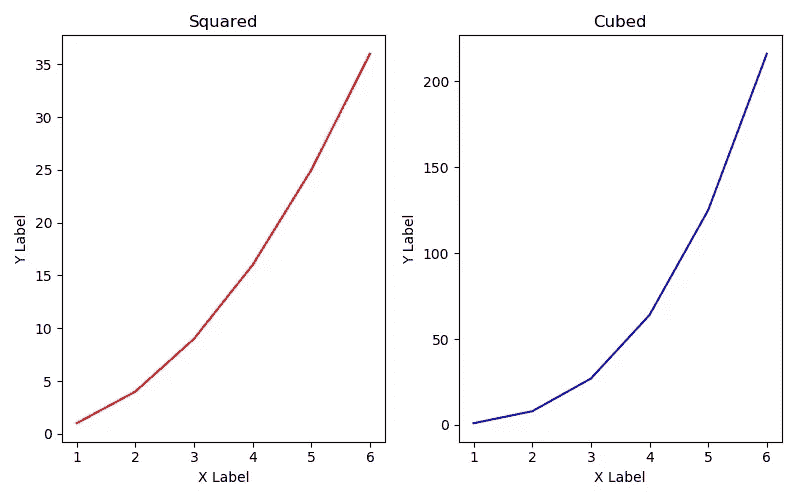

# 基础 Python 数据科学库:备忘单(第 3/4 部分)

> 原文：<https://medium.com/hackernoon/fundamental-python-data-science-libraries-a-cheatsheet-part-3-4-6c2aecc697a4>


如果您是一名开发人员，并且希望将数据操作或科学集成到您的产品中，或者开始您的数据科学之旅，下面是您需要了解的 Python 库。

1.  NumPy
2.  熊猫
3.  **Matplotlib**
4.  sci kit-学习

本系列的目标是提供关于如何使用必备库的介绍、亮点和演示，以便您可以选择更深入的内容。

# **Matplotlib**

[这个库](https://matplotlib.org/2.2.2/index.html)就是 go-to Python 可视化包(除了 [Plotly](https://plot.ly) 是付费的)！它允许您使用 Python 代码创建显示数据的丰富图像。

## 图书馆的焦点

这个库非常广泛，但是本文将集中讨论两个对象:图形和轴。

## 装置

打开命令行并键入

```
pip install matplotlib
```

> Windows:过去我发现安装 NumPy 和其他科学软件包是一件令人头疼的事情，所以我鼓励所有 Windows 用户下载 Anaconda 的 Python 发行版，它已经安装了所有的数学和科学库。

## 细节

Matplotlib 分为两个主要部分:Pyplot API(快速生产的可视化功能)和面向对象的 API(更加灵活和健壮)。

我们将重点讨论后者。

让我们开始吧！

```
import matplotlib.pyplot as plt
import numpy as np
```

## 创造

为了进行可视化，您需要一个接一个地创建两个对象。首先创建一个图形对象，然后从中创建一个轴对象。之后，所有的可视化细节都是通过调用方法创建的。

```
# Figure is a blank canvas
fig = plt.figure(figsize=(8,5), dpi=100) # 800x500 pixel image# Add axes at specific position (fractions of fig width and height)
position = [0.1, 0.1, 0.8, 0.8] # left, bottom, width, height
axes = fig.add_axes(position)
```

关于体形对象需要注意的一些事项:

*   figsize 和 dpi 参数是可选的
*   figsize 是以英寸为单位的图形的宽度和高度
*   dpi:是每英寸点数(每英寸像素)

关于 add_axes 方法需要注意的一些事情:

*   轴的位置只能用图形尺寸的几分之一来表示
*   有许多其他参数[可以传递给这个方法](https://matplotlib.org/2.0.1/api/figure_api.html#matplotlib.figure.Figure.add_axes)

**绘图**

现在，我们将创建一些简单的数据，绘制它，标记图形，并将其保存到代码所在的目录中。

```
# Create data
x = np.array([1,2,3,4,5,6])
y = np.array([1,4,9,16,25,36])# Plot a line
axes.plot(x, y, label="growth") # label keyword used later!
axes.set_xlabel('X Axis')
axes.set_ylabel('Y Axis')
axes.set_title("Simple Line")# Save the image
fig.savefig("file1.jpg")
```

以下是生成的图像:


**图例**

添加图例的最佳方式是在对 Axes 对象调用 plot 方法时包含 label 关键字(正如我们在上面的代码中看到的)。然后，您可以创建一个图例，并通过调用另一个方法来选择它的位置。

```
# Location options: 0 = Auto Best Fit, 1 = Upper Right, 2 = Lower Right, 
# 3 = Lower Left, 4 = Lower Right
axes.legend(loc=0)# Save the image
fig.savefig("file2.jpg")
```

以下是生成的图像:


**颜色&线条**

您可以通过将某些关键字参数传递给 plot 方法来控制线条的特征。一些最常用的关键字是:

*   颜色:要么传递名称(“b”、“蓝色”、“r”、“红色”等)，要么传递十六进制代码(“1155dd”、“15cc55”)
*   alpha:线条的透明度
*   行距
*   线条样式:线条的样式('-'，'-. '，':'，'步骤')
*   标记:线条上每个数据点的模式('+'，' o '，' * '，s '，'，'，'.')
*   市场规模

```
# Use the keywords in the plot method
benchmark_data = [5,5,5,5,5,5]
axes.plot(x, benchmark_data, label="benchmark", color="r", alpha=.5, linewidth=1, linestyle ='-', marker='+', markersize=4)axes.legend(loc=0)# Save the image
fig.savefig("file3.jpg")
```

以下是生成的图像:


**坐标轴范围&刻度线**

您还可以控制轴的范围并覆盖图形的刻度线。

```
# Control the range of the axes
axes.set_xlim([1, 6])
axes.set_ylim([1, 50]) # increasing y axis maximum to 50, instead of 35
#axes.axis("tight") # to get auto tight fitted axes, do this# Control the tick lines
axes.set_xticks([1, 2, 3, 4, 5, 6])
axes.set_yticks([0, 25, 50])# Control the labels of the tick lines
axes.set_xticklabels(["2018-07-0{0}".format(d) for d in range(1,7)])
axes.set_yticklabels([0, 25, 50])axes.legend(loc=0)
fig.savefig("file4.jpg")
```

以下是生成的图像:


**支线剧情**

到目前为止，我们已经创建了一个只有一个图形的图形对象。可以一次在一个图形上创建多个图形。我们可以使用支线剧情函数来实现。

```
# 2 graphs side by side
fig1, axes1 = plt.subplots(nrows=1, ncols=2, figsize=(8,5), dpi=100))# Set up first graph
axes1[0].plot(x, x**2, color='r')
axes1[0].set_xlabel("x")
axes1[0].set_ylabel("y")
axes1[0].set_title("Squared")# Set up second graph
axes1[1].plot(x, x**3, color='b')
axes1[1].set_xlabel("x")
axes1[1].set_ylabel("y")
axes1[1].set_title("Cubed")# Automatically adjust the positions of the axes so there is no overlap
fig1.tight_layout()fig1.savefig("file5.jpg")
```

以下是生成的图像:



我在这里提供了一个[链接，使用 Jupyter 笔记本](https://github.com/ljglass/datascience_notebooks)下载我的 Matplotlib 演练！

以前没用过 Jupyter 笔记本？访问他们的网站[这里](http://jupyter.org)。

## 应用程序

在我的上一篇关于熊猫的文章中，我们获得了比特币的数据，并根据 30 天的平均价格创造了一个何时买入和交易的信号。我们可以使用 Matplotlib 中的新知识来可视化这些数据。

你需要一个 [Quandl](https://www.quandl.com) 账户和 [python Quandl 库](https://docs.quandl.com/docs/python-installation)。

```
pip install quandl
```

上次的代码:

```
importquandl
importpandas aspd

# set up the Quandl connection
api_key = 'GETYOURAPIKEY'
quandl.ApiConfig.api_key = api_key
quandl_code = "BITSTAMP/USD"

# get the data from the API
bitcoin_data = quandl.get(quandl_code, start_date="2017-01-01", end_date="2018-01-17", returns="numpy")

# set up the data in pandas
df = pd.DataFrame(data=bitcoin_data, columns=['Date', 'High', 'Low', 'Last', 'Bid', 'Ask', 'Volume', 'VWAP'])

# make the 'Date' column the index
df.set_index('Date', inplace=True)

# find a rolling 30 day average
df['RollingMean'] = df['Last'].rolling(window=30).mean().shift(1)

# label when the last price is less than L30D average
df['Buy'] = df['Last'] < df['RollingMean']

# create a strategic trading DataFrame
trading_info = df.loc[:,['Last', 'RollingMean', 'Buy']]
```

可视化比特币数据的新代码:

```
importmatplotlib.pyplot asplt# make figure
fig = plt.figure(figsize=(8,5), dpi=100)

# add axes at specific position
position = [0.1, 0.1, 0.8, 0.8]
axes = fig.add_axes(position)

# plot the bitcoin data
num_days = trading_info.index.size
x = range(num_days)
y = trading_info['Last']
axes.plot(x, y, label="Price", color="b") # label keyword used later!
axes.set_xlabel('Date')
axes.set_ylabel('Price')
axes.set_title("Bitcoin Price")

# plot the rolling mean
axes.plot(x, trading_info['RollingMean'], label="Rolling Mean", color="r", alpha=.5, linewidth=1, linestyle ='-')

# set up the legend
axes.legend(loc=0)

# set up the date tick marks
x_ticks_index = range(0, num_days, 100)
x_ticks_labels = [str(trading_info.index[indx])[0:10] forindx inx_ticks_index]
axes.set_xticks(x_ticks_index)
axes.set_xticklabels(x_ticks_labels)

# save the image
fig.savefig("Bitcoin.jpg")
```

以下是生成的图像:


那是 Matplotlib！快速、灵活、简单的真实数据可视化。但是，如果我们想用比 30 天滚动平均值更复杂的东西来分析数据呢？每个 Python 面向数据的程序员需要知道的最后一个库是 Scikit-Learn — [在我的下一篇文章中了解它！](https://hackernoon.com/fundamental-python-data-science-libraries-a-cheatsheet-part-4-4-fd8895ef85d5)

感谢阅读！如果你有问题，请随意评论&我会尽量回复你。


在 Instagram 上与我联系[@ Lauren _ _ glass](https://www.instagram.com/lauren__glass/)&[LinkedIn](https://www.linkedin.com/in/laurenjglass/)

在亚马逊上查看我的[必需品清单](http://bit.ly/my_essentials)

访问我的网站！


Search for me using my nametag on Instagram!