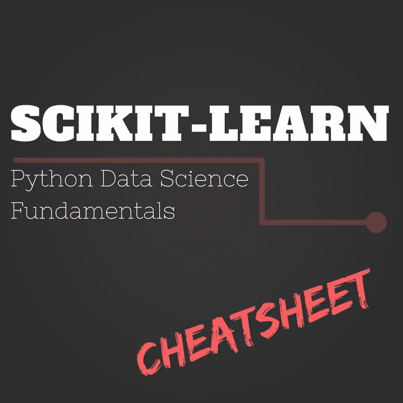
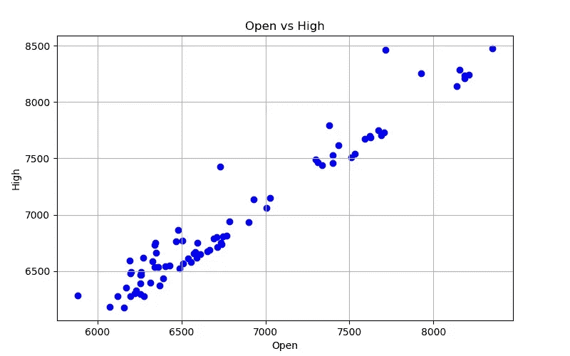
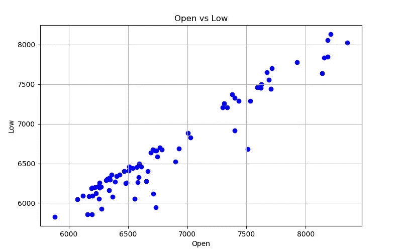
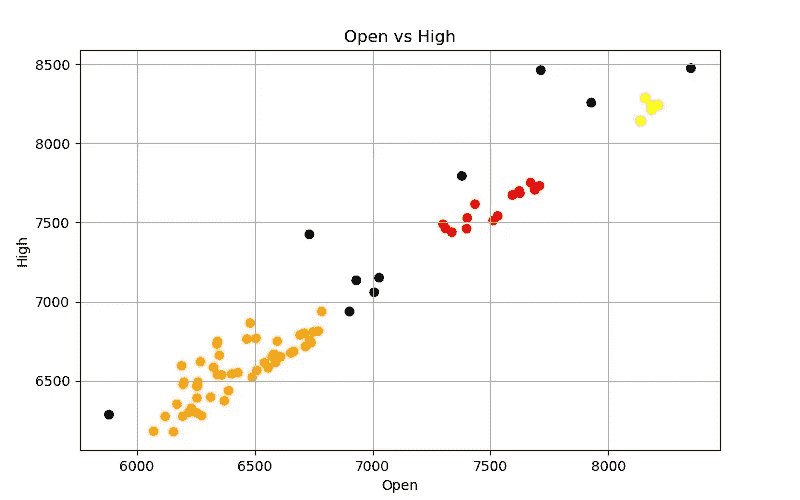
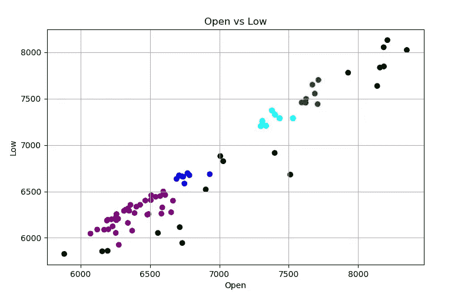

# 基础 Python 数据科学库:备忘单(第 4/4 部分)

> 原文：<https://medium.com/hackernoon/fundamental-python-data-science-libraries-a-cheatsheet-part-4-4-fd8895ef85d5>



如果您是一名开发人员，并且希望将数据操作或科学集成到您的产品中，或者开始您的数据科学之旅，下面是您需要了解的 Python 库。

1.  NumPy
2.  熊猫
3.  Matplotlib
4.  **Scikit-Learn**

本系列的目标是提供关于如何使用必备库的介绍、亮点和演示，以便您可以选择更深入的内容。

# **Scikit-Learn**

[Scikit-Learn](http://scikit-learn.org/stable/index.html) 构建在 [NumPy](https://hackernoon.com/fundamental-python-data-science-libraries-a-cheatsheet-part-1-4-58884e95c2bd) 、SciPy 和 [matplotlib](https://hackernoon.com/fundamental-python-data-science-libraries-a-cheatsheet-part-3-4-6c2aecc697a4) 之上。它包含了大量现成的机器学习算法。所有的算法都有很好的文档记录，并且对于所有的经验水平都很容易使用。

## **图书馆的焦点**

这个库包含许多强大的算法，每一个都有自己的对象和一定的参数和方法。

## **安装**

打开命令行并键入

```
pip install scikit-learn
```

> Windows:在过去，我发现安装 NumPy 和其他科学软件包是一件令人头痛的事情，所以我鼓励所有 Windows 用户下载 Anaconda 的 Python 发行版,它已经安装了所有的数学和科学库。

## **详情**

你可以在他们的[主页上看到，Scikit-Learn](http://scikit-learn.org/stable/index.html) 分为几个主题:分类、回归、聚类、降维、模型选择和预处理。

前三个主题(分类、回归和聚类)都是算法类型。而最后三个(降维、模型选择和预处理)是改变和分析数据的主题，因此当输入算法时，它会更好地工作。本文主要讨论前三个主题。

监督学习

分类和回归算法都属于机器学习的一部分，称为“监督学习”。这意味着这两种类型的算法有一些共同点:输入算法的数据有观察数据和目标(或结果或“答案”)。

这方面的一个标准例子是房屋数据及其销售价格。观察数据是每个家庭的特征。目标是房屋在市场上的价格。

然后，我们可以使用监督学习来预测任何房屋的价格，只要我们有关于它的特征。

*   分类数据意味着目标值是离散的(例如将一栋房子标记为昂贵或便宜)
*   回归意味着结果是连续的(以美元表示的房屋实际价格可以是任何正数)。

**无监督学习**

[聚类](http://scikit-learn.org/stable/modules/clustering.html)部分也被称为“无监督学习”。这意味着我们有观测数据，但没有目标。相反，我们希望使用一种算法来发现观察数据中的群体，并创建标签。一个常见的例子是销售或流量数据中的用户细分。

## **创作**

首先，您需要检查您的数据是否符合分类、回归或聚类方案。然后进入 Scikit-Learn 的对应部分，选择一个算法。如前所述，每个算法都是自己的对象。

为了了解这个库，我们将从一个非常简单的例子开始:线性回归。

我们将使用 Scikit-Learn 的一个内置数据集作为使用该模型创建、拟合和预测的演练。

> 注意:这是对线性回归的深入分析，只是一个简单的例子。

```
from sklearn import datasets
import pandas as pd
from sklearn.linear_model import LinearRegression
from sklearn.metrics import mean_squared_error, r2_score# Load the data (as [NumPy](https://hackernoon.com/fundamental-python-data-science-libraries-a-cheatsheet-part-1-4-58884e95c2bd) arrays)
observations, target = datasets.load_diabetes(return_X_y=True)# Initialize the algorithm object
regression_model = LinearRegression()
```

通常，您将使用所需的参数初始化算法对象。许多都有默认值，就像我们在这里看到的。然而，我建议研究每个参数的含义，以确保您做出了正确的选择。

我们将把数据放到一个 [pandas](https://hackernoon.com/fundamental-python-data-science-libraries-a-cheatsheet-part-2-4-fcf5fab9cdf1) DataFrame 中，以便直接将数据分成训练集和测试集。

```
# Make pandas DataFrames
observational_data = pd.DataFrame(data=observations)
target_data = pd.DataFrame(data=target)# Separate out training and testing sets of data
test_index = 400
train_X = observational_data.iloc[:test_index]
test_X  = observational_data.iloc[test_index:]
train_Y = target_data.iloc[:test_index]
test_Y  = target_data.iloc[test_index:]
```

现在我们已经准备好去适应这个模型了。

**。拟合方法**

我将获取训练数据，并将其放入线性回归算法中，方法是使用。拟合方法。该方法将计算最符合数据的基本线性方程。

```
regression_model.fit(train_X, train_Y)
```

就是这样！很好，我们表现如何？

**。预测方法**

为了评估我们的算法仅基于观察数据进行预测的能力，我们使用。预测方法。我们将使用观测数据的测试集来进行预测。

```
predictions = regression_model.predict(test_X)
```

然后通过查看 [R2](http://scikit-learn.org/stable/modules/generated/sklearn.metrics.r2_score.html#sklearn.metrics.r2_score) 和 [MSE](http://scikit-learn.org/stable/modules/generated/sklearn.metrics.mean_squared_error.html#sklearn.metrics.mean_squared_error) 指标，看看这些预测与实际目标相比如何。

```
print"R2 is", r2_score(test_Y, predictions)
>>> R2 is 0.69857490094print"Mean Square Error is", mean_squared_error(test_Y, predictions)
>>> Mean Square Error is 1668.74966759
```

我们将跳过检查残差图，只看这些指标。指标告诉我们这个模型是可以的。我们能够用我们的模型解释目标中大约 70%的差异。如果我们在观察数据中使用不同的列组合来运行这个模型，均方误差度量将帮助我们在模型之间进行比较。

## **应用**

酷！你已经看到这个库有算法对象，每个对象都有一个 fit 方法。如果您使用的算法是回归或分类算法，它也将有一个预测方法。

> E ach 算法可能不同，因此请务必阅读文档。

让我们将刚才的演练应用到现实生活中的比特币场景中。在我关于熊猫的文章中，我们获得了比特币的数据，并在比特币价格跌破其 30 天滚动平均价格时发出了信号。在我的[上一篇文章](https://hackernoon.com/fundamental-python-data-science-libraries-a-cheatsheet-part-3-4-6c2aecc697a4)中，我们使用 matplotlib 来绘制数据。

假设我们是一个谨慎的投资者，因此观察 30 天滚动平均线不是一个足够好的分析。有没有更好的方法来考察市场行为？

我曾经遇到过一个金融产品，它利用聚类来帮助交易者将相似的市场行为可视化。我认为这很有趣，因为使用监督学习建立精确的模型通常需要普通人无法获得的数据。聚类允许任何人在他们所拥有的东西中发现模式。

因此，让我们看看我们能否利用聚类来发现比特币价格的模式。我从 [Quandl](https://www.quandl.com) 获得了一个[小型比特币数据集](https://www.quandl.com/data/BCHARTS/BITFLYERUSD-Bitcoin-Markets-bitflyerUSD)(你需要一个账户)。该数据集包括大约 3 个月的比特币价格。我选择这个数据集是因为它有开盘价和收盘价。

让我们看看是否有基于市场开盘时比特币价格的一组组市场高点和低点。如果是的话，也许我们已经有了市场策略！

以下是我们需要的库:

```
importquandl
importpandas aspd
importmatplotlib.pyplot asplt
fromsklearn.cluster importDBSCAN
```

下面是我设置数据的代码:

```
# Set up the Quandl connection
api_key = 'GETYOURAPIKEY'quandl.ApiConfig.api_key = api_key
quandl_code = "BCHARTS/BITFLYERUSD"

# Get the bitcoin data
bitcoin_data = quandl.get(quandl_code, returns="numpy", end_date="2018-08-23")# Put bitcoin data into pandas DataFrame
columns = ['Date','Open','High','Low','Close','Volume (BTC)','Volume (Currency)','Weighted Price']
bitcoin = pd.DataFrame(data=bitcoin_data, columns=columns)
bitcoin = bitcoin.dropna() # drop blanks!
```

下面是一个函数，用于实现我们检查数据所需的可视化:

```
defmake_jpg(color, filename, y_column_name):

   # make figure
   fig = plt.figure(figsize=(8,5), dpi=100)

   # add axes at specific position
   position = [0.1, 0.1, 0.8, 0.8]
   axes = fig.add_axes(position) # scatter plot
   x_column_name = "Open"
   X = bitcoin[x_column_name]
   Y = bitcoin[y_column_name]
   axes.scatter(X, Y, color=color)
   axes.set_xlabel(x_column_name)
   axes.set_ylabel(y_column_name)
   axes.set_title("{0} vs {1}".format(x_column_name, y_column_name))
   axes.grid(b=True)

   fig.savefig(filename)
```

以下是我们的数据:



这是我见过的线性关系。但我的感觉是，需要相当多的其他数据点来用这些数据建立一个超级准确的回归模型，所以让我们坚持聚类算法能告诉我们什么。

Scikit-Learn 有许多可用的[聚类](http://scikit-learn.org/stable/modules/clustering.html)算法。我们将使用 [DBSCAN](http://scikit-learn.org/stable/modules/generated/sklearn.cluster.DBSCAN.html) ，因为我们不知道应该有多少个集群，并且我们希望关注数据点集中的区域。根据您希望如何构建策略，您可以使用其他聚类算法。

下面是构建开放对高数据和开放对低数据的聚类算法的代码。

```
def learn(y_column_name):

   # make visualization before learning process
   filename1 = "Bitcoin Open v {0}.jpg".format(y_column_name)
   make_jpg("blue", filename1, y_column_name)

   # ML algorithm
   dbscan = DBSCAN(eps=150)
   dbscan.fit(bitcoin.loc[:, ["Open", y_column_name]])

   # take out the lables
   labels = dbscan.labels_

   # make visualizations
   if y_column_name == 'High':
      color_map = {-1: "k", 0: "r", 1: "orange", 2: "y"}
   else:
      color_map = {-1: "k", 0: "g", 1: "b", 2: "purple", 3: "cyan"}

   colors = [color_map[l] for l in labels] # store the labels colors
   bitcoin['vs {0} Labels'.format(y_column_name)] = colors
   filename2 = "Bitcoin Open v {0} Learn.jpg".format(y_column_name)
   make_jpg(colors, filename2, y_column_name)
   returndbscan

high_dbscan = learn("High")
low_dbscan = learn("Low")
```

> E psilon:两个数据点之间的最大距离是多少，才能使它们仍然在同一个簇中。我为这个值选择了 150 美元。

我们发现了什么？



我们的集群是具有相似市场行为的群体。黑点是不属于某个聚类的异常值。

让我们看看每个集群，找出高/低价和开盘价之间的平均差额。

```
bitcoin["Open vs High Diff"] = bitcoin['High'] - bitcoin['Open']
**print** bitcoin.groupby('vs High Labels')["Open vs High Diff"].mean()>>> vs High Labels
black     312.500000
orange    139.954200
red        82.933571
yellow     48.316000bitcoin["Open vs Low Diff"] = bitcoin['Open'] - bitcoin['Low']
**print** bitcoin.groupby('vs Low Labels')["Open vs Low Diff"].mean()>>> vs Low Labels
black     359.137222
blue      104.825000
cyan      107.212857
green     124.174286
purple    113.181282
```

上面的结果告诉我们，如果有一天市场以 6500 美元左右的价格开盘，类似的数据点会看到平均高价+139 美元和低价-113 美元。

那现在怎么办？下一步是把我们学到的东西放到一个自动测试和执行交易策略的系统中。下一步就看你的了！祝你好运！

感谢阅读！如果你有问题，请随意评论&我会尽量回复你。


在 Instagram 上与我联系[@ Lauren _ _ glass](https://www.instagram.com/lauren__glass/)&[LinkedIn](https://www.linkedin.com/in/laurenjglass/)

在亚马逊上查看我的[必需品清单](http://bit.ly/my_essentials)

[访问我的网站！](https://www.laurenglass.me)


Search for me using my nametag on Instagram!