# 增强和虚拟现实显示技术基础

> 原文：<https://medium.com/hackernoon/fundamentals-of-display-technologies-for-augmented-and-virtual-reality-c88e4b9b0895>

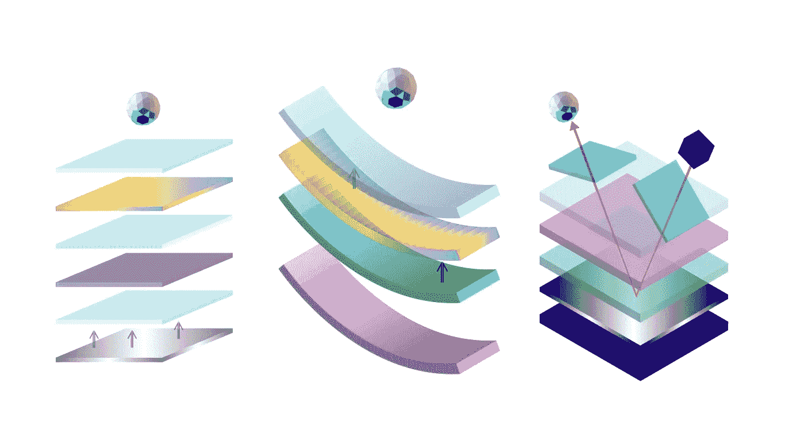

用于虚拟和增强现实的头戴设备有不同的形状和大小，从最小的谷歌眼镜到完全沉浸式的 HTC vive。在其核心，头戴式显示器(HMDs)由两个主要的结构元素组成:光学和图像显示器。

# **光学**

在看光学的基础知识之前，理解人眼的基本特性是很重要的。

## **人眼的基本特性**

**视场(FOV)** 它被定义为双眼所见图像的总角度大小。平均而言，水平双目 FOV 为 200 度，其中 120 度是双目重叠。双目重叠对于立体视觉和进一步讨论的其他深度线索尤其重要。垂直 FOV 大约为 130 度。

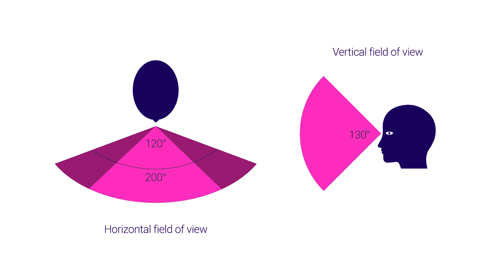

**瞳孔间距(IPD)** 顾名思义，它是眼睛瞳孔之间的距离，是双目视觉系统极其重要的考虑因素。这个距离因人而异，因性别和种族而异。一个不准确的 IPD 考虑可能会导致不良的眼睛镜头对准，图像失真，眼睛疲劳和头痛。成年人的平均 IPD 约为 63 毫米，大多数在 50-75 毫米之间。儿童的最小 IPD 约为 40 毫米。

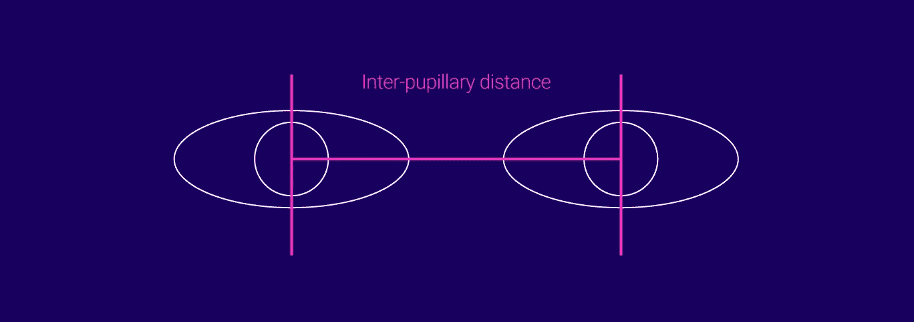

**眼睛起伏** 这是从眼睛角膜到第一个光学元件表面的距离。它定义了用户可以获得全视角的距离。这是一个重要的考虑因素，尤其是对于佩戴矫正镜片或眼镜的人。眼镜的眼间隙约为 12 毫米。对于头戴式显示器来说，使用户能够调节眼睛间隙是非常重要的。

**出瞳** 这是光学系统传输到眼睛的光的直径。

**眼框** 这是用户可以将他们的瞳孔放入其中以完全体验视觉效果的体积。

## **视力**

视力是衡量看东西所需眼睛数量的指标。由于我们大多数人最多只有两只眼睛，智能显示器的视力极限也是如此。

**单目显示器** 这种显示器通常通过一个小的显示元件和镜头提供一个单一的观看通道。该频道位于一只眼睛前面，用户可以自由地通过另一只眼睛完全观看真实世界。单目显示器由于其小的形状因数而经常被用作信息显示器。然而，这些类型的显示器不提供立体深度提示，且经常导致非常低的对比度。谷歌眼镜是一种单眼显示器。

**Biocular** 该类型通过内部反射为双眼提供单一观察通道。生物圆形显示器缺乏立体视觉，适合近距离任务。

**双目** 在这些类型的显示器中，每只眼睛获得一个单独的视图，从而形成立体视图。这些显示器类型提供了最深刻的线索和沉浸感，然而，它们是最重、最复杂和计算密集型的显示器。

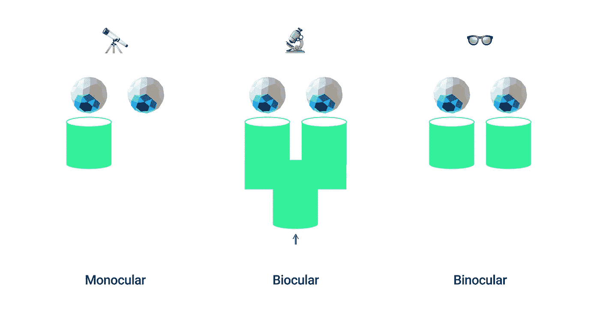

## **光学架构**

智能眼镜中的光学器件有三个主要用途:

*   **光的准直**使图像出现在比其物理距离更远的地方。
*   **放大显示图像**，使其看起来比实际尺寸大。
*   **将光图案的**传递给观看者的眼睛。

## **扭曲**

AR 和 VR 显示器有两种主要的光学设计系统或架构:光瞳形成和非光瞳形成。

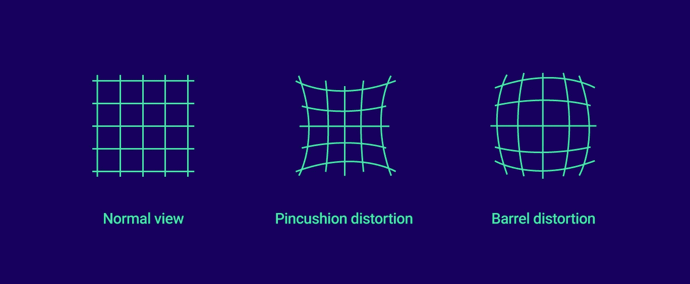

**非瞳孔成型结构** 这种结构由单个透镜组成，常见于流行的沉浸式显示器中，如 HTC Vive、Oculus Rift 和索尼 PSVR。这种类型的架构使用单个放大镜来直接准直来自显示面板的光。

**瞳孔成形结构** 非瞳孔成形结构设计了更轻、更紧凑的大眼盒，但在弯曲光场时会产生明显失真。这种效应被称为枕形失真。在瞳孔成形结构中，另一个产生桶形失真的透镜被用来抵消这种效应。这些通常用于非沉浸式显示器，如微软的全息透镜和谷歌眼镜。

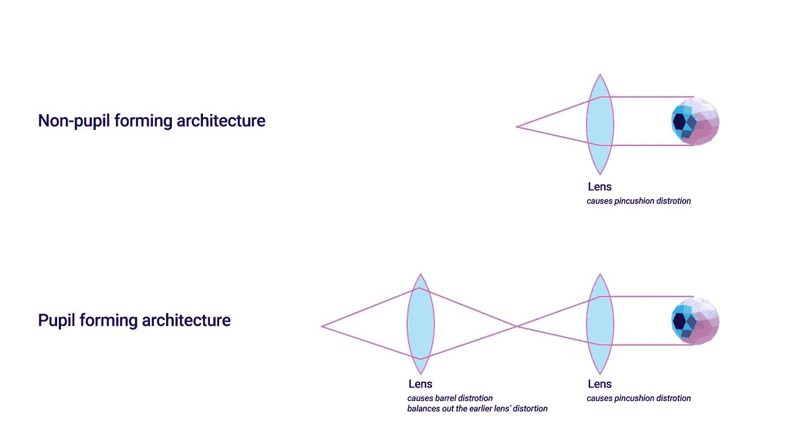

## **波导管**

顾名思义，波导管是光学中的一种物理结构，它将光波引导到用户的眼睛。这是通过内部反射来完成的，这个装置控制着光线在入口和出口之间的移动。工业上使用的波导管有四种:

**全息波导管** 这是一种相当简单的波导管，带有透镜等光学元件，用于通过一系列内部反射进行入耦合(入射)和出耦合(出射)。这种波导管用于索尼的智能眼镜显示器。

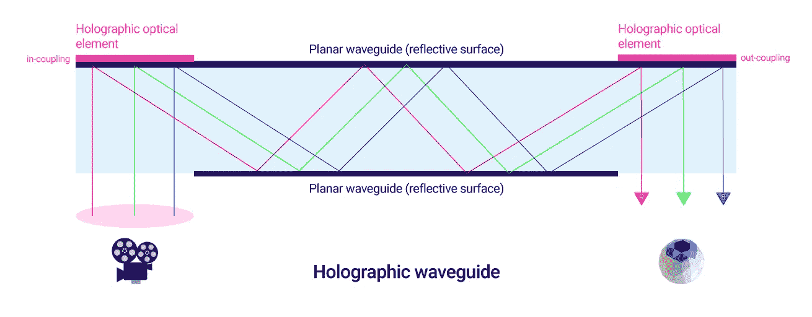

**衍射波导** 精密表面浮雕光栅用于实现内部反射，通过显示器无缝叠加 3D 图形。这些波导管用于许多 Vuzix 显示器和微软的全息透镜。

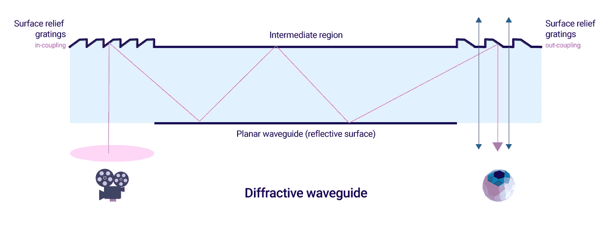

**偏振波导** 光进入波导并通过一系列内反射在部分反射的偏振面上。选定的光波抵消(偏振)进入观众的眼睛。Lumus DK-50 AR 眼镜使用了该方法。

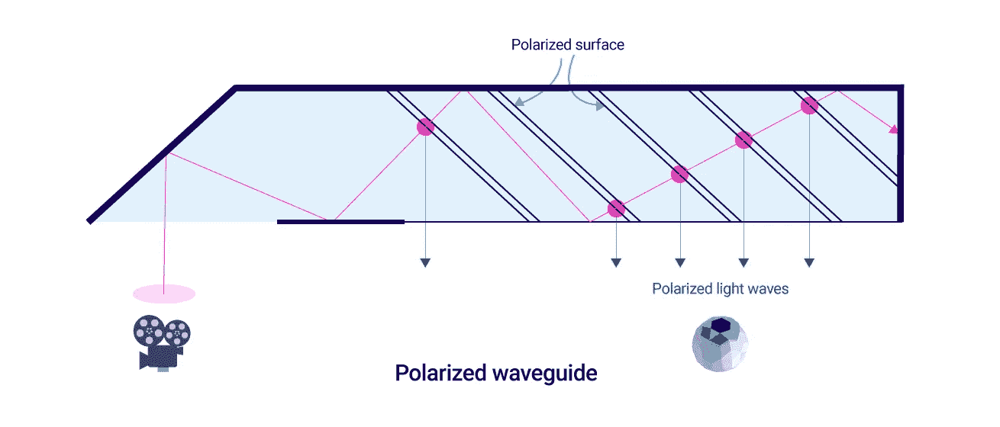

**反射波导** 这类似于全息波导，其中单个平面光导与一个或多个半反射镜一起使用。这种类型的波导可以在爱普生的 Moverio 以及谷歌眼镜中看到。

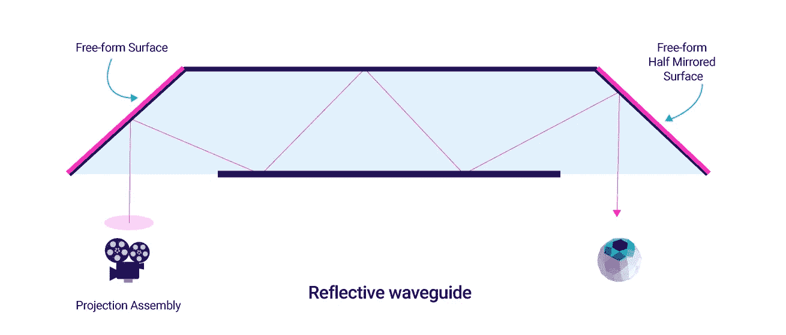

# **显示技术**

## **显示类型**

**完全沉浸式** 这些都是标准的完全沉浸式虚拟现实显示器。这些立体显示器与传感器相结合，以跟踪位置和方向。它们像《Ready Player One》这本书里一样完全挡住了用户对外界的视野。

**光学透视** 在光学透视眼镜中，用户通过光学元件直接观察现实，例如全息波导和其他能够在现实世界上实现图形叠加的系统。微软的 Hololens、Magic Leap One 和谷歌眼镜是光学透视智能眼镜的最新例子。

**视频透视** 通过这种类型的智能眼镜，用户可以看到首先由安装在显示器上的一个或两个摄像头拍摄的现实。然后，这些摄像机视图与计算机生成的图像相结合，供用户观看。HTC Vive VR 耳机内置摄像头，通常用于在设备上创建 AR 体验。

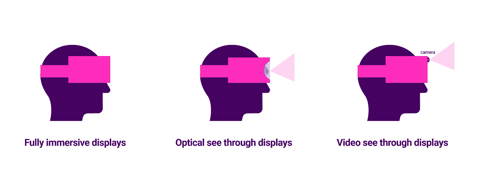

## **成像技术**

在过去的几十年里，成像和显示技术有了很大的改进。高端 CRT 主要被四种关键成像技术所取代:

**液晶显示器** 液晶显示器在高清电视中很常见，自 20 世纪 80 年代以来就被用于 ARVR 显示器。这种显示器由夹在两个偏振片之间的含有液晶分子的单元阵列组成。这个装置位于印刷有数百万个晶体管的薄玻璃基板之间。对于彩色液晶显示器，包含红色、绿色和蓝色滤光器的附加基板位于基板的每个单元上。单个 RGB 液晶单元被称为子像素。三个子像素形成一个像素。
电流通过玻璃基板。改变电流允许 LCD 调节光的通过，以产生精确的颜色。如果所有子像素都完全打开，就会产生白光。
液晶单元自身不发光，需要背光。液晶单元只能改变光的通过，以产生所需的颜色和随后的图像。

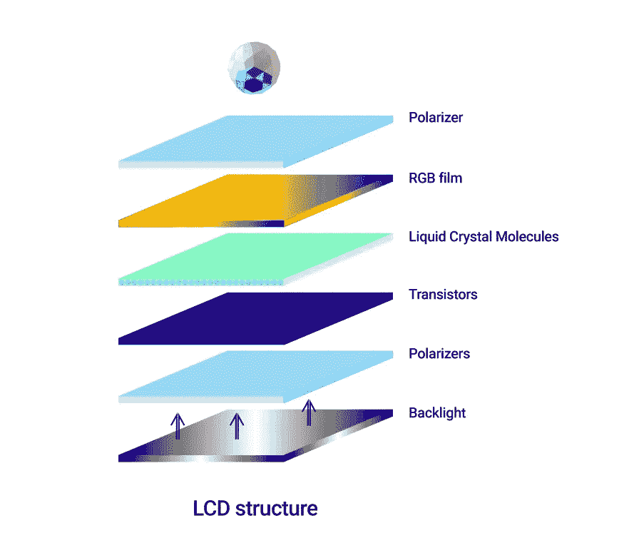

**有机发光二极管(有机发光二极管)** 这种显示技术基于有机(碳氢键合)材料，当施加电流时会发光。这是一种固态显示技术，通过有机薄片的能量以光的形式释放，也称为电致发光。颜色可以通过仔细装箱有机排放来控制，但是大多数制造商在有机发光二极管堆栈中添加红色、绿色和蓝色薄膜。有两种类型的有机发光二极管面板:

1.  无源矩阵有机发光二极管(PMOLED):
    与 CRT 一样，这种显示器由一个复杂的电子网格组成，以顺序控制每行中的各个像素。它不包含存储电容器，这使得更新速率慢并且维持像素状态的功耗高。这些主要用于简单的字符和图标显示。
2.  有源矩阵有机发光二极管(AMOLED):
    与 p OLED 不同，AMOLED 由一个薄晶体管层组成，其中包含一个存储电容器，以维持每个子像素的状态，从而对单个像素提供更大的控制。在 AMOLEDs 的情况下，单个像素可以完全关闭，从而实现更深的黑色和更高的对比度。这些是最适合近眼虚拟和增强现实设备的显示器类型。

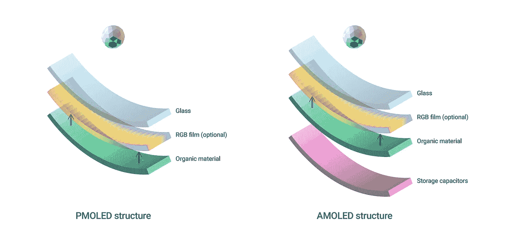

OLEDs are flexible

尤其是 OLEDs 和 AMOLEDs 远远优于 LCD。它们的结构相对简单，并且由于不需要外部背光，它们可以非常薄。除此之外，它们的功耗显著降低，具有更快的刷新率、高对比度、出色的色彩再现和更高的分辨率。大多数完全沉浸式 HMD 都利用了这项技术。

**数字光线投影仪(DLP)微显示器** 最初由德州仪器开发，DLP 芯片也被称为数字微镜器件(DMD)。该显示器由大约 200 万个独立控制的微镜组成，每个微镜可用于表示一个像素。这些微镜中的每一个大约为 5.4 微米。关于这些显示器有趣的是，眼睛的视网膜本身充当显示表面。RGB 光在这些朝向和远离光源倾斜的微镜上反射。由于每个微镜可以在一秒钟内向任意方向重新定向数千次，因此改变反射的颜色可以在视网膜上产生不同深浅的光。

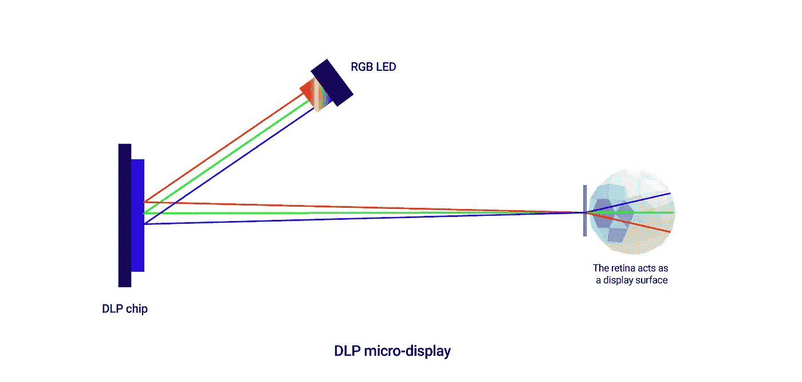

DLP 微显示器是现有最快的显示技术之一。它们的色彩刷新速度、低延迟、低功耗和极高的分辨率(0.3 英寸阵列对角线支持 1280 x 720 图像)使它们成为构建头戴式显示器的理想候选。

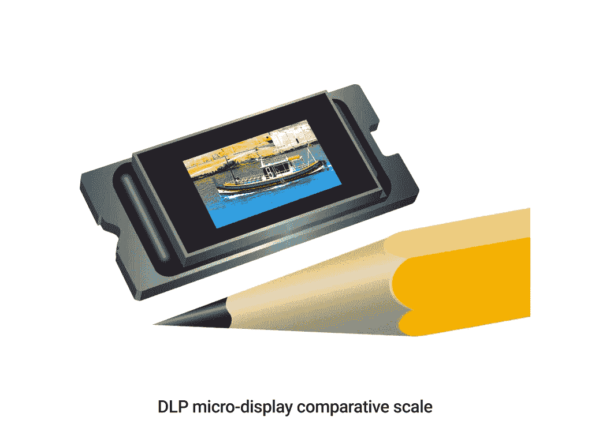

Scale of DLP Microdisplays

**硅上液晶(LCoS)微显示器** LCoS 显示器介于 LCD 和 DLP 显示器之间。LCD 是一种透射技术，其中产生图像并将其传输给用户，而 DLP 是一种反射技术，其中各个子像素通过微镜反射。光源被传递到反射面上。当光反射时，它穿过一系列调节光强度和颜色的子滤光器。与 DLP 显示器类似，它们的小尺寸在与小尺寸设备集成时提供了相当大的灵活性。微软的 Hololens、谷歌眼镜甚至 Magic Leap One 都使用了 LCoS 微显示器。

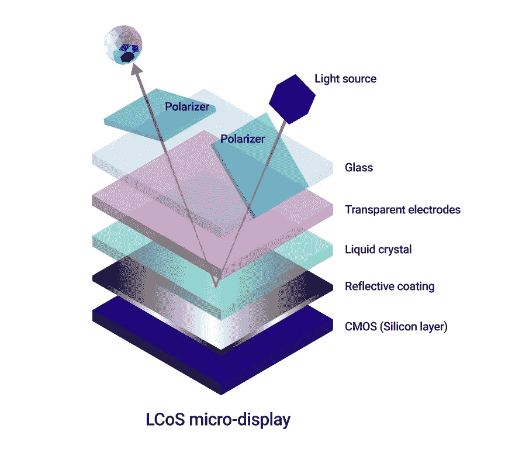

LCoS modulates light from an external source to produce the image

鉴于显示技术在发展中的极端分辨率，几乎可以肯定的是，基于平板的 HMD 可能会成为 AR 设备的历史。

**参考文献:**
1。[增强人类——海伦·帕帕吉安尼斯](https://amzn.to/2C7k3c3)
2。[实用的增强现实——史蒂夫·奥克斯塔卡尼斯](https://amzn.to/2C6XDHR)

**相关文章:**
1。[人眼对增强现实空间的理解](/@akshaykore/human-eyes-understanding-of-space-for-augmented-reality-d5ce4d9fa37b)
2。[增强现实中的一台机器和人类对世界的感知](https://hackernoon.com/a-machine-and-humans-perception-of-the-world-in-augmented-reality-2342f4a6750)
3。[增强和虚拟现实显示技术基础](https://hackernoon.com/fundamentals-of-display-technologies-for-augmented-and-virtual-reality-c88e4b9b0895)
4。[AR 装置的种类](https://uxplanet.org/augmented-reality-device-types-a7668b15bf7a)
5。[增强视觉的积木](https://uxplanet.org/building-blocks-for-augmented-vision-cc9b6172b461)
6。我们增强世界的未来。[计算机对增强现实空间的理解](https://uxplanet.org/a-computers-understanding-of-space-for-augmented-reality-c0fd40a52900)

**如果您喜欢这篇文章，请点击👏按钮(一次、两次或更多次)。
分享帮别人找！**