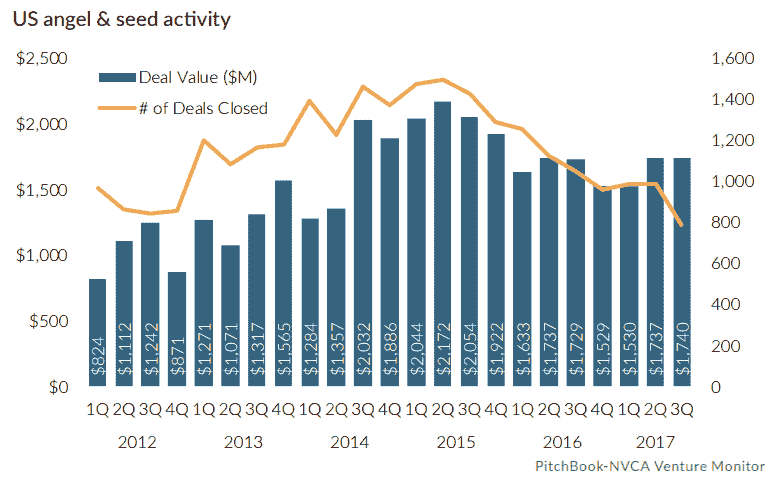
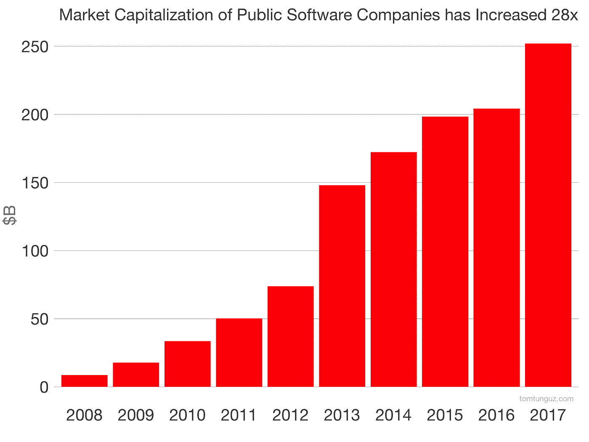
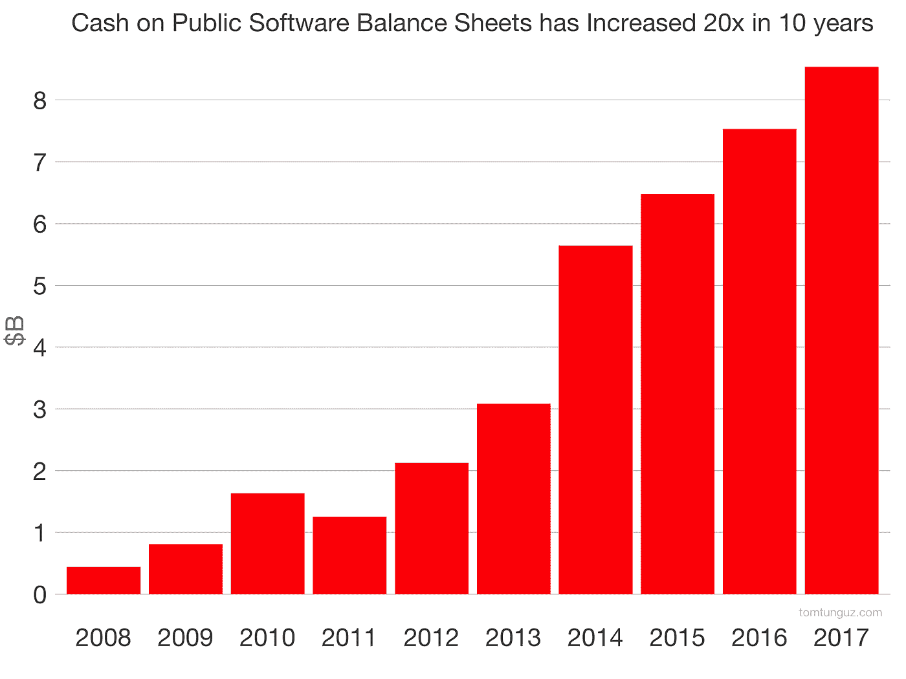
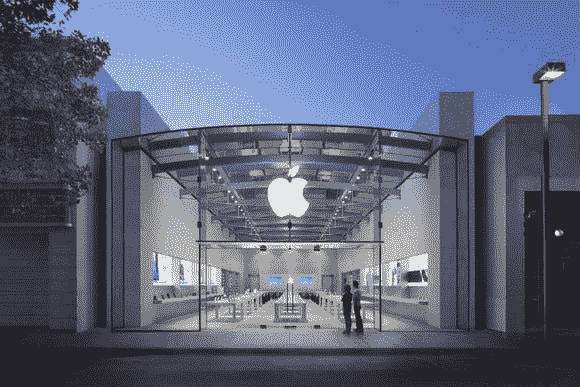
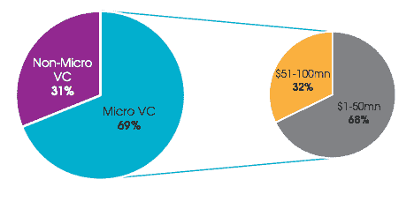

# 为你的创业公司筹集资金从未如此容易。

> 原文：<https://medium.com/hackernoon/fundraising-for-your-startup-has-never-been-this-easy-dce7624690d3>

## 对于初创公司创始人或那些尚未踏上创业之旅的人来说，2018 年将是令人敬畏的一年。

> 披露: [AngelLoop](https://goo.gl/G7ZSp6) ，投资者交流平台初创公司，之前曾赞助过黑客正午。

在过去的三年里(2014 年至 2017 年)，早期创始人的融资生态系统的美元金额一直很高，获得融资的交易数量很低。风投们更感兴趣的是保持他们的地位，通过[向他们投资](https://hackernoon.com/tagged/investing)更多的钱来帮助他们目前投资的公司维持更长时间，而不是向他们的投资组合中增加新公司。

这对上游投资者(天使和种子前期投资者)有很大影响。早期投资者在审查一项交易时会问自己的一个问题是，该公司是否能够从后期投资者那里获得额外的资金。他们这样做是因为他们相信融资是早期公司必不可少的基石。

在过去几年中，后期风险投资界的放缓引发了早期投资者的放缓，种子期交易受到了打击。

这一切都在改变。

**创业生态系统正在多样化(或者至少为创始人提供了风投之外的选择)。**

看涨的经济已经到来。市场上更多的钱，加上减税和更少的监管，对那些不愿将想法推向市场的创始人产生了重大影响。

Public Tech Companies want to grow and one way to do that is through M&A

**对收购的兴趣**——如果你不打算让你的企业上市，另一个获得重大流动性事件的途径是将你的企业出售给一家更大的公司，现在你只是运气好而已。上市公司的购买力已经膨胀，在技术领域，购买力为 300 亿美元。这些钱足够收购 30 只独角兽了。这是如何分解的。

*   上市科技公司(不包括谷歌/亚马逊/MSFT/脸书)的现金储备在过去 10 年里增长了 20 倍，对这些钱并不太热衷。截至 2017 年第三季度，合并余额达到 85 亿美元
*   此外，在过去十年中，这些科技公司的市值增长了 28 倍，目前徘徊在 2500 亿美元。

由于这些公司使用现金和股权的组合来收购较小的企业，我们可以假设他们将保留其 2500 亿美元市值的 10%(250 亿美元)，再加上 85 亿美元的现金储备，并在收购过程中使用这两者。

新诞生的百万富翁——全球百万富翁的数量正在增长。增长的最大驱动力是全球财富的整体增长。到 2021 年，强劲的市场、清算事件和新开放的市场将[帮助创造 450 万新的百万富翁](https://www.cnbc.com/2016/11/22/12-million-new-millionaires-will-be-minted-over-the-next-five-years.html)。

仅脸书就创造了 1000 名新的百万富翁，其中许多人继续投资于早期阶段的生态系统，并帮助刺激了 AirBnB、DropBox、Spotify 和优步等公司的增长。现在轮到他们的投资组合公司给他们的早期投资者投资回报，并帮助创造新的百万富翁，这将继续循环。

Apple repatriated $250B and will acquire your company with that money, JK, but maybe they will.

**应税收入的汇回**——据估计，约有 2.7 万亿美元的美国公司收入存在外国银行账户中，享受着优惠的税收待遇。随着 2017 年减税将遣返税率降至 15.5%，我们的许多科技公司现在都在考虑将资金汇回国内。据估计，美国公司将在 2018 年汇回 4000 亿美元，其中苹果将占到一半多一点。

除了向联邦政府支付 600 亿美元之外，苹果还会如何处理他们汇回美国的 2500 亿美元？首先，偿还美国债务，回购更多公开交易的股票，并收购网飞(这部分是投机性的)。

需要注意的两件事是回购他们的股票和他们进行收购的兴趣。股票回购有增加公司股票价值的趋势，苹果在人为抬高股价方面并不陌生。所有投资者都会感受到这种影响，包括那些在苹果工作的投资者(通过他们在 RSU 的限制性股票单位，因此为你创造了更多的百万富翁)。

**融资不再是进入的障碍—** 融资从未如此容易(hodl 指的是互联网崩溃前的那段时间)。随着创始人可以获得新的融资渠道，一大批新的风险投资和天使投资人进入这个领域，*融资不再是进入的障碍*。

*   **微风投多了**——[2016 年以来新增 550 家微风投进入](http://docs.preqin.com/newsletters/pe/Preqin-PESL-June-16-Feature-Micro-VC.pdf)生态圈。这些基金大多在寻找前期/种子期交易，它们的平均支票金额在 15 万至 50 万美元之间。

这是第一共和国银行的萨米尔·卡吉整理的一份名单。

AngelList is launching their SpearHead program to mint many new Angels

*   **更大的风投公司有寻找早期交易的球探**——即[红杉资本](https://techcrunch.com/2018/01/16/sequoia-capital-just-closed-a-giant-new-seed-fund-and-heres-how-it-works/)，以及天使投资人自己的[先锋](https://blog.angel.co/introducing-spearhead-an-accelerator-for-angel-investors-and-35m-to-back-them-d82e3473c287)正在资助导师和创始人，他们已经培养了企业家网络，并希望帮助这些创始人获得资本。这些交易中的大部分将以票据的形式出现，不要求创始人与他们分享信息权，但它们是这些大型风投有机会进入未来几轮融资的一种选择。
*   **自 2017 年初以来，ICO 市场增长了近 100 倍**——比特币泡沫造就了许多百万富翁，这些投资者希望保持这一势头，同时将风险降至最低。具体来说，他们通过分散投资于多种投资或 ICO 来实现这一点。如果你的公司通过区块链分散化来扰乱[在此输入新兴行业名称]，你很有可能完成你的第一轮 1 亿美元融资。谷歌一下就知道了。

随着所有这些投资者和资金进入我们的早期创业生态系统，对于创始人来说，融资变得不那么费力和神秘(没有双关语)。你需要的所有资源都可以在谷歌上搜索到。

因此，获得山谷切达干酪，建立您的团队，增加您的收入，并保持对更多的渴望。

我爱你，

—伊戈尔

**关于作者:**

Igor Feerer 是 3X 的创始人，他致力于为创始人和他们的投资者提供更好的沟通和合作方式，通过他的新企业 [AngelLoop](https://goo.gl/G7ZSp6) 扩大他们的风险。奇怪的是，创始人从投资者那里筹集资金，却忘记了他们能为投资者提供的真正价值，即建议、介绍，以及在让创始人的创意源源不断的时候踢他们的屁股。

在 [LinkedIn](https://www.linkedin.com/in/feerer/) 、 [Twitter](https://twitter.com/IggsLoop) 和 [Medium](/@IggsLoop) 上与 Igor 联系

> 喜欢这篇文章吗？在你的收件箱里接收 [AngelLoop](http://www.angelloop.com) 的最新帖子——在这里订阅[！](https://blog.angelloop.com/subscribe/)