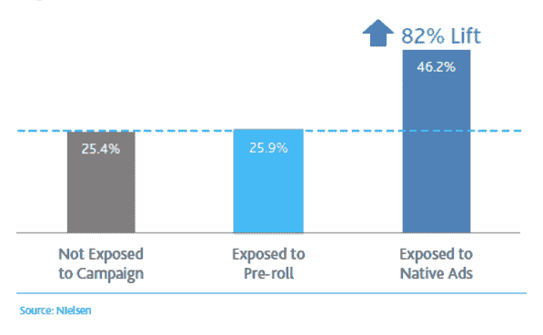

# 未来:2018 年 5 大原生广告趋势

> 原文：<https://medium.com/hackernoon/future-5-native-ad-trends-in-2018-a7c27f66b2a2>

新年伊始是一个谈论本土广告未来趋势的好时机，大品牌和创业营销人员将试图拥抱这一趋势。

# **新平台上原生广告的出现**

原生广告正在超越媒体和博客。社交媒体为活跃用户提供了赚钱的机会，不仅通过整合广告，还通过各种品牌产品的有效内容整合。相比之下，公司无需向相关媒体付费就能接触到大量受众。

允许放置这种广告的平台的数量在不断增长。现在，营销和原生推广工具不仅仅是博客，Instagram 和 YouTube。

与此同时，几年前，一家处理本土广告的公司 MirriAd 与环球音乐集团一起发起了一场运动。在这场运动中，[本土广告](https://vimeo.com/106939566)被插入到音乐艺术家的片段中。

今天，像 Pandora 和 Deezer 这样的流媒体服务正在[尝试](https://www.forbes.com/sites/cheriehu/2016/11/21/sponsored-songs-blazoned-brands-the-rise-of-native-ads-in-the-music-business/#1bfbabc34d4e)音乐原生广告。音乐家可以购买他们歌曲的“试听”——就像在社交媒体上购买浏览量一样。一切都表明，平台的数量和原生广告的展示方式只会越来越多。

# **移动网络广告的死亡**

越来越多的广告商意识到，人们使用智能手机与台式电脑的方式不同。根据[统计](http://www.smartinsights.com/marketplace-analysis/customer-analysis/consumer-media-device-use/)，只有 11%的用户会去移动版本的网站，而他们中的大多数(89%)更喜欢花时间在应用上。开发者感受到了这种趋势，所以现在有了适合各种场合的移动应用——流行商店中的数量大约为 500 万。

应用内广告比移动网络上的推广更有效，因为应用对用户来说更方便。根据 MMA 的一项研究，[应用内的原生广告被浏览的次数是移动网站横幅广告的三倍。Business Insider 的分析师表示，应用内广告的喜欢、分享和其他参与指数比移动横幅高出 20-60%。](http://www.mmaglobal.com/programs/native-advertising)

正如广告平台 Smaato 的[调查所述，所有这些导致了应用内广告正在排挤移动网络的事实。据该公司称，2016 年移动网络广告支出预算为 19%，81%用于应用内广告。今年，网络只占 6%，应用程序占 94%。明年，移动网络中的广告将最终消亡。](https://www.smaato.com/resources/reports/global-trends-report-q2-2017/)

# **原生视频内容开发**

近年来，快速增长的广告渠道是视频。这是因为与不同平台上的其他类型的内容相比，参与指数较高。

如今，在视频中插入广告有两种基本方式:前置滚动和商业广告或原生集成。第一种选择不是很受观众欢迎——很少有人喜欢像在电视上一样在视频前或视频中观看广告。相比之下，原生集成不会引起观众的这种愤怒。

Sharethrough 公司完成了一项[调查](http://www.sharethrough.com/resources/native-video-vs-preroll/),将五个广告活动与预滚动广告进行了比较，并与相同数量的本土广告活动进行了比较。当使用原生广告时，每种情况下的结果都更好。在一个案例中，广告品牌软饮料 Jarritos 在原生位置上显著增加了其品牌提升(用户与品牌的互动)，而 pre-rolls 仅增加了 2.1%。

# **公关角色变化**

越来越多的渠道和沟通方式也导致了内部公关部门角色的变化。今天，企业能够在不同的情况下以不同的方式与受众互动。在某些时候，它可能需要在危机管理中工作，以消除负面影响，并防止有人写一个事件。有能力阻止出版的公关人员变得比那些“安排出版”的人更有价值。同时，其他情况需要不同的技能，如活动推广、新产品发布支持等。

员工公关服务不能同时做所有的事情，因此外包在应对新出现的挑战方面变得越来越受欢迎。例如，员工的工作量可能会变得很大，以至于他们不愿意花时间在媒体关系上。他们可能只是使用原生广告，并在收费的基础上发布相关内容，但他们会按照一定的标准迅速完成。

# **内容营销:发行问题是关键**

传统上，主要品牌的营销人员已经习惯于在电视、广播和印刷媒体上进行大规模的广告采购。这个市场是成熟的，互动链已经建立并运行，特定的市场参与者(从代理商到经纪人和中介网络)负责广告的每个阶段:从广告的需求到其在目标媒体中的出现。广告解决方案的定价方案很明确，几十年来都没有改变。

网络媒体中的赞助出版物并不那么简单——这种广告没有统一的标准。因此，企业在每次安置时都会面临新的情况。据平台 [PRnews.io](https://prnews.io/) 的创始人亚历山大·斯托罗祖克(Alexander Storozhuk)称，现有的媒体服务刚刚开始发展，它们并不总是能够提供合适的广告量或保持高水平的质量。最终，品牌被迫直接联系博主和在线出版物进行购买，与他们沟通可能会很困难。还有定价不稳定的问题，为什么一个网站上的帖子比类似的网站贵很多，这一点并不总是很清楚。这使得普通品牌的规划和预算分配变得复杂。

随着分销渠道和本土广告基础设施的不断发展，这种情况正在逐渐改变。我们可以期待新的服务和第一个活跃的行业特定标准将在 2018 年出现。