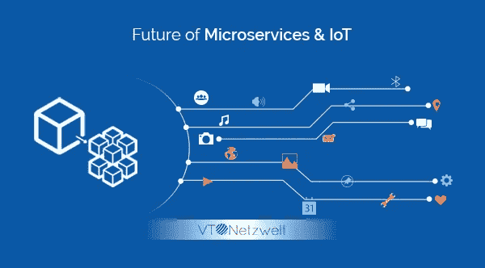

# 微服务和物联网的未来

> 原文：<https://medium.com/hackernoon/future-of-microservices-iot-2efc0ca84eb6>

微服务是构建企业应用程序的一种非常受欢迎的方式。类似于移动应用程序[开发](https://hackernoon.com/tagged/development)的采用，如果缺乏专业知识，它可能会推迟一些公司的追求。然而，由于物联网开发的兴起，可以肯定的是，微服务将很快成为大多数开发者的首选架构。

# 微服务架构是什么意思？

微服务架构，也称为微服务，是一种构建[软件](https://hackernoon.com/tagged/software)系统的独特技术。这一系统最近迅速流行起来。

您可以使用这个系统来创建企业应用程序。由于可扩展性，当您需要获得跨各种平台以及跨网络、物联网、移动设备和可穿戴设备的支持时，该系统被视为理想之选。基本上，如果您不确定未来需要支持哪些设备，您可以选择这种架构。

本质上，微服务架构是一种将软件应用构建为一组可自主部署的微小模块化服务的技术，其中每个服务都运行一个独特的流程，并通过定义明确的轻量级机制进行连接，以实现业务目标。

微服务基本上是一种架构风格，它以自由耦合的服务集合的方式建立应用程序，执行卓越的业务功能。微服务架构有助于大型复杂应用程序的持续部署/交付。这也有助于公司发展其庞大的技术堆栈。

尽管微服务架构因不适合某些 DevOps 文化而受到批评，但它仍被全球多个行业采用。

Twitter、亚马逊和网飞等大型在线公司都已经从单一技术栈发展到微服务驱动的架构。这使得他们今天能够达到令人眩晕的高度。

当开发物联网时，下面提到了微服务的未来是最好的五个原因

# 成本削减

如今，物联网传感器和设备并不超出人们的承受能力。话虽如此，实际上更可行的是生产数百个小型传感器，它们都以良好的方式做一件共同的事情，而不是追求更少的传感器，这无疑是更强大但更昂贵的选择。

推动这一行动的一个巨大因素是，无论一种设备有多好，在短短几年内，它将变得“过时”或被更有效和更实惠的替代品取代。

使用更简单的硬件的好处是，人们可以依靠微服务来增加价值和填补功能缺口。人们甚至可以慢慢推出网络，并继续升级，以及在个别机器被替换时以经济高效的方式保持不变。如果所有这些都做得很好，就永远不会有一个时候你不得不一次性摆脱整个单一系统。

# 快速创新

物联网部署的场景基本上仍处于测试阶段。尽管已经部署了大量令人惊奇和有用的设备，但就实现其全部潜力而言，我们仍处于冰山一角。

微服务开发方法帮助您更快地释放创新和创造价值。它使您能够尝试“事物”和“服务”的新组合

你不必建立一个完整的技术栈，或者把你的钱投入到巨大的基础设施中去，就可以获得新的东西。

有了微服务，你可以随心所欲地修补和测试。您可以很快获得创新解决方案的优势。所以，基本上是双赢。

# 没有太大的风险

通过微服务整理您的解决方案使您能够快速调整和迭代，从而避免错过目标的危险。您可以轻松地做到这一点，而无需重新设计整个系统或 IT 环境。

一些移动和 web 应用程序开发人员在利用敏捷开发方面取得了很大的成功。为物联网而构建，不确定你能否在短短一周内就在一个设备上开发出完整的功能。

然而，当你强调在一到两周的冲刺中构建微服务时，你可以向终点前进，一个接一个地连接你需要的所有 API，相对来说危险性更低。

# 灵活性和速度

利用微服务的另一个关键优势是，在后期测试中，您会发现某项服务不会如您所愿；根据您的要求，您可以将它换成更好或更合适的产品。

开发和集成的微服务方法使您能够非常快速地开发出一个特性，并且随着时间的推移使它变得更好。当它准备好被替换时，你实际上只是更新了拼图的一部分，而不是担心从零开始创建一张新的图片。

# 无限增值

在升级或更换物理部件之前，您部署的设备永远不会超出其物理性能。

然而，通过不断发展的微服务可以提供的数字化升级在范围和发生率方面是无限的。相机可以被设计成只点击 2D 图像，但取决于它所链接的第三方服务，它可能会为你提供统计交通信息，队列长度甚至天气报告。

很快，企业将默认转向微服务，因为他们认为没有可行的选择。随着物联网的不断增强，微服务将被推向新的和传统的行业。优势似乎很大，涉及的风险很低，因此转向微服务似乎是最有可能的解决方案。

**找专家建议？参观—** [**VT Netzwelt**](https://www.vtnetzwelt.com)

▓▓▓▓▓▓▓▓▓▓▓▓▓▓▓▓▓▓▓▓▓▓▓▓▓▓▓▓▓▓▓▓▓▓▓▓▓▓▓▓▓▓▓▓▓

**关于拉维夏尔马:**

我帮助企业建立—

✔他们与现有客户的更好的连接

✔帮助他们寻找新客户

用更好的解决方案改进✔流程

✔数字品牌吸引新市场

✔生活更美好！

要了解更多关于我如何帮助您的信息，请联系我。

▓▓▓▓▓▓▓▓▓▓▓▓▓▓▓▓▓▓▓▓▓▓▓▓▓▓▓▓▓▓▓▓▓▓▓▓▓▓▓▓▓▓▓▓▓