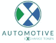

# 汽车行业的未来——最受欢迎的汽车区块链项目列表

> 原文：<https://medium.com/hackernoon/future-of-the-automobile-industry-list-of-the-most-popular-auto-blockchain-projects-b07a3d7ca3fe>

对于区块链工业来说，汽车工业是一个利润丰厚的投资领域，在效率低下的汽车市场中，有数十个机会和数不清的财富在等待着。有几十种方法，一些项目已经开始将他们的产品引入行业。

事实证明，汽车初创公司在区块链行业中非常多样化，目前提供多种服务，包括二手车销售、车辆使用数据的存储和处理、精英和外来车辆的销售、通过 VIN 号码存储车辆数据、仓储、会计、为驾车者提供更有利可图的个性化服务的数据处理、车辆销售数据、新车销售(包括电动汽车)、3D 打印车辆销售等等。然而，问题是，这些冒险是成功还是彻底失败。

目前市场上有许多区块链的项目被证明既成功又不太成功。我们将从 CarVertical 开始对此类项目进行审查。

# [卡弗蒂尔](https://www.carvertical.com/)

该项目来自立陶宛，它提供了一个基于区块链的平台，用于存储和交换车辆数据。用户可以控制其车辆数据对公众的可用性水平。此外，该项目将为驾车者提供营销服务，这将基于车辆数据(保险记录、维护历史、修理等)来提供。).该平台将聚合用户数据，并在机器学习的帮助下提供某些服务，如何时为车辆投保，何时通过计划维护等。这些数据是在保险公司、政府机构和其他权威机构的帮助下收集的。该项目还提供了在车辆的 OBD 插槽中安装特殊矿工的可能性，这将从车载计算机发送必要的数据，以换取令牌。

## 优势

一个有趣的小众项目。周到的交换和数据交易方案。

## 不足之处

与竞争对手相比，功能不足。仅使用二手车。

该项目已经筹集了 2000 万美元，这并不奇怪，因为用数据工作是一个非常有前途的课题。

我们继续回顾澳大利亚的 Bitcar 项目。

# [Bitcar](https://bitcar.io)

该项目提供了一个销售豪华和稀有车辆的 P2P 交易平台。该项目的目标受众是希望出售此类汽车的车主，以及将购买昂贵汽车视为投资的汽车投资者。

区块链平台通过两个 ERC20 令牌运行，一个是 BITCAR，这是 ICO 和项目流动性供应的令牌，另一个是 CAR，这是一种稳定的货币，反映了车辆模型的美元成本。

## 优势

深思熟虑的项目货币化计划。为个人和公司用户提供灵活的激励机制。

## 不足之处

缺少或多或少的关于资金支出的详细信息。

该项目预计将筹集 2200 万英镑。，总共筹集了 923 万美元。对于受众如此狭窄的市场来说，这还不错。

# [**高斯贸易**](https://gaus.trade)

我们审查清单上的下一个项目是来自爱沙尼亚的 Gaus 贸易项目。该项目为制造商向最终买家直接销售新车提供了一个区块链平台。通过从供应链中去除中间商并增加制造商的销售，这使得购买者的汽车价格大幅降低。

交易以该项目的代币进行，代币与车辆的美元价值挂钩。区块链提供操作的安全性和透明度。交易包括保险和贷款的可能性，而智能平台合同规定了退款的可能性。此外，该平台为每次购买提供 3%的返现。

## 优势

这是一款面向汽车市场的全新区块链产品。面向汽车初级市场的广泛功能。智能合同已完全投入使用。简单明了的买卖双方操作方案。经过深思熟虑的 ICO 程序，具有灵活的奖金制度。现实的想法。附加功能的存在(保险、信贷)。

## 不足之处

缺乏出售二手车的机会。

该项目的 ICO 将很快推出，私人销售已经筹集了 30 万美元。高斯贸易是区块链汽车工业中最有前途的项目之一，潜力巨大。

有些项目没有出现在我们的列表中，但是我们很高兴对它们说几句话。

# [大众车辆台账](https://mvlchain.io/)

大众车辆分类帐(韩国)。该项目提供了一个存储车辆数据的平台，如其服务历史、油耗、车主、道路事故等。该平台的用户还可以订购各种服务，如维修、保险、司机电话和租赁。该项目不仅针对个人用户，也针对 B2B 领域，如保险公司、汽车服务、出租车公司。该平台运行在移动应用程序上。购买车辆后，该平台立即投入使用。

ICO 尚未进行。

# [**AMO 币**](https://www.amo.foundation)

AMO 硬币(南韩)。该项目为个人用户和公司客户提供了一个数据交易平台。用户使用连接到 OBD 端口的数据收集器并通过平台应用程序将关于他们的车辆和驾驶的数据上传到平台。作为奖励，他们会得到代币。之后，平台将数据传输给企业客户，企业客户对数据进行处理，并提供用户可以在平台上购买的各种服务。

这些服务包括:备件交换、预测车辆问题、定制保险产品和汽车维修、P2P 二手车交易、视频和音频流、LDM-确定选定区域交通状况的服务。

该项目不独立开发服务。它提供了一个平台，公司可以在这个平台上开发具有特定功能的服务。

ICO 尚未进行。

# [**高速公路**](https://www.autobay.io/)

高速公路(阿根廷)。该项目为大型经销商和用户提供了一个交易平台。关于车辆的数据被加载到区块链中。将为经销商实现广泛的功能，如向平台上传大量提案的关税可用性和广告推广。也有可能通过拍卖出售车辆。此外，该项目通过其平台提供分期付款和贷款。

ICO 尚未进行。

# [T5【汽车】T6](https://axt.io/)

这个项目是由一个已经在美国运营二手车销售门户网站(dashub.com)的团队创建的。该项目提议将这项服务转移到区块链。在[未来](https://hackernoon.com/tagged/future)，该团队打算基于将在区块链收集的车辆数据添加许多新功能。

《国际刑事法院规则》尚未缔结。

# [**VLB**](https://vlb.io)

车辆生命周期区块链(俄罗斯)。这个项目提供了一个区块链平台，它将聚合有关车辆的所有可用信息，如其维护，维修，保险历史使用 VLB 令牌输入。然后数据被处理并提供给公司客户和国家。潜在客户包括保险公司、服务中心、经销商、内务部等。公司客户处理这些信息，并为平台用户形成一个服务池。该项目旨在优化车主和承包商之间的关系。其应用的一个例子是降低保险价格、修理费用等。该项目旨在为提供车辆详细信息的用户提供个性化条件。

该项目已经筹集了 200 万美元。

罗曼·布鲁斯科夫。