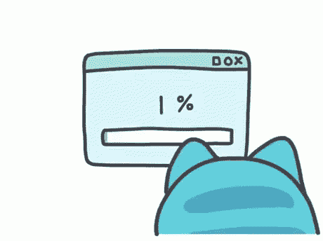

# UX 设计的未来:2018 年期待什么

> 原文：<https://medium.com/hackernoon/future-of-ux-design-what-to-expect-in-2018-adb8d9402fba>

在 DashBouquet，我们热衷于学习新事物，并不断提高我们的技能和知识。这就是为什么我们总是关注最现代的趋势，以便在竞争中保持领先，不仅满足客户的要求，也满足用户的需求。因此，我们认为与你分享 2018 年最受期待的 UX 设计趋势是一个好主意，并看看为什么它们会如此重要。

# 人们期待即时性

今天，世界围绕着即时性的概念旋转。Snapchat、Instagram stories、实时流媒体等等——人们现在已经习惯了这样一个事实，即他们总是可以看到其他人正在做什么，他们希望他们使用的几乎每个应用程序中都有这样的选项。

但是没关系——你的产品可能不是 100%适合这样的功能。然而，即时性的概念不仅仅是关于实时流，也是关于当你收到用户的任何请求时，对他们做出反应。就连政府服务和设施也在缓慢但稳步地向这个方向转变:人们可以在网上留下请求或问题，他们希望在此时此刻马上得到反馈。

所以要仔细考虑你的产品如何使用这个特性。无论是选择播放游戏流，还是选择与朋友分享用户在应用程序上做的任何事情，都不应该让用户感觉他们与世界隔绝。

# 为您的产品增加多样性

你应该知道所有这些关于不同表情符号和其他功能的故事，这些功能必须在实际应用程序发布后添加，因为许多人对最初提供的那些不满意。

这一部分真的很棘手:你不应该疯狂地试图满足每个人，但你也应该考虑你的产品是否满足所有可能的用户。如果你有任何犹豫，找一个更多元化的团队，或者至少做一些研究(或者创建焦点小组)，以确定任何可以改进的地方。在应用程序发布前覆盖所有内容要比收到负面评论后才试图修复你搞砸的东西好得多。

# 从设计到讲故事

市场上有数百万个品牌，它们都在努力吸引用户的注意力。因此，为了让你的产品脱颖而出，你必须以一种非常清晰、有趣和人性化的方式讲述你的品牌故事。你的 UX 应该告诉用户你是谁，你为什么在这里，你能提供什么。

暂时忘掉那些花哨的东西:图表、颜色和形状。坐下来，写几行关于你的品牌和它的故事。通过你的故事与用户交流:提出问题，添加聊天机器人，与用户互动，换句话说，要“健谈”。

# 团队合作就是一切

这种类型的第一个产品是谷歌文档，现在人们希望在线合作。基于云的工具正在兴起，越来越多的应用程序正在快速实现新功能，以保持竞争力并为用户提供他们需要的东西。

考虑到外包的流行和世界各地越来越多的远程团队，这样的实时协作对一些用户来说是必须的。这笔交易不仅仅是关于在线团队合作..—最重要的是知识共享。流程变得越来越透明，所有团队成员都应该知道项目目前的进展情况，这一点至关重要——这将成为 2018 年的趋势。

# 简约外观法则

这不是必须的，但可以考虑:代替复杂的设计，大胆的颜色和简约的方法将被使用。

有些人可能会说——但是我们已经过度利用极简趋势了！嗯，还是有提升的空间的。现代用户思维敏捷，决定更快，所以他们不想过多考虑你的设计。他们希望马上触及核心，因此 2018 年预测内容菜单将被淘汰(难以置信，但似乎是真实的)，只留下设计基础。

然而，即使动画是一个更复杂的元素，它们仍然会在游戏中占据主导地位。原因很简单:人们会更积极地回应它们，所以很多公司在他们的应用程序中使用 gif 和视频。

# 别忘了人工智能、增强现实和虚拟现实

这些技术在最近几年引起了大量的炒作，它们将继续增长。增强现实现在甚至被用在你最意想不到的领域:例如，在酒店中，它可以进行虚拟旅游。

至于人工智能，它现在广泛应用于医学，例如:一些应用程序实际上是虚拟助手，不仅可以监控你的健康状态，还可以在需要时联系医生或紧急情况。

因此，随着世界向数字化转变，越来越多基于机器学习和人工智能的应用程序涌现出来。考虑到智能家居甚至智能城市正在变得司空见惯，你可能会在这里找到自己的位置，并推出一款将成为数百万用户日常必需品的应用程序。

# 一点建议

如今人工智能和物联网正在兴起——但问题是，你的产品真的需要它吗？

是的，在某些情况下，人工智能让产品脱颖而出，为其增加了更多价值——但不要忘记一件简单的事情:它到底会如何帮助你的用户？这里不要以开发人员的身份思考，而是要试着站在用户的角度思考。他们需要人工智能吗？还是没有人工智能更好？你是想通过在产品中加入“AI”来变得花哨还是必须的？

聪明地思考——首先，你必须让用户开心。有时，将事情过于复杂化并不是交付好产品的最佳方式。

亚历克斯·米库利克撰写