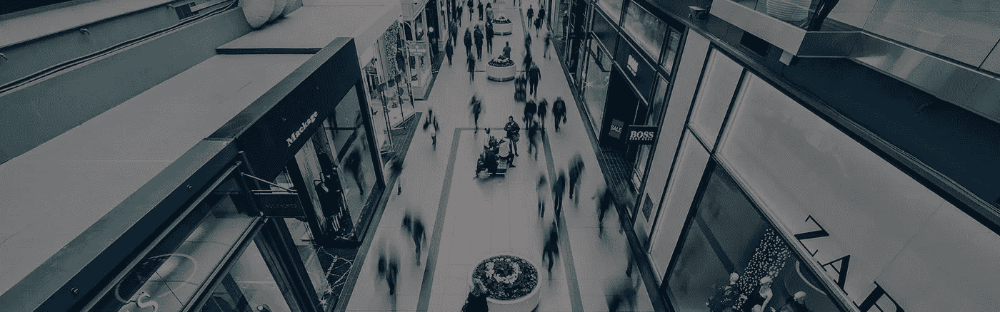
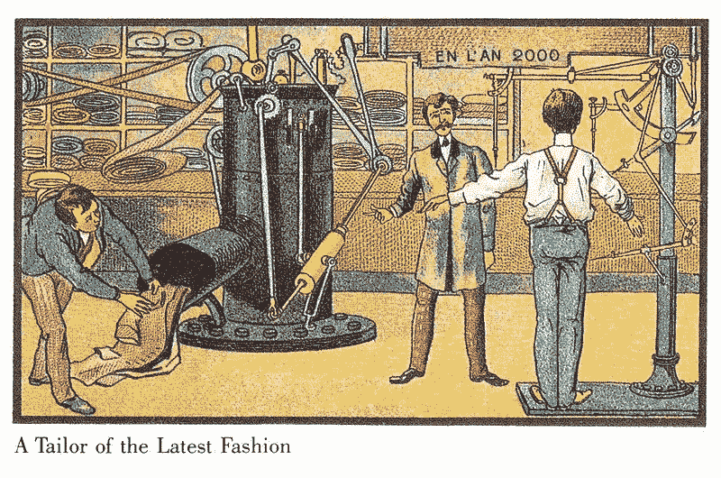

# 未来商店:未来零售商店的 10 大创新

> 原文：<https://medium.com/hackernoon/future-shop-10-innovations-in-the-retail-store-of-the-future-cd592ad264b1>

**本文标题与加拿大电子商店连锁店无关。这是对** [***【未来冲击】***](https://en.wikipedia.org/wiki/Future_Shock) **概念的一个不那么微妙的发挥——这个术语用来描述我们对*【太短时间内太多变化】*的反应。我们的购物体验无疑正在经历一场巨大的变革，而且只会呈指数级增长。**

因此，每一个长期甚至中期的预测都有可能变成一个拙劣的模仿——就像那些试图窥视 2000 年的 20 世纪初的法国明信片一样。然而，下面的说法有一定的道理，我们将在本文后面看到。

这听起来可能违背直觉，但线下购物不会无处可去。千禧一代在体验上花的钱比其他任何东西都多，他们希望获得卓越的实体体验。甚至线上垄断者亚马逊开越来越多的线下店，肯定是有原因的。

因此，让我们试着列出零售业的 10 项创新，它们将在不久的将来塑造我们的线下购物体验。

## **没有收银台，没有排队，没有入店行窃**

自助结账的概念并不新鲜，但亚马逊在 2016 年 12 月 5 日推出了亚马逊 Go 商店，无疑给它注入了新的生命。在那里，你只需将手机上的条形码呈现给传感器，拿走你需要的东西，然后走出去——你将通过你的亚马逊支付账单。但这还不够！在最先进技术的帮助下，亚马逊将能够*“检测到一件产品，它不仅从货架上消失了，还被拿在你的手中，放在包里，甚至藏在衬衫下面”*。商店扒手的艰难时期即将到来！

> 寻找一些有创意的想法和有前途的零售技术用例？[查看这份白皮书](https://eleks.com/whitepapers/evolution-retail-technology/?utm_source=medium-future-shop&utm_medium=refferal&utm_campaign=Republ-RetailEvolution-Whtpr)。

## **店内无人机**

今年 3 月，沃尔玛申请了一项无人机专利，该专利将在商店内定位并向顾客运送商品。有些人可能会觉得这很傻，尽管这一概念有明确的优势:由于美国法规不允许无人机在视线之外或人口稠密的地区飞行，这听起来比亚马逊的无人机送货上门计划更现实。那么沃尔玛室内无人机到底会如何工作呢？*“无人机将在商店的密室储存仓库中找到物品，通常仅限于工作人员，并飞过将仓库与零售区隔开的墙壁上的无障碍窗口来交付物品”*。

## **人工智能机器人店员**

我们已经习惯了在线商店中的聊天机器人，但是，随着线上和线下的界限越来越模糊，我们看到机器人进入实体商店为我们服务。零售商正计划使用机器人进行库存管理、检索订单、产品定制、客户协助，甚至直接替换员工。对于零售业的 600 万人来说，这增加了他们对被机器人抢走工作的恐惧。对于顾客来说，这带来了希望，在像[语音控制购物助手](https://labs.eleks.com/2017/03/experimenting-intelligent-apps-voice-controlled-shopping-assistant-smart-fridge.html)这样的解决方案的帮助下，可以避免大量的困惑和选择的痛苦。

## **您以前的线下和线上购物记录用于推荐**

同样，随着线上和线下的融合，我们可能很快就会发现，随着信标和面部识别系统的广泛使用，我们的数字轨道会在实体店中跟随我们。就像谷歌根据你的搜索历史决定向你展示哪些广告一样，商店里的零售商会向你发送特价信息，比如，当你接近你在网上寻找的商品时。一方面，这将减少忘记买你真正需要的东西的可能性。另一方面，这也会降低你的门槛，吸引你进行更感性的购买。

## **商品的全息再现**

这可能是根据您的购物历史定制的货架上商品的全息图像，也可能是定制的交互式全息图像，您可以调整它来查看您可以获得哪些产品选项。全息图已经被用于拉尔夫·劳伦新服装的橱窗展示，我们可以预计在未来它们将取代过于物质化的人体模型。

## **增强现实**

实际上，这个想法并不新鲜——像宜家这样的品牌已经使用 AR 有一段时间了，在未来，这种趋势只会增长。AR 有着广泛的应用:Lowe's 连锁零售家装和家电商店使用它来进行交互式比例大小的厨房 3D 呈现，客户可以应用不同的选项并在线分享他们的设计想法；乐高允许客户扫描某个工具包的盒子，以获得完整的 3D 外观；当你选择你需要的美容产品时，AR 也可以派上用场。总的来说，AR 在处理太大或打包的产品时非常方便，因此不能用于测试。

此外，在过去几年进入市场的最新新产品中，支持虚拟现实(VR)、增强现实(AR)和新推出的混合现实(MR)体验的解决方案越来越受欢迎。当我们在 R&D 实验室获得 HoloLens 时，我们非常兴奋地在一些现实生活的用例中进行尝试。因此，我们决定找出 HoloLens 技术对零售的好处。观看这个短片，看看我们的实验结果。

## **虚拟现实中(甚至在我们的大脑中)的试衣间**

你可能想在特殊条件下测试某些衣服(尤其是服装)，比如寒冷的天气、下雨或下雪。在虚拟现实的帮助下，你很快就能做到。阿迪达斯计划创建一个虚拟现实试衣间，将顾客暴露在模拟的冬季天气中，使选择寒冷中跑步服装的过程更加令人兴奋和相关。当考虑极端活动的服装时，这种“情境测试”远远领先于传统的试衣间。随着脑机接口的想法越来越流行(特别是在埃隆·马斯克宣布推出 Neuralink 之后)，我们可以想象这种虚拟试衣间放在我们的大脑中会更加真实。

## **商品和服务的终极定制**

ELSE Corp .是一家位于时尚和技术十字路口的意大利初创公司，在人工智能和虚拟现实的帮助下，将客户体验提升了一个档次。ELSE Corp .将这些工具结合起来，使顾客能够制作出真正独一无二的服装，并看看它实际上是否合身。很容易想象，在不久的将来，我们将能够立即在 [4D 打印机](https://www.newscientist.com/article/2127713-4d-printing-makes-objects-that-assemble-themselves-when-heated/)上打印这样一件定制的服装。耐克(Nike)和新百伦(New Balance)等品牌已经推出了 3D 打印鞋底的鞋子。随着纺织品 3D 打印的出现，本文开头的图片看起来很合适，不是吗？

## **生物识别技术**

无论是用于防止欺诈和入店行窃，还是方便支付，生物识别技术肯定会塑造零售业的未来。今年 4 月，万事达卡推出了一种带有嵌入式指纹读取器的试用版卡，目前看来，这种卡更安全，而不是更方便:这种卡不包括非接触式支付技术，除了将拇指放在读取器上，你还必须输入 PIN 码。但是随着生物识别技术——特别是人脸识别——的发展，我们可能很快就会期待更方便、更安全的解决方案。

## **线上和线下界限模糊**

随着现在和未来的界限变得难以区分，线上和线下的界限变得模糊。零售商将在线功能嵌入到线下世界，同时，在线客户体验在 AR 和 VR 的帮助下变得越来越真实，使用户不仅可以看到或触摸数字物品，还可以[闻到](http://www.techradar.com/news/world-of-tech/these-guys-are-building-an-electronic-nose-how-does-it-smell-1323547)，甚至[品尝](http://www.gizmodo.co.uk/2016/11/tech-offers-a-way-to-taste-in-vr/)！

# 现在是体验，未来是魔法。

我们 ELEKS 相信，零售商成功的关键与其说是营销和广告，不如说是给顾客一些他们在别处得不到的东西——一些超越他们以往任何体验的东西。这就是为什么我们努力在[全渠道解决方案](https://eleks.com/industries/retail-software-development/?utm_source=medium&utm_medium=&utm_campaign=Rebubl-10-Innovations-in-Retail-medium)中脱颖而出，将它们提升到神奇的水平。正如亚瑟·C·克拉克所说，“任何足够的技术都和魔法没有区别。”

最初发表于 2017 年 8 月 23 日 eleks.com。