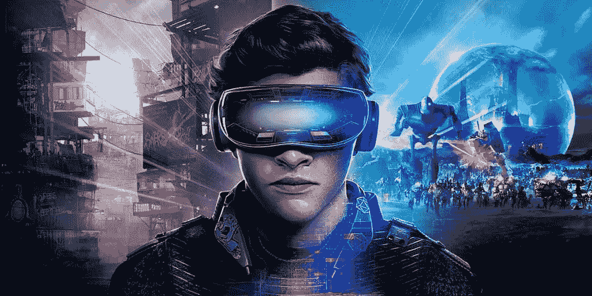
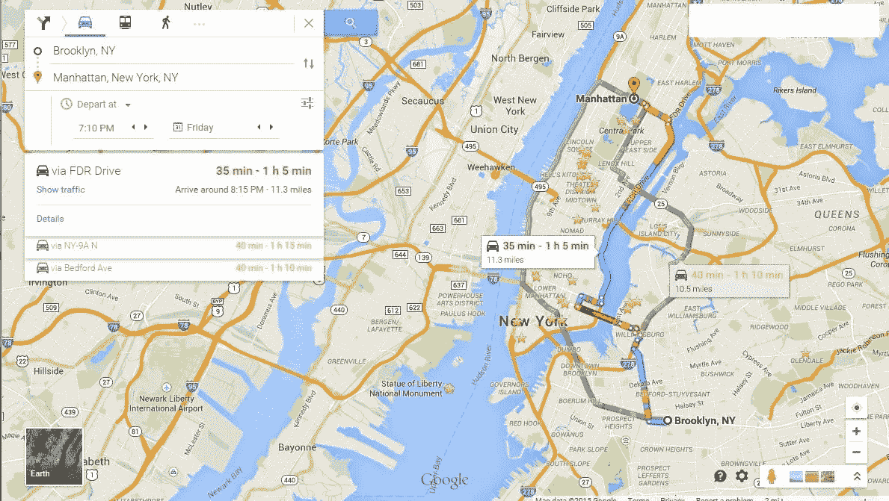
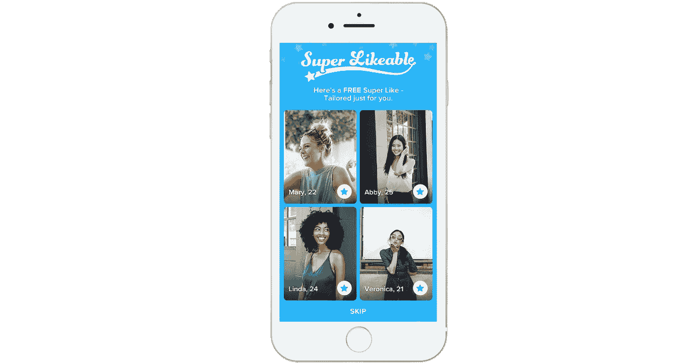

# 隐藏在众目睽睽之下的“未来”技术:人工智能(第 1 部分，共 4 部分)

> 原文：<https://medium.com/hackernoon/future-tech-thats-hiding-in-plain-sight-artificial-intelligence-part-1-of-4-8ec69749b61b>

*随着关于* [*人工智能*](https://hackernoon.com/tagged/artificial-intelligence) *(AI)、增强/虚拟现实(AR/VR)*[*区块链*](https://hackernoon.com/tagged/blockchain) *和物联网(IoT)的故事在最近几个月越来越热，我们常常忍不住认为这些技术离主流采用还有很长的路要走。*

*像****Ready Player One****和* ***复仇者联盟:无限战争*** *这样的电影只是通过将真实的技术与幻想混合在一起，使我们在现实世界中使用的技术在这个过程中显得原始。*

然而现实是怎样的呢？

人工智能、AR/VR、区块链和物联网已经在我们的日常生活中扮演着重要的角色，无数的例子隐藏在人们的视线中。

*在我们系列的第一部分，我们来看看* ***【人工智能】*** *。*

# 人工智能不是黑仔机器人

在流行文化中，人工智能通常被描述为机器人中高度进化并具有自我意识的人造“大脑”，能够推翻人类，就像《玛奇纳》中的**或《T42》中的《终结者》电影**一样。

在现实中，人工智能对人类有着压倒性的好处，并且更多地与软件应用联系在一起，而不是机器人。

它已经存在于我们每天使用的应用程序中。

# 地图和拼车

谷歌地图能够预测你的通勤时间或建议最快的工作方式依赖于**机器学习(ML)** ，这是一种人工智能形式，它利用海量的历史旅行数据来做出预测或决定。当优步或优步告诉你你的炒面预计到达的时间时，它也会这样做。

也许更令人印象深刻的是，谷歌能够[使用计算机视觉(CV)，另一种形式的人工智能，来“读取”街景车拍摄的图像中的街道标志](http://www.timesnownews.com/technology-science/article/deep-learning-google-maps-to-become-more-accurate-through-artificial-intelligence/60610)，然后使用 ML 来更新谷歌地图。

*Google Maps analyzes historical trip data to let you know how to go somewhere and how long it might take.*

# 电子商务和客户服务

到目前为止，你可能已经知道亚马逊会分析你在其网站上的购物行为，并根据过去的页面浏览和购买历史向你展示你最有可能购买的商品。那也是 ML/AI。西雅图科技巨头的 Alexa 也是如此，它是一个人工智能助手，可以做任何事情，从控制你的家用电器到帮助你从亚马逊订购另一盒尿布。(多方便啊！)在 AI 助手上投入巨资的不只是亚马逊；微软、谷歌和苹果是另外几个分别向世界介绍 Cortana、谷歌助手和 Siri 等人工智能个性的公司。

机器学习算法也被用于自动化仓库操作，使亚马逊这样的公司能够实现他们闪电般的快速交付预期。

必须提供客户服务或支持的企业现在转向人工智能聊天机器人，这些机器人能够在没有人类输入的情况下与客户互动。这些聊天机器人允许企业提供一种服务水平，这种服务水平是大多数客户对于日常查询可以接受的，而不必雇佣大量的客户服务代表。

# 约会和社交网络

你(或你的单身朋友)使用的约会应用正在大力投资人工智能/机器学习，以提供更好的匹配，让你向左或向右滑动。以 Tinder 为例，[去年开始测试一项名为“超级喜欢”的新功能，](http://blog.gotinder.com/introducing-super-likeable/)使用基于人工智能的匹配，偶尔会推荐四个它认为你很有机会与之一拍即合的用户，为你提供一个免费的“超级喜欢”来使用这四个用户中的一个。(据 Tinder 称，使用“超级相似”可以将用户匹配的可能性提高三倍。)

Tinder 中的另一个 ML 功能是让 Tinder 自动使用你最好的、最成功的照片进行 A/B 测试。竞争对手 OKCupid 也实现了这一点。当 OKCupid 用户没有使用他们最有效的照片时，该应用程序会提醒他们，以便他们可以更换更好的照片。

掌握机器学习算法的约会应用程序(甚至是社交网络应用程序)绝对会彻底改变这个行业——想象一下，在你的第一个月之后，你根本不用刷卡就能遇到你的完美匹配，因为应用程序已经准确地知道了你在寻找什么。

*Tinder’s Super Likeable feature occasionally present you with four matches Tinder’s AI algorithms thinks are especially great for you.*

# 体育领域的高级分析

你是 NBA 的球迷吗？

计算机视觉(CV)和人工智能正在成为每个 NBA 球队武器库中的重要工具。早在 2013 年，一家名为 SportsVu 的公司与 NBA 合作，在每个 NBA 赛场提供六个动作捕捉摄像机。相机生成的数据随后能够用于提供各种基于机器学习的观察，这些观察很快被证明优于单纯的人类观察。如今，一家名为 Second Spectrum 的公司有权向每支 NBA 球队提供这种丰富的动作捕捉数据，它的服务是金州勇士队等球队全押“小球”和三分球的一大原因。

美国职业棒球大联盟(MLB)使用人工智能的时间甚至比 NBA 还要长，看过《金钱球》的人可能都知道这一点。当使用不同的阵容(如投手)、击球顺序或经理安排的其他战术时，MLB 队使用 [sabermetrics](https://en.wikipedia.org/wiki/Sabermetrics#Machine_learning_for_predicting_game_outcome) 或高级游戏中统计数据来模拟游戏结果。

# 音乐推荐

回到消费者应用程序，如果你曾经使用过 Spotify 的[“发现周刊”功能](https://www.spotify.com/us/discoverweekly/)，你就已经允许(也许是无意中)一个人工智能来支配你的音乐偏好。(不要难过，虽然；很快，人工智能就会告诉我们在生活中应该穿什么、吃什么、做什么——我们会很乐意倾听！)

*Spotify’s “Discover Weekly” uses machine learning to give you curated playlists of songs you “should” like.*

# 避开黑仔机器人

任何负责任的人工智能概述都应该引入**技术奇点**的概念，这是超级人工智能能够快速自我改进的理论点，这样它就不再需要人类，因此理论上可以追求我们的灭绝。

对于一些人来说，这种可能性是如此真实，以至于特斯拉首席执行官埃隆·马斯克(Elon Musk)公开表示:“通过人工智能，我们正在召唤恶魔。你知道那些有五角星和圣水的人的故事吗，他说，是的，他确定他能控制恶魔？没用的。”

然而，大多数专家认为，如果治理得当，这是一个我们不需要担心的场景，甚至最早在 2040-2050 年之前都不太可能出现。(现在还没有必要锁定你的 Roomba。)

今天和在可预见的未来，人工智能是良性的，亲人类的，并被证明对选择在其应用程序中实现它的公司具有巨大的价值。

“关于移动应用，人工智能是我们非常感兴趣的一个领域。支持人工智能的移动应用程序特别有趣，因为任何拥有智能手机的人——即使是 5 年前的手机——运行一个开发良好的应用程序，都可以利用来自之前用户的数十亿或数万亿数据点的智慧。这就是云计算和人工智能的美妙之处，”CitrusBits 的首席执行官哈利·李解释道，citrus bits 是 T2 领先的移动应用开发机构，位于洛杉矶和旧金山湾区。

*在我们系列的第二部分，我们将探索增强现实和虚拟现实(AR/VR)如何迅速成为现代现实，并讨论一些当今最有趣的应用。*