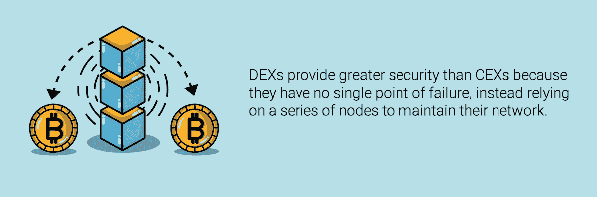

# 期货合同和交易所的未来:新技术如何创造新机会

> 原文：<https://medium.com/hackernoon/futures-contracts-and-the-future-of-exchanges-how-new-technology-creates-new-opportunities-b143ef6c0c7b>

早期的加密货币交易所寻求模仿传统交易所的方法，或许是为了让人们熟悉一个新兴的神秘资产类别。然而，尽管加密货币的基础技术提供了几乎无限的潜力，但这往往扼杀了创新。最近出现的是新一代交易所，它们提供交易新世界资产的工具。

将比特币期货合约上市的芝加哥商业交易所和 CBOE，以及致力于向投资者推出比特币交易所交易基金的传统资产管理公司(最近的例子是范埃克)等发展没有显示出任何放缓的迹象，但它们仍在试图通过几十年前的视角塑造数字资产的未来。这一切都将改变。

# 集中式与分散式

在过去十年之前，所有的交易所大多是集中式的，并且主要在一个物理位置上操作。如今，交易大厅正在消失，取而代之的是优先考虑速度和简化用户体验的技术。例子包括[上海期货交易所](http://www.shfe.com.cn/en/)、 [CME 集团](http://www.cmegroup.com/)和[纽约证券交易所](https://www.nyse.com/)。这些场所有中央服务器，通过一个入口点将所有订单发送到中央限价订单簿。

[比特币基地](http://www.coinbase.com)、[币安](https://www.nyse.com/)和[北海巨妖](http://www.kraken.com)在寻求创建加密货币交易所时采用了类似的模式，可能是因为他们希望人们能够放心地交易这些资产。这些[集中交易所](https://www.investopedia.com/terms/c/centralizedmarket.asp) (CEX)，现在全部电子化，服务器位于一个中心位置，只要通过注册程序和 KYC/反洗钱检查，就可以进行全球交易。

当考虑在 CEX 交易时，重要的是要记住你的硬币是由交易所持有(保管)的；你的私人钥匙不在你手中，因为所有交易都记录在位于他们服务器上的中央[订单簿](https://www.investopedia.com/terms/o/order-book.asp)上。如果交易所被黑客攻击(就像 T2 发生的 Coincheck T3 事件)，被政府实体关闭，或者只是离线，你可能会失去所有的硬币。唯一涉及区块链的时候是当你从交易所取出这些硬币并恢复实际所有权的时候。

考虑到这些痛点，许多交易者开始将目光投向 d [去中心化交易所](https://www.investopedia.com/terms/d/decentralizedmarket.asp) (DEX)，包括和 [CryptoBridge](https://crypto-bridge.org) 。dex 可供任何连接到互联网的人使用，并且由于它们使用公共分布式分类帐来记录所有交易并保持保管，所以您保留对所有私钥的控制。

由于没有单一的入口点，dex 更加安全，也更不容易被黑客破坏和窃取价值数亿美元的加密资产。你的资金不会被监管机构没收，即使服务器离线也不会丢失。安全性取决于你的钱包和你存放私人钥匙的地方。

这听起来很棒，对吧？嗯，有一个条件。DEX 交易的主要吸引力也是它最大的缺点:所有交易都在区块链上记录。因此，为任何其他 ETH 交易支付的相同费用也需要在交易所支付——为每一笔交易。

成本各不相同，但是如果你每天做几笔交易，成本就会增加，一些交易者最终会损失利润。这里有一种方法:10 次交易你赚了 0.01 ETH，但是你在每一次交易上花了 009 ETH 的汽油。你没有像买 CEX 那样赚 10 ETH，而是把 90%的利润花在了 ETH 汽油上，只剩下 01 ETH。远非最佳，而且这还没有考虑到在公共区块链开始达到每秒交易量(TPS)限制的情况下上涨的天然气成本。

# 混合交易所:两全其美

对这种模式的抱怨导致了混合交易所(HEX)的诞生，如 EverMarkets ( [EMX](http://emx.com) )和 [Eidoo](https://eidoo.io/) 。

EMX 是一家全球期货交易所，将提供数字和现实世界资产的期货合约，范围从大宗商品到加密指数，并计划最终包括固定收益和其他衍生品。在 EMX 启动交易后，该交易所计划将资金存放在由存储在区块链的智能合约控制的托管钱包中。在这种机制下，在退出交易所的交易时，资金将根据期货合约的价格交付给接受者。最终，这些智能合约还将防止未经授权的资金访问，并应使黑客更难窃取资金。

此外，由于 EMX 采用批量拍卖，而不是集中限价订单簿，他们可以为世界各地的几乎任何人提供公平的机会。这是因为在 EMX 模型中，无论一家公司规模有多大，速度有多快，所有人都要付出同样的代价。这消除了高频交易者通常享有的速度优势，让机构和散户交易者在同一水平上竞争。

Eidoo 也有类似的结构，专注于交易加密货币，而不是期货合约。该交易所在以太坊区块链的智能合约中持有资金，防止在交易结算前进入这些合约。为了缓解区块链泛滥，Eidoo 计划使用[一个非链订单簿和服务器](https://eidoo.io/docs/EIDOO_Technology_White_Paper_v_0_2_Draft_EN.pdf)来创建一个类似于集中式订单簿的熟悉的前端体验，同时记录批量交易中的交易。交易仅在匹配和执行时写入区块链。

这两个场所都能够使用代码和智能合约来取代目前由中介执行的许多功能([非中介化](https://www.investopedia.com/terms/d/disintermediation.asp))。这大大降低了交易成本，加快了交易速度，实现了近乎实时的结算。

# 前进的道路

期货合约的出现彻底改变了传统市场，这种转变现在也开始在加密市场中感受到。能够在区块链交易加密货币和加密期货正在创造越来越多的交易和风险管理机会。。

然而，快速采用的一个主要障碍是清算所的组织；任何有序的期货市场中最重要的部分。智能合约有可能处理清算所的许多功能，并可能最终取代它们。EMX 和其他人正在研究将清算中心的某些方面引入区块链，但将传统清算中心的所有方面引入加密货币领域需要更多的工程和法律工作。

就目前而言，真正的创新在于，分散式或混合式交易所覆盖全球，能够提供以前仅限于特定市场或地区的资产。希望通过一个应用程序交易亚洲的[西德克萨斯中质油](https://www.investopedia.com/terms/w/wti.asp) (WTI)期货和欧洲的[恒生指数](https://www.investopedia.com/terms/h/hangseng.asp)期货，并获得跨保证金交易的所有效率优势？这是有魔法的。促成这些创新的工程、监管和法律工作具有真正革命性的潜力。

# 结论

金融交易所已经并将继续在全球经济中发挥至关重要的作用，随着技术壁垒的不断崩溃和监管的相应更新，交易场所需要不断创新，以保持领先地位。所有的全球交易者都将从这些下一代交易所有机会提供的准入、效率和公平中受益。就目前而言，CEXs 和 dex 将为保住市场地位而战；但 hex 似乎最适合以更低的成本和更快的结算时间提供公平、普遍的市场准入。

## 关于作者:

[基里尔·希洛夫](http://twitter.com/kirills4ilov)——geek forge . io 和 Howtotoken.com 的创始人。采访全球 10，000 名顶尖专家，他们揭示了通往技术奇点的道路上最大的问题。加入我的**# 10k QA challenge:**[geek forge 公式](https://formula.geekforge.io/)。