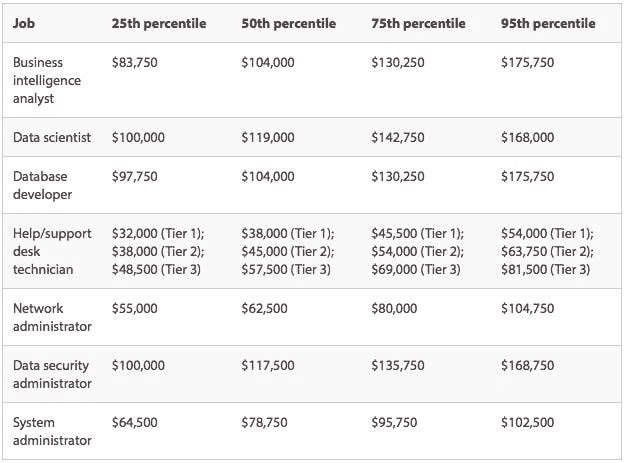

# 已经存在的未来工作职位

> 原文：<https://medium.com/hackernoon/futuristic-job-positions-that-already-exist-964433132b32>

在过去的二十年里，[技术](https://hackernoon.com/tagged/technology)发展如此之快，以至于即使你在职业生涯中努力工作，参加培训和社交活动，也几乎不可能在劳动力市场上保持一个好的位置。对公司来说也是一样——他们争先恐后地适应现代劳动力，尽一切可能吸引顶尖的技术人才。根据 Robert Half Technology 的 2018 年 IT 薪资报告，对一些人来说，这可能意味着在填补明年最受欢迎的职位方面占得先机，这些职位包括从数据聚焦到安全相关的职位。调查还根据工作经验揭示了每个职位的平均工资。

以下是 2018 年的七个热门职位，你应该寻找的技能和经验，以及为了保持竞争力你希望支付的平均工资。

# 2018 年最受欢迎的 7 个技术职位

*   *第 25th】百分位数:入门级工人或竞争不太激烈的行业的工人*
*   *第 50 百分位:“平均经验”，一份“平均复杂程度”的工作，或者更简单地说，那些有 3-6 年工作经验的人*
*   *第 75 百分位:高于平均水平的经验、强大的技能、证书、在“竞争相当激烈”的行业中更复杂的角色或工作*
*   *第 95 百分位:丰富的经验、认证、专业化、高水平的专业知识、在战略和高度复杂的岗位上工作或在人才竞争激烈的行业中工作。*

# 商业智能分析师

商业智能分析师需要数据库技术、分析和报告工具方面的经验；企业通常会寻找拥有计算机科学、信息系统或工程学士学位的候选人。您将希望雇用具备适当技能的人来了解您的业务的数据需求，然后将这些需求传达给利益相关者。随着业务需求转向依靠收集和理解数据，这一角色变得越来越重要。

**要寻找的技能和经验:**具有数据库查询、存储过程编写、在线分析处理(OLAP)、数据立方体技术的经验，较强的书面和口头技能

# 数据科学家

虽然您需要 BI 分析师从业务角度帮助理解和交流数据模式，但是[数据科学家](https://www.cio.com/article/3217026/data-science/what-is-a-data-scientist-a-key-data-analytics-role-and-a-lucrative-career.html)是帮助收集、处理和分析数据的人。他们还应该善于交流这些发现，并向业务中的其他人提供建议。

**需要寻找的技能和经验:**编程语言(特别是 Python 或 Java)，很强的分析和数学能力，硕士或博士学位。

# 数据库开发人员

当招聘数据库开发人员时，您会希望寻找能够展示分析和解决问题技能的候选人。因为他们将负责开发和管理企业数据库，所以你在招聘时应该清楚地知道你要招聘什么技能的人，以及哪种类型的开发人员最适合你的需求。

**需要的技能和经验:**至少拥有计算机科学学士学位，拥有微软 SQL Server、甲骨文或 IBM DB2 等企业数据库程序的经验，以及微软认证数据库管理员或甲骨文数据库管理员认证专家等认证

# 帮助台或支持台技术人员

对于面向客户的企业，帮助台是高效运营企业的重要组成部分。作为客户服务和故障排除的第一道防线，帮助台工作人员需要具备合适的技术和软技能。Robert Half Technology 将帮助台技术人员的角色分为三个层次，因为工作描述和要求会因业务的不同而有很大差异。

要寻找的技能和经验:

*   第一层:入门级的职位，要求不到两年的经验，大专学历或技术学校的课程。
*   第二层:要求有两到四年经验、两年或学士学位以及相关工作经验的职位。
*   第三层:四年或四年以上的服务台工作经验，相关领域的学士学位和专业认证。

# 网络管理员

网络管理员负责处理局域网/广域网协议、软件和硬件。他们花费大量时间进行故障排除，并且通常需要随时待命，以防出现紧急情况或故障。你对经验的要求取决于你的网络需求有多广泛，但是某些技能和证书可以帮助你找到最合格的员工。

需要的技能和经验:故障排除和沟通技能、分析和诊断技能、相关工作经验、专业认证

# 数据安全管理员

处理大量数据需要专注于安全性，以保护您的业务、员工、客户和顾客。数据安全管理员负责定义网络安全要求，确保所有安全措施都是最新的，监控公司范围内的安全实践并实施安全策略。

**需要的技能和经验:**批判性思维和解决复杂问题的能力，创新和积极主动的思维，不断学习新技能的意愿，强大的编程、数学和一般工程技能，学士学位，相关认证和计算机科学背景

# 系统管理员

像 IT 行业的大多数工作一样，系统管理员应该表现出很强的解决问题、沟通和分析能力。但是系统管理员也需要对公司特定的硬件和软件有很强的技术理解。您对系统管理员的要求会因您所依赖的服务、硬件和软件而异。

**需要的技能和经验:**服务器、备份和恢复以及安装、修补和升级软件的经验，排除和解决硬件、软件和网络问题的经验，计算机科学学士学位、大专文凭或技术培训证书，以及微软认证系统管理员(MCSA)、微软认证系统工程师(MCSE)或 Sun 认证系统管理员(SCSA)等证书。

# 去哪里找这些专家？

对于那些掌握技术脉搏并准备在职业生涯中迈出下一步的现代和积极主动的人，我们创建了[工作人员](https://aworker.io/)——这个平台有助于根据他们的专业背景、工作相关技能和成就找到最合适的公司和工作岗位。用户不再局限于一份工作、一家公司、一个城市甚至是一个洲，因此你在世界各地的所有联系都将被计算在内。这里的问题是，你必须通过附上证书或其他证明文件来证明你所写的数据。

任何人都可以通过推荐一个朋友或熟人获得空缺职位而获得奖励(即使他们在面试后没有找到工作，也会获得奖励)。你在实习、兼职、网络研讨会和其他专业活动中认识的所有人都能够证明你在工作中的技能和成就。要了解该项目的更多信息，请访问[本页](https://aworker.io/)。

在 21 世纪，我们预计会看到越来越多的新工作岗位，在这些岗位上，拥有专业领域的特定知识和有用的人际网络比样样精通更重要。你同意吗？

写在下面的评论里！