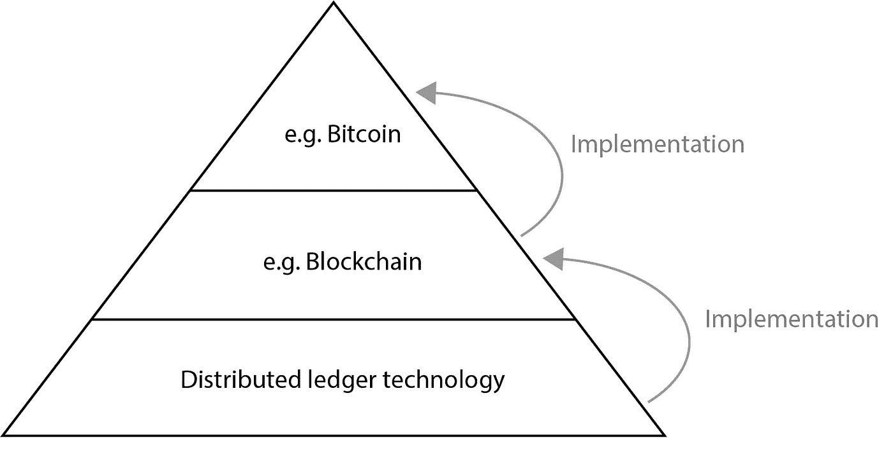

# 澄清关键术语:比特币、区块链和分布式账本技术

> 原文：<https://medium.com/hackernoon/gaining-clarity-on-key-terminology-bitcoin-versus-blockchain-versus-distributed-ledger-technology-7b43978a64f2>

在接下来的一个月左右，我计划分享一些关于分布式账本技术的想法。作为一名商业领袖，你应该有信心在你的组织内创新和推动增长，尤其是在涉及新技术的时候。这就是为什么我打算引导你通过这个令人兴奋的空间。

为了更好地理解分布式账本技术，您必须首先了解加密货币的复杂世界，以及与之相关的各种术语。

# 密码、资本和对控制权的追求

2017 年，加密货币的兴起，最引人注目的是比特币，使“[区块链](https://hackernoon.com/tagged/blockchain)”一词成为世界各地的头条新闻、书籍标题和餐桌讨论。

在某种程度上，“区块链”这个词已经成为比特币的同义词，这两个术语都是令牌化概念的同义词——我将在[未来的](https://hackernoon.com/tagged/future)文章中对这个术语进行更多的定义和讨论。

加密货币现在通常被称为密码，而资本流入这一领域的浪潮被称为“区块链运动”。然后是首次公开募股(ico)的世界，并找出对这些新生态系统的适当治理和控制。

至少可以说，加密领域是复杂的。因此，作为一名商业领袖，对这一切的良好理解是帮助你做出正确决策的必要条件。

不幸的是，这个领域的术语有点混乱。

今年早些时候，我为 Hacker Noon 写了一篇关于为什么区块链会改变世界的文章——你可以在这里查看。基于对这篇文章令人鼓舞的回应，随着该领域对人才需求的指数级增长，以及初创企业和资本流入该领域的速度不断加快，我相信这项技术将改变世界。

然而，当我写这篇文章时，我错误地提到了“区块链”，而不是“分布式账本技术”(DLT)。因此，记住这一点，我想借此机会澄清任何困惑。

# 比特币对区块链

了解比特币、区块链和 DLTs 之间的区别将有助于你提出正确的问题，并了解你的业务的机会和风险。

先说比特币。

被认为是自互联网以来最伟大的技术创新，比特币的出现是为了应对 2008 年的全球金融危机和许多银行机构的倒闭。

这是世界上第一种去中心化的数字货币，因为该系统在没有中央银行或系统管理员的情况下工作。

同样，区块链技术“……促进点对点交易，无需任何中介，如银行或管理机构……”。

基于这些描述，术语“比特币”和“区块链”看起来非常相似。但是这些词是同义词吗？

简而言之，没有。

就像生活和技术中的许多原则一样，把这个技术领域想象成一块蛋糕或多层堆栈。

在概念层面上，你走得越高，你就越有可能描述一个专注于特定业务问题的应用程序。在堆栈的底部，您会发现与该技术相关的原则和核心租户。切入正题，概念层次看起来像这样。

换句话说，比特币是区块链的实现，区块链是 DLT 的实现。

# 分布式账本技术不断变化的角色

2008 年 10 月 31 日，一篇名为“[比特币:点对点电子现金系统](https://bitcoin.org/bitcoin.pdf)”的论文以“中本聪”的笔名发布在一个密码学邮件列表上。

比特币是基于区块链技术，特别是工作证明共识算法。而且，随着数百个项目在区块链平台上建成，许多人认为“区块链”和“DLT”是同一个词。

然而，区块链只是一个数据库，它是公开的(没有人拥有它)，分布式的(没有中央服务器)，由每个人不断更新，并由每个参与者不断验证的加密技术保护。它在很大程度上也慢得令人难以置信，并且对于大多数商业应用程序来说不是立即有用的。

在 2016 年左右，“分布式账本技术”一词被用来描述不专门依赖于区块链的技术。这些新的非区块链实现出现是为了支持高事务量和微事务数据，最著名的是 DAG(有向非循环图)。

像 Hashgraph 这样的项目描述了一种新的方法来确保分布式分类帐系统中节点间数据一致性的复制。它被概念化为支持工作证明的加密原则的替代方案(稍后将详细介绍这些原则和不同类型的共识算法)。然而，这些新的 DLT 可能有其他的挑战，我将在以后的文章中回顾。

今天，分布式分类帐技术是一个总括术语，用来描述在分布式系统中的一个或多个节点上公开或秘密地以分类帐形式分发数据的技术。

现在有几种不同类型的 DLT，每种类型的主要区别在于它跨节点复制数据的方式。

还有其他的区别点，包括技术提供的基础——开源，或者以某种方式授权。相关的，与节点和相关分布相关的治理和控制也很有趣。在分布式系统中，网络、节点和内部数据的安全性也是理解的关键，并且在每个关注的项目中有所不同。

# 转向其他形式的 DLT 教？

随着密码世界的不断发展和变化，我们看到大量有趣的项目渴望测试，调整和篡改 DLT 的想法。这导致了最初比特币区块链的几种变体的产生，但也导致了完全抛弃了区块链理念的 DLT 系统的产生。

随着企业家越来越意识到他们的选择，我们可以看到对传统区块链系统的依赖减少，并转向其他形式的分布式账本技术。

作为一名商业领袖，了解两者的区别将被证明是非常宝贵的。

安东尼·史蒂文斯(Anthony Stevens)是《追逐数字》(Chasing Digital)一书的作者，是多家初创公司的联合创始人，也是毕马威(KPMG)的首席数字官。在加入毕马威之前，他曾在多家澳大利亚大公司担任行政领导职务。Anthony 热衷于帮助前数字化企业寻找新的增长机会，拥抱新的商业模式。