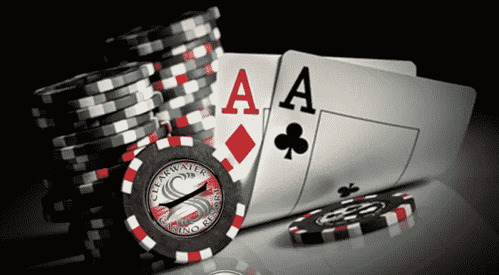
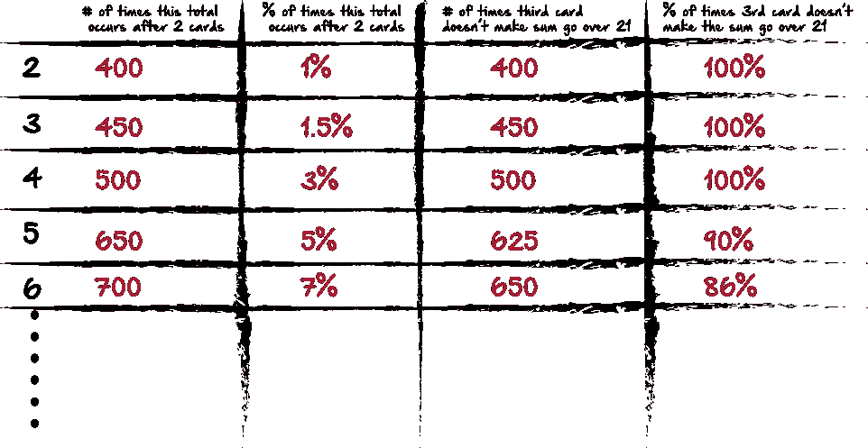
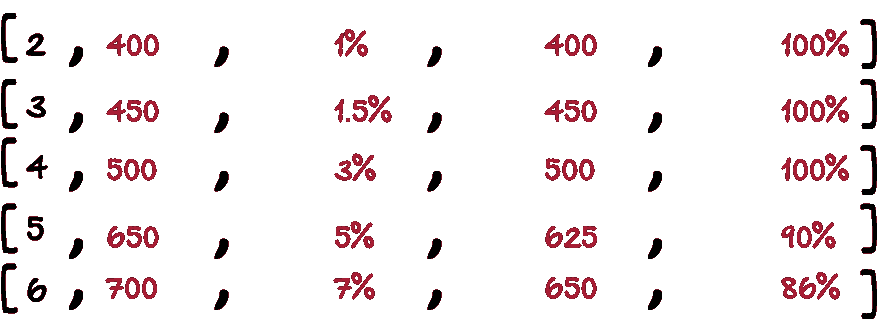

# 赌博与概率(Python)

> 原文：<https://medium.com/hackernoon/gambling-probability-python-dfd3e301b1ad>



我最近对某些结果的概率产生了兴趣。Python 为我们提供了一种测试场景的好方法，通过允许你运行特定场景数百万次，并计算特定结果发生的次数，来查看特定场景发生的可能性..以抛硬币为例。我们可能有兴趣看到任何给定的掷硬币结果是正面还是反面的概率。我们可以掷一百万次硬币，找出每种情况的可能性。

在掷硬币等情况下，结果很大程度上取决于在两种或多种可能性之间的随机选择。Python 包括一个名为‘random’的库，你可以通过`import random`导入这个库来使用。使用 random，我设置了一个脚本来确定正面或反面的概率，并将该场景运行了一百万次。我发现了以下内容:

总人数:499588 人

总尾数:500，412

最多的头像:19 个

连续最多的尾巴:19 条

很有趣吧？这提供了一些有用的见解，因为知道任何事情的特定运行的概率，将帮助我们确定在每个硬币被投掷之后增加我们的赌注多少。

于是，我决定变得复杂一点，用 Python 建立一个模拟 21 点游戏的测试。现在，我没有同时给庄家和玩家编程，所以从技术上来说这不是一个真正的游戏。然而我想知道的是，在前两张牌发完之后，得到任何特定值的概率。那么，在 100 万回合中，前两张牌加起来是 2，还是 3，还是 4 等等的概率是多少？

这本身就产生了一个有趣的问题，因为 Ace 的值可以是 1 或 11，所以在我确定 Ace 的值之前，如果它出现在手中，我想先浏览一下代码。

如果你想继续，这是我的项目 github:【https://github.com/ethanjarrell/blackJackPython

首先，为了使用确定一张新卡，我知道我会想要随机库，所以在我的页面顶部，我再次导入随机。

```
import random
iterations = 1000000
```

我还创建了一个名为迭代的变量。如果我想运行 100 万次，或者仅仅 100 次，我可以在这里改变这个变量，而不是在整个脚本中的多个位置改变我的算法。

接下来，我将创建一个名为`sumValue`的变量。基本上，我要记录的是每张牌抽完之后的总数。前两张牌抽完后，我要初始金额。然后，如果我抽第三张牌，我只想知道当前和是否超过 21。第四次抽牌时也是一样。

这有助于我把事情画出来，所以我的想法是这样的:



根据前两张卡片的初始值，我想知道一些事情，比如总数出现的次数。所以前两张卡是什么并不重要，重要的是总数出现的频率。然后，根据最初的总数，我想知道我每次抽牌超过 21 的机会有多大。在这里，我只是编造了这些数字，但这是基本的想法。

将这种想法转化为 Python，似乎最好的跟踪方式是使用一系列列表。2，3，4，5，6 等等都将是一个 Python 列表，然后当我抽牌并获得新的值时，我会添加到那个列表中。有点像这样:



所以回到我的`sumValue`变量，`sumValue`将是一个列表的列表。每个子列表的大部分都是占位符数字，我将把它们设置为零。

```
sumValue = [["2: ", 0, 0, 0, 0, 0, 0, 0, 0], ["3: ", 0, 0, 0, 0, 0, 0, 0, 0], ["4: ", 0, 0, 0, 0, 0, 0, 0, 0], ["5: ", 0, 0, 0, 0, 0, 0, 0, 0], ["6: ", 0, 0, 0, 0, 0, 0, 0, 0], ["7: ", 0, 0, 0, 0, 0, 0, 0, 0], ["8: ", 0, 0, 0, 0, 0, 0, 0, 0], ["9: ", 0, 0, 0, 0, 0, 0, 0, 0], ["10: ", 0, 0, 0, 0, 0, 0, 0, 0], ["11: ", 0, 0, 0, 0, 0, 0, 0, 0], ["12: ", 0, 0, 0, 0, 0, 0, 0, 0], ["13: ", 0, 0, 0, 0, 0, 0, 0, 0], ["14: ", 0, 0, 0, 0, 0, 0, 0, 0], ["15: ", 0, 0, 0, 0, 0, 0, 0, 0], ["16: ", 0, 0, 0, 0, 0, 0, 0, 0], ["17: ", 0, 0, 0, 0, 0, 0, 0, 0], ["18: ", 0, 0, 0, 0, 0, 0, 0, 0], ["19: ", 0, 0, 0, 0, 0, 0, 0, 0], ["20: ", 0, 0, 0, 0, 0, 0, 0, 0], ["21: ", 0, 0, 0, 0, 0, 0, 0, 0], ["21+: ", 0, 0, 0, 0, 0, 0, 0, 0]]
```

如您所见，每个子列表有 8 个索引。下面是我打算如何使用每个索引:

索引 0:当前列表。

索引 1:该列表的值在 2 张牌后出现的次数。

索引 2:该值在 2 张牌后出现的次数百分比。

指数 3:抽第三张牌的次数，并且总数不超过 21。

指数 4:这个和不超过 21 的次数的百分比，基于初始和。

指数 5:抽取第四张牌的次数，并且总数不超过 21。

指数 6:这个和不超过 21 的次数百分比，基于初始和。

指数 7:抽第五张牌的次数，并且总数不超过 21。

指数 8:基于初始总和，该总和不超过 21 的次数的百分比。

请随意检查我的 github，并给我一些关于我如何生成一切的反馈。这是我得到的输出，非常酷，基于一百万只模拟手:

```
['2: ', 4407, 0.4407, 4407, 100.0, 3611, 81.9378261856138, 1622, 44.918305178620884]
['3: ', 12242, 1.2242, 12242, 100.0, 9461, 77.28312367260251, 3754, 39.67868090053906]
['4: ', 16655, 1.6655, 16655, 100.0, 11803, 70.8676073251276, 4461, 37.79547572651021]
['5: ', 24185, 2.4185, 24185, 100.0, 15744, 65.09820136448212, 5311, 33.733485772357724]
['6: ', 28641, 2.8641, 28641, 100.0, 16746, 58.46862888865612, 5186, 30.96858951391377]
['7: ', 36233, 3.6233, 36233, 100.0, 18682, 51.56073192945657, 5175, 27.700460336152446]
['8: ', 40852, 4.0852, 40852, 100.0, 18091, 44.284245569372366, 4668, 25.80288541263612]
['9: ', 48010, 4.801, 44060, 91.77254738596126, 17717, 40.211075805719474, 4134, 23.333521476547947]
['10: ', 52891, 5.2891, 44294, 83.7458168686544, 16580, 37.43170632591322, 3451, 20.814234016887816]
['11: ', 60226, 6.0226, 45693, 75.86922591571746, 15375, 33.64848007353424, 2967, 19.297560975609755]
['12: ', 64898, 6.4898, 44762, 68.97284970261025, 13456, 30.061212635717798, 2244, 16.676575505350772]
['13: ', 72088, 7.2088, 44059, 61.11835534346909, 11615, 26.362377720783496, 1602, 13.792509685751185]
['14: ', 77072, 7.7072, 41540, 53.897654141581896, 9312, 22.416947520462205, 1042, 11.189862542955327]
['15: ', 72808, 7.2808, 33722, 46.31633886386111, 6446, 19.115117727299687, 588, 9.121936084393422]
['16: ', 64783, 6.4783, 25256, 38.98553632897519, 3841, 15.208267342413684, 240, 6.248372819578234]
['17: ', 60308, 6.0308, 18896, 31.3324932015653, 2196, 11.621507197290432, 85, 3.8706739526411655]
['18: ', 52487, 5.2487, 12599, 24.00403909539505, 926, 7.349789665846496, 11, 1.187904967602592]
['19: ', 48301, 4.8301, 7708, 15.958261733711517, 239, 3.1006746237675142, 0, 0.0]
['20: ', 40825, 4.0825, 3244, 7.946111451316595, 0, 0.0, 0, 0]
['21: ', 36151, 3.6151, 0, 0.0, 0, 0, 0, 0]
['21+: ', 85937, 8.5937, 0, 0.0, 0, 0, 0, 0][Finished in 29.804s]
```

现在，这些数据中的大部分看起来很明显，在现实中，你不需要 Python 来告诉你，当你抽两张低牌时，你不太可能超过 21。但是玩着玩着还是很好玩的！

你可能记得我之前提到过处理 ace 的问题。该输出反映了将 ace 仅作为值 1 而不是 11 来处理。

这是我函数的第一部分:

```
def hand():
    deck = []
    value = range(1, 14)
    for i in value:
       if i == 10 or i == 11 or i == 12 or i == 13:
            i = 10 d = "D-"+str(i)
        c = "C-"+str(i)
        s = "S-"+str(i)
        h = "H-"+str(i)
        deck.append(d)
        deck.append(c)
        deck.append(s)
        deck.append(h)
    hand = []
    hand2 = []
    card1 = random.choice(deck)
    hand.append(card1)
    if card1 in deck:
        deck.remove(card1)
    card2 = random.choice(deck)
    hand.append(card2)
    if card2 in deck:
        deck.remove(card2)value1 = int(hand[0].split("-")[1])
    value2 = int(hand[1].split("-")[1])
```

基本上，我的名为`hand()`的函数有一个名为 deck 的列表。因为每个套件都有从 1(a)开始到 13(k)结束的牌。然而，扑克和 21 点之间的一个区别是，在扑克中，10 的值是 10，杰克是 11，皇后是 12，国王是 13。然而，在 21 点中，杰克、皇后和国王都是 10。所以我从 1 到 13 的数值范围开始。

```
value = range(1, 14)
```

接下来，我遍历它来创建我的卡片，但是，如果值是 10 到 13，我就把它改成 10。

```
for i in value:
       if i == 10 or i == 11 or i == 12 or i == 13:
            i = 10
```

现在，对 21 点来说，花色并不重要，但只是为了好玩，我也创造了花色。

```
 d = "D-"+str(i)
        c = "C-"+str(i)
        s = "S-"+str(i)
        h = "H-"+str(i)
        deck.append(d)
        deck.append(c)
        deck.append(s)
        deck.append(h)
```

这样，当脚本运行时，我们的牌组将在 D(方块)中创建 4 个 a，然后在 C(梅花)中创建 4 个 a，等等，因为它遍历我的范围。您的输出将如下所示:

```
['D-1', 'C-1', 'S-1', 'H-1', 'D-2', 'C-2', 'S-2', 'H-2', 'D-3', 'C-3', 'S-3', 'H-3', 'D-4', 'C-4', 'S-4', 'H-4', 'D-5', 'C-5', 'S-5', 'H-5'.......]
```

在从一副牌中抽一张牌时，我想确保我不会重复抽任何牌，而且不会两次都抽同一张牌。我在这里的想法是为牌组和手牌各准备一份清单。当我从牌组列表中随机选择一张牌时，我会将它添加到牌组列表中，然后从牌组列表中移除它。像这样:

```
card1 = random.choice(deck)
    hand.append(card1)
    if card1 in deck:
        deck.remove(card1)
```

现在，我基本上可以重复同样的代码来计算任意多的抽牌。

接下来，我会思考如何处理 Ace 卡的值。这是我对此的想法。我会随机抽两张牌，加到手上。然后，如果其中一个值是 1 (ace)，我将把值改为 11，确保我得到最高的总数。然后，如果两张牌的和大于 21，并且任何一张牌都是 a，我就把它改成 1。我会这样做:

```
 value1 = int(hand[0].split("-")[1])
    value2 = int(hand[1].split("-")[1])
    if value1 == 1:
        value1 = 11
    if value2 == 1:
        value2 = 11
    sum1 = value1 + value2
    if sum1 > 21 and value2 == 11:
        value2 = 1
        sum1 = value1 + value2
    if sum1 > 21 and value1 == 11:
        value1 = 1
        sum1 = value1 + value2
```

由于此时我的列表只有两个值，`hand[0]`和`hand[1]`代表手牌列表中的两个值。但是，正如我说的，我不需要这个套件，所以我要拆分它，得到拆分的第二部分的整数，如果它是 1，就把这个值设置为 11。然后得到总和，如果其中一个值是 11，如果总和超过 21，则将值重置为 1。

有趣的是，我们可以看到这对事情的影响有多大。如果没有 Ace 牌的初始重置，在 5000 手模拟牌中，有 600 多手牌的前两张牌都超过了 21。但是在添加 Ace 值调整后，这个数字下降到 5000 手模拟牌中的 300 多一点。

我们如何处理 ace 的值可以调整。例如，我们可能希望等到发了 3 或 4 张牌后再检查总数，并在必要时进行 ace 调整。有趣的是，我们可以看到这种变化如何影响我们的统计数据。例如，我之前提到的输出来自 100 万手模拟牌，但没有经过 ace 调整，但这里是经过调整的 100 万手模拟牌:

```
['2: ', 0, 0.0, 0, 0, 0, 0, 0, 0]
['3: ', 0, 0.0, 0, 0, 0, 0, 0, 0]
['4: ', 4499, 0.4499, 4499, 100.0, 3555, 79.01755945765726, 1382, 38.874824191279885]
['5: ', 11950, 1.195, 11950, 100.0, 8737, 73.11297071129707, 2958, 33.85601465033764]
['6: ', 16511, 1.6511, 16511, 100.0, 10815, 65.50178668766277, 3390, 31.345353675450763]
['7: ', 24130, 2.413, 24130, 100.0, 14029, 58.13924575217572, 3971, 28.30565257680519]
['8: ', 28895, 2.8895, 28895, 100.0, 15073, 52.164734383111266, 3712, 24.626816161348106]
['9: ', 36296, 3.6296, 36296, 100.0, 15917, 43.85331716993608, 3419, 21.48017842558271]
['10: ', 40583, 4.0583, 40583, 100.0, 14188, 34.960451420545546, 2718, 19.157034113335214]
['11: ', 48467, 4.8467, 48467, 100.0, 12446, 25.679328202694617, 2456, 19.733247629760566]
['12: ', 93381, 9.3381, 64545, 69.12005654255148, 19480, 30.180494228832597, 3069, 15.754620123203285]
['13: ', 96590, 9.659, 59441, 61.539496842323224, 15431, 25.960195824430947, 2162, 14.010757565938695]
['14: ', 89771, 8.9771, 48436, 53.955063439195285, 10855, 22.411016599223718, 1254, 11.552280055274068]
['15: ', 84662, 8.4662, 38888, 45.93324041482602, 7362, 18.931289858053898, 669, 9.08720456397718]
['16: ', 76903, 7.6903, 30166, 39.22603799591693, 4636, 15.368295431943247, 274, 5.910267471958585]
['17: ', 72024, 7.2024, 22710, 31.531156281239586, 2576, 11.343020695728754, 95, 3.687888198757764]
['18: ', 65253, 6.5253, 15392, 23.588187516282776, 1102, 7.159563409563409, 8, 0.7259528130671506]
['19: ', 59526, 5.9526, 9415, 15.816617948459497, 288, 3.0589484864577803, 0, 0.0]
['20: ', 102666, 10.2666, 8011, 7.802972746576277, 0, 0.0, 0, 0]
['21: ', 47893, 4.7893, 0, 0.0, 0, 0, 0, 0]
['21+: ', 0, 0.0, 0, 0, 0, 0, 0, 0][Finished in 29.911s]
```

如您所见，我们根本得不到任何 2 或 3 值，因为我们总是从 11 而不是 1 开始。这也略微增加了我们在第 3 张和第 4 张牌之后没有超过的可能性。

同样，这并不是惊天动地的事情，但是很容易看到构建这样一个简单的函数如何真正帮助我们看到一些很酷的模式。无论如何，我会感谢任何反馈，并祝你未来的赌博好运！