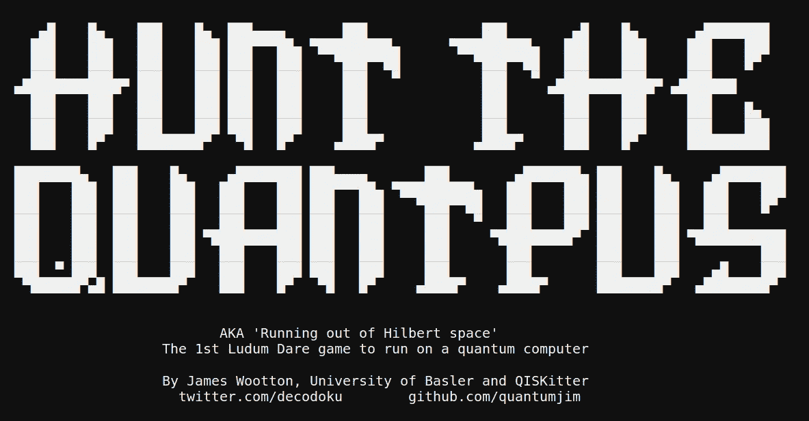
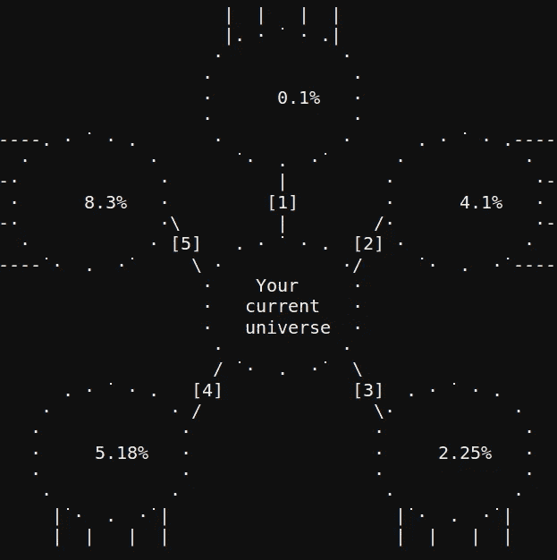

# 量子计算机上的游戏干扰

> 原文：<https://medium.com/hackernoon/game-jamming-on-a-quantum-computer-36a13723a454>

有了[量子计算机](https://hackernoon.com/tagged/quantum-computer)，你可以做很多事情。瞎折腾，做点好玩的事就是其中之一。

过去几年，我一直是量子计算机的主要误用者之一。在我的项目中有[简单游戏](/@decodoku/the-history-of-games-for-quantum-computers-a1de98859b5a)和[笑脸的量子叠加](/qiskit/making-a-quantum-computer-smile-cee86a6fc1de)。其他人也做过类似的事情，包括[量子音乐](https://soundcloud.com/alexiskirke/alexis-kirke-talks-quantum-on-futureproofing-bbc-radio-4)。他们一起展示了使用这种新技术进行创新的许多方法。

所以我有了一个主意。我会把这些项目的量子核心提取出来，用 Python 抽象成一个简单的类或函数。这套工具将允许更多的人进行更具创造性的量子项目，而无需担心设备本身的编程技术。它可以为量子新手提供一种简单的方式来为黑客马拉松和游戏堵塞做量子事情。

我喜欢这个想法，并且想了很多。这是一个值得考虑的好主意。不过，实际上我并没有做任何事情。我需要一些东西来激励我。我需要一个期限。所以我致力于为 Ludum Dare 42 游戏大会制作第一个量子游戏。

在游戏卡壳的前一天，我很快从我最初的几个量子游戏中拼凑了一些基本工具。这个项目终于开始了！github repo 已经制作完成，并且包含了比 README 更多的内容。

然后我只需要等待果酱的主题被揭示。随着午夜钟声的敲响，星期五变成了星期六，它来了。

我想不出用我现有的任何量子工具来制作一个“耗尽空间”游戏的方法，所以我需要一些新的东西。

当想到“空间”这个词时，我的脑海里很快就联想到了“希尔伯特空间”。这是量子计算机中量子位的可能状态空间。通常我们开始时所有的量子位都被设置为`0`。因此，如果我们有 5 个量子位，我们将从状态`000000`开始。这只是希尔伯特空间中的一个点。

然后，一个简短的量子程序可以开始探索附近的状态，比如只有一个比特不同的状态:`0001`、`0010`、`00100,`等。这些状态，以及我们可以创造的所有量子叠加态，在希尔伯特空间中形成了一个小区域。然后，随着我们的程序越来越长，我们创造了更多的可能状态，慢慢地探索越来越多的希尔伯特空间。

这基本上与 Ludum Dare 42 的主题完全相反。我们应该耗尽空间，而不是扩张！所以让我们反向运行我们的程序。从能创造疯狂复杂的量子态的东西开始，然后从它的结尾删掉几行量子代码。继续这样做，我们程序的输出将描述一个慢慢缩小的希尔伯特空间区域。

这是基本的量子理论。现在如何把它做成游戏。对我来说，这很自然地适合于像*亨特·温普斯*这样的事情。这是类似于*塞尔达传说*的游戏的早期前身，在那里玩家探索一个迷宫，试图找到一个怪物，同时避免危险。用 *Hunt 的 Wumpus* ，都是基于命令行的文本。这也很适合我，因为我没有足够的时间在图形方面做太多。

现在开始叙述。量子力学以有点古怪而闻名，对于正在发生的事情有很多解释。一个流行的解释是[多世界解释](https://en.wikipedia.org/wiki/Many-worlds_interpretation)，它基本上陈述了量子叠加应该被认为是平行宇宙。

我自己并不相信这种解释，但科幻一次又一次地表明，它有利于故事情节的发展。所以我们会说，我们开始的大而复杂的量子态代表了一个多元宇宙。随着用来创建它的程序被撤销，这个多元宇宙慢慢地自我瓦解。如果任其发展下去，将只剩下一个宇宙。

玩家的工作就是拯救多元宇宙！他们必须在相邻的宇宙间跳跃，避开已经坍塌的宇宙，并试图找到问题的原因:量子粒子。一旦他们找到了，一切都有救了。

带着这个基本的想法，我创作了这个游戏(实际上我是在制作游戏的时候想出这个主意的，结果出现了死胡同和意大利面代码。但是现实并不总是一个好的故事。)所需的量子程序，在我的创意包里被写成了新工具。像所有其他的一样，它是使用 quantum SDK 编写的

然后，我在 IBM 的一个真正的量子设备原型上运行了许多不同的量子程序实例。这些运行的数据被保存下来，以便可以在游戏中使用，给玩家在真正的量子计算机上玩游戏的真实体验，而无需他们费心设置连接。程序的其余部分只是普通计算机的普通 Python，处理所有的输入和输出，胜利和失败。

最终产品仍然相当原始和有缺陷，但有一个游戏在那里的某个地方。这是一个在量子计算机上运行的游戏。我很自信地说卢顿·戴尔以前从未有过这样的经历。如果你想玩它，请点击这里的。