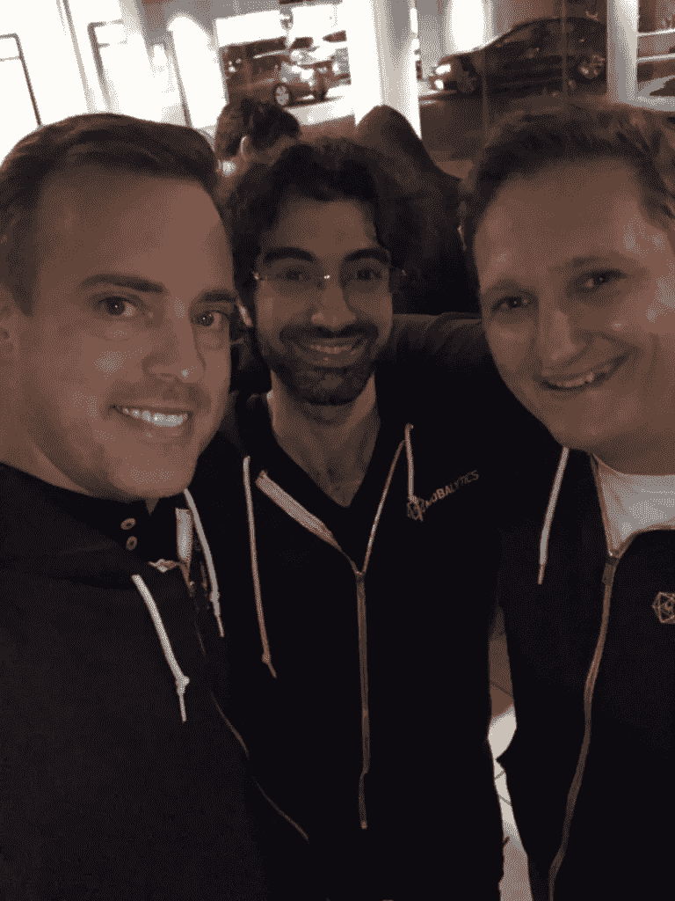

# 游戏之夜——与我们的创始人及其团队共度的美好时光

> 原文：<https://medium.com/hackernoon/game-night-quality-time-with-our-founders-and-their-team-7c6791666a23>

这些天我越来越多地去洛杉矶，因为我们的投资组合似乎在那里增长最快。这是由于几个因素，包括我们对电子竞技的关注。

几乎每次出差，我都会和我们投资公司的创始人和一些团队成员在“[游戏之夜](https://hackernoon.com/tagged/game-night)度过至少一个晚上。Mobalytics 是一家玩家表现分析公司，通过玩家表现指数分析你的游戏表现，并提供反馈以帮助你提高，从而帮助人们提高视频游戏水平。

Left to Right: Stephen Hays, Amine Issa, Bogdan Suchyk

具有讽刺意味的是，我们花了这么多时间专注于帮助游戏玩家提高视频游戏水平的技术，然后每月一次我们聚集在他们的办公室参加游戏之夜，通常包括旧的学校卡片和棋盘游戏。

通常，游戏之夜从一个卡牌游戏开始，如[阿瓦隆](https://boardgamegeek.com/boardgame/128882/resistance-avalon)或[狼人](https://boardgamegeek.com/boardgame/147949/one-night-ultimate-werewolf)(你们作为一个团队玩，每场游戏持续 5-10 分钟)，然后进展到一个游戏，如[电网](https://boardgamegeek.com/boardgame/2651/power-grid)(6 个人玩大约 3-4 小时)。

通常游戏之夜从晚上 7 点或 8 点开始，至少到凌晨 2 点，有时晚至凌晨 4 点或 5 点。我无法告诉你这个团队有多聪明、有竞争力、有凝聚力，这对我有多重要。看到队友之间，甚至与他们的投资者之间的竞争是多么有趣。我非常感激不仅与创始人，而且与他们的许多团队成员有如此良好的关系。

我也喜欢从数字游戏(电脑、游戏机等)中休息一下。)和做一些需要亲自，老派，面对面互动的事情。

我需要开始与投资组合中的其他团队共度游戏之夜。这是一个谈论任何事情的好时机，可以同时谈论任何事情和任何事情。我们在生意上、生活上、无所事事地叙旧，我们只是聚在一起做我们都喜欢的事情，那就是一起玩游戏。当你玩游戏和互相竞争时，你会学到很多关于人的东西。

Stephen Hays 是位于德克萨斯州达拉斯的风险投资公司 [Deep Space Ventures](http://deepspacevc.com/) 的管理合伙人，该公司专注于电子竞技和 B2B 企业创业。

[点击这里在 Twitter 上关注斯蒂芬](https://twitter.com/hazesyah)

[点击这里阅读更多关于深空冒险的信息](http://deepspacevc.com/)