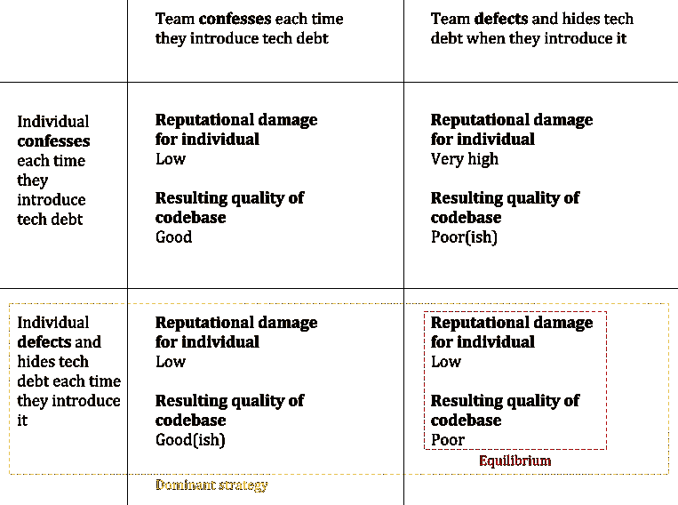

# 技术债务和囚徒困境——或者博弈论如何影响你的软件团队的成功

> 原文：<https://medium.com/hackernoon/game-theoretical-reasons-software-projects-fail-the-prisoners-dilemma-reputational-damage-and-4129c6bdf0eb>

Four software engineers lined up for the crime of missed deadlines and a poorly functioning product. Who is to blame? It’s all of them, but not for the reason you think (and they had little choice in the matter…)

Johnny 是一名出色的开发人员。他非常关心自己的技术，并认为尽可能写出最好的代码是他的道德责任。他对自己的基本语言了如指掌，总是试图研究和遵循最佳实践，并在晚上阅读技术书籍来扩展自己的知识。

但是约翰尼有一个问题。上周，他一直在为他供职的科技初创公司 Drivl 开发一个大型软件系统的一个小组件。当他在冲刺开始时提出这个解决方案时，他认为这个方案确实非常聪明，但是他现在才意识到他可能错了。一阵焦虑沿着他的脊椎流下，他感到手掌开始微微出汗。Johnny 已经注意到他的技术方法中的一个缺陷，如果包含在下周的发布中，它不会立即引起问题，但是他知道如果代码继续运行，从长远来看，它将导致他的团队的性能下降和可维护性问题。他停下打字，皱起眉头，开始沉思。

“冲刺将在明天晚上结束”，他想。“但我知道我至少还需要几天的时间来重构代码，使之更可行。”

他有一个选择。他的第一个选择是承认自己错了，然而这将推迟发布，并且不可避免地损害他和他的团队在公司内的声誉。这将不得不向更高层的人解释，他们不太可能理解，因为这个问题确实是相当技术性的。这个团队已经错过了几个截止日期，他们最不需要的就是再次玷污他们的名声。

另一种选择是保持沉默，让代码部署，并允许罐子被踢开。

“我想我别无选择”，他心想。"我会努力确保在下一次冲刺中有时间解决这个问题."不幸的是，不管出于什么原因，这种情况从未发生过…

在故事中，约翰尼没有意识到的是，他是经典博弈论问题“囚徒困境”迭代中的“囚徒”。

## 什么是‘囚徒困境’？

> 囚徒困境是决策分析中的一个悖论，在这个悖论中，两个为了自身利益而行动的个体追求一个不会导致理想结果的行动过程。典型的囚徒困境是这样建立的，双方都选择牺牲对方来保护自己。由于遵循一个纯粹的逻辑思维过程，两个参与者都发现自己处于一个比他们在决策过程中相互合作更糟糕的状态。
> 
> [**Investopedia.com**](https://www.investopedia.com/terms/p/prisoners-dilemma.asp)

**囚徒困境倾向于在日常生活中，在各种宏观和微观尺度上大量出现。这就是为什么[单边核裁军很难](http://www.baselpeaceoffice.org/sites/default/files/imce/articles/News/nuclear_prisoners_dillemma.pdf)的原因，为什么[吸血蝙蝠进行互惠的食物交换](https://en.wikipedia.org/wiki/Prisoner%27s_dilemma#In_animals)的原因，也是为什么当英国下了一天半的雪，[的商店在没有特别好的理由的情况下就完全卖完了面包。](https://www.express.co.uk/news/weather/925310/UK-snow-weather-forecast-panic-buying-supermarket-food)**

**囚徒困境的“纯”例子如下:**

> **两名犯罪团伙成员被捕入狱。每个囚犯都被单独监禁，无法与他人交流。检察官缺乏足够的证据来判定这两个人的主要罪名成立。他们希望以较轻的罪名判处两人一年监禁。同时，检察官向每个囚犯提出了一个交易。每个囚犯都有机会要么通过证明对方犯了罪来背叛对方，要么通过保持沉默来与对方合作。报价是:**
> 
> **如果 A 和 B 都背叛了对方，他们每个人都要在监狱里服刑 2 年**
> 
> **如果 A 背叛了 B，但 B 保持沉默，A 将被释放，B 将在监狱服刑 3 年(反之亦然)**
> 
> **如果 A 和 B 都保持沉默，他们都将只服刑 1 年(以较轻的罪名)**
> 
> **[**Wikipedia.com**](https://en.wikipedia.org/wiki/Prisoner's_dilemma)**

**因为背叛提供了比合作更大的回报，而合作又有被对方背叛的风险，所以两个纯粹理性的行动者总是会背叛对方。**

**认识到这个困境的最重要的事实是，人们是被体制的逻辑*强迫叛逃的，而不是出于任何不良意图。如果他们想把损失降到最低，他们就必须背叛，因为错误的合作尝试会让他们付出更大的代价。***

**同样的困境也可能出现在两人以上的群体中，就像我上面故事中约翰尼的情况一样。这就是所谓的“n 人囚徒困境”。**

**在 Johnny 的故事中，合作采取的形式是围绕技术债务的透明，并尽早向同事提出，以便它是可见的，并可以立即或战略性地得到解决。叛逃涉及到个人隐藏技术债务，并且由于按时交付的压力以及将无能与迭代解决问题的需求错误地等同起来，而继续工作，就好像技术债务不存在一样。**

**不幸的是，在多次迭代之后，如果技术债务被引入并且没有被修复，那么代码库的问题将不可避免地堆积到不可管理的水平，即使这不是任何人所希望的。**

**约翰尼受制于一套特定的规则，他必须以一种对他的环境最不反感的方式来“策划”他的方式。在一个因承认技术债务而招致声誉受损的环境中，叛逃符合他的利益。事实上，对约翰尼来说，这是一种‘优势策略’。**

## **主导策略**

**在博弈论中,“优势策略”是指一个策略的结果对单个玩家来说是相等或更好的，不管其他玩家使用什么策略。囚徒困境的一个显著特征是，当每个人都参与时，个体参与者的优势策略会导致对每个人都不利的结果。**

**为了说明这一点在 Johnny 的案例中是如何应用的，下面的决策矩阵显示了根据所采取的策略，个人与团队的收益和结果代码库质量的表示。惩罚的目的是在一个工作环境中具有代表性，当个人在代码库中犯下技术债务时，会造成声誉损害(这可能采取多种形式，例如，指责不称职，或因导致团队错过截止日期而感到羞愧)。**

****

**在图中，背叛(不承认技术债务)在所有情况下对个人来说几乎没有惩罚*，而承认技术债务有时会带来很高的惩罚，并且从来没有比不承认更好的奖励。理性的行动者总是会在他们存在的地方使用他们的优势策略，在这种情况下，个人的优势策略在最下面一行。由此产生的平衡是右下角的方块:质量差的代码库。***

## *****我们就不能呆在左下角的盒子里吗？*****

***从技术上来说，如果团队设法停留在类似左下角方框的情况下，事情就不会太糟(大多数人不承认引入了技术债务，但有时可能有几个人仍然承认)。然而，这种立场是不稳定的，因为一旦有足够多的人注意到偶尔的背叛，他们就会开始想为什么他们应该坦白并接受名誉损害，而其他人显然没有，这种情况很快就会演变成接近右下角的情况。***

## *****这个困境不能通过雇佣**有“英雄心态”**或更多“技能”的团队成员来解决*****

***你可能会找到一些“英雄”，他们愿意把自己的利益放在一边，承认他们认为在任何情况下都需要解决的技术债务。然而，这对他们来说是有压力的，并且从长期来看是不可持续的。如果“英雄们”意识到他们的努力是徒劳的，尽管名誉受损，但文化变革仍遥遥无期，他们可能会跳槽。***

***团队的技能也是不相关的，因为有很多完全不可逾越的原因，为什么即使是一个熟练的团队成员也可能向一个非技术涉众引入与错误没有区别的技术债务。仅举几个例子:***

*   ***过去的设计和未来的需求不匹配，导致旧的技术解决方案变得不适用，团队成员不得不寻找不完美的变通解决方案***
*   ***一项技术选择的几乎不可预见的边缘情况限制只有在所有东西都已部署到生产环境并处于负载状态之后才会被发现***
*   ***被审查的问题具有深远的性能影响，只有在工作进行的时候才知道***
*   ***在最后一分钟才知道的需求增加，碰巧从技术的角度显著地改变了在已经在积极开发的系统上解决问题的方式***
*   ***团队成员犯了一个真正的、非故意的错误，我们有时都会这样***

# ***解决困境***

***你的公司的文化和流程可以被认为是一个游戏的一套规则，它会影响单个玩家(员工)所采取的策略。***

## ***改变游戏规则***

***对于业务和工程团队来说，最佳的结果是要么在技术债务出现时就解决它，要么使它变得透明，以便可以明智地管理它，并将其保持在一个合适的水平。为了实现这一点，该公司将不得不构建游戏规则，以确保个人玩家的主导策略是承认较差的技术决策。***

***实现这一点有两个逻辑选项:***

1.  ***让背叛的惩罚比合作的惩罚更严厉***
2.  ***防止因引入技术债务而损害声誉***

***不幸的是，解决方案 1 不太合理。叛逃惩罚只有在惩罚迅速、明显和准确的情况下才有效。这在软件工程文化中是不可能的，因为技术债务很容易隐藏，至少在最初是这样。通常，糟糕的技术决策甚至不会被做出决策的人所知，直到他们做出决策后的很长一段时间，并且通常很难确定是个人的选择。***

***解决方案 2 是最有可能成功的候选方案，尽管它仍然不容易。很可能大多数成功的软件工程文化都有某种程度的保护措施来防止声誉受损。***

***没有一个放之四海而皆准的方法来实现这一点，但这里有一些建议:***

*   ***确保公司文化和精神包含这样一种理念，即错误是打造优秀产品的一部分，是一种学习练习(快速失败和精益就是很好的例子)***
*   ***确保业务中的每个人都期望项目范围的变更是频繁的，并且每个人都期望由于过去和未来需求之间的不匹配，范围的变更将需要重构(这是一种技术债务)***
*   ***小心最后期限。在一个充满背叛的环境中，他们可以对迅速而明显地引起人们注意自己的错误进行惩罚，更清楚地定义单边合作的负面回报。确保组织中的每个人都预期强制执行硬性截止日期会导致技术债务，这些债务必须在事后得到承认和清理***
*   ***考虑在[特性切换](https://martinfowler.com/articles/feature-toggles.html)之后部署特性，这样，如果由于需要重新制定技术决策而导致特性没有准备好，它们就可以被排除在发布之外***
*   ***如果你已经处在一个充满背叛的环境中，放松对截止日期的执行，直到每个人都“合作”***

## ***心理**安全**是关键***

***我在这里的论点与 google re:work 对 180 个团队的两年研究结果并不矛盾，该研究发现[成功团队最重要的文化属性是“心理安全”](https://rework.withgoogle.com/blog/five-keys-to-a-successful-google-team/)。***

***谷歌将一个团队定义为“当团队成员感到冒险是安全的，在彼此面前是脆弱的”时，这个团队在心理上是安全的。用他们的话说:***

> ***事实证明，我们都不愿意参与可能会对他人如何看待我们的能力、意识和积极性产生负面影响的行为。虽然这种自我保护是职场中的自然策略，但对有效的团队合作是不利的。另一方面，团队成员之间越安全，他们就越有可能承认错误，合作，并承担新的角色。它几乎影响了我们为员工考虑的每一个重要方面。***
> 
> *****谷歌人力运营分析师 Julia Rozovsky*****

## ***充满希望的理由***

> ***事实上，尽管简单的“理性”利己行为模型预测到了这一点，但在这个游戏和类似的游戏中，人类表现出对合作行为的系统性偏好。***
> 
> ***[Wikipedia.com](https://en.wikipedia.org/wiki/Prisoner%27s_dilemma)***

***当理性行动者采取最佳策略时，囚徒困境就会出现。然而，人不是理性的行动者。有时，当我们面临囚徒困境时，我们可能会受人性的驱使，善意地做出违背自身利益的行为。可以想象，这可能意味着，即使是最糟糕的职场囚徒困境也有希望扭转。人们并不真的想成为自私的懦夫，如果有机会的话，他们会努力不去做。只是有时候他们面对的回报太差了，他们觉得自己做不到。***

***这里关键的一点是，你应该小心你的过程中意想不到的游戏理论副作用，因为如果你让善意的人遵循一套规则，他们自我保护的最佳策略会给所有人带来不好的结果，他们可能会让你非常头疼。通常情况下，没有人希望出现这种糟糕的结果，所以改变游戏规则，事情不一定会这样。***