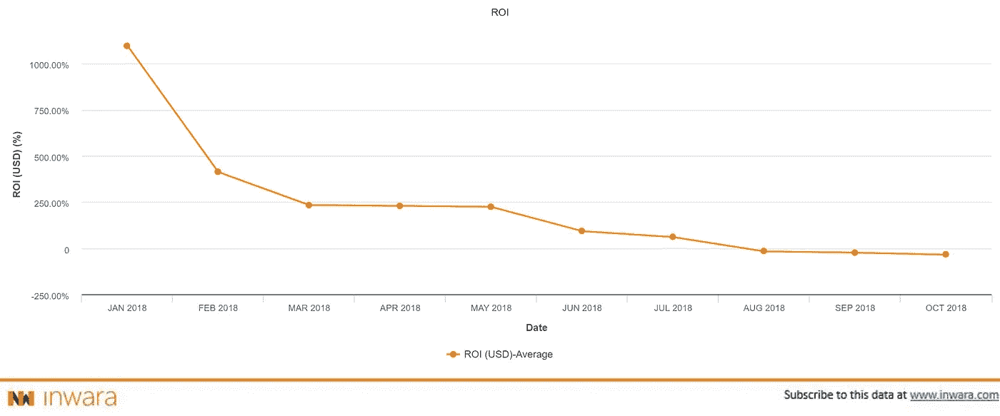

# 游戏 ico，2019 年蓄势待发？

> 原文：<https://medium.com/hackernoon/gaming-icos-poised-for-growth-in-2019-complete-synopsis-gaming-sector-icos-analysis-28f5d317023d>

## 年初至今的融资趋势和业绩

[*免责声明*](https://www.inwara.com/disclaimer) *:文章灵感来自* [*InWara*](http://www.inwara.com/?utm_source=stohackernoon&utm_medium=stohackernoon&utm_campaign=stohackernoon) *。这不是财务建议。*

根据 Statista.com 的数据，游戏行业预计将从 2017 年的 1089 亿美元增长到 2020 年的 1285 亿美元。采用水平不断提高，就 ico 数量而言，该行业已跃升至第 5 位。尽管如此，许多已经在游戏产业中采用区块链的项目，正面临着挑战。

# 就 ico 数量而言，游戏行业在 2018 年第三季度跃升至第五位

尽管总体放缓，但从 2018 年 Q2 到 2018 年第三季度，游戏行业的 ico 数量有所增长。在 Q2，游戏已经从第一名上升到第五名，排在第十名。

Source: [InWara’s Q3 report](https://www.inwara.com/report/quarterly?utm_source=gaminghackernoon&utm_medium=gaminghackernoon&utm_campaign=gaminghackernoon)

# 地理展望

[Source: InWara’s ICO database](https://www.inwara.com/?utm_source=gaminghackernoon&utm_medium=gaminghackernoon&utm_campaign=gaminghackernoon)

## 美国保持领先地位

游戏 ico 在美国受到了一些严重的影响，仅 Refereum 在 2018 年的主要销售中就筹集了 3300 万美元。就 ico 总数的百分比而言，美国占据了游戏领域的 23%。

## 中国:第二次挑战

尽管有传言称中国正在打击新生的加密市场，但游戏行业的 ico 已经在中国成功筹集了 5300 万美元。

## 爱沙尼亚:意外进入前五名

令人惊讶的是，爱沙尼亚不仅吸引了风险资本家，还吸引了个人投资者，成功关闭了游戏行业的 7 个 ico，跻身前 5 名。

# 这一领域的活跃风投

## [桥连资本](http://bridgelink.capital)

Bridgelink Capital 是一家总部位于英国的投资公司，专注于优质的早期创业投资，是全球领先的投资公司

## [Genesia 风险投资公司](http://en.genesiaventures.com/)

Genesia Ventures，Inc .是一家总部位于日本的风险投资公司，专注于种子期到前期系列阶段的投资。

## [冬季资本](http://wintercapital.com/)

Winter Capital 是一家私募股权和风险投资公司，主要在俄罗斯和欧洲开展创业和增长资本投资。

## [阻止 VC](https://blockvcfund.com/)

BlockVC 是领先的区块链和数字资产管理公司之一，专注于与区块链技术相关的项目、代币和风险投资。

## [8 位十进制大写](https://www.bloomberg.com/profiles/companies/1629358D:US-8-decimal-capital)

8 Decimal Capital 是一家专注于美国的风险资本投资公司。

# 博彩业面临的挑战

> 创建令牌很容易。列出它是一个挑战

[Source: InWara’s ICO database](https://www.inwara.com/?utm_source=gaminghackernoon&utm_medium=gaminghackernoon&utm_campaign=gaminghackernoon)

上市一直是对该行业产生不利影响的主要挑战之一。2017 年，游戏行业的上市率为 33%，2018 年降至 30%。

尽管这一利率好于医疗保健等其它行业，但对个人投资者而言，这仍是一个不利的兆头，流动性仍是主要担忧。

然而，这些代币作为赌场代币的潜在用途可以缓解压力，如果采用的话。

# 投资回报:博彩业的回报并不乐观

[Source: InWara’s ICO database](https://www.inwara.com/?utm_source=gaminghackernoon&utm_medium=gaminghackernoon&utm_campaign=gaminghackernoon)

虽然就 ico 数量而言，游戏行业是成功的，但游戏行业 ico 的回报并不好。36 个上市 ico 中只有 3 个实现了正 RoI，更糟糕的是，它们在 2018 年稳步下降。

游戏行业的平均投资回报率在 2018 年初创下历史新高后，稳步下滑。专家们一直押注于整个游戏行业的繁荣，从而推动该行业 ico 业绩的增长。

# 顶级筹款人-博彩业

[Source: InWara’s ICO database](https://www.inwara.com/?utm_source=gaminghackernoon&utm_medium=gaminghackernoon&utm_campaign=gaminghackernoon)

> 前五大 ico 筹集了该领域总资金的 60%以上

Game Credits 融资 1.06 亿美元，Mediarex Enterprise 融资 6500 万美元，均在 2017 年融资。有趣的是，这些融资大多来自区块链/数字资产累积者，而不是特定的风投，因为虚拟货币在过去 10 年里一直是游戏的一部分。Refereum 是最成功的，2018 年筹集了 3300 万美元。

预计该部门将获得更高的社区支持。传统上，游戏玩家使用法定货币(即美元)购买游戏物品，预计这将有助于数字货币的采用。

# [游戏积分](https://gamecredits.com/)

GameCredits: Founded in 2014.

GameCredits 移动商店旨在成为一种替代选择，也是第一个围绕加密货币构建的商店，以解决更大的游戏行业中的问题。

经过与游戏行业领导者 Datcroft LTD .两年的发展，Game credits 即将完成第一家加密移动游戏商店的开发。MobileGo 令牌将用于移动平台的游戏化，并通过奖励激励玩家的忠诚度和参与度。

## [Mediarex 企业有限公司](https://www.chiliz.com/en/home/)

Mediarex Sports & Entertainment: Founded: 2012

Mediarex 运营着 ChiliZ，这是一个令牌化的投票平台，让粉丝能够对体育和电子竞技组织进行人群管理。

Mediarex Sports & Entertainment(S&E)总部位于马耳他的 Gzira，是一家游戏赛事、统计和排名公司。

# [金恩私人有限公司](https://enjincoin.io/)

Enjin: Founded: 2008

金恩是一个去中心化的游戏平台，旨在为游戏行业现存的问题提供一个解决方案。

金恩是 2009 年推出的游戏平台，总部位于新加坡。金恩为游戏玩家、开发者、部落首领、服务器所有者等提供社区管理服务(CMS)平台。他们有 250，000 个游戏社区，涵盖数千种游戏和 1，870 万注册游戏玩家。

# [REFEREUM](https://refereum.com/)

Refereum: Founded in 2017

RFR 公用事业产品令牌是以太坊区块链上的数字令牌，具有执行代码的能力，它将保存在数字钱包中。

Refereum，Inc .于 2017 年 9 月注册成立，其管理团队由游戏行业的专家组成。

# [DMarket](https://dmarket.com/about-us)

Dmarket: Founded in 2017

DMarket 旨在为每一位游戏玩家提供一个机会，让他们可以对每一种可能的游戏资产、物品、皮肤或其他游戏对象进行简单的一键式购买/出售、交换和评估。

位于区块链的市场 DMarket 帮助将所有游戏和平台连接在一起。

> 这些数据从何而来？
> 
> 为了利用 InWara 的数据，在这里安排一次[的免费专家参观](https://calendly.com/amathur)

## 要获得所有 ICO 和私人融资轮的详细投资分析，请访问 InWara 的 ICO 数据库和私人融资数据库

