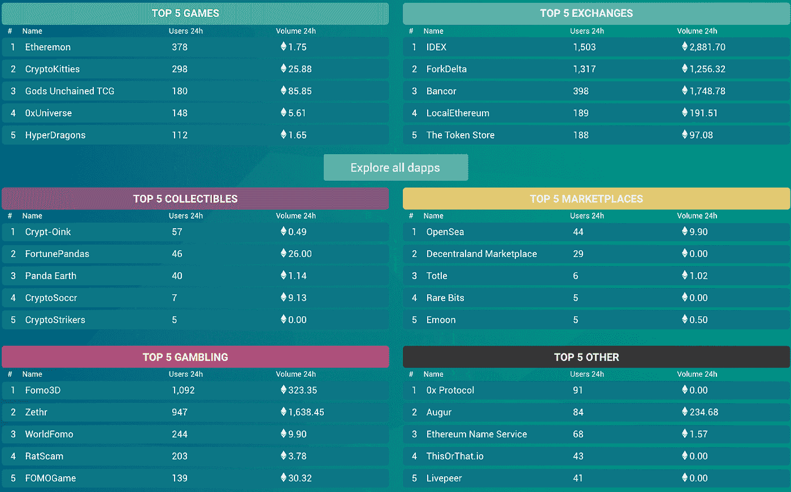
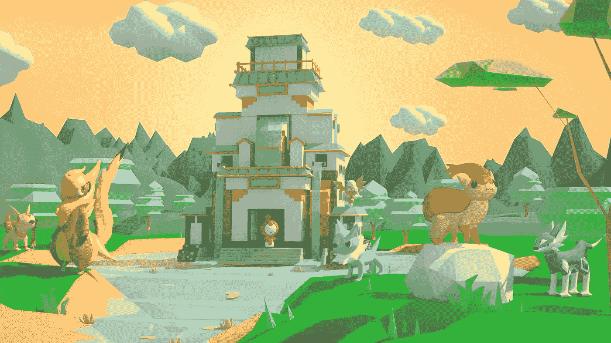
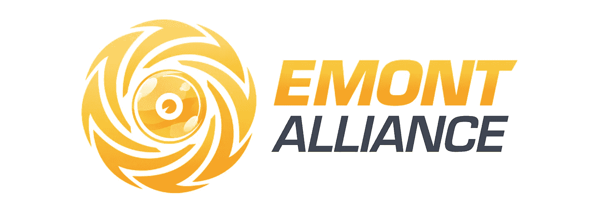

# 博彩业——区块链的早期采用者

> 原文：<https://medium.com/hackernoon/gaming-industry-the-early-adopter-of-blockchain-6732a1f4a990>

虽然区块链被宣传为自互联网以来最重要的发明，但它同样被批评为离下一个网络泡沫不远了。本文不会试图进一步分析或预测区块链的影响。我们将探索游戏行业如何接受这一新生技术，并给它一个机会。

对一个针对分散应用的列表和分析平台[*【DappRadar.com】*](https://dappradar.com/)的快速调查，将说明区块链游戏的延伸。**游戏是最受欢迎的三大类别之一:交流、赌博和游戏。**目前，已经有 350 款游戏被开发出来。尽管目前只有 100 款 dapp 游戏在运行，但每周都会有新的游戏发布。这显示了游戏开发社区对区块链参与度的飙升。

*Analytics board of decentralized applications by DappRadar*

CryptoKitties 是上市的最受欢迎的区块链游戏之一，最近在由 Union Square Ventures 和 Andreessen Horowitz 牵头的一轮融资中筹集了 1200 万英镑。

使用区块链的游戏应用的增长可能是由游戏行业对新技术的进步态度所驱动的。游戏近年来采用了[**虚拟现实、增强现实、人工智能**](https://mashable.com/2017/11/20/technology-evolves-gaming/#cocOHPjytOq9) **、** [**用户生成内容**](https://www.ft.com/content/7920e2ec-6cb3-11e8-92d3-6c13e5c92914) ，以及其他几种新颖的技术。至少有 15 亿玩家的 1150 亿美元的巨大市场*(2015 年欧空局**报告的 [*)需要不断增长。如此高的消费水平似乎推动了引入最新、最令人兴奋的技术来吸引玩家的努力。*](http://www.theesa.com/wp-content/uploads/2015/04/ESA-Essential-Facts-2015.pdf)*

*区块链是这一演变中合乎逻辑的下一步，因为玩家长期以来一直熟悉游戏世界中的虚拟货币和可替代物品。Steam 等分销平台允许用法定货币购买的信用来交换游戏资产。随着 [**玩家大量投资游戏内道具**](https://thinkgaming.com/app-sales-data/) **，**免费手游利润极高(2017 年带来了 [**整个行业 43%的收入)**](https://venturebeat.com/2017/11/28/newzoo-game-industry-growing-faster-than-expected-up-10-7-to-116-billion-2017/) **。***

*然而，这些平台存在重大安全漏洞，使数百万玩家面临重大经济损失。77000 个 Steam 账号*(来源:* [*商业内幕*](https://www.gamespot.com/articles/77000-steam-accounts-hacked-every-month-new-securi/1100-6433003/) *)* 每月被黑，目前的解决方案是脆弱的 2 因子识别。同时，在游戏中还没有一个有效的奖励系统。这些都是区块链证明有效的领域。*

*当游戏资产与加密货币交易时，智能合约可以实现更好的安全性。游戏还可以用小额加密代币奖励用户，通过这些代币，游戏设计者可以强化理想玩家的行为，提高参与度。这样的功能已经在几个区块链游戏中实现了。 [**以太怪兽**](https://www.etheremon.com/) ，一个建立在以太坊网络上的数字怪兽世界，允许用户交易 ERC-20 代币，用 ERC-721 代币 EMONT 奖励玩家。玩家可以使用这些奖励在游戏中进行再投资，或者交易 ETH 和法定货币，弥合线上和线下资产之间的差距。*

**

*[Etheremon](https://www.etheremon.com/) Game on Decentraland (coming soon)*

# *游戏开发者加入空间的时间到了，但如何加入呢？*

*尽管区块链有潜力给博彩业带来巨大影响，但它仍处于萌芽阶段，这为投资和增长留下了巨大机遇。一些项目已经凭借清晰的路线图、强大的合作伙伴关系和良好的社区支持脱颖而出。*

*除了前面提到的 CryptoKitties，分散地是另一个突出的项目，在 2017 年获得了 ICO 的 2400 万美元。与 Zilliqa 和分散之地密切合作开发的 Etheremon 成为最活跃的玩家之一，并在建立新的游戏模式和 Etheremon 的 VR 世界方面取得了令人印象深刻的进展。*

*为了抓住这个机会，加入区块链游戏的先锋行列，开发者应该利用现有的资源并相互合作。 [**EMONT 联盟**](http://emontalliance.com/) 主动为区块链游戏社区提供 SDK 和营销资源:*

**

*   *在 EMONT Alliance 的帮助下，工作室可以快速部署区块链游戏，以建立智能合同。*
*   *EMONT Alliance 的营销资源，包括社区、营销渠道、合作伙伴，可以用来扩大受众范围。*
*   *EMONT 是为 EMONT 联盟中的 Etheremon 等游戏设计的令牌。由于 EMONT 将分发给联盟成员，游戏工作室也可以雇佣 EMONT 作为奖励来吸引玩家。*

*干杯，*

*以太精灵
埃蒙特联盟的成员*