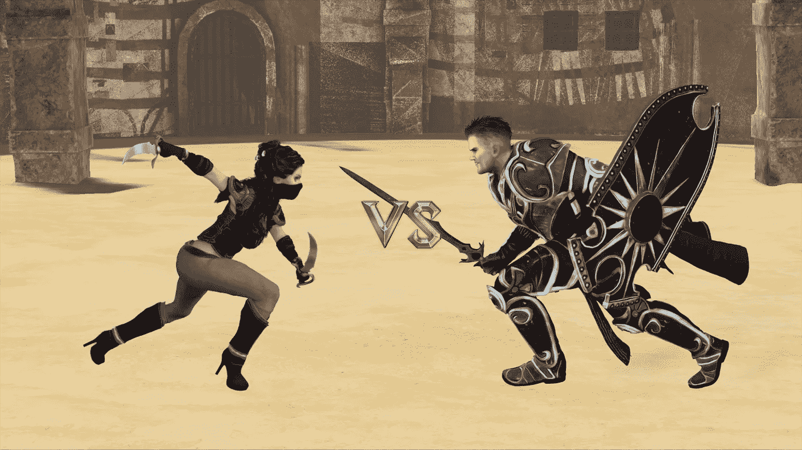
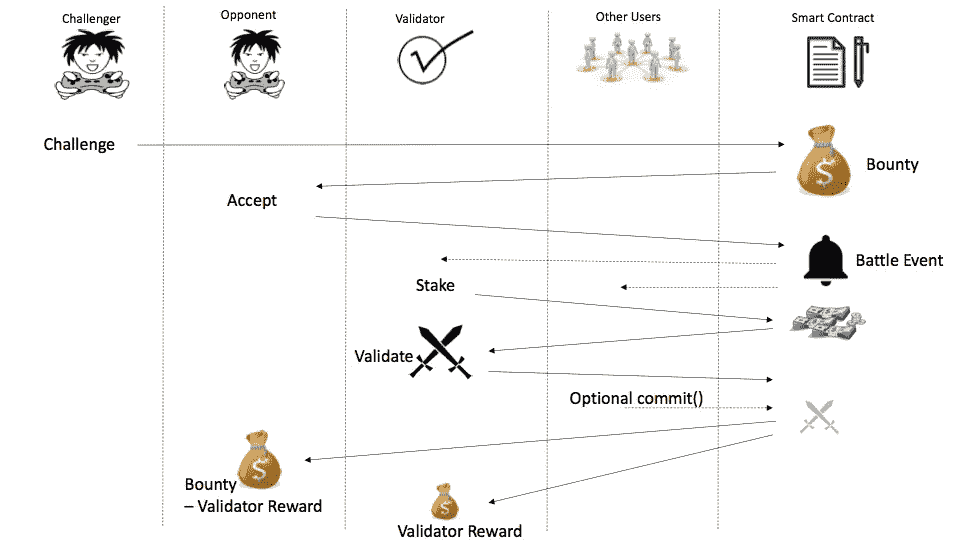

# 区块链游戏——让它发挥作用

> 原文：<https://medium.com/hackernoon/gaming-on-the-blockchain-making-it-work-c060ba105566>

# 密码游戏很难

在之前的[文章](/cryptofights/cryptofights-io-the-future-of-gaming-on-the-blockchain-dffb1965b251)中，我们支持加密游戏。出于各种原因，[区块链](https://hackernoon.com/tagged/blockchain)是托管游戏的理想之选，包括以代币形式表示可替代和不可替代资产很容易。这些可以是游戏角色和其他数字资产，例如，3D 角色扮演英雄和物品，如[中的武器和盔甲](https://cryptofights.io/)。在区块链玩游戏的另一个原因是底层平台的分散和透明性质，这有可能在公平和公开的过程中转变游戏。

然而，正如我们已经指出的那样，大多数加密游戏都不能满足这些期望，它们只不过是赌博或收藏品交易网站。那么，为什么密码游戏至今未能成功呢？答案很简单:在今天的区块链技术上，实现一个令人兴奋的游戏实际上非常困难。

# 限制

有几个限制因素使得很难实现玩家希望看到的交互体验类型:

*   **交易速度:**交易需要一段时间来处理。在以太坊上，平均阻塞时间大约是 15 秒。这意味着任何需要在区块链上改变状态的操作都会有严重的响应延迟，尤其是在网络拥塞的时候。
*   **缺乏熵**:大多数游戏需要某种形式的随机数生成**。**区块链是确定性的，因为所有事务必须在所有参与节点上计算相同的值。这使得寻找产生随机数的必要熵源变得非常困难。
*   **执行成本:**状态改变事务中的所有操作都有关联成本。这有助于保护区块链免受垃圾邮件和拒绝服务攻击。然而，这也意味着游戏玩家必须为这些互动付费。这很快就会累积起来，变得不切实际。

# 我们是如何让它工作的

为了以实用的方式在区块链上实现 CryptoFights，开发者采用了以下准则:

*   尽可能异步工作。这意味着除非不可避免，否则不要等待事务结果。游戏玩家不应该无所事事地等待事情发生。事实上，通常可以做些事情来缓解等待的过程，比如在适当的时候显示战斗指令或动画。
*   将每次战斗或游戏移动的交易数量降至最低。
*   最后，与前一点密切相关的是，开发人员试图用外链解决方案来发挥创造力。这意味着，只实现那些真正受益于区块链属性的游戏部分。

以上并不意味着 CryptoFights 放弃分散。相反，借用基本算法的关键区块链原语，使用底层智能合约作为结算层，来实现公平且可验证的链外解决方案。

正如[之前发布的](/cryptofights/implementing-role-play-style-games-on-the-blockchain-308763f645a7)，CryptoFights 是 3D 英雄在竞技场中战斗，模仿传统的角色扮演游戏。同时，玩这个游戏有一个重要的战略方面，玩家也掷骰子来为战斗提供一定程度的随机性。同时，开发人员设计了[一种在链上可靠地产生随机性](/cryptofights/a-3-way-handshake-approach-to-blockchain-random-number-generation-337fb27b6389)的聪明方法，他们也设计了在链外公平且可验证地执行战斗的方法。

为了说明这一点，让我们讨论两个如何在链外实现战斗的例子。

# 股权战验证的证明

第一个解决方案基于在一些区块链中的**利益一致算法**中使用的相同概念，即，允许参与者下注他们的一些财富，以正确地离线执行战斗算法。任何人都可以验证结果，如果发现欺诈，验证者将损失赌注金额。如果验证被正确执行，验证者将被奖励。

其工作原理如下:CryptoFights 允许玩家在竞技场中为奖金而战。奖金以乙醚的形式支付给战斗的胜利者。因此，在那些游戏者决定为奖金而战的战斗中，我们可以激励第三方，该第三方希望作为执行战斗合同的奖金的一部分的验证者。

战斗算法是在一个*纯*函数中实现的，这在以太坊上意味着可以在一个无 gas 的本地节点调用中调用该函数。战斗算法的输入是一个随机数种子，用于决定骰子滚动的结果。 [future block 方法](https://blog.winsome.io/random-number-generation-on-winsome-io-future-blockhashes-fe44b1c61d35)用于提供所需的种子，这是随机数生成的唯一安全的无交易链上解决方案。

外部验证器使用以下步骤执行算法:

1.  通过发出挑战和下注来请求战斗。
2.  对手接受挑战。
3.  智能合约引发一个事件，通知潜在的验证者即将到来的战斗。
4.  第一个请求充当验证者的参与者被接受来执行这个角色。
5.  验证者在以太中下注预定百分比的战斗奖金
6.  验证器使用当前链上计算的随机数种子作为输入来执行无交易战斗契约。
7.  验证器将结果提交给区块链。
8.  发布一个事件来指示战斗验证。
9.  任何参与者都可以验证已经提交了正确的结果，并在检测到欺诈性验证的情况下强制结算。
10.  智能合约在暂停后结算战斗结果。
11.  战斗的获胜者将获得减去验证百分比的赌注。
12.  验证者百分比被支付给验证者或欺诈性验证的检测者。欺诈检测器也接收由验证器标记的以太。

Validator Staking

上述过程大大降低了战斗执行的气体成本，并改善了玩家的交互用户体验。

# 转弯证明

另一个在链外战斗中执行回合的选择是使用适应的状态通道方法，并使用区块链来解决和解决冲突。这可以通过以下步骤实现:

1.  每个用户在挑战/接受模式中选择一个 256 位随机数，我们已经[在前面描述过](/cryptofights/a-3-way-handshake-approach-to-blockchain-random-number-generation-337fb27b6389)。
2.  在游戏中，每个随机数被散列尽可能多的次数，从而为每个回合产生一个单独的种子。
3.  回合包括验证对手的前一回合，增加回合计数器，提供下一个随机数种子，并调用只读区块链函数，而不执行交易。这种状态转换提供了游戏逻辑，允许玩家更新他们的游戏状态。
4.  在每一回合结束时，玩家用他们的私人钥匙签署一条离线信息。这可以通过使用 [Metamask 的](https://metamask.io/)链外消息以一种用户友好的方式高效地实现。
5.  在战斗结束时，或者任何玩家想做的时候，战斗可以在链上的关卡中进行。
6.  玩家也可以通过调用争议函数来强制解决冲突，这将导致链上战斗验证。

使用上述算法，大多数战斗可以在三次交易中解决。

# 结论

**验证赌注**和**回合证明**只是游戏逻辑如何离线执行的两个例子，同时保留了区块链的关键透明属性。

对于密码游戏开发者来说，为了让区块链游戏在当前的技术下可行，创造性地使用离线解决方案是至关重要的。

一些加密功能的测试版已经开始运行。在 [cryptofights.io](https://cryptofights.io/) 报名。[竞技场](https://cryptofights.io/)见！