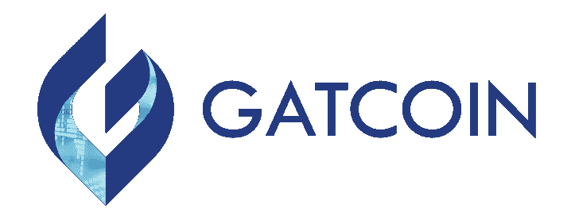

# GAT 币第一积分兑换平台

> 原文：<https://medium.com/hackernoon/gat-coin-the-first-exchange-platform-of-points-rewards-a5da5059de8d>

**重塑奖励计划**

普通消费者是 29 个不同忠诚度奖励计划的成员，但我们中 76%的人从未使用过这些计划带给我们的任何购物激励。对于 2017 年价值约 3200 亿美元的整个行业来说，这是大量浪费的资源。出现这种情况有很多原因，主要是基于奖励的非流动性。您不能将积分从一个忠诚度计划转移到另一个，也不能使用非指定品牌的优惠券。这意味着大多数奖励从未被使用，甚至可能被消费者视为垃圾邮件。GATCOIN 旨在创建一个平台来解决这些问题，同时也为商家和品牌提供强大的工具来分析和接触有吸引力的新客户。

GATCOIN 生态系统依靠两条腿，由参与商户发行的商户代币作为其奖励计划的代币，以及新的加密货币 GAT。GAT 是 GAT 市场上唯一有效的货币，在 GAT 市场上，商家代币可以用来交换商品和服务。GAT 钱包将保存您所有的商业代币，这些代币可以在 GAT 交易所进行买卖。在这里，你也可以用 GAT 交易其他主要的加密货币，比如比特币和以太坊。GAT 符合 ERC20 标准，并在以太坊区块链注册。

***硬币信息***

**对商家和用户的好处**

每个商家发行他们自己商家代币作为他们的忠诚度奖励计划。这些是智能合同，商家可以决定其特征，使其复制忠诚度积分、折扣券、礼券或预付现金卡。这些代币是在封闭网络中发行的，不是加密货币。这使得发行者可以跟踪代币的流通，并接收关于其客户行为的粒度数据。

通过允许商人代币在 GAT 交易所交易，他们被赋予了价值。折扣或忠诚度积分再也不会被认为是垃圾邮件，因为它们可以被用来交换 GAT，最终成为法定货币。被授予代币的消费者将意识到他们可以出售代币或者用代币交换他们需要的其他代币。同时，使用 GAT 从任何商家购买提供折扣或升级的代币的能力将有助于推动新客户的加入。

GATCOIN 还开发了一种特殊的 A-Drop 技术，目前正在申请专利，这种技术可以让商家根据地理位置、人口统计和消费习惯将特别优惠或折扣放入钱包。这使得商家可以瞄准更有可能购买的感兴趣的客户，并为他们提供适合他们口味的优惠。地理定位目标也将有助于将客户流量导向实体店。

通过跟踪商家代币收集的数据为商家提供了对其目标客户的消费行为的有价值的洞察，并允许他们开展活动以产生更多的参与。用户将获得更具吸引力的优惠，他们可以出售任何 GAT 不需要的代币。

**开发技术**

该系统需要能够处理数百万的微交易。目前没有分散的网络能够满足要求，因此 GAT 交换最初将作为一个集中的数据库启动。它稍后将迁移到一个分散的解决方案，以消除将令牌存储在第三方的信任要求。

通过在中央数据库上立即启动，GATCOIN 可以启动商家和用户的入职流程。他们可以用各种商家代币填充系统，并在 GAT 市场中建立商品和服务的供应。这也将允许 GATCOIN 开始从 5 个独立的收入来源赚钱。

1.发行各种类型的商业代币的费用

2.GAT 交易所的交易费用

3.应用内广告费用

4.出售 GAT 以换取法定货币的费用

5.提供 GATCOIN 分析的费用

生态系统中的所有交易都在 GAT 中完成。商人可以在 GAT 交易所以略高于当前市场价的价格用法定货币购买 GAT。

作为锚定客户，GATCOIN 正在与日本领先的社交礼品券分销商 COTOCO 合作，在 2018 年下半年推出首批数字代币。