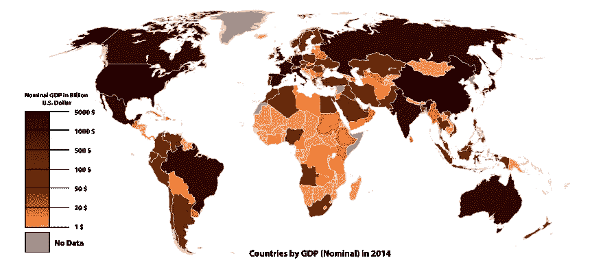
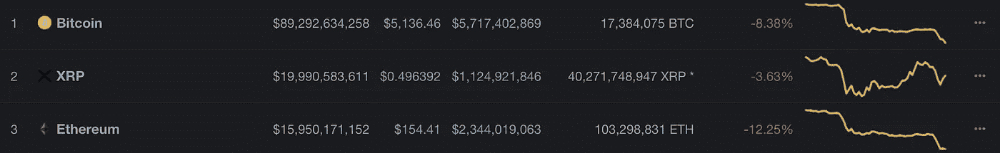

# GCP:加密产品总值

> 原文：<https://medium.com/hackernoon/gcp-gross-crypto-product-9d3e71d247da>

## crypto 创造的总体价值的最佳衡量标准是什么？

随着我们对密码学兴趣的加深，我们开始思考不同的密码价值主张。这适用于单个硬币或代币，例如，*加密工具 X* 的内在价值或估价是多少？

加密评估分析还扩展到更广泛的价值指标，如核心开发人员网络的实力、各种 2 级项目的开发状态、给定网络在正在进行的治理辩论中的姿态，等等。

随着分析从价值的表面指标(如价格)转向某些无形资产的估值(如区块链项目的知识产权)，人们会发现，如今的加密估值更像是艺术而非科学。

加密市场资本分析很少涉及正在审查的潜在加密项目，而更多涉及正在应用的加密经济方法的广度和/或局限性。

为了使加密估价更加稳健，**我们提议新兴领域*加密经济学*采用一种通过加密为当前全球经济增加的总价值的衡量标准:总加密产品(GCP)** 。

# **什么是总加密产品？**

作为一种经济措施，我们的概念总加密产品(GCP)是明确的国内生产总值(国内总产值)模型。

> **国内生产总值** ( **GDP** )是一个国家在给定时期(比如一个季度或一年)生产的最终商品和服务的货币价值——由最终用户购买。

将度量扩展到加密，这里有一个可能的定义:

> **总加密产品** ( **GCP** )是在给定时期(比如一个季度或一年)内，一个国家使用加密工具、网络和/或资产生产的最终商品和服务的货币价值，这些商品和服务由最终用户购买。

立刻，提议的度量标准会被攻击为过宽和/或过窄。除其他原因外，拟议的指标过于宽泛，因为全国范围的分析未能区分特定网络的附加值。因为信息网络在全球范围内产生最大价值，所以这一指标过于狭窄和分散；因此，逐个国家的 GCP 方法无法捕捉加密的真实全球经济影响。

这些批评很有道理。但它们并不是这一提议的秘密经济措施所独有的。国内生产总值的计量也存在同样的方法和经验问题。这就是为什么我们有名义国内生产总值(T18)、人均国内生产总值(T20)、购买力平价(T21)等指标，也是为什么我们有相互竞争的国内生产总值衡量方法。

A map of world economies by size of GDP (nominal) in USD, [*World Bank*](https://en.wikipedia.org/wiki/World_Bank) *(*2014) (Source: Wikipedia)

与 GDP 指标一样，我们预计会出现竞争性的 GCP 方法。我们对 GCP 的工作定义并不意味着先发制人或全面。我们需要其他定义和方法，并期待帮助开发它们。

例如，虽然我们在每个国家的基础上推进 GCP，我们这样做是作为一个启发式的装置；这就是传统上对 GDP 的定义。我们的分析表明，针对具体国家的方法可能有助于针对具体国家的政策审议和/或比较监管分析。但是，对于不同的分析需求，比如全球治理问题，更好的模型是可能的，也是可取的。

# 为什么有一个 GCP？

作为经济价值的衡量标准，GCP 有助于我们理解秘密经济活动的真实影响。这对许多正在进行的辩论很有用，例如:

*   环保主义者批评加密技术
*   正在进行的[密码监管辩论](/cryptolawreview/crypto-for-regulators-375ebd286451)
*   正在进行的[区块链治理](/cryptolawreview/blockchain-governance-105-international-law-3c7ebd025a43)辩论

我们需要更复杂的估值模型的核心原因是，与单个加密硬币或代币的市值挂钩的估值——甚至是总市值——无法充分反映加密经济的现实。以下是 2018 年 10 月 31 日来自 Coinmarketcap.com 的截图:

下面是 2018 年 11 月 19 日周一早上的截图:

下面是 2018 年 11 月 19 日周一晚上的截图:

原油价格模型表明，在这中间的三周里发生了一些事情，抹去了 300 多亿美元的总加密价值。然后，在 11 月 19 日，一些事情扰乱了 crypto 的价值主张，以至于 crypto 在早上和晚上之间又损失了 100 亿美元的市值。

发生了什么非常糟糕的事情吗？不完全是。秘密世界正处于其惯常的动荡的新闻周期中。这一时期的一些重大事件可以解释低迷的原因，如美国证券交易委员会宣布与基于以太坊的分散式交易所的创建者达成和解。此外，比特币现金(BCH)经历了一次硬分叉，将硬币一分为二。

在估值分类账的有利一面，克里斯蒂娜·拉加德(国际货币基金组织总裁)向 crypto 发出了[公开邀请，从本质上创建全球公私合作伙伴关系](https://www.imf.org/en/News/Articles/2018/11/13/sp111418-winds-of-change-the-case-for-new-digital-currency)。就加密新闻而言，这是一个令人鼓舞和合法化的发展。然而，如果我们看看价格行为，情况就完全不同了。

因此，更好的加密价值量化指标是可能的，也是迫切需要的。其中包括:

1.  **针对单个硬币的 GCP 指标**(包含市场价格的估值指标，但侧重于给定区块链上发生的活动的核心经济价值)
2.  **GCP 部门措施**(例如,( a)加密分散式云存储市场的商品和服务总价值；(b)在区块链“1 级”平台(如“加密操作系统”)市场中生产的商品和服务的总价值；(c)不同加密货币市场的估价(例如，加密贷款、[加密债务收集](/cryptolawreview/crypto-debt-collection-c3825a8588ca)等)等。)
3.  **GCP 地理测量**(例如，地区或州范围的评估，特别是针对严格地域监管的硬币使用案例，如在线赌博；这对于理解加密对经济发展的影响和潜力极其有用)
4.  **GCP 全球计量**(包括功能等同于[国民生产总值](https://www.investopedia.com/ask/answers/030415/what-functional-difference-between-gdp-and-gnp.asp)、*国民生产总值*的模型)；
5.  等等。

# GCP 测量示例

你可能会对此感到惊讶，但有几个现有的尝试来定义像总加密产品。目前，有非常宽泛的 GCP 措施，也有非常狭义的 GCP 措施。在考察了这两种方法之后，我们提出了一个平衡的中间路线。

## GCP:广义解释

最广泛的加密经济产出的概念来自经济航天局(ECSA)。ECSA 在它的工作中没有使用 GCP 这个词(据我们所知)，但是总的来说，GCP 正是经济学家们试图模仿的。(' *Econauts* ' *是经济航天局成员集体自称的*。)

ECSA 的秘密经济论点非常复杂，所以我们鼓励每个人在深入研究之前泡一大壶茶。但总的来说，关键的一点是，我们都受益于包容性的加密经济空间和远远超出价格的加密经济价值的衡量标准。

经济空间机构理论家开发和部署的关键见解是，加密价格是一个在给定时间内产生的经济价值的相当差的指标。对于理解不同加密工具的内在价值(潜在价值)而言，基于价格的分析也是一种非常糟糕的预测分析工具。

## GCP:狭义解释

“加密生产总值”一词也有更狭义的定义。在我们的研究中，我们发现该术语在 2017 年 8 月由一名密码交易员首次使用—*。*

*这是希罗自己的原话:*

> *在不声称有明确答案的情况下，使用不同的指标来衡量市值。相反，使用“总加密产品”。GCP 将通过每个时期创造多少财富来让我们理解加密是否是一个泡沫。GCP 的概念在于生产，生产来自于打桩、采矿等。以及这些硬币的生产价格。*
> 
> *试图找出硬币创造所创造的财富的来源，是要解决的核心问题。对于这一点，我们可以看出，基本成本来自于电费，以及设备成本。*

*Hirounsung 的见解非常高明。我们用它作为第一种 GCP 度量的基础:**单个硬币的 GCP 度量**。*

**Hirounsung* 的框架似乎专注于输入和输出的价值(如在给定加密工具的价格&其他指标中捕获的)。由 *hirounsung* 概述的模型说明了增加加密采矿投入成本和其他“硬币创造”投入的重要性这些指标当然适用于任何规模，但它们主要适用于基于矿业的区块链项目。*

*随着区块链空间越来越多地转向不同的利益证明(POS)和其他验证模型，GCP 措施将需要转移到硬币成本的其他估计(例如，可能是在 POS 环境中运行验证器节点所需的运营成本)。*

*Hirounsung 的框架是一个狭窄的框架，但它在特定的背景下是有用的，因为它是精确定制的。*

## *GCP:平台估值*

**GCP 平台估值*是上述 GCP 广义和狭义概念之间的另一条中间道路。这里的基本估价问题是:**在给定的时间段(2018 年)**内，比如说，以太坊网络上生产的商品和服务的总价值是多少？*

*价格理论家和市场原教旨主义者可以指出以太坊在给定时间点的市场资本总额(或在给定时间框架内平均，如一个季度或一年)。以上问题的一个答案是，以太坊网络的价值体现在以太坊的市场价格上。*

**

*将价格等同于价值的基本原理是,“市场”考虑了影响估价的各种物质和非物质、主观和客观、内在和外在因素。因此，今天以太坊大约 160 亿美元的市值已经考虑了法律风险(未偿和潜在负债)、市场风险、技术风险、监管风险等因素。*

> *也许加密价格已经抓住了链上动态和链外风险因素和市场现实的全部范围。但也许不是。*

*对于以太坊来说，一个明确将自己定位为加密基础层的加密平台——类似于其他萌芽加密项目的技术推动者或孵化器——替代估价模型似乎非常可取。*

*例如，在实际物质方面，meek @Littercoin 的经济价值似乎与以太坊的整体估值直接相关，meek @ litter coin 是一个基于以太坊的区块链奖，用于生成地理空间数据。其他数以千计的基于以太坊的代币方案也是如此，它们已经在全球范围内产生了价值。*

# *GCP 方法论的挑战*

*GCP 模特是一项大事业。幸运的是，由[平行产业](http://www.pllel.com/industries/)、[马特勒姆](https://hackernoon.com/mattereum-litepaper-pros-cons-8fdf2a4b007e)以及现在的[国际货币基金组织](https://www.imf.org/~/media/Files/Publications/SDN/2018/SDN1808.ashx)所做的分类工作，证明了 crypto 有许多聪明的头脑，有能力解决这种规模的问题。*

*我们注意到构建包含市场价格*和*的估值方法的困难，同时关注在给定区块链发生的活动的核心经济价值。**问什么是以太坊 GCP 类似于问什么是福特的 GCP** (汽车生产总值=给定年份使用福特汽车生产的商品和服务的总价值)。*

*但与福特的 GCP 相比，我们的直觉是，加密平台估值方法实际上可以基于[严格的量化数据](https://hackernoon.com/the-material-crypto-economy-1-of-2-ce48c9275756)。*

> *追踪福特汽车的各种使用方式本身就很困难。理解不同的——通常是相互竞争的——开发团队对以太坊的各种用途也很困难。*

*但是因为加密的全部目的是在可靠的可验证的账本上记录经济活动，所以像*以太坊 GCP* 这样的东西似乎比像*福特 GCP* 这样的东西更容易构建、提炼和优化。*

**

*Everyone knows Ford is a driver of economic growth. But nobody really knows how much growth is traceable directly to Ford. Public global blockchain projects are also drivers of economic growth, and nobody knows how much growth crypto is currently generating. While it is hard to measure crypto-economic impact, it is a lot easier than modeling the economic impact of Ford cars on the road. Crypto theorists should see the immense value of empirically-based pan-crypto, macrocrypto, and microcrypto economic analysis and Gross Crypto Product‘s place in that analysis.*

*最后，区块链法医/审计技术的进步表明，复杂的类似 GCP 的模型可能已经在使用中。如果是这样的话，我们希望这些模型的开发者将它们开放给公众讨论、同行评审和采用。*

# *总加密产品的下一步是什么？*

*我们希望密码理论家、经济学家和密码会计师(比如[梅根·克纳布](https://medium.com/u/8b5e69790042?source=post_page-----9d3e71d247da--------------------------------)的 [Veriledger](https://veriledger.io/) )参与到总密码产品的想法中来。*

*部署强大的评估方法的价值在于，它们让我们能够理解加密如何对全球经济的整体运行做出贡献。这种洞察力似乎是制定、颁布和/或采用任何全球监管或治理框架的先决条件。*

*[匆忙监管](/cryptolawreview/crypto-for-regulators-375ebd286451)而不停下来分析可能会大大削弱 crypto 的全部潜力。*