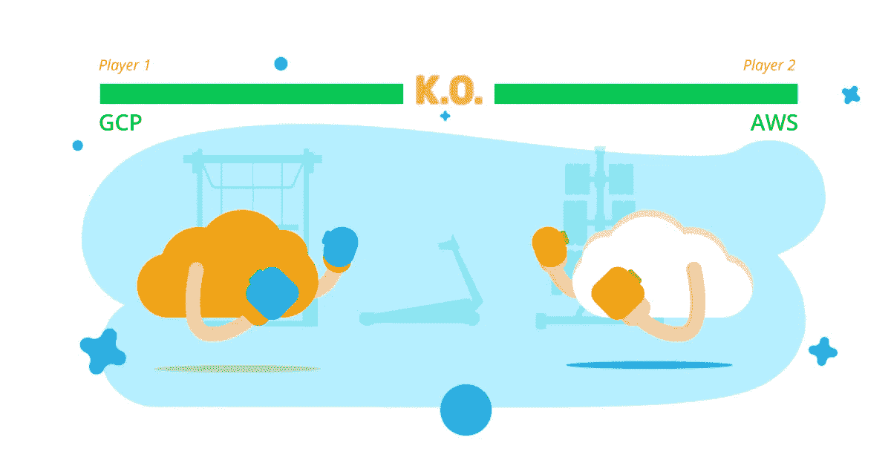
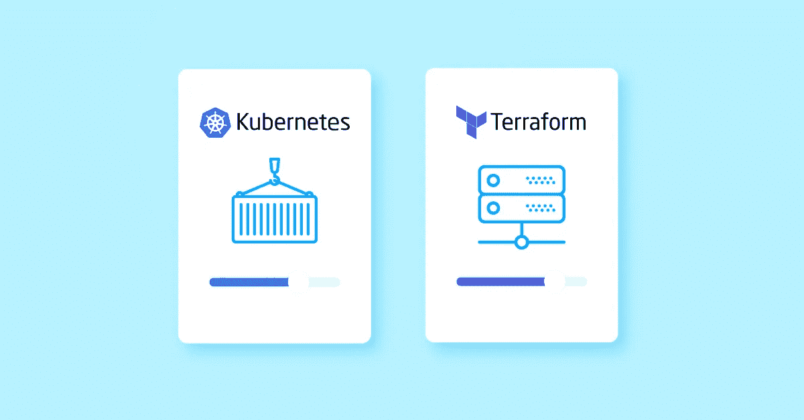

# GCP 与 Kubernetes 和 Terraform 哪个更好？

> 原文：<https://medium.com/hackernoon/gcp-vs-aws-which-is-better-for-using-with-kubernetes-or-terraform-d2176ec60cc6>

像 [Terraform](https://itsvit.com/blog/what-is-terraform-and-why-it-rocks/) 或 [Kubernetes](https://itsvit.com/blog/kubernetes-management-choose-start/) 这样方便的 DevOps 工程工具使得处理 dockerized 环境和管理配置变得更加简单，但是它们非常依赖 CSP 的特性。

我们实际上已经[比较了 AWS 和 GCP](https://itsvit.com/blog/news/aws-vs-gcp-cloud-service-provider-choose/) 的一系列参数，然而这种比较将这些平台使用的 DevOps 工具排除在外。您应该记住，您公司用于管理基础设施的解决方案应该能够与所选云服务提供商(CSP)的底层架构和功能完美交互。

然而，像 Terraform 和 Kubernetes 这样的 DevOps 解决方案在目的、特性和功能上有很大不同。 **Kubernetes 需要通过使用[内置 Docker 支持](https://itsvit.com/blog/docker-kubernetes-till-death-us-part/)来管理 Docker 容器**，而 **Terraform 帮助将数据中心基础设施编排为代码**，并允许使用简单的清单来管理它。

也就是说，这两个工具在 AWS 和 GCP 上都能很好地工作，但也有一些特殊之处:

*   由于 Kubernetes 最初是由谷歌开发的，GCP 对该工具有完全的本地支持。也就是说，利用 [Google Kubernetes 引擎](https://cloud.google.com/kubernetes-engine/)意味着大多数功能都是现成的，极大地简化和增强了容器化应用程序的部署、管理和扩展。将 Kubernetes 与 AWS 结合使用也是很有可能的，但这需要大量的手动配置。
*   AWS 提供了所有底层基础设施、API 和服务，因此有可能将 Terraform 发挥到最大效率。使用 Terraform 也可以非常有效地利用大多数 GCP 服务。

因此，真正的选择在于您需要执行的任务，以及平台特性能够在多大程度上补充您的 [DevOps 团队的技能集](https://itsvit.com/our-services/devops-service-provider/)和工具集，以实现您追求的目标。

此外，有许多现成的工具可以使用 IT Svit 的这两种 [DevOps 解决方案来完成各种任务。如果您在任何方面需要帮助，或者如果您需要为您的独特业务需求定制解决方案，请](https://itsvit.com/solutions/)[联系我们](https://itsvit.com/contacts/)，我们随时准备为您提供帮助！

*最初，我在我公司的博客上发布了这个故事—*[https://its vit . com/blog/GCP-vs-AWS-better-using-kubernetes-terraform/](https://itsvit.com/blog/gcp-vs-aws-better-using-kubernetes-terraform/)