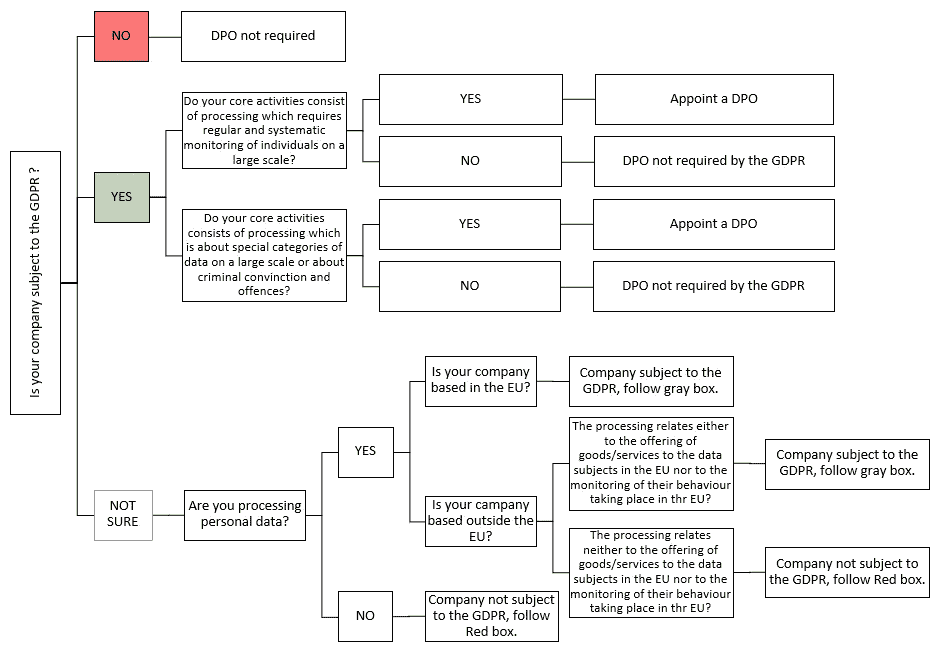

# GDPR:你准备好了吗？

> 原文：<https://medium.com/hackernoon/gdpr-are-you-prepared-3a9d64708dc7>

今年中东发生了许多变化，从油价上涨到最近增值税的实施。随着中东企业变得更加全球化，他们还必须了解外国的法律法规。《通用数据保护条例》( GDPR)是一项旨在协调全欧洲数据隐私法律的法规，旨在保护和授权所有欧盟公民的数据隐私，并重塑组织处理数据隐私的方式。GDPR 取代了 1995 年 10 月 24 日制定的控制数据处理的现行数据保护指令 95/46/ec。GDPR 提到的许多法规都可以在当前的立法中找到，但 GDPR 更加详细和准确，考虑到了快速发展的数字世界中给数据主体带来隐私风险的挑战。

这一新规最早于 2012 年 1 月提出，最终于 2014 年 3 月获得批准。欧盟已于 2016 年 4 月通过该法规，并将于 2018 年 5 月 25 日起实施。不合规可能会给公司带来巨额罚款和处罚。

**重要性**

随着技术进步和互联网的广泛使用，个人数据随处可见。这使得更新标准和法规以适应当今保护个人信息隐私的技术的需求日益增加。GDPR 很重要，因为它改善了对欧洲数据主体权利的保护，并阐明了处理个人数据的公司必须采取哪些措施来维护这些权利。

**一般数据保护条例(GDPR)的目标**

GDPR 目标将迫使这些公司改变其程序和保护个人数据的方式，以满足以下要求:

*   **让个人能够更好地控制自己的个人数据:** GDPR 寻求控制公司如何使用个人身份信息——这包括个人的姓名、电话号码、电子邮件地址，甚至互联网浏览习惯。公司将需要个人的许可来使用和存储他们的个人信息，并且将被限制在与目的相关的固定期限内存储。个人也有被遗忘的权利，这意味着他们可以在任何时候要求删除他们的个人数据。
*   **隐私设计:**公司必须采取适当的措施来有效识别风险，以保护个人的隐私权。这包括进行隐私影响评估。
*   **违规通知:**数据处理者必须在意识到违规后 72 小时内将数据违规通知监管机构，而数据控制者必须在意识到违规后直接发送通知。这种违反可能包括任何会损害个人隐私权的行为。
*   **数据保护官员:**所涉公司必须任命一名数据保护官员，检查是否遵守该条例，并征求该官员的意见，以满足该条例的所有要求。

**你的公司受制于 GDPR 吗？**

**对 GDPR 违规行为的处罚**

任何收集或处理欧盟公民个人信息的公司都必须遵守该法规，即使他们居住在欧盟之外。未能遵守 GDPR 要求的公司将受到监管机构的警告，并可能面临高达 2000 万€或该公司全球年收入 4%的高额罚款。

**中东组织面临的挑战**

中东所有涉及欧盟公民数据的公司都应该考虑 GDPR 的潜在影响。此类组织在遵守法规方面将面临许多挑战:

*   通过审计和报告管理和保护个人信息。
*   增加他们在数据保护方面的投资，包括雇佣合适的人才和实施适当的控制措施，并配备所需的基础架构。
*   确保流程到位，以便在 72 小时内发送违规报告。
*   确保明确组织内谁拥有数据保护和隐私的主要角色。
*   通过为欧盟数据创建新的数据存储来隔离欧盟公民的数据。
*   制定新的数据处理政策，以符合 GDPR 的要求。
*   更新合同、条款和隐私声明。
*   根据 GDPR 准则采用新的安全控制措施。
*   通过进行隐私影响评估来识别和降低隐私风险。

**结论**

GDPR 的实施肯定会对各组织产生积极的影响。这将通过实施符合法规的完整数据隐私策略来实现。通过正确规划这一策略，个人最终可以确保他们的数据得到很好的保护。