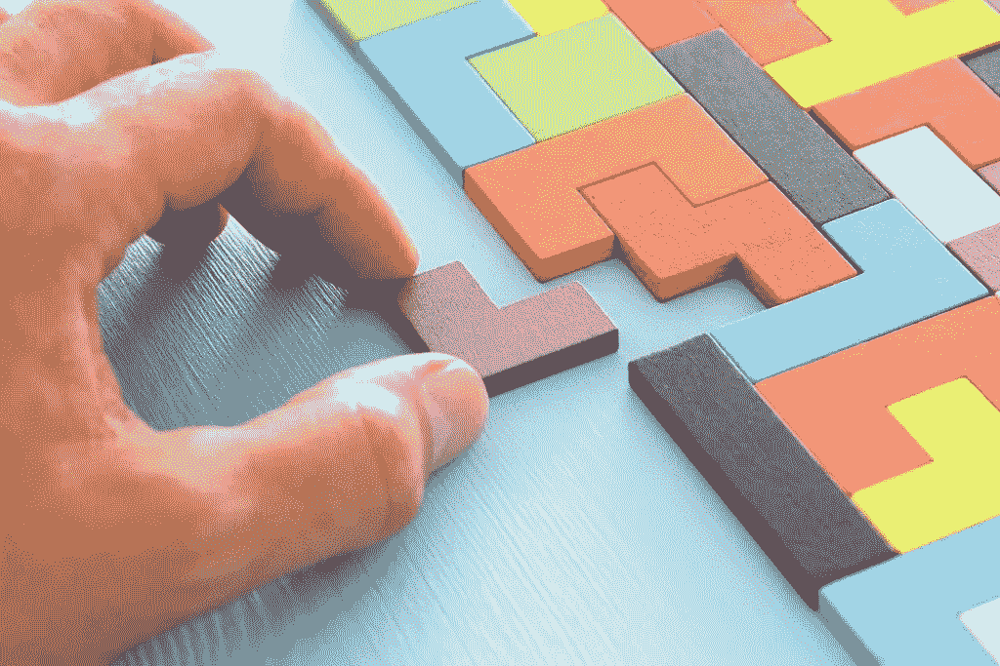

# GDPR 合规和区块链:朋友还是敌人？

> 原文：<https://medium.com/hackernoon/gdpr-compliance-and-blockchain-friends-or-foes-3d3ae4cf27a9>

区块链的起源是一个分布式的公共账本，乍看之下，它与 GDPR 立法所要求的绝对隐私根本不相容；然而，区块链已经发生了变化。零知识证明之类的发展很适合支持而不是阻碍数据隐私。这是否意味着 GDPR 合规和区块链不仅可以共存，还可以实现更好的数据隐私？

数据保护法规，特别是 [GDPR](https://eleks.com/blog/gdpr-compliance-checklist/?utm_source=medium&utm_medium=refferal&utm_campaign=Republ-GDPR-Blockchain-Blog) ，在涉及数据安全、数据隐私和用户控制个人数据访问的权利(包括被遗忘的权利)时，划定了严格的界限。
相比之下，区块链起源于一个公共账本，每个参与者都可以访问整个区块链。此外，区块链事务以及存储在区块链中的数据是不可变的。换句话说，交易和相关的交易数据一旦被记录，就不能被擦除。

很明显，区块链的公共方面，如比特币，以及区块链的不变性，都与 GDPR 的规定相冲突，但这是对区块链的简单化处理。区块链不需要公开，尽管交易数据是不可变的，但使用区块链应用程序并不意味着受 GDPR 保护的个人数据也必须存储在不可变的区块链中。

# GDPR 合规和区块链:满足 GDPR 要求

虽然区块链可能看起来与数据隐私要求相冲突，但熟悉多功能性以及采用区块链的[风险和回报的企业会知道，区块链是一种可塑的技术。](https://eleks.com/whitepapers/risks-and-rewards-of-blockchain-adoption/?utm_source=medium&utm_medium=refferal&utm_campaign=Republ-GDPR-Blockchain-Blog)

事实上，[区块链应用程序](https://eleks.com/expertise/blockchain-technology/?utm_source=medium&utm_medium=refferal&utm_campaign=Republ-GDPR-Blockchain-Blog)的突出特点与 GDPR 的期望非常吻合。此外，在区块链不符合数据隐私原则的地方，有效的变通办法也只是几步之遥。以下是一些关键的想法:

*   **离线存储个人数据**。通过使用单向工作的散列法，企业可以[利用区块链存储交易数据](https://labs.eleks.com/2016/10/secure-document-transfer-built-top-blockchain-technologies.html?utm_source=medium&utm_medium=refferal&utm_campaign=Republ-GDPR-Blockchain-Blog)，同时保持个人数据离线存储。虽然个人数据的哈希将存储在区块链上，但单向哈希意味着一旦离线个人数据被删除，这些哈希数据将毫无意义。
*   **部署零知识证明**。简而言之，零知识证明意味着一方(证明者)可以向另一方证明其知道某些事实，而无需透露这些事实或透露这些事实是如何被知道的。使用零知识算法意味着个人数据置身事外，不会影响交易效率。
*   利用区块链的安全优势。GDPR 非常重视数据安全，这与分散架构的安全优势是一致的。区块链没有单点故障，这使得区块链应用程序不那么容易受到攻击。相比之下，集中式数据存储库有很多常见的漏洞。
*   **构建私有区块链应用**。企业可以选择构建隔离外部用户的私有区块链，限制对数据的访问。利用公钥和私钥的应用程序可以允许参与者匿名交换区块链数据，所有这些都有助于数据保护合规性。

# 区块链如何成为隐私推动者

与其修改区块链应用程序来实现 GDPR 合规性，不如将区块链视为一种增强隐私的工具。当没有任何一方获得或处理个人数据时，数据隐私的考虑就大大减少了。

Sovrin 基金会的[全球身份网络](https://sovrin.org/)是一个早期的例子，展示了如何利用区块链实现高度依赖敏感个人身份信息的交易，而无需实际传输和共享这些信息。

满足隐私问题的区块链的创造性应用程序不断涌现，很可能是区块链使企业更容易遵守 GDPR 等数据隐私立法。

# 在 GDPR 面前利用区块链

显然，企业在开发符合 GDPR 标准的区块链应用程序时，需要运用一定程度的创造性思维。安全性和数据隐私问题应该是区块链应用程序开发的重点。

> *“区块链绝对有* [*用途广泛*](https://eleks.com/blog/blockchain-use-cases-regulated-industries/?utm_source=medium&utm_medium=refferal&utm_campaign=Republ-GDPR-Blockchain-Blog)*；然而，你应该时刻牢记数据安全”，ELEKS 公司安全总监 Iurii Garasym 说。“在区块链上以普通格式存储个人或敏感数据并不是一个好主意。考虑使用* [*记号化*](https://eleks.com/blog/benefits-data-tokenization-highly-regulated-industries/?utm_source=medium&utm_medium=refferal&utm_campaign=Republ-GDPR-Blockchain-Blog) *或者散列来代替。个人数据应存储在区块链境外的可靠存储或数据库中。然后，令牌、哈希或链接可以应用于区块链。”*

虽然[将你的个人数据加密](https://eleks.com/blog/tokenization-vs-encryption-things-you-need-to-know/?utm_source=medium&utm_medium=refferal&utm_campaign=Republ-GDPR-Blockchain-Blog)然后[存储在区块链](https://eleks.com/blog/blockchain-data-storage-enterprise-data-management/?utm_source=medium&utm_medium=refferal&utm_campaign=Republ-GDPR-Blockchain-Blog)上听起来对商业很有吸引力，但这种解决方案很可能永远不会完全符合 GDPR。即使加密密钥被删除，个人数据也不会被删除。因此，不符合存储限制原则要求。特别是，如果我们谈论很多关于在不久的将来使用量子计算机的潜力，请记住，它们可能能够在瞬间破解这种加密。

一如既往，基于风险的方法在这里确实有意义。在大多数情况下，一个内部有令牌、外部有安全存储的私有或特权区块链应该工作得最好，至少目前是这样。

您是否不确定企业区块链应用程序的安全性和法规遵从性？[立即联系我们](https://eleks.com/contact-us/?utm_source=medium&utm_medium=refferal&utm_campaign=Republ-GDPR-Blockchain-Blog)了解如何调整区块链以符合隐私法规，包括 GDPR。

*原载于 2018 年 10 月 11 日 eleks.com**的* [*。*](https://eleks.com/blog/gdpr-compliance-and-blockchain-friends-foes/?utm_source=medium&utm_medium=refferal&utm_campaign=Republ-GDPR-Blockchain-Blog)