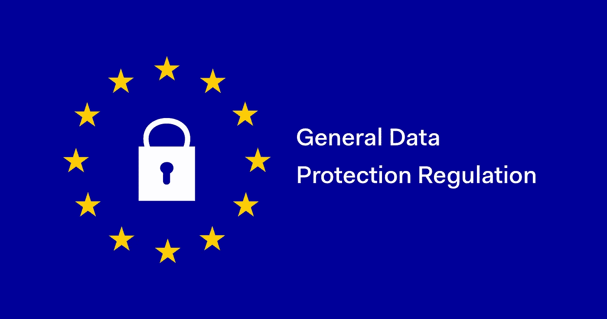
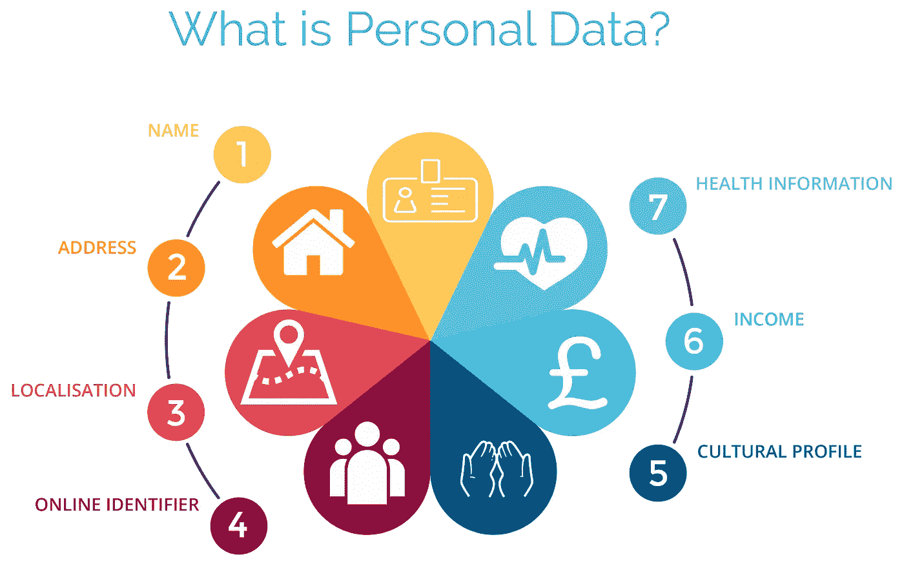

# GDPR 解码第一部分:基础

> 原文：<https://medium.com/hackernoon/gdpr-decoded-part-1-the-basics-23d2428afda3>

datanalytics.com

# 介绍

[GDPR](https://www.eugdpr.org/) 已经到来，企业都在争先恐后地寻找合规性和变通办法来维持业务。最常见的形式是[瞄准](https://www.recode.net/2018/4/11/17177842/facebook-advertising-ads-explained-mark-zuckerberg)和[重新瞄准](https://docs.aws.amazon.com/AWSEC2/latest/UserGuide/user-data.html)用户，用广告迎合他们的口味和所谓的“个人资料”,现在这种形式正受到严重威胁，企业要么必须酝酿新的营销理念，要么就关门大吉。

> 一个值得关注的领域是区块链空间，它再次受到另一项含糊不清的立法的束缚。

提交给区块链的数据是否构成 GDPR 文本中所阐述的数据处理？比特币区块链上出现的[儿童色情](http://fortune.com/2018/03/20/bitcoin-price-blockchain-child-porn-ban-crime/)无法关闭区块链，但这项被认为是消费者权利新时代的立法，经过多年的审议和演变，对加密社区提出了一个严重的问题，加密社区已经在对 ico 的大规模打击下摇摇欲坠，美国证券交易委员会的立场，以及最重要的是，个人和公司运营欺诈 ico。

所以，让我们来看看 GDPR 是什么，它将如何影响你作为一个企业或消费者。

# 什么是 GDPR？

法规(EU) 2016/679 是欧盟(“EU”)的新通用数据保护法规(“GDPR”)，对个人、公司或组织在欧盟处理与个人相关的个人数据进行了规范。

# 用简单的英语

GDPR(General Data Protection Regulation)是欧盟议会制定的一项新法律(因此仅适用于欧盟公民、总部位于欧盟的公司或那些“处理”欧盟公民数据的人)。该法律规定，它不适用于死者或法律实体的个人数据的处理。同样，它也不适用于个人为非商业活动开展的活动。

# 所以，不，如果你是一个跟踪者，你不需要明确的同意来跟踪你的受害者。有刑法来管你这种人渣。

# 什么是个人数据？

个人数据是与已识别或可识别的活着的个人相关的任何信息。根据 GDPR 的说法，收集在一起并可以识别用户身份的独立数据也是个人数据。该法律保护个人数据，无论用于处理该数据的技术是什么—它是技术中立的，适用于自动和手动处理，前提是数据是根据预定义的标准(例如字母顺序)组织的。

iocea.com

# 用简单的英语

当您在情人节在线购买鲜花时，网站会收集您的个人数据，以便为您提供更好的服务。为了记录在案，该网站收集了你的 IP 地址、订单号、家庭住址、姓名、电子邮件地址和你对鲜花的选择。在这些数据中，可用于识别您身份的数据需要符合 GDPR 法律，这意味着您必须有权要求将其删除。为清楚起见，属于个人数据类别的数据被加粗。

## 你选择的鲜花，如果储存在一个单独的数据库里，类似于一个目录，如果你的名字和其他个人数据没有关联，就不在 GDPR 法律*的管辖范围内。*

这意味着存储的个人数据不能用于解密相关人员的身份，消费者不能要求将其删除。因此，可以用来识别提供者身份的去识别、伪匿名和加密数据进入了 GDPR 的雷达范围。哈希等完全匿名的数据(不可逆)不符合 GDPR 法规。

> 有趣的事实:像 info@abc.com[这样的电子邮件可以免于遵守 GDPR 法案，因为它们不会泄露个人信息。](mailto:info@abc.com)

# 什么是数据处理？

数据处理包括对个人用户数据执行的各种操作，包括手动或自动方式。它包括个人数据的**收集、记录、组织、构建、存储、改编或修改、检索、咨询、使用、传输披露、传播**或以其他方式提供、**对齐或组合、限制、删除或销毁**。

floridadataentry.com

# **根据该案文,《一般数据保护条例》( GDPR)适用于全部或部分通过自动化手段进行的个人数据处理，也适用于非自动化处理，如果它是结构化归档系统的一部分。**

# 用简单的英语

如果您出于非商业原因以外的任何目的收集属于欧盟公民的个人数据或对其进行任何活动，您将根据新的 GDPR 法规处理数据。从在网站上发布一个人的照片到在咨询过程中获取文件，所有这些都在 GDPR 的注视之下。即使你粉碎了一份包含个人信息的文件，它也是由 GDPR 管辖的。我们都熟悉的最常见的例子是我们在收件箱中收到的促销电子邮件。这就是为什么我们会收到数百封来自我们不知道的公司的电子邮件，寻求加入。

# **同意**

对同意的要求已经变得更加严格，公司不能再使用充满法律语言的冗长难懂的条款和条件，因为同意的请求必须以一种可理解的、知情的和容易获得的形式给出，同意的目的是数据处理。

# 用简单的英语

企业不能再通过淹没在许可协议(如 EULA 协议)的冗长乏味的文本中来处理默示同意和获得的同意。与数据收集一起，数据处理的使用及其预期结果应附在用户数据申请表中。此外，终止同意必须和给予同意一样容易。​

# 不遵守的处罚是什么？

违反 GDPR 或€2000 万英镑的公司可能会被处以高达全球年营业额 4%的罚款。这是对最严重的侵权行为的最高罚款，例如，没有得到客户的充分同意来处理数据或通过设计概念侵犯隐私的核心。有一个分级的罚款方法，例如，一家公司可能因记录不整齐(第 28 条)、未向监管机构和数据主体通知违规或未进行影响评估而被罚款 2%。

# 用简单的英语

违反 GDPR 法规的最高罚款为营业额的 4%或 2000 万欧元，以金额较大者为准。根据违规的严重程度，这些罚款分为两个级别。这个规则同样适用于控制器和数据处理器。

> 这意味着在云中存储/处理的数据也在 GDPR 权限之内。

# 结论

GDPR 在防止滥用用户数据方面迈出了正确的一步，这些数据表面上看起来无害，但却足以左右选举和民众情绪。这一新规定还强调了超国家实体日益增长的重要性，鉴于过去两年笼罩政治叙事的民族主义色彩，这一规定令人耳目一新。

请在下面的评论区告诉我你对此的看法。欢迎各种观点。

在 [Twitter](https://twitter.com/StartUp_Vulture) 和 [LinkedIn](https://www.linkedin.com/in/utsavjaiswal/) 上关注我，不要错过我的任何一个故事。