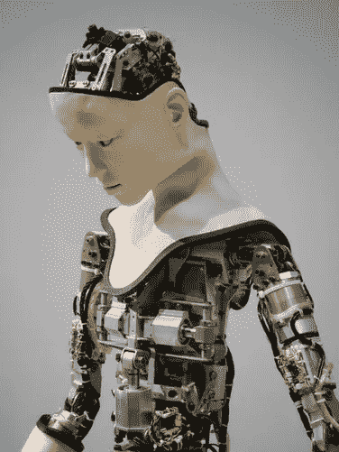

# 广义人工智能与狭义人工智能

> 原文：<https://medium.com/hackernoon/general-vs-narrow-ai-3d0d02ef3e28>

狭义的 AI 是我们一直在的地方。艾将军是我们要去的地方。狭义的人工智能是指只能处理一项特定任务的人工智能。垃圾邮件过滤工具，或者 Spotify 推荐的播放列表，甚至无人驾驶汽车——所有这些都是技术的复杂应用——只能通过术语“狭义人工智能”来定义。甚至沃森，IBM 的媒体友好型超级计算机，可以在 Jeopardy 中击败人类专家！虽然在这个过程中吞下了维基百科的大部分内容，但这只能被视为“狭隘人工智能”的一个例子。碰巧沃森使用了一种专家系统方法，结合了机器学习和自然语言处理，以便在《危险边缘》中击败人类这一领域给人留下深刻印象！还值得注意的是，沃森正在扩展到医学和法律领域。尽管如此，沃森目前仍然明显狭隘，而且可能有点不厚道，相当虚弱。从这个意义上来说，弱人工智能是指人工智能系统在特定领域表现出一定程度的智能，但它仍然是一个在这个狭窄领域内为人类执行高度专业化任务的计算机系统。

一般人工智能——强人工智能——是更复杂的东西。这是指一个系统能够处理任何要求它完成的一般性任务，就像人一样。一般人工智能的理想是，系统将拥有我们人类所拥有的认知能力和对其环境的一般经验理解，以及以比人类快得多的速度处理这些数据的能力。随之而来的是，该系统将在知识、认知能力和处理速度方面变得比人类强得多——这导致了一个非常有趣的物种定义时刻，在这个时刻，人类物种被这个(现在非常)强大的人工智能实体超越。

这种情况会导致许多不同的潜在结果。其中之一就是谷歌工程总监雷蒙德·库兹韦尔(Raymond Kurzweil)所说的“奇点”。在库兹韦尔看来，到 2029 年，人工智能系统将顺利通过传统的图灵测试，并达到人类水平的智能。他预测，到 2045 年，技术奇点将会出现，人类将能够将他们的新大脑皮层连接到某种形式的存储系统——最有可能是基于云的，也可能是 dna 连接的——并将能够将这个新大脑皮层与人工智能驱动的放大器合并。本质上，人工智能实体将与人类意识融合，给人类物种的认知能力带来巨大的好处。

还有一些深入量子力学世界的有趣研究——罗杰·彭罗斯爵士和斯图尔特·汉默洛夫的理论，即脑电波，实际上是意识本身，来自大脑微管内的量子级振动。量子事件本身就有争议，以前被认为过于微妙，容易退化，因此这一理论无法在科学界占据主导地位。然而，最近由日本的 Anirban Bandyopadhyay 和宾夕法尼亚大学的 Roderick G. Eckenhoff 博士领导的研究指出，微管内存在量子效应。量子计算领域本身还处于起步阶段，有朝一日可能会与人工智能领域相一致，假设以量子计算为动力的人工智能实体将比以前认为的可能更接近地模仿人脑功能也不是不合理的。

当然，对于每一个理想主义的未来预测，都有一个等效的悲观观点，而最终全知的人工智能实体主宰人类，决定我们的命运的末日场景，是现代文化中一个足够熟悉的比喻。

仍然坚定地扎根于当今的现实，我们可以说——艾将军，强艾，AGI——无论我们怎么称呼它——目前都是遥不可及的。然而，成千上万的小型、超级专业的狭义人工智能系统目前正在使用，它们的使用将在未来几年呈指数增长。这个技术雪球将在便利性、社会接受度、医学、教育、隐私、就业、经济、伦理等方面影响当前的人类。作为一个物种，我们需要在狭窄的人工智能实体中开辟正确的道路，我们需要考虑它们对我们的影响，就在此时此地，以及我们希望它们在未来做什么，说什么，想什么。

 [## 塞尔与中国房间争论

### 机器有可能具有智能吗？去理解一种语言？如果是为了理解一种语言，我们的…

www.mind.ilstu.edu](http://www.mind.ilstu.edu/curriculum/searle_chinese_room/searle_chinese_room.php)  [## 大脑神经元内部“微管”量子振动的发现支持了有争议的…

### 一个有争议的 20 年的意识理论的回顾和更新声称意识来自于…

www.sciencedaily.com](https://www.sciencedaily.com/releases/2014/01/140116085105.htm)  [## 大脑微管中的量子计算？彭罗斯-哈梅罗夫的意识模式

### 量子计算的潜在特性可以解释意识神秘的一面。彭罗斯-哈梅罗夫模型…

rsta.royalsocietypublishing.org](http://rsta.royalsocietypublishing.org/content/356/1743/1869)