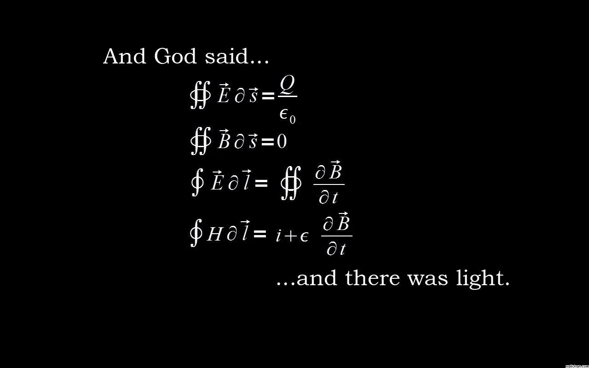
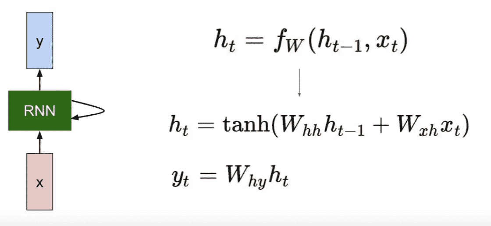
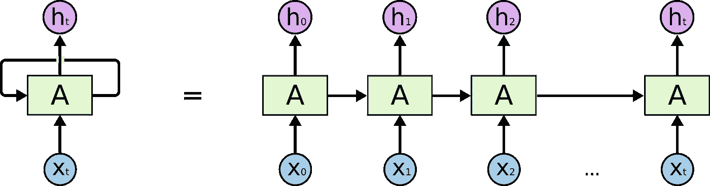
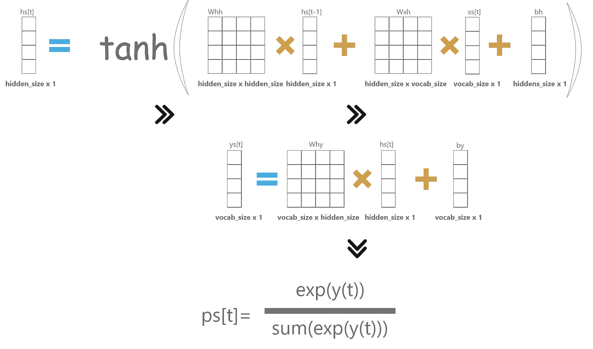
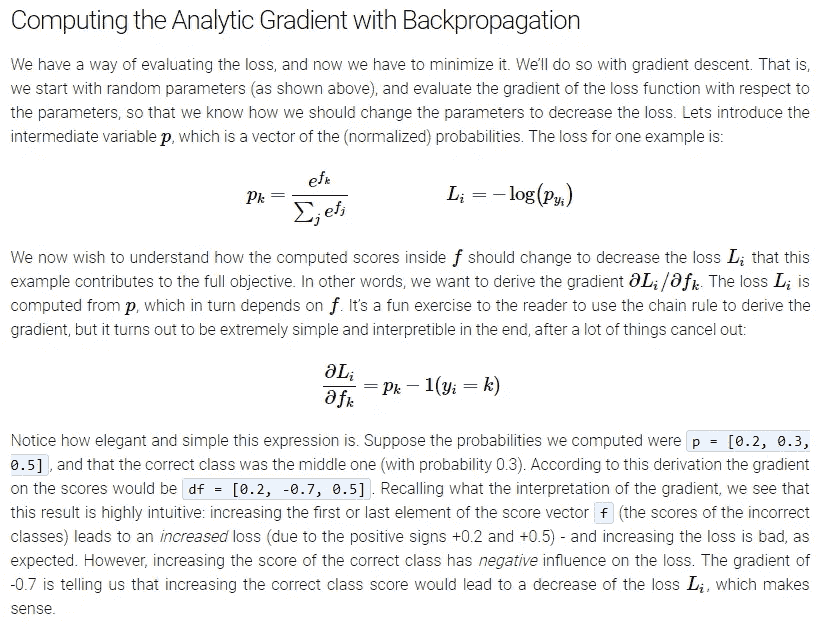
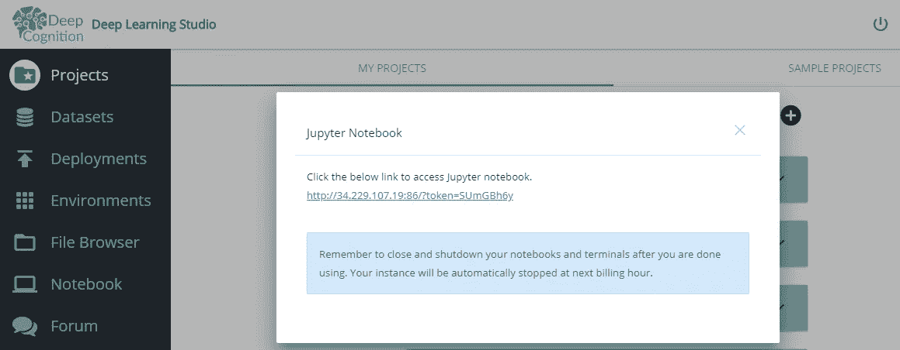
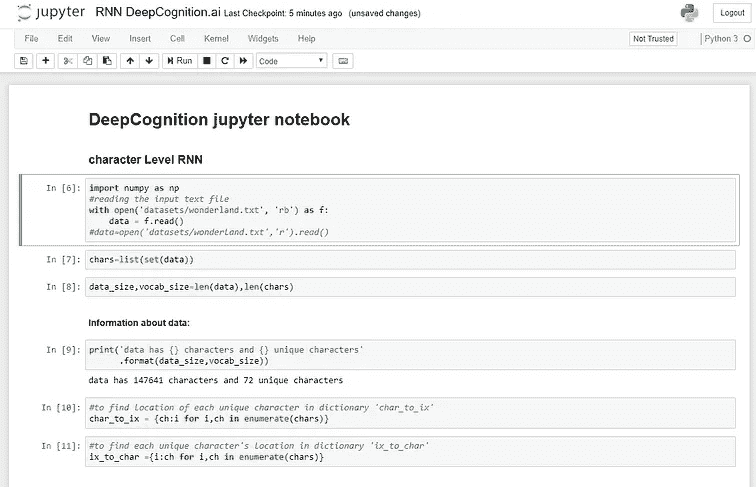
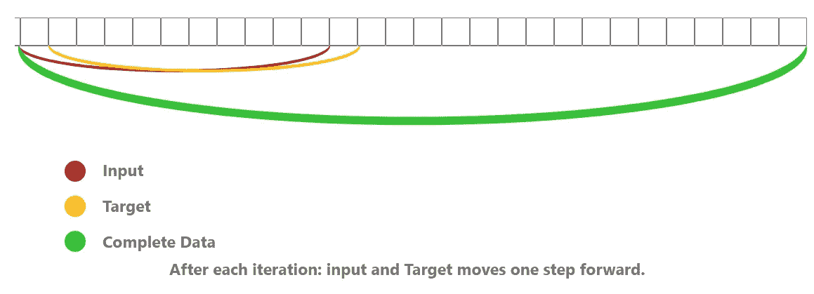
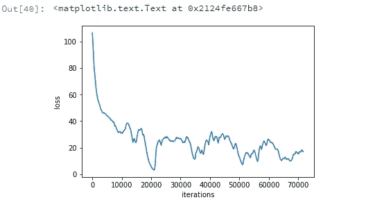

# 使用 RNNs 生成故事|带代码的纯数学|:

> 原文：<https://medium.com/hackernoon/generate-stories-using-rnns-pure-mathematics-with-code-cb6f1e967b22>



你好，读者！

> 读者注意:
> 
> 这篇文章假设你对深度学习的数学世界非常着迷。你想要深入到深度学习的数学中去，以了解在引擎盖下实际发生了什么。
> 
> **关于这篇文章的一些信息:**
> 
> 在本文中，我们将从头开始讨论和实现 RNNs。然后，我们将使用它们来生成文本(如诗歌、c++代码)。在阅读了 Andrej Karpathy 关于“[递归神经网络](http://karpathy.github.io/2015/05/21/rnn-effectiveness/)的不合理有效性”的博客后，我受到了写这篇文章的启发。这段代码生成的文本并不完美，但它给出了文本生成实际工作方式的直觉。我们的输入将是包含一些文本(如莎士比亚的诗)的纯文本文件，我们的程序将生成类似于输入(诗)的输出，这可能有意义，也可能没有意义。

让我们深入 RNNs 的数学世界。

那么 RNN 的基本结构是什么呢？



Fig 1 :Vanilla RNN



Fig 2: Unrolled Vanilla RNN

不要担心任何条款。我们将逐一讨论它们。它们很容易理解。

在图 1 中:

**h(t)**:RNN 在时间 t=t 时的隐藏状态

**fw** :非线性函数(主要是 tanh)

**Whh** :随机初始化的权重矩阵。当我们从 **h** 移动到 **h** 时使用(隐藏状态到另一个隐藏状态)。

**Wxh** :随机初始化的权重矩阵。当我们从' **x'** 移动到' **h'** (隐藏状态的输入)时使用。

**为什么**:当我们从' **h'** 移动到' **y'** 呈现隐藏状态输出时，随机初始化权重矩阵。

**bh(不在照片中)**:随机初始化的列矩阵，作为偏差矩阵加入 h(t)的计算中。

**by(不在照片中)**:随机初始化的列矩阵，作为计算 y(t)时要加入的偏置矩阵。

**代码:**

我们从导入数据开始:

从[这里](https://github.com/Manik9/RNNs-from-scratch-)下载数据。

```
**char_to_ix:** it's a dictionary to assign a unique number to each unique character
**ix_to_char:**it's a dictionary to assign a unique character to each number.
We deal with assigned number of each character and predict number of next character and then use this predicted number to find the next character.
```

*隐藏大小*:隐藏神经元的数量

*seq_length* :这是指我们希望我们的 RNN 记住多少个先前的紧接的状态。

*lr* :代表学习率。

> **初始化参数:**

初始化我们上面讨论的参数(Whh …… by)。

> **向前传球:**

ForwardPass.py

xs，ys，hs，ps 都是字典。

**xs[t]** :在时间(character) t=t，我们使用独热编码来表示字符，即除了一个元素之外，独热向量的所有元素都是零，并且我们使用 char_to_ix 字典来找到该元素(字符)的位置。示例:假设我们的数据为“abcdef”。我们通过使用独热编码将“a”表示为

```
this is what we are doing in 25th,26th line in the code above.
a=[[1], 
   [0],
   [0],
   [0],
   [0],
   [0]] 
```

**ys[t]** :在时间(character) t=t，我们存储那个 RNN 单元格的最终输出。

**hs【t】**:在时间(character)t=t，我们存储当前 RNN 单元格的隐藏状态。

**PS【t】**:在时间(字符)t=t，我们存储每个字符出现的概率。

正如你在上面的代码中看到的，我们实现了简单的计算，如图 1 所示的 xs[t]，ys[t]，hs[t]，ps[t]。

最后，我们计算 softmax 损失。



Forward Pass

> **向后传球**

dWxh:导数 w.r.t 矩阵 Wxh。我们将用它来修正我们的 Wxh 矩阵。以及类似的 dWhh，dWhy，dbh，dby，dhnext。

为了返回到 y:我们从正确的下一个字符的出现概率中减去 1，因为:



stanford CS231N notes

```
Now:
To calculate:
**dy**: ps[t]-1**dWhy** += : dy•hs[t].T
**dh** += Why.T•dy + dhnext**dby** += dy (As matrix multiplication term becomes zero in   derivative )#backprop in hs[t] now:
**dhraw** adds derivative w.r.t tanh(derivative of tanh is 1-tanh^2)
dhraw= (1-hs[t]^2)*dhdbh += dhraw (because derivative matrix multiplication terms is zero w.r.t dbh)
dWhx += (dhraw•xs[t].T)
dWhh += (dhraw•hs[t-1])
finally:
dhnext += (Whh.T•dhraw)
```

一切都准备好了:

## **该运行程序了:DeepLearning Studio**

rnn 在计算上非常昂贵。为了训练我们的程序，我使用了 Deep Cognition 的**深度学习工作室**。它提供了预装的深度学习框架，如 Tensorflow-gpu/cpu、keras-gpu/cpu、py torch…等等。查看[**这里**](https://deepcognition.ai/) 。



click on Notebooks and you’re ready to code! ✋

[](https://deepcognition.ai/) [## 深度认知——今天就成为一个人工智能驱动的组织

### 无需编码即可设计、训练和部署深度学习模型。深度学习工作室简化并加速了…

deepcognition.ai](https://deepcognition.ai/) 

mbh，mby 是 Adagrad optimiser 的内存变量。



For line number 7–11\. Here one-step = seq_length.

最后，根据不同参数(Why…h(t))的损失函数计算损失，并从相应参数中减去损失。

```
line number 5-6 is the way we Adagrad works.
Like in normal gradient descent we do:
theta= theta-lr*grad
1e-8 is used to prevent DivisionByZero exception.
```

> **培训结果:**



```
At epoch zero:Generated text
**loss=106.56699692603289
iteration:0**QZBipoe.M
prb’gxc]QXECCY“f);wqEnJAVV-Dn-
Fl-tXTFTNI[ ?Jpzi”BPM’TxJlhNyFamgIj)wvxJDwBgGbF!D“F‘bU;[)KXrT km*;xwYZIx-
AX
dDl_zk(QlW(KolSenbudmX.yq
H-(uPUl-B:mj]o’E-ZTjzH)USf:!
sCiTkTMcmgUY)rCj
ZaL*rhWVpS----
**---------------------------------------------------** l was  beginning begiginning to Alice walicegininn to geteginninato giteginniito geteginninn to geteginninatg gegeginninasto get beginninnninnigw to gicleaaaa  was ginniicg benning to get a wen----
**loss=11.115271278781561
iteration:66200**
```

它开始学习像“开始，爱丽丝，曾经，去，去……”这样的单词。一点都不完美。但它给人一种直觉，即给定一些样本数据，我们可以生成适当的文本。LSTMs 的性能比 RNNs 好得多。LSTMs 是具有 3-4 个门的 RNNs 的扩展。请务必查看我在 LSTMs 上的文章

[](https://hackernoon.com/understanding-architecture-of-lstm-cell-from-scratch-with-code-8da40f0b71f4) [## 用代码从零开始理解 LSTM 细胞的结构。

### 在数据序列很重要的情况下，包括 CNN 在内的普通神经网络表现不佳。比如说…

hackernoon.com](https://hackernoon.com/understanding-architecture-of-lstm-cell-from-scratch-with-code-8da40f0b71f4) 

在**[**github repo**](https://github.com/Manik9/RNNs-from-scratch-)**上访问带有数据集的完整代码。****

**恭喜读者，现在你已经深入了解了 RNNs(简单线性代数)的数学知识。**

**感谢您抽出宝贵的时间阅读我的文章。如果你真的喜欢它，请分享并鼓掌👏。**

**在[媒体](/@maniksoni653)和 [LinkedIn](https://www.linkedin.com/in/maniksoni) 上关注我。**

**快乐深度学习。**

**[](/@maniksoni653) [## 马尼克索尼培养基

### 阅读媒介上的 Manik Soni 的作品。机器学习研究员。每天，Manik Soni 和成千上万的其他人…

medium.com](/@maniksoni653) [](https://www.linkedin.com/in/maniksoni) [## Manik Soni -机器学习研究员-自雇| LinkedIn

### 查看 Manik Soni 在全球最大的职业社区 LinkedIn 上的个人资料。Manik 有 2 份工作列在他们的…

www.linkedin.com](https://www.linkedin.com/in/maniksoni)**