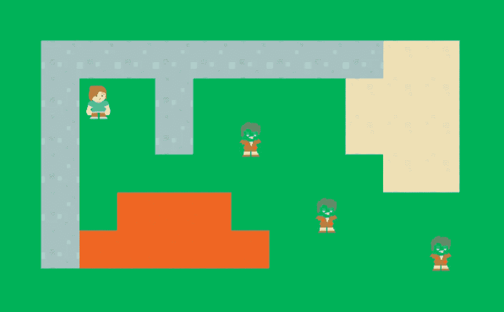
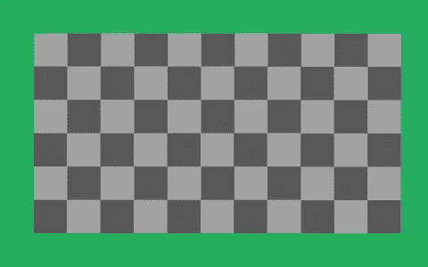
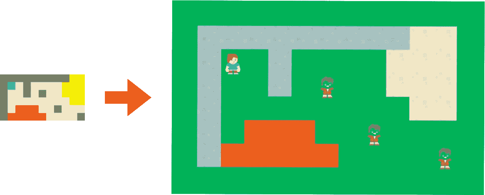

# 从 Unity3D 中的图像生成关卡

> 原文：<https://medium.com/hackernoon/generating-a-level-from-an-image-in-unity3d-225b51a68172>

我们的水平是由不同的块作为瓷砖。不仅对我这个开发者，对游戏设计师来说，硬编码所有的职位都有点痛苦。

我需要能让设计和测试足够快的东西。并且独立于开发者。所以游戏设计者可以在 Unity 中放一个文件，这个文件会被读取，关卡会出现在屏幕上。

我暂时想到了如何做这件事。我首先想到的是 JSON 文件。我来自移动应用程序世界，我习惯于使用 JSON 做任何事情，所以在这里使用它似乎也是合乎逻辑的。

但是后来，游戏设计师有了一个更好的主意。为什么不用图像呢？它看起来更直观，而且足够小，不会占用太多空间。所以我决定使用这种方法。

# 如何用一张图片生成关卡？

这个想法很简单:从图像中读取 1 个像素，解码 de color 并在该位置放置一个图块。图像将是宽度的平铺数量 x 高度的平铺数量。

所以我们从这里开始:

I zoomed the image, but it should be 1px per color

对此:

The generated level

**免责声明**:我在这些例子中使用的所有资产都来自[肯尼游戏资产 2](https://kenney.itch.io/kenney-game-assets-2) 。从这里感谢[肯尼](https://kenney.itch.io/)提供如此令人敬畏的资产:)如果你喜欢他们，考虑得到他的一个包。

# 我们的资产

出于测试目的，我们将在背景中间生成一个级别。如果这是我们的背景图像:

Our beautiful grassy background

我们希望将图块放在另一幅图像的选中区域:

The checked area is where the level will be drawn

这只是把他们画在中间。我选择这个数量和位置没有特别的原因，所以你可以随意适应你的游戏要求。

这些是将被使用的瓷砖:一个女孩为玩家(蓝色像素在我们的水平地图纹理)，一个僵尸(绿色像素)，火(红色像素)，沙子(黄色像素)和石头(灰色像素)

The tiles that will be used

# 让我们开始编码吧

我不打算详细介绍 Unity 是如何工作的，所以我只解释与这个主题相关的代码，它从一个图像生成一个关卡。

我的场景中有一个包含我的*级别生成器*脚本的*游戏对象*。该脚本具有以下公共变量(因此我可以从编辑器中调整某些参数):

然后在我们的 *Start* 方法中，我们得到一个对 GenerateLevel 方法的调用。它看起来是这样的:

我们遍历包含关卡设计的纹理的宽度和高度。然后，我们得到像素颜色，并检查哪个对象代表了该颜色。如果没有该像素颜色的对象， *GetGameObject* 方法将返回 null，然后我们将继续下一个像素。这将发生在读取背景像素时(在我的例子中是白色)。

一旦我们得到了要实例化的对象名，我们需要知道它的位置。为此，我们有两个方法:一个是将图块转换为背景中的像素点(也考虑了上面显示的 startingPosition 变量),另一个是将像素位置转换为 *Vector3* 世界位置。

之后，它只是实例化该位置的对象，循环继续，直到纹理结束。

让我们看看这里使用的其他 3 种方法:

我认为这里的代码非常简单明了。

第一种方法只是将 x，y 平铺从水平设计纹理变成背景中的像素位置。

第二种方法将这些像素位置转换成游戏世界点数。

第三个只是一个巨大的开关，上面有我们瓷砖的颜色代码和它们相应的预制名称。

Level Generation in process! The left image, has been zoomed. In reality it’s 11x6px

有了这段代码，我们终于从那个小图像中获得了我们的级别。

我希望这段代码可以帮助那些想做和我们类似事情的人。如果你有任何问题，请随时提问。

