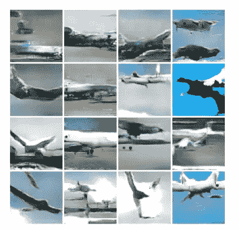
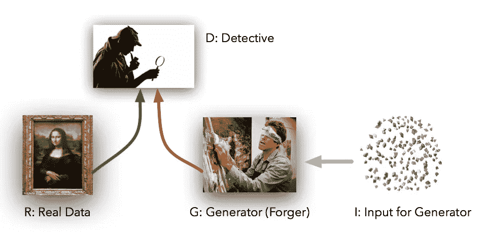
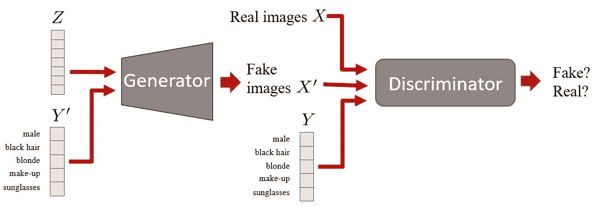
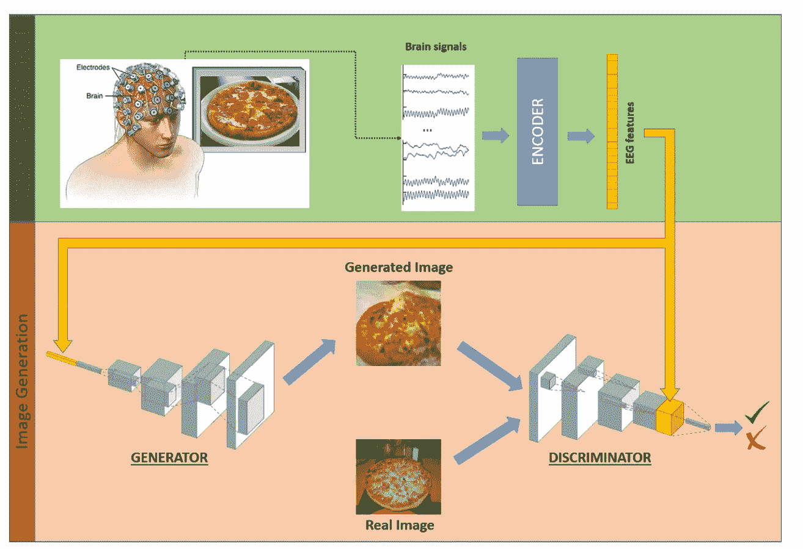
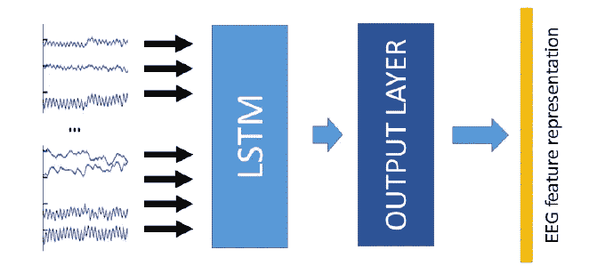

# 从大脑信号中生成图像

> 原文：<https://medium.com/hackernoon/generating-images-from-brain-signals-a286cb002aa7>

该方法由“**EEG-in/image-out”**处理
流水线、**组成，其中提供给发生器的 EEG 信号被转换成真实的图像。**

Images Generated using Conditional GAN

## 只是对甘的一个介绍！

生成对抗网络(GAN)用于从零开始生成类似于训练数据集分布的数据。在我们的例子中，创建与我们的训练数据集相似的**图像**。

GAN 由两个网络组成——发生器和鉴别器

1.  GAN 中的生成器尝试从头开始创建**训练集图像**
2.  同时鉴别器检查**生成器是否实际生成训练集图像。**

## 够了吗？

如果我们使用普通 GAN，我们可以从噪声中生成逼真的图像。**这里，没有条件作为输入提供给发生器。**

**在我们的例子中，给定相应的 EEG 信号(条件),发生器需要生成逼真的图像。**

## **病情甘！**

Example of a Conditional GAN

**GAN 和条件 GAN 的区别在于鉴别器和发生器功能中的附加参数 *y* 。**

# 工作原理—使用有条件的联动

Overview of the architecture design of the proposed EEG-driven image generation approach

## 培训发电机

生成器网络在有条件的 GAN 框架中被训练，以
从 EEG 特征产生图像，使得生成的图像与条件向量(EEG 特征)的图像相匹配。

**调理矢量？**

EEG feature encoder architecture.

原始 EEG 信号由基于 RNN 的编码器**处理，该编码器被训练输出一个我们称之为 EEG 特征的向量，包含从输入信号中提取的视觉相关和类别区分信息。**

## **训练鉴别器**

然后，判别模型检查发电机的输出是否合理，是否也与条件标准匹配。

不是用具有正确条件的**真实图像**和具有任意条件的**虚假图像**来训练鉴别器(这迫使鉴别器学习如何在没有任何明确监督的情况下区分具有正确条件的真实图像和具有错误条件的真实图像)，我们还提供了由具有错误条件的**真实图像**组成的错误样本，该样本被随机选择作为来自不同类别的代表性 EEG 特征向量。

# **参考**

*   受大脑信号制约的生成性对抗网络