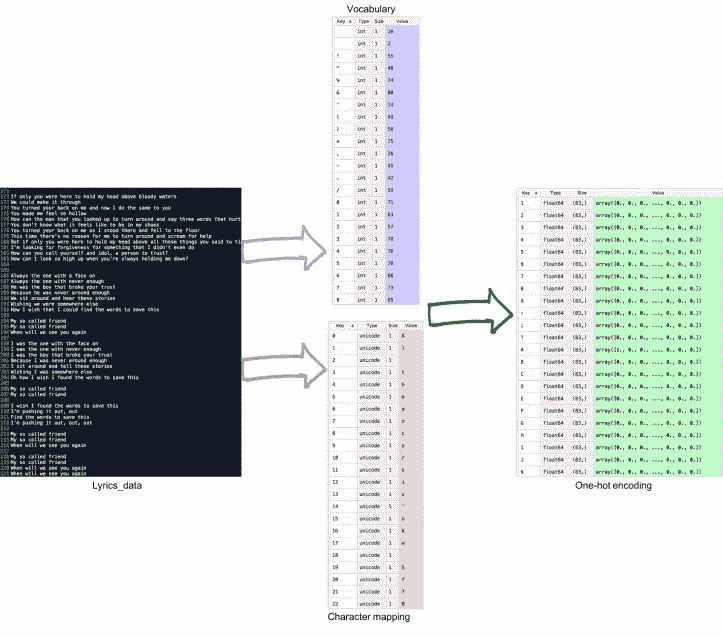

# 使用深度(多层)LSTM 生成歌词

> 原文：<https://medium.com/hackernoon/generating-lyrics-using-deep-multi-layer-lstm-b28ee8124936>


*在这篇文章中，学习如何使用深度(多层)LSTM 生成歌词，作者是 Skejul 的创始人兼首席执行官 Matthew Lamons(人工智能平台，帮助人们管理他们的活动)，以及人工智能科学家、深度学习实践者和独立研究员 Rahul Kumar。*

本文将向您展示如何创建一个适合生成音乐歌词任务的深度 LSTM 模型。你的目标是:建立并训练一个模型，输出任意数量艺术家风格的全新原创歌词。这个练习可以参考在`Lyrics-ai`([https://github . com/packt publishing/Python-Deep-Learning-Projects/tree/master/chapter 06/Lyrics-ai](https://github.com/PacktPublishing/Python-Deep-Learning-Projects/tree/master/Chapter06/Lyrics-ai))找到的代码文件。

# 数据预处理

要构建一个可以生成歌词的模型，您需要大量的歌词数据，这些数据可以很容易地从各种来源提取出来。你可以在[https://github . com/packt publishing/Python-Deep-Learning-Projects/tree/master/chapter 06/Lyrics-ai](https://github.com/PacktPublishing/Python-Deep-Learning-Projects/tree/master/Chapter06/Lyrics-ai)找到代码文件。这些文件包含一个名为`lyrics_data.txt`的文本文件，其中包含了大约 10，000 首歌曲的歌词，并存储在。

现在您已经有了数据，将这个原始文本转换成一次性编码版本:

```
import numpy as npimport codecs **# Class to perform all preprocessing operations**class Preprocessing:vocabulary = {}binary_vocabulary = {}char_lookup = {}size = 0separator = '->'**# This will take the data file and convert data into one hot encoding and dump the vocab into the file.**def generate(self, input_file_path):input_file = codecs.open(input_file_path, 'r', 'utf_8')index = 0for line in input_file:for char in line:if char not in self.vocabulary:self.vocabulary[char] = indexself.char_lookup[index] = charindex += 1input_file.close()self.set_vocabulary_size()self.create_binary_representation()**# This method is to load the vocab into the memory**def retrieve(self, input_file_path):input_file = codecs.open(input_file_path, 'r', 'utf_8')buffer = ""for line in input_file:try:separator_position = len(buffer) + line.index(self.separator)buffer += linekey = buffer[:separator_position]value = buffer[separator_position + len(self.separator):]value = np.fromstring(value, sep=',')self.binary_vocabulary[key] = valueself.vocabulary[key] = np.where(value == 1)[0][0]self.char_lookup[np.where(value == 1)[0][0]] = keybuffer = ""except ValueError:buffer += lineinput_file.close()self.set_vocabulary_size()**# Below are some helper functions to perform pre-processing.**def create_binary_representation(self):for key, value in self.vocabulary.iteritems():binary = np.zeros(self.size)binary[value] = 1self.binary_vocabulary[key] = binarydef set_vocabulary_size(self):self.size = len(self.vocabulary)print "Vocabulary size: {}".format(self.size)def get_serialized_binary_representation(self):string = ""np.set_printoptions(threshold='nan')for key, value in self.binary_vocabulary.iteritems():array_as_string = np.array2string(value, separator=',', max_line_width=self.size * self.size)string += "{}{}{}\n".format(key.encode('utf-8'), self.separator, array_as_string[1:len(array_as_string) - 1])return string
```

预处理模块的总体目标是将原始文本数据转换为一键编码，如下图所示:



该图表示数据预处理部分。原始歌词数据被用于建立词汇映射，该词汇映射被进一步转换成热门编码。预处理模块成功执行后，二进制文件将被转储为`{dataset_filename}.vocab`。这个`vocab`文件是在训练过程中需要和数据集一起输入到模型中的强制文件之一。

# 定义模型

本文将采用 Keras 模型的方法，并使用 TensorFlow 从头开始编写每一层。TensorFlow 使您能够更好地控制模型的架构。对于此模型，使用以下块中的代码创建两个占位符，用于存储输入和输出值:

```
import tensorflow as tfimport picklefrom tensorflow.contrib import rnndef build(self, input_number, sequence_length, layers_number, units_number, output_number):self.x = tf.placeholder("float", [None, sequence_length, input_number])self.y = tf.placeholder("float", [None, output_number])self.sequence_length = sequence_length
```

接下来，将权重和偏差存储在您创建的变量中:

```
self.weights = {'out': tf.Variable(tf.random_normal([units_number, output_number]))}self.biases = {'out': tf.Variable(tf.random_normal([output_number]))}x = tf.transpose(self.x, [1, 0, 2])x = tf.reshape(x, [-1, input_number])x = tf.split(x, sequence_length, 0)
```

您可以使用多个 LSTM 图层构建此模型，基本 LSTM 像元为每个图层分配指定数量的像元，如下图所示:


Tensorboard visualization of the LSTM architecture

以下是这方面的代码:

```
lstm_layers = []for i in range(0, layers_number):lstm_layer = rnn.BasicLSTMCell(units_number)lstm_layers.append(lstm_layer)deep_lstm = rnn.MultiRNNCell(lstm_layers)self.outputs, states = rnn.static_rnn(deep_lstm, x, dtype=tf.float32)print "Build model with input_number: {}, sequence_length: {}, layers_number: {}, " \"units_number: {}, output_number: {}".format(input_number, sequence_length, layers_number,units_number, output_number)**# This method is using to dump the model configurations**self.save(input_number, sequence_length, layers_number, units_number, output_number)
```

# 训练基于深度张量流的 LSTM 模型

既然已经有了强制输入，也就是数据集文件路径、`vocab`文件路径和模型名称，就可以开始训练过程了。定义模型的所有超参数:

```
import osimport argparsefrom modules.Model import *from modules.Batch import *def main():parser = argparse.ArgumentParser()parser.add_argument('--training_file', type=str, required=True)parser.add_argument('--vocabulary_file', type=str, required=True)parser.add_argument('--model_name', type=str, required=True)parser.add_argument('--epoch', type=int, default=200)parser.add_argument('--batch_size', type=int, default=50)parser.add_argument('--sequence_length', type=int, default=50)parser.add_argument('--log_frequency', type=int, default=100)parser.add_argument('--learning_rate', type=int, default=0.002)parser.add_argument('--units_number', type=int, default=128)parser.add_argument('--layers_number', type=int, default=2)args = parser.parse_args()
```

由于这是一个训练模型的批处理，使用`Batch`模块将数据集分成定义的`batch_size`的批处理:

```
batch = Batch(training_file, vocabulary_file, batch_size, sequence_length)
```

每批将返回两个数组。一个是输入序列的输入向量，其形状为[ `batch_size`、`sequence_length`、`vocab_size` ]，另一个数组保存标签向量，其形状为[ `batch_size`、`vocab_size` ]。

现在，初始化您的模型并创建优化器函数。在这个模型中，您使用了`Adam`优化器。然后，您将训练您的模型并对每一批执行优化:

```
**# Building model instance and classifier**model = Model(model_name)model.build(input_number, sequence_length, layers_number, units_number, classes_number)classifier = model.get_classifier() **# Building cost functions**cost = tf.reduce_mean(tf.square(classifier - model.y))optimizer = tf.train.AdamOptimizer(learning_rate=learning_rate).minimize(cost)**# Computing the accuracy metrics**expected_prediction = tf.equal(tf.argmax(classifier, 1), tf.argmax(model.y, 1))accuracy = tf.reduce_mean(tf.cast(expected_prediction, tf.float32))**# Preparing logs for Tensorboard**loss_summary = tf.summary.scalar("loss", cost)acc_summary = tf.summary.scalar("accuracy", accuracy)train_summary_op = tf.summary.merge_all()out_dir = "{}/{}".format(model_name, model_name)train_summary_dir = os.path.join(out_dir, "summaries")### Initializing the session and executing the traininginit = tf.global_variables_initializer()with tf.Session() as sess:sess.run(init)iteration = 0while batch.dataset_full_passes < epoch:iteration += 1batch_x, batch_y = batch.get_next_batch()batch_x = batch_x.reshape((batch_size, sequence_length, input_number))sess.run(optimizer, feed_dict={model.x: batch_x, model.y: batch_y})if iteration % log_frequency == 0:acc = sess.run(accuracy, feed_dict={model.x: batch_x, model.y: batch_y})loss = sess.run(cost, feed_dict={model.x: batch_x, model.y: batch_y})print("Iteration {}, batch loss: {:.6f}, training accuracy: {:.5f}".format(iteration * batch_size,loss, acc))batch.clean()
```

一旦模型完成其训练，就存储检查点。您可以稍后使用它们进行推理。以下是在训练过程中发生的准确度和损失的图表:


The accuracy (top) and the loss (bottom) plot with respect to the time

可以看到，随着时间的推移，精度在提高，损耗在降低。

# 推理

现在模型已经准备好了，您可以使用它来进行预测。首先定义所有参数。在构建推理时，您需要提供一些种子文本，就像您在前面的模型中所做的那样。除此之外，您还应该提供`vocab`文件的路径和输出文件，您将在其中存储生成的歌词。另外，提供您需要生成的文本的长度:

```
import argparseimport codecsfrom modules.Model import *from modules.Preprocessing import *from collections import dequedef main():parser = argparse.ArgumentParser()parser.add_argument('--model_name', type=str, required=True)parser.add_argument('--vocabulary_file', type=str, required=True)parser.add_argument('--output_file', type=str, required=True)parser.add_argument('--seed', type=str, default="Yeah, oho ")parser.add_argument('--sample_length', type=int, default=1500)parser.add_argument('--log_frequency', type=int, default=100)
```

接下来，通过提供您在前面代码的培训步骤中使用的模型名称来加载模型，并从文件中恢复词汇:

```
model = Model(model_name)model.restore()classifier = model.get_classifier()vocabulary = Preprocessing()vocabulary.retrieve(vocabulary_file)
```

使用 stack 方法存储生成的字符，追加堆栈，然后使用同一个堆栈以交互方式将其输入到模型中:

```
**# Preparing the raw input data**for char in seed:if char not in vocabulary.vocabulary:print char,"is not in vocabulary file"char = u' 'stack.append(char)sample_file.write(char)**# Restoring the models and making inferences**with tf.Session() as sess:tf.global_variables_initializer().run()saver = tf.train.Saver(tf.global_variables())ckpt = tf.train.get_checkpoint_state(model_name)if ckpt and ckpt.model_checkpoint_path:saver.restore(sess, ckpt.model_checkpoint_path)for i in range(0, sample_length):vector = []for char in stack:vector.append(vocabulary.binary_vocabulary[char])vector = np.array([vector])prediction = sess.run(classifier, feed_dict={model.x: vector})predicted_char = vocabulary.char_lookup[np.argmax(prediction)]stack.popleft()stack.append(predicted_char)sample_file.write(predicted_char)if i % log_frequency == 0:print "Progress: {}%".format((i * 100) / sample_length)sample_file.close()print "Sample saved in {}".format(output_file)
```

# 输出

成功执行后，你将获得自己新创作的、人工智能生成的歌词，并被审核和发布。以下是这类歌词的一个例子。修改了一些拼写，使句子更有意义:

```
Yeah, oho once upon a time, on ir intasdI got monk that wear your goodSo heard me down in my clippCure me out brickCoway got baby, I wanna sheart in faicI could sink awlrook and heart your all feeling in the firing of to the still hild, gavelly mind, have before you, their leadOh, oh shor,s sheld be you und makeOh, fseh where sufl gone for the runtomeWeaaabe the ligavus I feed themust of hear
```

在这里，您可以看到模型已经学会了生成具有适当间距的段落和句子的方式。它仍然缺乏完美，也没有意义。

***看到成功的迹象—*** *第一个任务是创建一个可以学习的模型，然后第二个用来在那个模型上改进。这可以通过用更大的训练数据集和更长的训练持续时间来训练模型来获得。*

*如果你觉得这篇文章有趣，可以探索* [*Python 深度学习项目*](https://www.amazon.com/Python-Deep-Learning-Projects-demystifying/dp/1788997093) *掌握使用 Python 和 Keras 的深度学习和神经网络架构。* [*Python 深度学习项目*](https://www.packtpub.com/big-data-and-business-intelligence/python-deep-learning-projects) *传授在计算语言学和计算机视觉领域实现复杂深度学习项目所需的所有知识。*