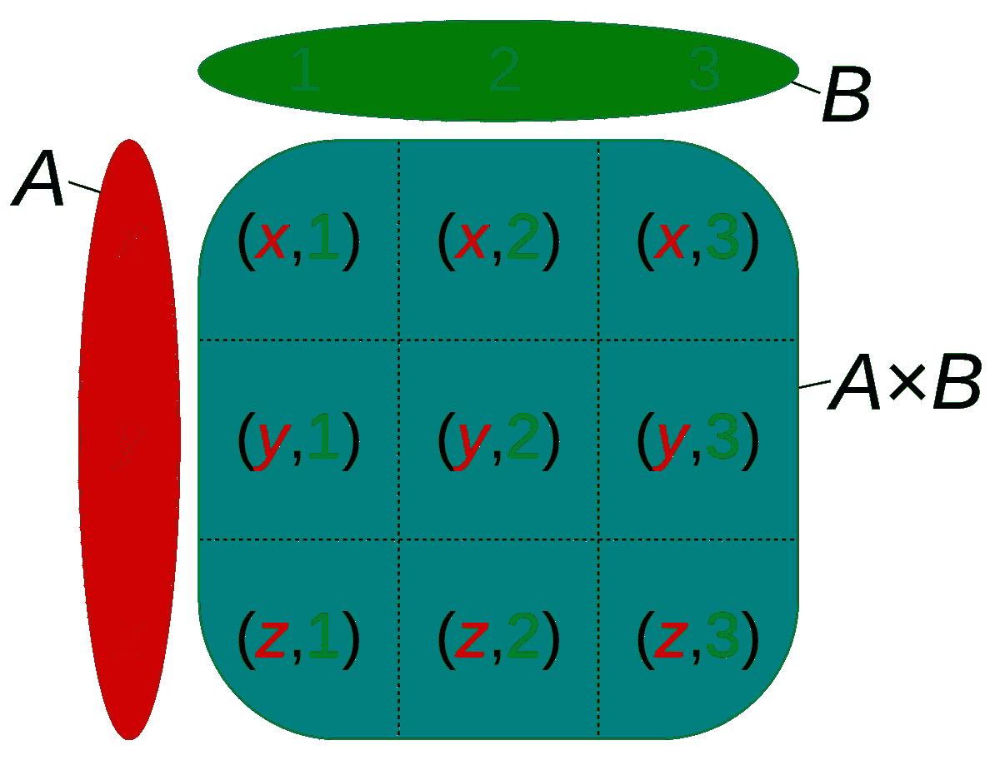

# 生成第 n 个笛卡尔乘积

> 原文：<https://medium.com/hackernoon/generating-the-nth-cartesian-product-e48db41bed3f>



Image courtesy of [Wikipedia](https://en.wikipedia.org/wiki/Cartesian_product)

**注:本文更新时间为 2018-11-12。有关更多信息，请参见本文末尾的“更新”一节。**

最近在我的工作中，我们遇到了一个问题:我们需要生成一组问题和答案的一些可能的组合，但我们只需要这些组合的一个小子集。另外，我们需要这个子集随机分布在各种可能性中(同时保持均匀分布)。这样，在基于我们的组合运行一些统计数据后，我们可以生成一个强大的数据模型。

当然，我们可以生成所有可能的组合，并使用内置的库随机选择一些可能的组合。当您的可能组合范围相对较小时(少于 1，000，000；给或拿)。但是当你有 **197，074，944** 种可能的组合时呢？是的，这是我们的一小组问题和答案的可能组合。

*如果您想跳到实际实现，请随意向下滚动到章节:* ***使用 Python 的解决方案***

# 如何不去处理这个问题

我尝试做的第一件事是使用 Python 的`itertools`库一次生成所有的组合，然后从列表中选择一个随机子集。关于`itertools`的好处是它会很快生成这些组合**。不太好的是，它将生成所有 197，074，944 个组合**非常快**，这意味着在一眨眼的时间里，我看到我的 RAM 消耗在大约 5 秒内从大约 2GB 增加到我的机器的最大值。在那之后，脚本一直试图使用分页内存来建立这些组合，我不得不做一个硬复位来让我的机器复活。**

**显然，这种方法不适用于如此大的一组组合。**

**我们需要找到一种方法来避免填满内存空间，同时保持合理的性能。**

# **输入:懒惰的笛卡尔积**

**花了几个小时研究这个话题，我终于看到了这篇精彩的文章:[http://phrogz.net/lazy-cartesian-product](http://phrogz.net/lazy-cartesian-product)。作者在解释一些理论以及用 JavaScript 实现方面做得非常出色。**

**TL；DR:你可以在索引 *n* 找到笛卡尔乘积的任意组合，而不需要计算每一个组合。**

**有了这个算法，您现在几乎可以消除内存空间的问题，在计算一个条目时大致保持 *O(1)* 的性能，如果存储组合，只需要担心磁盘空间。**

**另外，我们现在可以找到条目的子集，而不需要计算所有可能的组合。**

# **Python 解决方案**

**使用上面链接中的伪代码，生成的 Python 代码如下:**

**下面是一个展示代码如何运行的示例:**

**如果我们在终端中运行这个程序，我们将得到以下结果:**

```
$ python example.py
[1, 'foo', 'z', 'three']
[2, 'bar', 'y', 'three']
[4, 'bar', 'y', 'two']
$
```

# **最终结果**

**在我的工作中，我们将它包装在一个脚本中，这样我们可以生成大约 1，000，000 个记录的随机子集(从 197，074，944 个可能的组合中)，并将这些组合保存到一个`.csv`文件中。总之，在我的机器上，该脚本只花了大约 10 秒钟就完成了(很可能是由于文件 I/O)。**

**最终，该算法可以根据需要用任何其他语言实现。对于我的工作，我也用 C#编写了一个桌面应用程序的算法，我可以想象用 C/Rust 编写的东西会产生更高性能的结果。**

# **更新**

**经过进一步检查，当生成的组合数量开始增加时，上面的当前代码开始失效。简而言之就是:Python 执行浮点除法的方式导致算法在试图计算下一个要选择的元素的索引时失败。感谢 [woudsma](https://github.com/wouda) 使用 [bigfloat](https://pypi.org/project/bigfloat/) 软件包找到了解决方案:**

**如果您发现您的结果不正确，我强烈推荐使用这个优秀的代码分支。**

**关于进一步的讨论，请参见下面详细介绍这些发现的回复。**