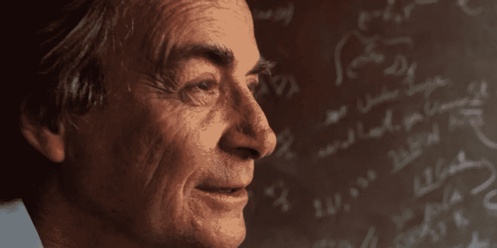
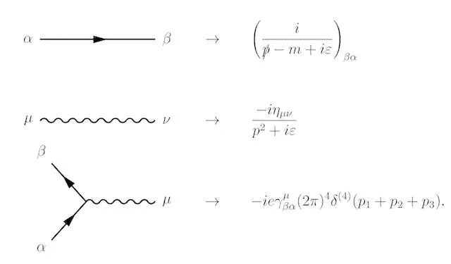

# 天才是懒惰的——你也应该如此

> 原文：<https://medium.com/hackernoon/geniuses-are-lazy-and-you-should-be-too-9dbc05f2e41f>

Richard Feynman, Theoretical Physicist and Nobel Laureate

当你面临一个棘手的问题时，你会怎么做？喝杯咖啡，静下心来准备一个漫长的夜晚？拿出图书馆的书，或者 excel 电子表格？咬紧牙关，准备一场艰苦的跋涉？

也许那不是最好的方法。

看看过去几百年里科学上的一些重大发现。有一点似乎很突出——天才都很懒。

杰出的科学家开始把他们的难题转化成一个简单的问题，而不是试图迎头痛击。和“咬紧牙关往前挤”正好相反。人们说伟大的思想家从不同的角度看问题。

## 物理学家和数学家从字面上改变了他们的观点。他们将数学变换作为一种炼金术——将难题转化为简单问题。

爱因斯坦用相对论做到了这一点。当你在三维空间中思考时，相对论是一个很难理解的概念，因为人类已经进化成这样了。然而，时空是四维的，所以仅仅为了能够“看到”光或物质在四维世界中的行为，就需要大量的数学体操。这就好像你在参加一场国际象棋比赛，但是你必须爬上一座 20，000 英尺高的山才能到达棋盘。没人关心甚至知道你先爬上了山——他们只关心象棋。山是无差别的努力工作(在 4-D 空间中计算事物)，而象棋是重要的新东西(狭义相对论)。

爱因斯坦乘坐一辆隐喻的缆车爬上这座山。他应用了洛伦兹变换。这使他能够以光速独立于观察者的参照系(狭义相对论的一个关键原则)的方式来模拟时空。这解决了许多脑力繁重的工作，让他专注于开发导致相对论的不同概念和交互模型。

以为转化只是物理学家的事吗？再想想。所有人都在作弊。每个人都在用坐标变换把难题转化成更简单的问题。

Spotify 用这个来构建你的推荐引擎。事实上，转换(在机器[学习](https://hackernoon.com/tagged/learning)环境中通常称为‘特征空间’转换)是每个好的机器学习模型的核心。一个例子是支持向量机(SVM)——一种受监督的机器学习方法。支持向量机从一个困难的优化问题(称为“原始”问题)开始，然后在数学上将其转化为一个更容易解决的“对偶”问题。其他流行的方法，包括多层(深度)神经网络，也是从将其输入转换到不同的特征空间开始，因此问题变得更容易解决。

有时转换是非常数学化的。有时它们就像创造一种独特的速记一样简单。

传奇物理学家理查德·费曼创造了费曼图。它们看起来像漫画，但它们描述了实空间和虚空间中的复杂积分。这让费曼将他的认知能力集中在量子场论真正不同和新颖的地方，而不是浪费精力去做复杂的积分运算。

*费曼图(左)和它们所代表的术语(右)*

我们这些在知识产业工作的人——产出是编码的思想(一个演示、一次演讲、一篇论文或几行代码)——可以从这些物理学家和数学家那里窃取技巧。

首先，你知道你要解决什么吗？该解决方案的哪一部分真正与众不同且新颖？你怎么能摆脱其他不是的东西呢？

## **你需要找到你的转变——让你把大部分认知能量集中在差异化的东西上，而放弃不差异化的东西——不管有多复杂。**

也许真正的问题有一种更容易解决的形式？也许你可以通过改变地理位置，改变你最初的目标用户来解决这个问题？也许是你对编程语言或数据库模式的选择？也许是建筑上的改变？

[谷歌](https://hackernoon.com/tagged/google)用 GPU(图形处理器)做到了这一点。传统的计算是在 CPU 上完成的。谷歌的大规模机器学习问题归结为将大量数字矩阵相乘。事实证明，GPU 针对这一点进行了优化，因为这与驱动 3d 计算机游戏的数学相同，所以他们将 CPU 换成了 GPU(事实上，现在是 TPUs——张量处理单元),以使他们的问题更简单。

偷懒是好的，但故意这样。天才能够将艰苦的工作与重要的工作分开，并通过转变其余的工作来加倍重视重要的工作。