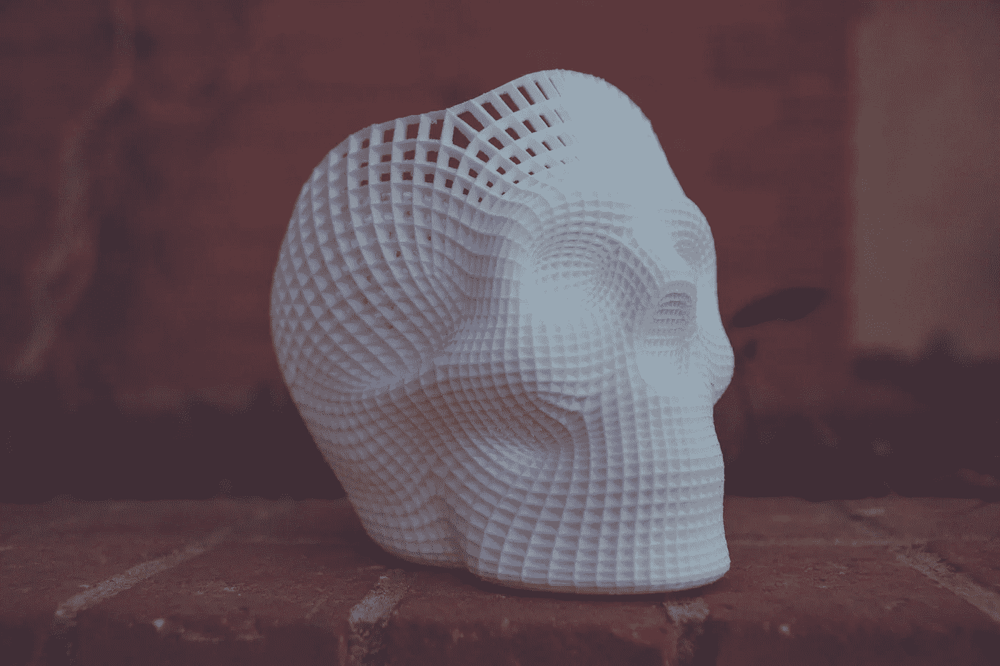

# 基因组研究

> 原文：<https://medium.com/hackernoon/genomic-inquiries-5c675aff55ec>

Photo by [NeONBRAND](https://unsplash.com/photos/38XhGPwzI3U?utm_source=unsplash&utm_medium=referral&utm_content=creditCopyText) on [Unsplash](https://unsplash.com/search/photos/anatomy?utm_source=unsplash&utm_medium=referral&utm_content=creditCopyText)

我一直在读一本乔治·安纳斯和谢尔曼·伊利亚写的个性化[药物](https://hackernoon.com/tagged/medicine)叫做 [*基因组*](https://hackernoon.com/tagged/genomic) *信息*的书。这是一本很好的书，讲述了基因组学与日常生活的关系。

在某些方面，这本书可能被认为不是最近的，因为它是在 2015 年出版的。似乎每天都有新的头条新闻报道大学在基因或转化医学治疗疾病方面的突破。尽管这些事情可能是真的，但是随着这些发现和技术的发展，会产生重大的影响。

# 个体化用药

随着区块链和人工智能这个词的出现，个性化医疗或精准医疗也加入了炒作的行列。事实上，这是许多公司多年来的梦想。谁不想坐在可以买卖获利的人类基因组上呢？

作者的目标是为读者提供一个全面的图片，说明对疾病的筛查和潜在诊断程序进行 DNA 测序意味着什么。

一些关键要点如下:

1.  隐私是一种公共物品；你的 DNA 不是。
2.  未经您的许可，任何人不得收集、存储、分析或使用您的 DNA 或源自您的 DNA 的信息。
3.  癌症基因组测序为个性化医疗带来了希望。
4.  给一个孩子贴上基因异常的标签会让一个健康的孩子变成一个终身患病的孩子。
5.  自基因组学诞生以来，种族主义和种族偏见就一直困扰着它。
6.  食物类似于药物，我们仍在学习我们的基因如何决定我们对食物和药物的反应。
7.  这不是先天对后天，而是先天和后天(以及我们的微生物群)。

在这些封面之间写有如此多的宝石。然而，仅仅从这些要点来看——为了好玩而对你的 DNA 进行测序的概念有着更深的社会含义。我们应该更加强调我们的独特性，并且明白我们确实有*不知道*的权利。

不知道你的 DNA 和潜在疾病的每一件事情并不一定是无知——而是按照你认为合适的方式生活。这是一种自由。

如果你有兴趣了解更多，我鼓励你寻求公正的信息。这是接受教育的唯一途径。

我们还没有释放个性化医疗的全部潜力——你最好相信谁拥有数据的钥匙，谁的口袋里也有钱。我们应该保持警惕，确保受益的是健康消费者和 T2。

我们需要更多地意识到让第三方对我们的 DNA 进行测序、储存和分析意味着什么。我们的 DNA 是许多事物的蓝图，这些事物造就了你，你。不要忘记这一点。

我们正处于大数据时代，这也意味着大基因组数据。哪里有炒作，哪里就有情绪。有情绪的地方，就有快速的行动，而不需要理解行动的全貌和含义。我们必须谨慎行事——尤其是涉及到我们生物学的本质时。