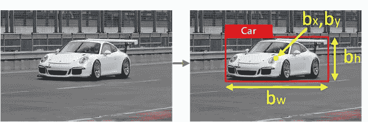
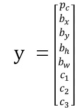
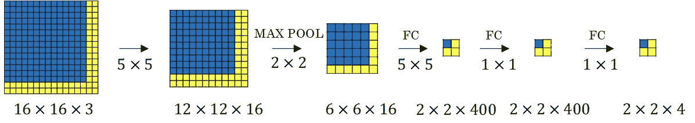
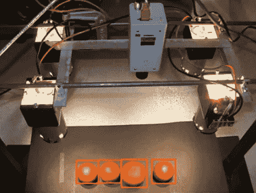

# YOLO 对象本地化如何与 Keras 协同工作的简明指南(第 1 部分)

> 原文：<https://medium.com/hackernoon/gentle-guide-on-how-yolo-object-localization-works-with-keras-part-1-aec99277f56f>

A sliding window with magnifier

TL: DR，我们将深入一点，了解 YOLO 物体定位算法是如何工作的。

我见过一些令人印象深刻的对象本地化实时演示。其中一个是与 [TensorFlow 对象检测 API](https://github.com/tensorflow/models/tree/master/research/object_detection) ，你可以定制它来检测你可爱的宠物——浣熊。

玩了一会儿 API 之后，我开始想知道为什么对象本地化工作得这么好。

很少有网上资源以明确易懂的方式向我解释。所以我决定为那些对对象定位算法的工作原理感兴趣的人写一篇我自己的帖子。

这篇文章可能包含一些高级主题，但我会尽可能友好地解释给初学者听。

# 到对象定位

# 什么是对象定位，它与对象分类相比如何？

你可能听说过 ImageNet 模型，它们在图像分类方面做得非常好。一个模型被训练来辨别在给定的图像中是否有特定的物体，例如汽车。

对象定位模型类似于分类模型。但是经过训练的定位模型还通过在图像周围绘制边界框来预测对象在图像中的位置。例如，一辆**汽车**位于下图中。边界框、中心点坐标、宽度和高度的信息也包括在模型输出中。

让我们看看我们有 3 种类型的目标要检测

*   1-行人
*   2-汽车
*   3 —摩托车

对于分类模型，输出将是代表每个类别概率的 3 个数字的列表。上图中只有一辆**汽车**在里面，输出可能看起来像 `[0.001, 0.998, 0.001]`。第二类是汽车的概率最大。

本地化模型的输出将包括边界框的信息，因此输出将如下所示

*   pc:为 1 表示检测到任何物体。如果为 0，输出的其余部分将被忽略。
*   bx: x 坐标，对应图像左上角的对象中心
*   by: y 坐标，对应图像左上角的对象中心
*   bh:边界框的高度
*   bw:边界框的宽度

此时，您可能已经想到了一种简单的方法来进行对象定位，即在整个输入图像上应用一个滑动窗口。就像我们用放大镜一次看地图的一个区域，看看那个区域是否有我们感兴趣的东西。这种方法很容易实现，甚至不需要我们训练另一个本地化模型。因为我们可以只使用流行的图像分类器模型，并让它查看图像的每个选定区域，并输出每类目标的概率。

但是这种方法非常慢，因为我们必须预测很多区域，并且尝试很多盒子大小，以便得到更准确的结果。它是计算密集型的，因此很难实现像自动驾驶汽车这样的应用程序所需的良好的实时对象定位性能。

这里有一个小技巧可以让它变得更快一点。

如果你熟悉卷积网络的工作原理，它可以通过为你拿着**虚拟放大镜**来模拟**滑动窗口效应**。因此，它在网络的一次前向传递中生成给定边界框大小的所有预测。这在计算上更有效。但是，基于我们如何选择步幅和尝试多少不同大小的边界框，边界框的位置不会非常精确。

*鸣谢:Coursera deeplearning.ai*

在上图中，我们有形状为 16 x 16 像素和 3 个颜色通道(RGB)的输入图像。然后是左上角蓝色方块中显示的**回旋纵向滑动窗口**，大小为 14 x 14，步幅为 2。意味着窗口一次垂直或水平滑动 2 个像素。输出中的左上角给出了左上角 14 x 14 的图像结果。如果在 14×14 区域中检测到 4 种目标对象中的任何一种。

如果你不完全确定我刚才谈到的滑动窗口的卷积实现，没问题。因为我们稍后解释的 YOLO 算法将会处理它们。

# 为什么我们需要对象本地化？

一个明显的应用，自动驾驶汽车，实时检测和定位其他汽车，路标，自行车是至关重要的。

它还能做什么？

一个安全摄像头来跟踪和预测一个可疑的人进入你的财产？

或者在水果包装和配送中心。我们可以建立一个基于图像的体积传感系统。它甚至可以使用边界框的大小来接近传送带上的橙子大小，并进行一些智能分类。

你能想到其他一些有用的物体定位的应用吗？请在下面分享你的酷想法！

系列文章的第二部分“[YOLO 对象定位如何与 Keras 协同工作的简明指南(第 2 部分)](https://heartbeat.fritz.ai/gentle-guide-on-how-yolo-object-localization-works-with-keras-part-2-65fe59ac12d)”。

*最初发表于*[T5【www.dlology.com】](https://www.dlology.com/blog/gentle-guide-on-how-yolo-object-localization-works-with-keras/)*。更多深度学习体验！*